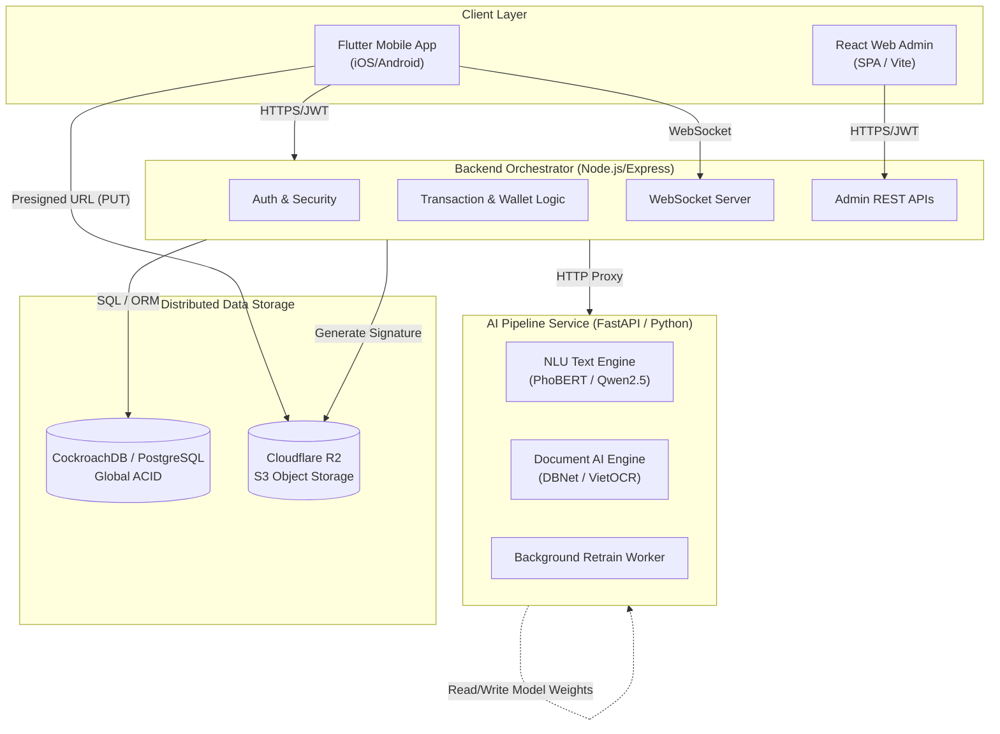
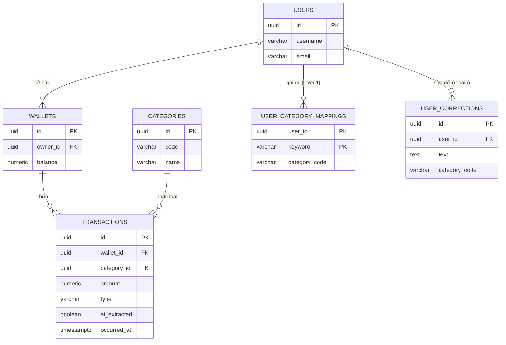

# GỢI Ý TÊN ĐỀ TÀI

Dựa trên phân tích toàn diện về kiến trúc hệ thống và các công nghệ lõi của dự án MoneyStory (bao gồm NLU, OCR, Mobile, WebAdmin), tên đề tài cần phản ánh chính xác bài toán nghiệp vụ, tính năng thông minh và nền tảng công nghệ. Dưới đây là các đề xuất tốt nhất:

1. **Lựa chọn 1 (Toàn diện, chuẩn hàn lâm):** *"Nghiên cứu và xây dựng hệ thống quản lý chi tiêu cá nhân thông minh đa phương thức ứng dụng Thị giác máy tính và Xử lý ngôn ngữ tự nhiên."*
2. **Lựa chọn 2 (Nhấn mạnh hệ thống và kiến trúc):** *"Xây dựng hệ thống quản lý tài chính cá nhân tích hợp trợ lý ảo dựa trên kiến trúc Microservices và Trí tuệ nhân tạo."*
3. **Lựa chọn 3 (Ngắn gọn, trực diện):** *"Phát triển ứng dụng quản lý chi tiêu thông minh tự động trích xuất thông tin hóa đơn và ý định văn bản (MoneyStory)."*

---

# MỤC LỤC

**LỜI CẢM ƠN**
**TÓM LƯỢC**
**DANH MỤC ĐỒ THỊ, BIỂU BẢNG VÀ HÌNH ẢNH**
**PHẦN GIỚI THIỆU**
1. Đặt vấn đề
2. Những nghiên cứu liên quan
3. Mục tiêu đề tài
4. Đối tượng và phạm vi nghiên cứu
5. Phương pháp nghiên cứu
6. Nội dung nghiên cứu
7. Bố cục của quyển luận văn

**CHƯƠNG 1 - ĐẶC TẢ YÊU CẦU**
1.1. Khảo sát hiện trạng và định hướng hệ thống
1.2. Phân tích yêu cầu chức năng (Functional Requirements)
1.3. Sơ đồ Use Case tổng quát
1.4. Phân tích yêu cầu phi chức năng (Non-Functional Requirements)

**CHƯƠNG 2 - CƠ SỞ LÝ THUYẾT VÀ THIẾT KẾ GIẢI PHÁP**
2.1. Kiến trúc tổng thể hệ thống (Microservices Architecture)
2.2. Cơ sở lý thuyết phân hệ Trí tuệ nhân tạo (AI Pipeline)
   2.2.1. Xử lý hình ảnh và Nhận dạng ký tự quang học (OCR)
   2.2.2. Trích xuất thông tin tài liệu đa phương thức (LayoutLMv3)
   2.2.3. Hiểu ngôn ngữ tự nhiên (NLU) và Trích xuất thực thể
2.3. Cơ sở lý thuyết kiến trúc Backend và Dữ liệu Phân tán
   2.3.1. Hệ quản trị CSDL phân tán CockroachDB và Thuật toán Raft
   2.3.2. Cơ chế Xác thực và Lưu trữ an toàn
2.4. Thiết kế cơ sở dữ liệu
2.5. Thiết kế các luồng xử lý nghiệp vụ cốt lõi (Core Flows)

**CHƯƠNG 3 - CÀI ĐẶT GIẢI PHÁP** (Lưu ý: Không viết trong tài liệu này)
**CHƯƠNG 4 - ĐÁNH GIÁ KIỂM THỬ** (Lưu ý: Không viết trong tài liệu này)
**PHẦN KẾT LUẬN**
**TÀI LIỆU THAM KHẢO**
**PHỤ LỤC**

---

# PHẦN GIỚI THIỆU

### 1. Đặt vấn đề
Việc quản lý tài chính cá nhân đóng vai trò thiết yếu trong xã hội hiện đại, giúp người dùng kiểm soát thu chi và đạt được các mục tiêu tiết kiệm. Tuy nhiên, rào cản lớn nhất của các ứng dụng quản lý chi tiêu truyền thống là sự đòi hỏi tính kỷ luật cao từ người dùng trong việc nhập liệu thủ công. Quá trình tự điền số tiền, chọn danh mục, và ghi chú cho từng giao dịch hàng ngày thường gây nhàm chán và tốn thời gian, dẫn đến việc người dùng dễ dàng bỏ cuộc chỉ sau một thời gian ngắn sử dụng. Để giải quyết nút thắt này, một hệ thống quản lý chi tiêu thông minh có khả năng tự động hóa việc nhập liệu thông qua đa phương thức (văn bản tự nhiên, giọng nói, hình ảnh hóa đơn) là một nhu cầu cấp thiết. Bài toán đặt ra đối với đề tài là làm sao xây dựng được một hệ thống có khả năng "hiểu" được ngữ nghĩa ngôn ngữ tự nhiên tiếng Việt và nhận dạng chính xác thông tin từ các hóa đơn có cấu trúc phức tạp để tự động trích xuất các thông tin tài chính cốt lõi.

### 2. Những nghiên cứu liên quan
Trên thị trường hiện nay, có nhiều ứng dụng sổ thu chi phổ biến như Money Lover, Sổ Thu Chi MISA hay Timo. Hầu hết các ứng dụng này đã giải quyết tốt bài toán quản lý ngân sách và báo cáo thống kê, nhưng vẫn phụ thuộc chủ yếu vào form nhập liệu cứng ngắc. Về mặt học thuật, lĩnh vực Trích xuất thông tin tài liệu (Document AI) và Hiểu ngôn ngữ tự nhiên (NLU) tại Việt Nam đang có những bước tiến mạnh mẽ. Các nghiên cứu từ cuộc thi MC-OCR Challenge 2021 đã đặt nền móng cho việc trích xuất thông tin hóa đơn tiếng Việt bằng mạng học sâu. Cùng với đó, sự ra đời của các mô hình ngôn ngữ như PhoBERT hay các mô hình ngôn ngữ lớn đa phương thức (Qwen, Gemini) đã mở ra cơ hội tối ưu hóa độ chính xác cho bài toán phân loại ý định và trích xuất thực thể. Tuy nhiên, việc tích hợp toàn diện cả hai luồng công nghệ này vào một kiến trúc hệ thống liền mạch, đồng thời xử lý được bài toán cá nhân hóa danh mục chi tiêu theo thói quen của từng người dùng vẫn còn là một vấn đề chưa được giải quyết triệt để trong các sản phẩm hiện tại.

### 3. Mục tiêu đề tài
Mục tiêu trọng tâm của đề tài là xây dựng hoàn chỉnh hệ thống MoneyStory - nền tảng quản lý chi tiêu cá nhân thông minh tự động hóa luồng nhập liệu thông qua Trí tuệ nhân tạo. Cụ thể, đề tài hướng tới ba mục tiêu cốt lõi: 
(1) Phát triển phân hệ AI có khả năng phân tích ngôn ngữ tự nhiên và hình ảnh hóa đơn để tự động trích xuất thông tin giao dịch (số tiền, danh mục, thời gian) với độ chính xác cao.
(2) Thiết kế kiến trúc Microservices mở rộng, bao gồm ứng dụng di động cho người dùng cuối và cổng quản trị Web Admin cho việc vận hành, huấn luyện lại AI.
(3) Tích hợp thuật toán cá nhân hóa nhằm tự động thích nghi với thói quen phân loại danh mục của từng cá nhân.

### 4. Đối tượng và phạm vi nghiên cứu
- **Đối tượng nghiên cứu:** Các thuật toán trích xuất thực thể tiếng Việt (NER), mô hình ngôn ngữ (PhoBERT, LLMs), mạng học sâu nhận dạng chữ viết (DBNet, VietOCR, LayoutLMv3), và kiến trúc hệ thống phần mềm phân tán (Node.js, CockroachDB, Flutter, React).
- **Phạm vi nghiên cứu:** Đề tài tập trung vào ngôn ngữ tiếng Việt (bao gồm cả từ lóng, teencode, văn nói thường ngày) và dữ liệu hóa đơn bán lẻ tại thị trường Việt Nam. Hệ thống được triển khai trên nền tảng ứng dụng di động (iOS/Android) và ứng dụng Web nội bộ.

### 5. Phương pháp nghiên cứu
Đề tài sử dụng kết hợp các phương pháp nghiên cứu sau:
- **Phương pháp nghiên cứu thực nghiệm:** Thu thập, tiền xử lý và xây dựng các tập dữ liệu (dataset) huấn luyện tiếng Việt (`intent_record.csv`, tập ảnh MC-OCR). Thực nghiệm huấn luyện và tinh chỉnh (fine-tuning) các mô hình học máy, từ đó đánh giá qua các chỉ số đo lường (Accuracy, F1-score).
- **Phương pháp kỹ nghệ phần mềm:** Áp dụng mô hình phát triển phần mềm linh hoạt (Agile), thiết kế hệ thống theo hướng dịch vụ độc lập (Microservices), và sử dụng các mẫu thiết kế (Design Patterns) tiêu chuẩn.
- **Phương pháp toán học và thống kê:** Sử dụng các thuật toán tương đồng ngữ nghĩa (Cosine Similarity), đồng thuận phân tán (Raft Consensus) và biểu diễn xác suất (Platt Scaling) trong thiết kế thuật toán hệ thống.

### 6. Nội dung nghiên cứu
Để đạt được các mục tiêu trên, nhóm nghiên cứu tập trung thực hiện các nội dung sau:
- Xây dựng ứng dụng di động (Frontend Mobile) bằng Flutter, đảm nhiệm vai trò giao tiếp, thu âm giọng nói cục bộ và hiển thị báo cáo.
- Xây dựng máy chủ trung tâm (Backend Orchestrator) bằng Node.js & Express để xử lý logic tài chính, phân quyền JWT, và giao tiếp CSDL phân tán.
- Xây dựng động cơ Trí tuệ nhân tạo (AI Pipeline) kết hợp PaddleOCR, VietOCR, PhoBERT và Qwen2.5 để xử lý hình ảnh và văn bản thông qua FastAPI.
- Phát triển cổng quản trị WebAdmin bằng React 19 giúp giám sát chất lượng, gom cụm dữ liệu sửa đổi, và kích hoạt huấn luyện (Retrain) mô hình trực tiếp.

### 7. Bố cục của quyển luận văn
Quyển luận văn được chia thành 4 chương chính và phần kết luận:
- **Chương 1 - Đặc tả yêu cầu:** Khảo sát hiện trạng, định hướng và liệt kê các yêu cầu chức năng, phi chức năng của hệ thống.
- **Chương 2 - Cơ sở lý thuyết và Thiết kế giải pháp:** Trình bày nền tảng lý thuyết toán học, công nghệ học sâu được sử dụng và thiết kế kiến trúc, cơ sở dữ liệu, các luồng nghiệp vụ cốt lõi.
- **Chương 3 - Cài đặt giải pháp:** Mô tả chi tiết quá trình lập trình, cấu trúc mã nguồn, và phương thức triển khai thực tế trên máy chủ.
- **Chương 4 - Đánh giá kiểm thử:** Đưa ra các kịch bản kiểm thử, đánh giá hiệu năng hệ thống, độ chính xác của các mô hình AI thông qua độ đo định lượng.
- **Phần kết luận:** Tóm tắt kết quả đạt được, giới hạn của đề tài và định hướng phát triển tương lai.

---

# CHƯƠNG 1 - ĐẶC TẢ YÊU CẦU

Chương này trình bày quá trình khảo sát bài toán thực tế, từ đó trích xuất và định nghĩa các yêu cầu hệ thống. Việc đặc tả yêu cầu giúp xác định rõ giới hạn chức năng và định chuẩn chất lượng cho hệ thống MoneyStory trước khi bước vào giai đoạn thiết kế kiến trúc.

### 1.1. Khảo sát hiện trạng và định hướng hệ thống
Các sản phẩm quản lý tài chính hiện hành tuy phong phú về tính năng phân tích báo cáo nhưng đang tồn tại điểm nghẽn ở khâu nhập liệu. Người dùng buộc phải trải qua 4 đến 5 thao tác (chọn ngày, chọn danh mục, nhập số tiền, gõ ghi chú) cho mỗi giao dịch. Định hướng của hệ thống MoneyStory là giảm thiểu quy trình này xuống còn một thao tác duy nhất thông qua hộp thoại chat tự nhiên (văn bản/giọng nói) hoặc tính năng chụp ảnh hóa đơn. Đồng thời, hệ thống cần có cơ chế "Human-in-the-loop" (con người trong vòng lặp), cho phép thu thập các sửa đổi của người dùng nhằm huấn luyện mô hình thông minh hơn theo thời gian thực.

### 1.2. Phân tích yêu cầu chức năng (Functional Requirements)
Hệ thống được chia thành ba nhóm tác nhân chính, tương ứng với các chức năng cụ thể:

**Đối với Người dùng ứng dụng (Mobile User):**
- **Quản lý Tài khoản & Ví:** Cho phép đăng ký, đăng nhập qua email hoặc Google OAuth. Hỗ trợ tạo ví cá nhân và ví chung (Group Wallet) để chia sẻ chi tiêu.
- **Giao tiếp Đa phương thức (Trợ lý ảo AI):** Cung cấp giao diện chat với linh vật (Mascot Mimo). Người dùng có thể nhập chi tiêu bằng văn bản tự nhiên, giọng nói (thu âm cục bộ), và tán gẫu với trợ lý.
- **Nhận dạng Hóa đơn thông minh:** Hỗ trợ tính năng chụp/quét hóa đơn. Hệ thống phải tự động bóc tách số tiền, tên cửa hàng và gợi ý danh mục hàng hóa.
- **Quản lý Mục tiêu & Ngân sách:** Đặt hạn mức chi tiêu theo tháng/tuần và khởi tạo các mục tiêu tiết kiệm. Ứng dụng phải cảnh báo tự động khi ngân sách sắp vượt ngưỡng.
- **Báo cáo & Thống kê:** Hiển thị số liệu trực quan bằng biểu đồ (so sánh tháng trước MoM, tỷ trọng danh mục) thông qua các câu lệnh chat hoặc màn hình thống kê.

**Đối với Quản trị viên (WebAdmin Ops):**
- **Giám sát chất lượng (Telemetry):** Xem tổng quan các chỉ số hệ thống, đặc biệt là tỷ lệ "Hội tụ AI" (Fusion Success Rate) - số giao dịch tự động hoàn toàn không cần người dùng sửa.
- **Gom cụm và Duyệt dữ liệu (Curation):** Hệ thống tự động gom cụm các lỗi nhận diện mà người dùng đã sửa. Quản trị viên có thể xem xét và bấm duyệt (Curate) để thêm vào tập dữ liệu huấn luyện.
- **Điều phối Huấn luyện (Retrain Ops):** Kích hoạt quá trình huấn luyện lại mô hình (Trigger Retrain) và nạp nóng mô hình mới vào RAM máy chủ mà không làm gián đoạn dịch vụ.

**Đối với Hệ thống AI & Backend:**
- **Tự động trích xuất:** Tự động phân loại ý định (Record, Action, Chitchat) và bóc tách thực thể (Số tiền, Thời gian, Sản phẩm).
- **Cá nhân hóa theo người dùng:** Có cơ chế ghi nhớ thói quen gán nhãn danh mục của từng người dùng để ghi đè kết quả mô hình chung.
- **Bảo mật và Xử lý ngầm:** Tự động làm sạch dữ liệu phản hồi của AI (NLG Sanitizer) và xử lý ảnh hóa đơn bất đồng bộ (Background processing).

### 1.3. Sơ đồ Use Case tổng quát
Sơ đồ Use Case dưới đây mô tả sự tương tác giữa các tác nhân (Actors) và các chức năng hệ thống trong MoneyStory.

```mermaid
usecaseDiagram
  actor "Mobile User" as U
  actor "Web Admin (Ops)" as A
  actor "AI Background Service" as AI

  package "MoneyStory System" {
    usecase "Xác thực (Đăng nhập/Đăng ký)" as UC_Auth
    usecase "Nhập liệu bằng Text/Voice (NLU)" as UC_NLU
    usecase "Quét Hóa đơn (OCR)" as UC_OCR
    usecase "Quản lý Giao dịch & Ví" as UC_Tx
    usecase "Xem Báo cáo & Ngân sách" as UC_Report
    
    usecase "Duyệt dữ liệu gom cụm (Curation)" as UC_Curate
    usecase "Huấn luyện lại AI (Retrain)" as UC_Retrain
    usecase "Quản lý Quy tắc Ghi đè" as UC_Override
    
    usecase "Trích xuất thực thể & Phân loại" as UC_Extract
  }

  U --> UC_Auth
  U --> UC_NLU
  U --> UC_OCR
  U --> UC_Tx
  U --> UC_Report

  A --> UC_Curate
  A --> UC_Retrain
  A --> UC_Override

  UC_NLU ..> UC_Extract : <<include>>
  UC_OCR ..> UC_Extract : <<include>>
  
  AI --> UC_Extract
  AI --> UC_Retrain
```

### 1.4. Phân tích yêu cầu phi chức năng (Non-Functional Requirements)
- **Hiệu năng và Thời gian phản hồi (Performance):** Quá trình xử lý văn bản NLU phải phản hồi dưới 1000ms. Quá trình xử lý hóa đơn OCR phức tạp được xử lý ngầm và cần đẩy kết quả thông báo (Push) cho người dùng qua WebSocket ngay khi hoàn tất (trung bình 3-5 giây).
- **Tính khả dụng và Chống chịu lỗi (Availability & Fault Tolerance):** Các dịch vụ AI (FastAPI) phải được thiết kế dưới dạng stateless. Nếu GPU/Mô hình nặng thất bại, hệ thống phải có cơ chế tự động chuyển đổi sang Mock/Rule-based (Fallback) để ứng dụng không bị tê liệt.
- **Bảo mật và Tính nhất quán (Security & Consistency):** Sử dụng cơ chế xoay vòng token (Refresh Token Rotation). Ảnh hóa đơn của người dùng không được public, chỉ tải lên qua URL có chữ ký bảo mật (Presigned URL) có thời hạn ngắn. Dữ liệu tài chính phải sử dụng cơ sở dữ liệu hỗ trợ ACID mức cao (CockroachDB).
- **Tính Idempotency (Chống trùng lặp):** Giao diện phải khóa tương tác (Optimistic UI) khi đang xử lý giao dịch nhằm triệt tiêu lỗi bấm đúp gửi dữ liệu hai lần, đảm bảo sổ sách kế toán của người dùng không bị sai lệch.

---

# CHƯƠNG 2 - CƠ SỞ LÝ THUYẾT VÀ THIẾT KẾ GIẢI PHÁP

Chương này trình bày nền tảng lý thuyết toán học, các công nghệ lõi và thiết kế kiến trúc toàn diện của hệ thống MoneyStory. Việc kết hợp xử lý ngôn ngữ tự nhiên và thị giác máy tính đòi hỏi một kiến trúc mở rộng và nền tảng dữ liệu phân tán đáng tin cậy.

### 2.1. Kiến trúc tổng thể hệ thống (Microservices Architecture)
Hệ thống tuân thủ kiến trúc đa tầng (N-Tier Microservices), giúp mỗi thành phần có thể mở rộng (scale) độc lập, tối ưu hóa quá trình tính toán nặng của AI.



**Nguyên lý hoạt động:**
Ứng dụng di động (Client mỏng) chủ yếu đóng vai trò thu thập hình ảnh và văn bản. Mọi yêu cầu được gửi tới Backend Node.js. Backend chịu trách nhiệm xác thực, lưu trữ CSDL, và hoạt động như một bộ điều phối (Orchestrator). Khi cần bóc tách dữ liệu AI, Backend sẽ gửi yêu cầu (Proxy) sang dịch vụ FastAPI. FastAPI thực thi các suy luận học sâu (Deep Learning Inference) độc lập và trả kết quả có cấu trúc JSON để Backend tiến hành lưu trữ và đồng bộ hóa cho Client.

### 2.2. Cơ sở lý thuyết phân hệ Trí tuệ nhân tạo (AI Pipeline)

#### 2.2.1. Xử lý hình ảnh và Nhận dạng ký tự quang học (OCR)
Quá trình số hóa hóa đơn bắt đầu bằng việc nhận dạng vị trí và nội dung của văn bản trên hình ảnh. Bài toán này cực kỳ thách thức do hóa đơn tại Việt Nam rất đa dạng về hình thức, độ sáng, cũng như có hiện tượng bị cong, gấp nếp hoặc xoay chiều [1].
**Phát hiện chữ (Text Detection) với DBNet:** Thuật toán Differentiable Binarization (DBNet) giải quyết bài toán phát hiện văn bản dạng đa giác bằng cách đưa hàm nhị phân hóa (Binarization) vào quá trình học [2]. Thay vì sử dụng ngưỡng cứng không thể lấy đạo hàm, DBNet áp dụng nhị phân hóa mềm:
$$ \hat{B}_{i,j} = \frac{1}{1 + e^{-k(P_{i,j} - T_{i,j})}} $$
Trong đó $P_{i,j}$ là bản đồ xác suất (Probability Map), $T_{i,j}$ là bản đồ ngưỡng (Threshold Map), và $k = 50$ là hệ số dốc. Tính khả vi của hàm này cho phép mạng nơ-ron lan truyền ngược (backpropagation) hoàn chỉnh, từ đó tự động tối ưu hóa việc phân tách văn bản và nền ngay cả khi chữ bị méo mó.
**Phân loại hướng (Orientation) với MobileNetV3:** Để giải quyết việc người dùng chụp ngược hóa đơn, một mạng MobileNetV3 [3] được áp dụng để dự đoán góc xoay. Thông qua tích chập phân tách chiều sâu (Depthwise Separable Convolution), tỷ lệ chi phí tính toán so với tích chập truyền thống giảm mạnh xuống còn $1/N + 1/D_K^2$, mang lại khả năng xử lý thời gian thực trên thiết bị máy chủ.
**Nhận dạng chuỗi ký tự (Text Recognition) với VietOCR:** Kế thừa cấu trúc mạng thần kinh tích chập kết hợp hồi quy (CRNN), VietOCR giải quyết bài toán đọc chữ tiếng Việt bằng cách thay thế bộ giải mã CTC bằng cấu trúc Attention của Bahdanau [4]. Tại mỗi bước $i$, bộ giải mã tính toán trọng số chú ý $\alpha_{i,j}$ lên chuỗi đặc trưng $h_j$ từ mạng VGG19:
$$ e_{i,j} = v_a^T \tanh(W_a s_{i-1} + U_a h_j) $$
$$ \alpha_{i,j} = \frac{\exp(e_{i,j})}{\sum_{k=1}^{T_x} \exp(e_{i,k})} $$
Nhờ sự hội tụ của vector ngữ cảnh $c_i = \sum_{j} \alpha_{i,j} h_j$, mô hình GRU trong VietOCR có thể tái tạo chính xác các nguyên âm có dấu phức tạp trong tiếng Việt.

#### 2.2.2. Trích xuất thông tin tài liệu đa phương thức (LayoutLMv3)
Khác với phân tích văn bản thuần túy, hóa đơn chứa đựng thông tin trong cấu trúc không gian (bố cục). Mô hình LayoutLMv3 [5] ra đời để hợp nhất ba loại đặc trưng: Văn bản (Text), Bố cục (Layout) và Hình ảnh (Visual) trong cùng một kiến trúc Transformer.
Thay vì tách rời OCR và phân loại như trước đây, LayoutLMv3 nhúng tọa độ không gian 2D $[x_0, y_0, x_1, y_1]$ của hộp văn bản vào thẳng mô hình ngôn ngữ. Hơn nữa, thông qua hai tác vụ tiền huấn luyện (Masked Language Modeling và Masked Image Modeling), mô hình có khả năng gán nhãn thực thể ngữ nghĩa (ví dụ: `SELLER`, `TOTAL_COST`) dựa trên sự liên kết giữa chữ viết và hình ảnh biểu diễn bên dưới.

#### 2.2.3. Hiểu ngôn ngữ tự nhiên (NLU) và Trích xuất thực thể
Khả năng "trò chuyện" của hệ thống được vận hành bởi kỹ thuật Xử lý Ngôn ngữ Tự nhiên tiên tiến, phân rã lời nói thành Ý định (Intent) và Thực thể (Entities).
**Mã hóa đặc trưng với PhoBERT:** Để hiểu tiếng Việt, hệ thống tận dụng PhoBERT [6], một biến thể của RoBERTa được đào tạo trên kho ngữ liệu khổng lồ. Văn bản được tách từ (Tokenization) và đưa qua mạng Transformer. Vector đầu ra của token `<s>`, ký hiệu là $\mathbf{h}_{\text{CLS}} \in \mathbb{R}^{768}$, đóng vai trò là đại diện ngữ nghĩa tổng quát của toàn bộ câu.
**Phân loại và Hiệu chỉnh Platt (Platt Scaling):** Vector $\mathbf{h}_{\text{CLS}}$ được dẫn qua mô hình Logistic Regression nhằm phân loại ý định (Record, Action, Chitchat). Thay vì tin cậy hoàn toàn vào điểm số thô, thuật toán Platt Scaling được sử dụng để hiệu chỉnh đầu ra thành một phân phối xác suất đáng tin cậy. Điều này giúp hệ thống tự động từ chối những dự đoán có độ tự tin thấp.
**Nhận dạng thực thể SpaCy (NER):** Việc trích xuất SỐ TIỀN (`AMOUNT`), THỜI GIAN (`TIME`), và SẢN PHẨM (`PRODUCT`) được thực hiện bằng bộ phân tích cú pháp chuyển trạng thái của SpaCy [7]. Thuật toán vận hành bằng các phép dịch chuyển (SHIFT, REDUCE, OUT) trên chuỗi token liên tục, xác định giới hạn thực thể với hiệu năng vượt trội.
**Tối ưu bằng Qwen-VL/LoRA:** Đối với chế độ thông minh toàn diện, hệ thống tích hợp Qwen-VL [8] (Qwen2.5) được tinh chỉnh bằng Low-Rank Adaptation (LoRA). Thay vì cập nhật hàng tỷ tham số, LoRA chỉ tối ưu hóa các ma trận hạng thấp $\Delta W = A \times B$. Nhờ vậy, chi phí tính toán và bộ nhớ VRAM được giảm tải tối đa, đảm bảo khả năng triển khai mô hình lớn trên các Cloud GPU.

### 2.3. Cơ sở lý thuyết kiến trúc Backend và Dữ liệu Phân tán
Khối lượng truy xuất của một ứng dụng tài chính đòi hỏi tính nhất quán, tính bền vững và sự đồng bộ thời gian thực.
#### 2.3.1. Hệ quản trị CSDL phân tán CockroachDB và Thuật toán Raft
Để đảm bảo các giao dịch (Transactions) luôn đạt chuẩn ACID toàn cục, hệ thống lựa chọn CockroachDB [9]. Thay vì lưu dữ liệu nguyên khối, CockroachDB phân rã dữ liệu thành các đoạn (Ranges) dung lượng 64MB và nhân bản ra tối thiểu 3 Node vật lý.
Việc nhất quán dữ liệu được bảo đảm thông qua thuật toán đồng thuận Raft (Raft Consensus Protocol). Một giao dịch cập nhật số dư ví chỉ được cam kết (Commit) thành công khi có đa số (Quorum = 2/3) máy chủ đồng thuận ghi nhận vào Log. Thiết kế này triệt tiêu hoàn toàn rủi ro mất mát dữ liệu tài chính trong trường hợp máy chủ gặp sự cố cục bộ.
#### 2.3.2. Cơ chế Xác thực và Lưu trữ an toàn
**Bảo mật JWT và Xoay vòng Token:** Các API được bảo vệ thông qua chuỗi JSON Web Token. Cơ chế Refresh Token Rotation đảm bảo khi Refresh Token được đổi mới, token cũ bị thu hồi lập tức. Mọi nỗ lực sử dụng lại token cũ do đánh cắp (Replay Attack) sẽ kích hoạt khóa bảo mật, buộc người dùng đăng nhập lại từ đầu.
**Cloudflare R2 và Presigned URL:** Dữ liệu hình ảnh hóa đơn chứa thông tin cá nhân vô cùng nhạy cảm. Để đảm bảo an ninh, Backend không tiếp nhận tệp ảnh trực tiếp. Thay vào đó, Backend sinh một URL tạm thời kèm chữ ký số (Presigned URL bằng HMAC-SHA256). Ứng dụng di động sử dụng URL này để đẩy trực tiếp tệp lên hạ tầng lưu trữ đối tượng Cloudflare R2, vừa bảo mật vừa giảm tải băng thông trung chuyển cho hệ thống nội bộ.

### 2.4. Thiết kế cơ sở dữ liệu
Thiết kế dữ liệu tuân thủ chuẩn mô hình thực thể liên kết (ERD) với cấu trúc logic phân mảnh rõ ràng cho nghiệp vụ cốt lõi và hệ thống AI.



**Các bảng đặc thù AI:** Bảng `user_category_mappings` phục vụ việc truy vấn ghi đè từ khóa tĩnh của mỗi cá nhân, trong khi bảng `user_corrections` đóng vai trò như một tập dữ liệu thô (Raw dataset) lưu trữ lịch sử người dùng chỉnh sửa nhãn, chờ WebAdmin duyệt để đưa vào quy trình huấn luyện lại mô hình.

### 2.5. Thiết kế các luồng xử lý nghiệp vụ cốt lõi (Core Flows)

Hệ thống xoay quanh 4 luồng xử lý thông minh để tối ưu hóa trải nghiệm người dùng:

1. **Luồng Cá nhân hóa (RuleUser Hybrid Flow):** Mọi văn bản đầu vào đều đi qua bộ lọc 3 tầng. Lớp 1 (Exact Match): So khớp chuỗi tuyệt đối với bảng quy tắc của người dùng (ví dụ: "grab" -> Transport). Lớp 2 (Semantic Similarity): Mã hóa câu thoại thành vector TF-IDF và tính khoảng cách độ tương đồng (Cosine Similarity $S \ge 0.85$) với lịch sử cũ. Nếu cả 2 lớp thất bại, Lớp 3 mới gọi đến mô hình AI toàn cục (PhoBERT/Qwen), giúp cá nhân hóa triệt để cách gán danh mục cho từng cá nhân.
2. **Luồng Xử lý Hóa đơn Bất đồng bộ (Async Bill Flow):** Người dùng chụp ảnh $\rightarrow$ Client nén ảnh $\rightarrow$ Upload lên R2 $\rightarrow$ Backend tạo một giao dịch nháp (Pending state) $\rightarrow$ Backend gọi API tới FastAPI xử lý ngầm. Quá trình ngầm kích hoạt PaddleOCR (detect), VietOCR (recognize), và Weighted Voting phân loại món ăn. Khi hoàn tất, Backend nhận kết quả và phát ra sự kiện WebSocket $\rightarrow$ Giao diện người dùng tự động điền số liệu mà không bị treo hệ thống.
3. **Luồng Hỏi đáp Nghiệp vụ (Intent Action Flow):** Phân hệ NLU nhận diện ý định "Báo cáo" (Action). Thay vì để AI tự tạo báo cáo, Backend chặn yêu cầu này, chủ động truy vấn CSDL PostgreSQL tính toán thống kê (Tổng chi, số dư). Số liệu thật được đính kèm vào ngữ cảnh (Context Meta) và gửi cho LLM. Nhờ đó, LLM có thể sinh ra câu trả lời tự nhiên mà không mắc lỗi bịa đặt số liệu (Hallucination).
4. **Luồng Tái huấn luyện (Retrain Flow):** Mọi sửa đổi của người dùng đối với kết quả dự đoán (trên Mobile App) đều được Backend lưu trữ ngầm. Tại cổng WebAdmin, quản trị viên quan sát các cụm từ sai phổ biến, phê duyệt (Curate). Backend tự động bổ sung mẫu dữ liệu mới vào file `.csv` chuẩn và kích hoạt Background Task trên AI Service. Khi quá trình học hoàn tất, hệ thống tự động nạp nóng (Hot-reload) bộ trọng số `.joblib` lên RAM của tiến trình đang chạy mà không gây thời gian gián đoạn (Downtime).

---

# TÀI LIỆU THAM KHẢO

[1] N. D. Cuong, M. P. Hoang, et al., "MC-OCR Challenge 2021: End-to-end system to extract key information from Vietnamese Receipts," in Proceedings of the 2021 IEEE RIVF International Conference on Computing and Communication Technologies (RIVF), 2021, pp. 1-6.  
[2] M. Liao, Z. Wan, et al., "Real-time Scene Text Detection with Differentiable Binarization," in Proceedings of the AAAI Conference on Artificial Intelligence, vol. 34, no. 07, 2020, pp. 11474-11481.  
[3] A. Howard, M. Sandler, et al., "Searching for MobileNetV3," in Proceedings of the IEEE/CVF International Conference on Computer Vision (ICCV), 2019, pp. 1314-1324.  
[4] D. Bahdanau, K. Cho, and Y. Bengio, "Neural machine translation by jointly learning to align and translate," in 3rd International Conference on Learning Representations (ICLR), 2015, pp. 1-15.  
[5] Y. Huang, T. Lv, et al., "LayoutLMv3: Pre-training for Document AI with Unified Text and Image Masking," in Proceedings of the 30th ACM International Conference on Multimedia (MM), 2022, pp. 4083-4091.  
[6] D. Q. Nguyen, and T. Nguyen, "PhoBERT: Pre-trained language models for Vietnamese," in Findings of the Association for Computational Linguistics: EMNLP 2020, 2020, pp. 1037-1042.  
[7] M. Honnibal, and I. Montani, "spaCy 2: Natural language understanding with Bloom embeddings, convolutional neural networks and incremental parsing," Sentient NLP, vol. 7, no. 1, pp. 411-420, 2017.  
[8] J. Bai, S. Yang, et al., "Qwen-VL: A Versatile Vision-Language Model for Understanding, Localization, Text Reading, and Beyond," arXiv preprint arXiv:2308.12966, 2023.  
[9] R. Taft, U. Sharif, et al., "CockroachDB: The Resilient Geo-Distributed SQL Database," in Proceedings of the 2020 ACM SIGMOD International Conference on Management of Data, 2020, pp. 1493-1509.  

*(Các Chương tiếp theo về Cài đặt, Mã nguồn, và Kịch bản kiểm thử sẽ được kế thừa dựa trên thiết kế này).*
