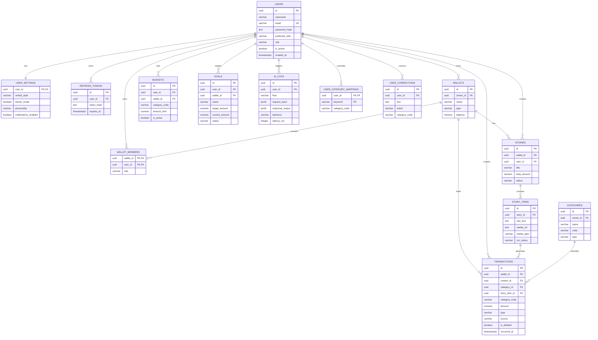
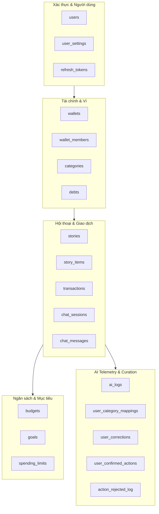

# TÀI LIỆU THIẾT KẾ CƠ SỞ DỮ LIỆU CHÍNH THỨC — MONEYSTORY

Tài liệu này mô tả chi tiết thiết kế cơ sở dữ liệu quan hệ (PostgreSQL / CockroachDB) của dự án **MoneyStory**, bao gồm các sơ đồ trường hợp sử dụng, sơ đồ thực thể liên kết (ERD), sơ đồ cấu trúc thành phần, mã định nghĩa DDL và từ điển dữ liệu chi tiết cho tất cả các bảng.

---

## 1. SƠ ĐỒ USE CASE TRUY CẬP CƠ SỞ DỮ LIỆU
Sơ đồ trường hợp sử dụng (Use Case Diagram) biểu diễn cách thức các tác nhân (Mobile User, WebAdmin, AI Background Services) tương tác với dữ liệu trong hệ thống.

```mermaid
usecaseDiagram
  rect "Database System"
    usecase UC_Auth "Đăng ký / Đăng nhập"
    usecase UC_Tx "Tạo & Xem Giao dịch"
    usecase UC_Budget "Cài đặt Ngân sách & Hạn mức"
    usecase UC_OCR "Quét Hóa đơn & Nhận dạng"
    usecase UC_Goal "Tạo & Đóng góp Mục tiêu"
    usecase UC_Curate "Gom cụm & Duyệt dữ liệu NLU"
    usecase UC_Retrain "Kích hoạt Huấn luyện AI"
    usecase UC_Logs "Xem Telemetry & Latency Logs"
  end

  "Mobile User" --> UC_Auth
  "Mobile User" --> UC_Tx
  "Mobile User" --> UC_Budget
  "Mobile User" --> UC_OCR
  "Mobile User" --> UC_Goal

  "WebAdmin (Ops)" --> UC_Curate
  "WebAdmin (Ops)" --> UC_Retrain
  "WebAdmin (Ops)" --> UC_Logs

  "AI Background Service" --> UC_OCR
  "AI Background Service" --> UC_Logs
```

---

## 2. SƠ ĐỒ THỰC THỂ LIÊN KẾT (ENTITY-RELATIONSHIP DIAGRAM)
Sơ đồ thực thể liên kết (ERD) thể hiện cấu trúc logic, khóa chính (PK), khóa ngoại (FK) và mối quan hệ giữa các bảng chính trong cơ sở dữ liệu.



---

## 3. SƠ ĐỒ THÀNH PHẦN LOGIC DỮ LIỆU
Sơ đồ mô tả cách phân nhóm các bảng thành 5 module nghiệp vụ chính trong ứng dụng:



---

## 4. SCHEMA ĐỊNH NGHĨA DỮ LIỆU CHI TIẾT (DDL SQL)

Dưới đây là tập hợp toàn bộ mã định nghĩa bảng SQL tương thích hoàn toàn với PostgreSQL 14+ và cụm đám mây CockroachDB:

```sql
-- 1. Bảng Users (Tài khoản người dùng)
CREATE TABLE users (
    id               UUID PRIMARY KEY DEFAULT gen_random_uuid(),
    username         VARCHAR(80) NOT NULL,
    email            VARCHAR(160) NOT NULL UNIQUE,
    password_hash    TEXT NOT NULL,
    avatar_url       TEXT,
    preferred_vibe   VARCHAR(20) NOT NULL DEFAULT 'funny',
    role             VARCHAR(20) NOT NULL DEFAULT 'user', -- user | admin
    is_active        BOOLEAN NOT NULL DEFAULT TRUE,
    last_login_at    TIMESTAMPTZ,
    age              INT CHECK (age IS NULL OR age > 0),
    job_title        VARCHAR(120),
    income_amount    NUMERIC(15, 2) NOT NULL DEFAULT 0,
    income_type      VARCHAR(20),
    streak_count     INT NOT NULL DEFAULT 0,
    streak_max       INT NOT NULL DEFAULT 0,
    last_activity_at TIMESTAMPTZ,
    created_at       TIMESTAMPTZ NOT NULL DEFAULT NOW(),
    updated_at       TIMESTAMPTZ NOT NULL DEFAULT NOW()
);

-- 2. Bảng User Settings (Cài đặt hiển thị & Mascot)
CREATE TABLE user_settings (
    user_id        UUID PRIMARY KEY REFERENCES users(id) ON DELETE CASCADE,
    verbal_style   VARCHAR(20) NOT NULL DEFAULT 'funny', -- funny | gentle | serious | sarcastic
    theme_mode     BOOLEAN NOT NULL DEFAULT FALSE,        -- false=light, true=dark
    personality    VARCHAR(20) NOT NULL DEFAULT 'mascot',
    notifications_enabled BOOLEAN NOT NULL DEFAULT TRUE,
    locale         VARCHAR(10) NOT NULL DEFAULT 'vi-VN',
    updated_at     TIMESTAMPTZ NOT NULL DEFAULT NOW()
);

-- 3. Bảng Refresh Tokens (Token duy trì đăng nhập)
CREATE TABLE refresh_tokens (
    id               UUID PRIMARY KEY DEFAULT gen_random_uuid(),
    user_id          UUID NOT NULL REFERENCES users(id) ON DELETE CASCADE,
    token_hash       TEXT NOT NULL,
    expires_at       TIMESTAMPTZ NOT NULL,
    revoked_at       TIMESTAMPTZ,
    created_at       TIMESTAMPTZ NOT NULL DEFAULT NOW()
);
CREATE INDEX idx_refresh_tokens_user ON refresh_tokens(user_id);

-- 4. Bảng Categories (Danh mục thu chi)
CREATE TABLE categories (
    id               UUID PRIMARY KEY DEFAULT gen_random_uuid(),
    owner_id         UUID REFERENCES users(id) ON DELETE CASCADE, -- NULL = system category
    name             VARCHAR(80) NOT NULL,
    code             VARCHAR(40) NOT NULL,                        -- mã nhãn AI (Food, Transport...)
    type             VARCHAR(20) NOT NULL DEFAULT 'expense',     -- expense | income | both
    icon             VARCHAR(60),
    color            VARCHAR(20),
    is_active        BOOLEAN NOT NULL DEFAULT TRUE,
    created_at       TIMESTAMPTZ NOT NULL DEFAULT NOW()
);
CREATE UNIQUE INDEX idx_categories_owner_code 
    ON categories(COALESCE(owner_id, '00000000-0000-0000-0000-000000000000'), code);

-- 5. Bảng Wallets (Ví tài chính cá nhân / chung)
CREATE TABLE wallets (
    id               UUID PRIMARY KEY DEFAULT gen_random_uuid(),
    owner_id         UUID NOT NULL REFERENCES users(id) ON DELETE CASCADE,
    name             VARCHAR(120) NOT NULL,
    type             VARCHAR(20) NOT NULL DEFAULT 'personal', -- personal | group
    currency         VARCHAR(10) NOT NULL DEFAULT 'VND',
    balance          NUMERIC(15, 2) NOT NULL DEFAULT 0,
    icon             VARCHAR(60),
    color            VARCHAR(20),
    is_archived      BOOLEAN NOT NULL DEFAULT FALSE,
    created_at       TIMESTAMPTZ NOT NULL DEFAULT NOW(),
    updated_at       TIMESTAMPTZ NOT NULL DEFAULT NOW()
);
CREATE INDEX idx_wallets_owner ON wallets(owner_id);

-- 6. Bảng Wallet Members (Thành viên ví chung)
CREATE TABLE wallet_members (
    wallet_id        UUID NOT NULL REFERENCES wallets(id) ON DELETE CASCADE,
    user_id          UUID NOT NULL REFERENCES users(id) ON DELETE CASCADE,
    role             VARCHAR(20) NOT NULL DEFAULT 'member', -- owner | member | viewer
    joined_at        TIMESTAMPTZ NOT NULL DEFAULT NOW(),
    PRIMARY KEY (wallet_id, user_id)
);

-- 7. Bảng Stories (Dòng thời sự gom nhóm chi tiêu theo ngày)
CREATE TABLE stories (
    id              UUID PRIMARY KEY DEFAULT gen_random_uuid(),
    wallet_id       UUID NOT NULL REFERENCES wallets(id) ON DELETE CASCADE,
    user_id         UUID NOT NULL REFERENCES users(id) ON DELETE CASCADE,
    title           VARCHAR(255),
    total_amount    NUMERIC(15, 2) NOT NULL DEFAULT 0,
    status          VARCHAR(20) NOT NULL DEFAULT 'open', -- open | closed | archived
    cover_image_url TEXT,
    occurred_on     DATE NOT NULL DEFAULT CURRENT_DATE,
    created_at      TIMESTAMPTZ NOT NULL DEFAULT NOW(),
    updated_at      TIMESTAMPTZ NOT NULL DEFAULT NOW()
);
CREATE INDEX idx_stories_user_date ON stories(user_id, occurred_on DESC);
CREATE INDEX idx_stories_wallet ON stories(wallet_id);

-- 8. Bảng Story Items (Đầu vào thô: ảnh, text chat, giọng nói)
CREATE TABLE story_items (
    id           UUID PRIMARY KEY DEFAULT gen_random_uuid(),
    story_id     UUID NOT NULL REFERENCES stories(id) ON DELETE CASCADE,
    raw_text     TEXT,
    media_url    TEXT,
    media_type   VARCHAR(20),                        -- image | voice | text
    ocr_status   VARCHAR(20) NOT NULL DEFAULT 'none', -- none | processing | completed | failed
    processed_at TIMESTAMPTZ,
    created_at   TIMESTAMPTZ NOT NULL DEFAULT NOW()
);
CREATE INDEX idx_story_items_story ON story_items(story_id);

-- 9. Bảng Transactions (Giao dịch tài chính)
CREATE TABLE transactions (
    id               UUID PRIMARY KEY DEFAULT gen_random_uuid(),
    wallet_id        UUID NOT NULL REFERENCES wallets(id) ON DELETE CASCADE,
    creator_id       UUID NOT NULL REFERENCES users(id),
    category_id      UUID REFERENCES categories(id),
    category_code    VARCHAR(40),               -- mã danh mục để truy vấn nhanh
    amount           NUMERIC(15, 2) NOT NULL,
    type             VARCHAR(20) NOT NULL DEFAULT 'expense', -- expense | income
    source           VARCHAR(20) NOT NULL DEFAULT 'manual',  -- manual | text | story | bill
    note             TEXT,
    image_url        TEXT,
    thumbnail_url    TEXT,
    ai_extracted     BOOLEAN NOT NULL DEFAULT FALSE,
    ai_confidence    NUMERIC(4, 3),
    ai_meta          JSONB NOT NULL DEFAULT '{}'::jsonb,
    mascot_mood      VARCHAR(30),
    ai_comment       TEXT,
    occurred_at      TIMESTAMPTZ NOT NULL,
    server_synced_at TIMESTAMPTZ NOT NULL DEFAULT NOW(),
    is_deleted       BOOLEAN NOT NULL DEFAULT FALSE,
    story_item_id    UUID REFERENCES story_items(id) ON DELETE SET NULL,
    is_draft         BOOLEAN NOT NULL DEFAULT FALSE, -- Cờ Draft giao dịch chờ
    created_at       TIMESTAMPTZ NOT NULL DEFAULT NOW(),
    updated_at       TIMESTAMPTZ NOT NULL DEFAULT NOW()
);
CREATE INDEX idx_tx_wallet ON transactions(wallet_id);
CREATE INDEX idx_tx_occurred ON transactions(occurred_at);
CREATE INDEX idx_tx_story_item ON transactions(story_item_id);
CREATE INDEX idx_tx_active ON transactions(wallet_id, occurred_at) WHERE is_deleted = FALSE;

-- 10. Bảng Budgets (Ngân sách chi tiêu hạn mức định kỳ)
CREATE TABLE budgets (
    id               UUID PRIMARY KEY DEFAULT gen_random_uuid(),
    user_id          UUID NOT NULL REFERENCES users(id) ON DELETE CASCADE,
    wallet_id        UUID REFERENCES wallets(id) ON DELETE CASCADE,
    category_code    VARCHAR(40),                -- NULL = hạn mức tổng thể
    period           VARCHAR(10) NOT NULL DEFAULT 'month', -- week | month | year
    amount_limit     NUMERIC(15, 2) NOT NULL,
    start_date       DATE NOT NULL,
    end_date         DATE,
    is_active        BOOLEAN NOT NULL DEFAULT TRUE,
    alert_enabled    BOOLEAN NOT NULL DEFAULT TRUE,
    created_at       TIMESTAMPTZ NOT NULL DEFAULT NOW(),
    updated_at       TIMESTAMPTZ NOT NULL DEFAULT NOW()
);
CREATE INDEX idx_budgets_user ON budgets(user_id);

-- 11. Bảng Spending Limits (Hạn mức nhanh)
CREATE TABLE spending_limits (
    user_id        UUID NOT NULL REFERENCES users(id) ON DELETE CASCADE,
    category_code  VARCHAR(40) NOT NULL,
    limit_amount   NUMERIC(15, 2) NOT NULL,
    spent_amount   NUMERIC(15, 2) NOT NULL DEFAULT 0,
    period         VARCHAR(10) NOT NULL DEFAULT 'month',
    updated_at     TIMESTAMPTZ NOT NULL DEFAULT NOW(),
    PRIMARY KEY (user_id, category_code, period)
);

-- 12. Bảng Goals (Mục tiêu tiết kiệm tài chính)
CREATE TABLE goals (
    id              UUID PRIMARY KEY DEFAULT gen_random_uuid(),
    user_id         UUID NOT NULL REFERENCES users(id) ON DELETE CASCADE,
    wallet_id       UUID REFERENCES wallets(id) ON DELETE SET NULL,
    name            VARCHAR(160) NOT NULL,
    target_amount   NUMERIC(15, 2) NOT NULL,
    current_amount  NUMERIC(15, 2) NOT NULL DEFAULT 0,
    emoji           VARCHAR(16),
    deadline        DATE,
    status          VARCHAR(20) NOT NULL DEFAULT 'active', -- active | done | cancelled
    created_at      TIMESTAMPTZ NOT NULL DEFAULT NOW(),
    updated_at      TIMESTAMPTZ NOT NULL DEFAULT NOW()
);
CREATE INDEX idx_goals_user ON goals(user_id);

-- 13. Bảng AI Logs (Nhật ký Telemetry phục vụ giám sát AI)
CREATE TABLE ai_logs (
    id               UUID PRIMARY KEY DEFAULT gen_random_uuid(),
    user_id          UUID REFERENCES users(id) ON DELETE SET NULL,
    flow             VARCHAR(40) NOT NULL,  -- nlu | ocr | expense_from_text...
    request_input    JSONB NOT NULL DEFAULT '{}'::jsonb,
    response_output  JSONB NOT NULL DEFAULT '{}'::jsonb,
    backend          VARCHAR(20),           -- real | mock | gemini | error
    latency_ms       INTEGER,
    confidence       NUMERIC(4, 3),
    error            TEXT,
    created_at       TIMESTAMPTZ NOT NULL DEFAULT NOW()
);
CREATE INDEX idx_ai_logs_user ON ai_logs(user_id);
CREATE INDEX idx_ai_logs_created ON ai_logs(created_at);

-- 14. Bảng User Category Mappings (Layer 1: Exact Match Ghi đè Tĩnh)
CREATE TABLE user_category_mappings (
    user_id          UUID NOT NULL REFERENCES users(id) ON DELETE CASCADE,
    keyword          VARCHAR(120) NOT NULL,
    category_code    VARCHAR(40) NOT NULL,
    weight           NUMERIC(4, 2) NOT NULL DEFAULT 1.0,
    updated_at       TIMESTAMPTZ NOT NULL DEFAULT NOW(),
    PRIMARY KEY (user_id, keyword)
);

-- 15. Bảng User Corrections (Lịch sử người dùng sửa nhãn AI để Curation)
CREATE TABLE user_corrections (
    id               UUID PRIMARY KEY DEFAULT gen_random_uuid(),
    user_id          UUID NOT NULL REFERENCES users(id) ON DELETE CASCADE,
    text             TEXT NOT NULL,
    intent           VARCHAR(20),
    category_code    VARCHAR(40),
    record_type      VARCHAR(20),
    action_type      VARCHAR(40),
    predicted        JSONB,
    source           VARCHAR(20) NOT NULL DEFAULT 'user', -- user | admin | ai_suggest
    created_at       TIMESTAMPTZ NOT NULL DEFAULT NOW()
);
CREATE INDEX idx_corrections_user ON user_corrections(user_id);

-- 16. Bảng User Confirmed Actions (Nhớ trạng thái xác nhận hành động AI)
CREATE TABLE user_confirmed_actions (
    user_id          UUID NOT NULL REFERENCES users(id) ON DELETE CASCADE,
    action_signature VARCHAR(160) NOT NULL,
    action_type      VARCHAR(40),
    confirmed_at     TIMESTAMPTZ NOT NULL DEFAULT NOW(),
    PRIMARY KEY (user_id, action_signature)
);

-- 17. Bảng Chat Sessions & Messages (Lịch sử trò chuyện trợ lý)
CREATE TABLE chat_sessions (
    id              UUID PRIMARY KEY DEFAULT gen_random_uuid(),
    user_id         UUID NOT NULL REFERENCES users(id) ON DELETE CASCADE,
    title           VARCHAR(255),
    is_archived     BOOLEAN NOT NULL DEFAULT FALSE,
    last_message_at TIMESTAMPTZ,
    created_at      TIMESTAMPTZ NOT NULL DEFAULT NOW(),
    updated_at      TIMESTAMPTZ NOT NULL DEFAULT NOW()
);
CREATE INDEX idx_chat_sessions_user ON chat_sessions(user_id, updated_at DESC);

CREATE TABLE chat_messages (
    id             UUID PRIMARY KEY DEFAULT gen_random_uuid(),
    session_id     UUID NOT NULL REFERENCES chat_sessions(id) ON DELETE CASCADE,
    role           VARCHAR(10) NOT NULL, -- user | assistant | system
    content        TEXT NOT NULL,
    intent_action  JSONB NOT NULL DEFAULT '{}'::jsonb,
    created_at     TIMESTAMPTZ NOT NULL DEFAULT NOW()
);
```

---

## 5. TỪ ĐIỂN DỮ LIỆU CHI TIẾT (DATA DICTIONARY)

Dưới đây là định nghĩa và vai trò của từng trường dữ liệu trong các bảng chính của hệ thống.

### 5.1. Bảng `users` (Thông tin người dùng)
| Tên cột | Kiểu dữ liệu | Ràng buộc | Mô tả |
| :--- | :--- | :--- | :--- |
| `id` | UUID | Primary Key | Định danh duy nhất cho tài khoản, sinh tự động. |
| `username` | VARCHAR(80) | Not Null | Tên hiển thị của người dùng. |
| `email` | VARCHAR(160) | Not Null, Unique | Địa chỉ thư điện tử dùng để đăng nhập. |
| `password_hash` | TEXT | Not Null | Mật khẩu đã băm bằng thuật toán bcrypt. |
| `role` | VARCHAR(20) | Not Null | Phân quyền tài khoản (`user` hoặc `admin`). |
| `preferred_vibe`| VARCHAR(20) | Default 'funny' | Phong cách trò chuyện của mascot mà user thích. |
| `streak_count` | INT | Default 0 | Số ngày liên tiếp người dùng ghi chép chi tiêu. |
| `income_amount` | NUMERIC(15,2)| Default 0 | Thu nhập khai báo định kỳ của người dùng. |

### 5.2. Bảng `transactions` (Giao dịch tài chính)
| Tên cột | Kiểu dữ liệu | Ràng buộc | Mô tả |
| :--- | :--- | :--- | :--- |
| `id` | UUID | Primary Key | Định danh duy nhất cho từng giao dịch. |
| `wallet_id` | UUID | Foreign Key | Tham chiếu tới bảng `wallets` chứa giao dịch này. |
| `creator_id` | UUID | Foreign Key | Người tạo lập giao dịch (tham chiếu `users`). |
| `category_code` | VARCHAR(40) | Index | Mã danh mục nhận dạng (ví dụ: Food, Transport...). |
| `amount` | NUMERIC(15,2)| Not Null | Số tiền giao dịch phát sinh. |
| `type` | VARCHAR(20) | Default 'expense' | Phân loại giao dịch (`expense` hoặc `income`). |
| `source` | VARCHAR(20) | Default 'manual' | Nguồn tạo (`manual`, `text`, `story`, `bill`). |
| `ai_extracted` | BOOLEAN | Default False | Đánh dấu giao dịch có được trích xuất bằng AI không. |
| `ai_confidence` | NUMERIC(4,3) | Nullable | Điểm độ tự tin tin cậy của mô hình AI. |
| `is_draft` | BOOLEAN | Default False | Đánh dấu giao dịch nháp (chờ người dùng điền tiền). |
| `is_deleted` | BOOLEAN | Default False | Xóa mềm giao dịch để bảo toàn lịch sử đồng bộ. |

### 5.3. Bảng `user_category_mappings` (Layer 1 Overrides Ghi đè Tĩnh)
| Tên cột | Kiểu dữ liệu | Ràng buộc | Mô tả |
| :--- | :--- | :--- | :--- |
| `user_id` | UUID | Primary Key, FK | Người dùng thiết lập quy tắc (tham chiếu `users`). |
| `keyword` | VARCHAR(120) | Primary Key | Từ khóa thô đã chuẩn hóa viết thường (vd: 'grabbike'). |
| `category_code` | VARCHAR(40) | Not Null | Danh mục đích mong muốn ghi đè (vd: 'Transport'). |
| `updated_at` | TIMESTAMPTZ | Default Now() | Thời điểm cập nhật quy tắc ghi đè. |

### 5.4. Bảng `user_corrections` (Nhãn sửa đổi để Tái huấn luyện)
| Tên cột | Kiểu dữ liệu | Ràng buộc | Mô tả |
| :--- | :--- | :--- | :--- |
| `id` | UUID | Primary Key | Định danh duy nhất cho bản ghi correction. |
| `user_id` | UUID | Foreign Key | Người dùng thực hiện sửa nhãn (tham chiếu `users`). |
| `text` | TEXT | Not Null | Chuỗi văn bản/cụm từ gốc người dùng đã nhập. |
| `intent` | VARCHAR(20) | Nullable | Nhãn ý định người dùng đã sửa đổi (ví dụ: `Record`). |
| `category_code` | VARCHAR(40) | Nullable | Nhãn danh mục người dùng chọn lại. |
| `predicted` | JSONB | Nullable | Dữ liệu gốc do mô hình AI dự đoán sai. |
| `source` | VARCHAR(20) | Default 'user' | Nguồn sửa đổi (`user`, `admin`, `ai_suggest`). |

### 5.5. Bảng `ai_logs` (Nhật ký Telemetry AI)
| Tên cột | Kiểu dữ liệu | Ràng buộc | Mô tả |
| :--- | :--- | :--- | :--- |
| `id` | UUID | Primary Key | Định danh duy nhất cho bản ghi log. |
| `user_id` | UUID | Foreign Key | Người gửi yêu cầu (tham chiếu `users`). |
| `flow` | VARCHAR(40) | Not Null | Tên luồng chạy (`nlu`, `ocr`, `expense_from_bill`...). |
| `request_input` | JSONB | Default '{}' | Bản ghi tham số đầu vào của API AI. |
| `response_output`| JSONB | Default '{}' | Kết quả trả về thô của mô hình AI. |
| `latency_ms` | INTEGER | Nullable | Thời gian suy luận của AI (đơn vị phần nghìn giây). |
| `backend` | VARCHAR(20) | Nullable | Backend suy luận thực tế (`real`, `mock`, `gemini`). |
