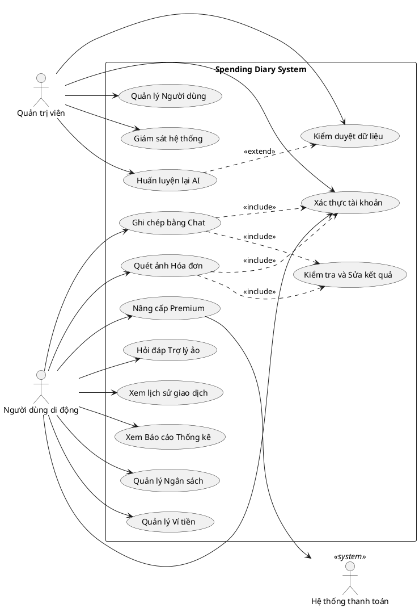

# CHƯƠNG 1. TỔNG QUAN ĐỀ TÀI VÀ ĐẶC TẢ YÊU CẦU

### 1.1. Khảo sát hiện trạng và định hướng hệ thống

Qua khảo sát các ứng dụng quản lý tài chính cá nhân hiện có trên thị trường, đề tài nhận thấy rào cản lớn nhất khiến người dùng từ bỏ việc ghi chép chi tiêu là sự mệt mỏi khi phải nhập liệu thủ công liên tục. Việc duy trì thao tác điền các biểu mẫu tĩnh truyền thống với hàng loạt trường thông tin mang tính lặp lại (như giá trị giao dịch, ngày giờ, danh mục chi tiêu và ghi chú) đòi hỏi nhiều thao tác, khiến người dùng dễ nản chí và từ bỏ thói quen quản lý tài chính.

Từ thực tiễn đó, giải pháp Spending Diary tạo ra bước chuyển dịch từ nhập liệu thuần túy sang ghi chép tự nhiên (Log-Life). Hệ thống không chỉ dừng lại ở việc thống kê các con số khô khan mà tái hiện ngữ cảnh chi tiêu dưới dạng câu chuyện trực quan. Phương thức giao tiếp giữa hệ thống và người dùng được thiết kế thông qua 3 chế độ hiển thị linh hoạt:

- **Dòng thời gian (Story Feed):** Mỗi giao dịch được biểu diễn như một bài đăng sinh động gồm hình ảnh hóa đơn, văn bản mô tả và nhận xét từ trợ lý ảo, giúp gia tăng mức độ tương tác.
- **Phòng trưng bày (Gallery View):** Cấu trúc danh sách ảnh hóa đơn thành bảng lưới, cho phép người dùng nhanh chóng tìm lại các khoản chi thông qua việc nhận diện hình ảnh thay vì đọc văn bản.
- **Lịch chi tiêu (Calendar View):** Tổ chức dữ liệu theo lịch tháng, cung cấp cái nhìn toàn diện về mật độ chi tiêu theo từng ngày.

*(Chèn Hình 1.1: Giao diện 3 chế độ xem: Dòng thời gian, Phòng trưng bày và Lịch chi tiêu)*

Cách tiếp cận này giúp người dùng dễ dàng ghi nhớ, theo dõi và duy trì thói quen quản trị tài chính một cách tự nhiên và liên tục.

### 1.2. Kiến trúc giải pháp 

Hệ thống Spending Diary được thiết kế theo kiến trúc hiện đại, phân tách rõ ràng các tầng để đảm bảo tính mở rộng và dễ bảo trì. Kiến trúc tổng thể bao gồm 4 thành phần chính:

1. **Ứng dụng di động (Client):** Được xây dựng bằng Flutter, phục vụ người dùng cuối với giao diện đa nền tảng (iOS/Android). Đây là nơi người dùng nhập dữ liệu bằng hội thoại hoặc ảnh hóa đơn, xem báo cáo và tương tác với trợ lý ảo Mimo.
2. **Hệ thống điều phối (Backend API):** Xây dựng bằng Node.js (NestJS/Express), đóng vai trò trung tâm xử lý logic nghiệp vụ, quản lý tài khoản, ngân sách và điều phối luồng dữ liệu giữa Client và AI.
3. **Dịch vụ Trí tuệ nhân tạo (AI Service):** Phân hệ độc lập phát triển bằng Python (FastAPI). Phân hệ này chịu trách nhiệm chạy các mô hình học sâu để hiểu ngôn ngữ tự nhiên (trích xuất thông tin từ câu chat) và xử lý thị giác máy tính (nhận dạng thông tin từ ảnh hóa đơn).
4. **Cơ sở dữ liệu (Database):** Sử dụng hệ quản trị cơ sở dữ liệu phân tán CockroachDB để lưu trữ an toàn các dữ liệu tài chính, đảm bảo tính nhất quán và toàn vẹn của dữ liệu giao dịch.

Sự phân tách này giúp hệ thống hoạt động ổn định; ngay cả khi dịch vụ AI gặp sự cố hoặc quá tải, người dùng vẫn có thể ghi chép chi tiêu bằng biểu mẫu thủ công thông qua Backend thông thường.

*(Chèn Hình 1.2: Sơ đồ kiến trúc tổng thể của hệ thống Spending Diary)*

### 1.3. Yêu cầu chức năng

Các yêu cầu chức năng của hệ thống được phân chia theo ba nhóm tác nhân chính và được tổng hợp trong Bảng 1.1.

**Bảng 1.1: Phân tích yêu cầu chức năng của hệ thống**

| Nhóm chức năng | Chi tiết yêu cầu |
| :--- | :--- |
| **1. Ứng dụng di động (Người dùng)** | - **Xác thực:** Đăng ký, đăng nhập an toàn bằng Email/Password hoặc Google. - **Nhập liệu tự động:** Ghi chép bằng cách chat với trợ lý hoặc chụp ảnh hóa đơn. - **Xác nhận giao dịch:** Cho phép người dùng chỉnh sửa kết quả do AI nhận diện trước khi lưu. - **Quản lý ví:** Tạo và quản lý ví cá nhân, hỗ trợ ví nhóm (Group Wallet) để chi tiêu chung. - **Ngân sách & Mục tiêu:** Thiết lập hạn mức chi tiêu, theo dõi mục tiêu tiết kiệm, cảnh báo vượt hạn mức. - **Báo cáo:** Xem thống kê thu chi, biểu đồ phân bổ danh mục theo ngày, tháng. |
| **2. Dịch vụ AI (Hệ thống)** | - **Hiểu ngôn ngữ tự nhiên:** Nhận diện ý định, trích xuất số tiền, danh mục, thời gian từ câu nói/tin nhắn (bao gồm tiếng lóng, viết tắt). - **Nhận dạng hóa đơn:** Phát hiện vùng chữ, đọc văn bản và bóc tách thông tin hóa đơn tự động. - **Trợ lý tư vấn:** Sinh câu trả lời tự nhiên dựa trên số liệu thực tế từ cơ sở dữ liệu để tư vấn tài chính. - **Hợp nhất dữ liệu:** Xử lý các hóa đơn có nhiều mặt hàng để chọn ra danh mục đại diện phù hợp nhất. |
| **3. Cổng Web Admin (Quản trị viên)** | - **Giám sát hệ thống:** Theo dõi các chỉ số hoạt động, thời gian phản hồi, tải của máy chủ AI. - **Quản lý dữ liệu:** Kiểm duyệt các giao dịch mà người dùng đã chỉnh sửa kết quả của AI (Corrections). - **Huấn luyện mô hình:** Kích hoạt tái huấn luyện mô hình AI dựa trên các dữ liệu đã được kiểm duyệt. |

### 1.4. Sơ đồ Use Case tổng quát

Dưới đây là sơ đồ Use Case tổng quát mô phỏng các tương tác giữa người dùng (User) và quản trị viên (Admin) với hệ thống.

*Hình 1.3: Sơ đồ Use Case tổng quát của hệ thống Spending Diary*

Về chi tiết đặc tả cho từng Use Case (bao gồm luồng sự kiện chính, luồng sự kiện ngoại lệ, tiền điều kiện và hậu điều kiện), vui lòng xem tại **Phụ lục D: Đặc tả Use Case chi tiết**.

### 1.5. Yêu cầu phi chức năng

- **Hiệu năng và Độ trễ (Performance & Latency):** Hệ thống cần phản hồi các tin nhắn hội thoại thông thường trong vòng 1,5 giây. Đối với chức năng quét và trích xuất hóa đơn bằng hình ảnh (đòi hỏi xử lý phức tạp), hệ thống phải trả về kết quả trong thời gian tối đa 5-10 giây để đảm bảo trải nghiệm người dùng không bị gián đoạn.
- **Tính sẵn sàng và Chống chịu lỗi (Availability & Fault Tolerance):** Trong trường hợp dịch vụ AI xử lý ngôn ngữ hoặc hình ảnh bị quá tải hoặc gián đoạn, ứng dụng di động phải lập tức chuyển sang chế độ dự phòng, cho phép người dùng tiếp tục nhập liệu bằng biểu mẫu thủ công bình thường.
- **Tính toàn vẹn dữ liệu (Data Integrity):** Hệ thống phải có cơ chế ngăn chặn việc tạo trùng lặp giao dịch (Idempotency) khi người dùng vô tình bấm nút gửi nhiều lần do lỗi mạng. Cơ sở dữ liệu phân tán cần đảm bảo không mất mát dữ liệu tài chính trong mọi tình huống sự cố máy chủ cục bộ.
