# ĐỀ TÀI: ỨNG DỤNG QUẢN LÝ CHI TIÊU CÁ NHÂN THÔNG MINH

*(Sinh viên có thể sử dụng tên gọi tắt: Xây dựng ứng dụng quản lý chi tiêu cá nhân thông minh Spending Diary)*

---

**TÓM TẮT ĐỀ TÀI**

Quản lý chi tiêu cá nhân là việc quan trọng, nhưng hầu hết các ứng dụng hiện nay đều yêu cầu người dùng nhập tay từng con số qua các biểu mẫu cứng nhắc, khiến nhiều người dễ bỏ cuộc giữa chừng. Từ thực tế đó, đề tài tập trung xây dựng ứng dụng Spending Diary — một hệ thống quản lý chi tiêu cho phép ghi chép thu chi hằng ngày nhanh chóng và đơn giản hơn, thông qua nhắn tin tự nhiên hoặc chụp ảnh hóa đơn.

Hệ thống có một trợ lý ảo tên là Mimo. Thay vì phải chọn từng danh mục hay gõ từng con số, người dùng chỉ cần nhắn tin như đang nói chuyện bình thường. Ứng dụng dùng mô hình ngôn ngữ Qwen 2.5 để phân tích câu tiếng Việt, kể cả các từ lóng và cách viết tắt của giới trẻ. Khi có hóa đơn, người dùng chỉ cần chụp ảnh lại, ứng dụng sẽ dùng VietOCR và LayoutLMv3 để tự động trích xuất số tiền và ngày tháng. Điểm đặc biệt là AI luôn phải lấy số liệu trực tiếp từ cơ sở dữ liệu trước khi trả lời, đảm bảo không bao giờ tự suy đoán hay đưa ra con số sai.

Ứng dụng gồm hai phần chính: ứng dụng di động cho người dùng cuối và trang web quản trị dành cho quản trị viên. Kết quả kiểm thử cho thấy hệ thống nhận diện câu nói và hình ảnh nhanh, đạt độ chính xác cao. Với Spending Diary, đề tài hướng đến việc mang lại một công cụ ghi chép thật sự thân thiện, giúp mọi người duy trì thói quen quản lý tài chính tốt hơn.

---

# LỜI CẢM ƠN

Để hoàn thành đề tài luận văn này, trước hết em xin gửi lời cảm ơn chân thành đến gia đình em. Ba mẹ và người thân đã luôn ở bên, động viên và tạo điều kiện để em có thể yên tâm học tập và nghiên cứu trong suốt quãng thời gian đại học.

Em đặc biệt xin cảm ơn Thầy Thái Minh Tuấn, Giảng viên hướng dẫn của em. Từ những ngày đầu chọn đề tài, Thầy đã tận tình hướng dẫn và đồng hành cùng em qua từng giai đoạn. Những góp ý chuyên môn của Thầy đã giúp em tháo gỡ được nhiều vấn đề kỹ thuật khó trong quá trình xây dựng hệ thống.

Em cũng xin cảm ơn những người bạn đã luôn đồng hành cùng em. Cảm ơn các bạn Dương Quốc Kiệt, Thạch Ly Na, Hà Nhã Uyên, Thạch Thị Bảo Trân và Lâm Thị Bích Như đã nhiệt tình giúp đỡ trong việc thu thập dữ liệu, thử nghiệm các tính năng và đóng góp những ý kiến rất thực tế. Nhờ có các bạn mà ứng dụng trở nên hoàn thiện và gần gũi với người dùng hơn.

Cuối cùng, em xin trân trọng cảm ơn quý Thầy Cô trong Hội đồng bảo vệ luận văn đã dành thời gian đánh giá đề tài. Dù đã cố gắng hết sức, em biết đề tài vẫn còn nhiều điểm cần được bổ sung và hoàn thiện thêm. Em rất mong nhận được nhận xét và góp ý của quý Thầy Cô.

Trân trọng cảm ơn!

---

# MỤC LỤC
1. Phần Giới thiệu
2. Chương 1 - Tổng quan đề tài và Đặc tả yêu cầu
   1.1. Mô tả đề tài
   1.2. Kiến trúc giải pháp và mô hình kỹ thuật đề xuất
   1.3. Phân tích yêu cầu chức năng
   1.4. Sơ đồ Use Case tổng quát
   1.5. Yêu cầu phi chức năng
3. Chương 2 - Cơ sở lý thuyết và thiết kế giải pháp
4. Chương 3 - Cài đặt và triển khai hệ thống
5. Chương 4 - Đánh giá và Kiểm thử mô hình
6. Chương 5 - Kết luận và Hướng phát triển

---

# PHẦN GIỚI THIỆU

### 1. Đặt vấn đề

Trong cuộc sống hiện nay, việc quản lý tài chính cá nhân ngày càng trở nên quan trọng, đặc biệt với nhóm người trẻ khi thu nhập bắt đầu ổn định nhưng thói quen chi tiêu chưa được kiểm soát tốt. Trên các kho ứng dụng đã có nhiều công cụ hỗ trợ quản lý chi tiêu, nhưng hầu hết vẫn yêu cầu người dùng tự tay nhập từng khoản thu chi qua các biểu mẫu cứng nhắc. Sự lặp đi lặp lại của các bước điền số tiền, chọn danh mục và viết ghi chú khiến người dùng nhanh chóng chán nản và thường bỏ cuộc chỉ sau vài tuần sử dụng. Về lâu dài, điều này khiến việc theo dõi tài chính cá nhân trở thành một thói quen khó duy trì hơn là một công cụ thực sự có ích.

Trong những năm gần đây, trí tuệ nhân tạo phát triển mạnh, đặc biệt là các công nghệ xử lý ngôn ngữ tự nhiên và nhận dạng văn bản trên hình ảnh. Tuy nhiên, việc áp dụng những công nghệ này vào ứng dụng quản lý tài chính thực tế vẫn còn nhiều thách thức. Tiếng Việt là ngôn ngữ có thanh điệu phức tạp, cách viết tắt và từ lóng của giới trẻ thay đổi liên tục, trong khi các tờ hóa đơn in nhiệt thường có độ tương phản thấp và phông chữ không đồng nhất, gây khó khăn cho các hệ thống nhận dạng thông thường. Từ thực trạng đó, đề tài được thực hiện nhằm xây dựng ứng dụng Spending Diary — một hệ thống quản lý chi tiêu thông minh cho phép người dùng ghi chép thu chi chỉ bằng cách nhắn tin tự nhiên hoặc chụp ảnh hóa đơn, thay thế hoàn toàn các biểu mẫu nhập liệu thủ công truyền thống.

### 2. Các ứng dụng liên quan

Qua quá trình khảo sát các giải pháp hiện có trên thị trường, đề tài xác định được hai nhóm sản phẩm đang được sử dụng phổ biến. Nhóm thứ nhất là các ứng dụng sổ thu chi cá nhân như MoneyLover (https://moneylover.me) và Sổ thu chi MISA (https://www.misa.vn). Đây là những ứng dụng được nhiều người dùng với giao diện báo cáo rõ ràng và hệ thống danh mục chi tiết. Tuy nhiên, cơ chế phân loại giao dịch của các ứng dụng này chủ yếu dựa vào bộ từ khóa định sẵn, không thể học từ thói quen và cách diễn đạt riêng của từng người dùng. Khi người dùng nhập câu có từ lóng hoặc cách viết tắt không nằm trong danh sách từ khóa, hệ thống thường phân loại sai hoặc yêu cầu người dùng chọn lại thủ công.

Nhóm thứ hai là các ứng dụng ngân hàng số như Timo (https://timo.vn). Các nền tảng này phân loại giao dịch khá chính xác nhờ có sẵn mã ngành nghề từ hệ thống thẻ thanh toán. Tuy nhiên, chúng chỉ ghi nhận được giao dịch qua thẻ mà không thể theo dõi các khoản chi bằng tiền mặt, vốn vẫn rất phổ biến trong cuộc sống hằng ngày tại Việt Nam. Ngoài ra, các ứng dụng này cũng chưa có trợ lý ảo đủ thông minh để trò chuyện tự nhiên với người dùng. Spending Diary được xây dựng nhằm giải quyết đồng thời cả hai điểm yếu trên: ghi nhận được mọi giao dịch kể cả tiền mặt thông qua nhắn tin hoặc chụp ảnh hóa đơn, đồng thời đảm bảo mọi số liệu đều được kiểm tra trực tiếp với cơ sở dữ liệu trước khi phản hồi người dùng.

### 3. Mục tiêu của đề tài

Đề tài xác định ba nhóm mục tiêu chính. Mục tiêu đầu tiên là xây dựng cơ chế nhập liệu thông minh, cho phép người dùng ghi chép thu chi mà không cần điền biểu mẫu. Thay vào đó, người dùng chỉ cần nhắn tin theo cách nói thông thường hoặc chụp ảnh hóa đơn, hệ thống sẽ tự động nhận diện và phân loại đúng số tiền cùng danh mục tương ứng.

Mục tiêu thứ hai là nghiên cứu, tinh chỉnh và tích hợp thành công các mô hình AI vào hệ thống. Với phần xử lý ngôn ngữ, mô hình Qwen 2.5 được tinh chỉnh trên tập dữ liệu tiếng Việt để nhận diện đúng ý định người dùng ngay cả khi họ dùng từ lóng hoặc viết tắt; kết quả được đánh giá đối chiếu với PhoBERT và TF-IDF. Với phần xử lý hình ảnh, kiến trúc LayoutLMv3 kết hợp VietOCR được áp dụng để trích xuất chính xác số tiền và ngày tháng từ các tờ hóa đơn bán lẻ có bố cục không đồng nhất.

Mục tiêu thứ ba là đảm bảo tính chính xác và toàn vẹn cho dữ liệu tài chính. Hệ thống bắt buộc mọi thông tin về số dư và lịch sử giao dịch phải được truy vấn trực tiếp từ cơ sở dữ liệu trước khi phản hồi, không để AI tự suy đoán. Người dùng cũng có thể xem lại và chỉnh sửa kết quả nhận diện trước khi xác nhận lưu, đảm bảo dữ liệu luôn phản ánh đúng thực tế. Đề tài hướng đến việc triển khai hệ thống hoàn chỉnh trên hai nền tảng: ứng dụng di động cho người dùng cuối và trang web quản trị dành cho quản trị viên.

### 4. Đối tượng và phạm vi nghiên cứu

#### 4.1. Đối tượng nghiên cứu

Đề tài hướng đến phục vụ đối tượng chính là nhóm người dùng trẻ tại Việt Nam, đặc biệt là sinh viên và người mới đi làm. Đây là nhóm có nhu cầu quản lý tài chính cá nhân cao nhưng thường gặp khó khăn trong việc duy trì thói quen ghi chép do trở ngại từ các bước nhập liệu thủ công của ứng dụng truyền thống.

Về mặt công nghệ, đề tài tập trung nghiên cứu và ứng dụng các kỹ thuật học sâu tiên tiến. Trong lĩnh vực xử lý ngôn ngữ tự nhiên, đối tượng nghiên cứu là mô hình ngôn ngữ lớn Qwen 2.5 để phân tích câu lệnh tiếng Việt. Đối với xử lý hình ảnh, đề tài khảo sát kiến trúc LayoutLMv3 kết hợp cùng VietOCR nhằm nhận dạng thông tin từ hóa đơn. Bên cạnh đó, hệ thống cũng ứng dụng cơ sở dữ liệu PostgreSQL để đảm bảo tính an toàn và toàn vẹn cho các dữ liệu giao dịch.

#### 4.2. Phạm vi nghiên cứu

Về mặt nghiệp vụ, phạm vi của ứng dụng được giới hạn ở việc quản lý các khoản chi tiêu cá nhân hoặc các giao dịch dùng chung trong một nhóm nhỏ như gia đình và nhóm bạn bè. Hệ thống không mở rộng sang các nghiệp vụ tài chính phức tạp như kế toán doanh nghiệp, tính thuế thu nhập hay phân tích biểu đồ chứng khoán, nhằm giữ cho ứng dụng luôn đơn giản và đúng với định hướng thân thiện với người dùng phổ thông.

Về mặt dữ liệu đầu vào, nghiên cứu chỉ tập trung xử lý các câu giao tiếp bằng tiếng Việt thông dụng hằng ngày, bao gồm cả từ lóng và cách viết tắt phổ biến của giới trẻ. Đối với tính năng chụp ảnh, hệ thống chỉ giới hạn giải quyết bài toán trích xuất dữ liệu từ các loại hóa đơn bán lẻ đặc thù tại thị trường Việt Nam.

### 5. Phương pháp nghiên cứu

Đề tài kết hợp phương pháp nghiên cứu thực nghiệm đối với trí tuệ nhân tạo và mô hình phát triển linh hoạt đối với kỹ thuật phần mềm. Về mặt dữ liệu, nghiên cứu tiến hành thu thập, làm sạch và gán nhãn tập lệnh tiếng Việt giao tiếp hằng ngày cùng hình ảnh hóa đơn thực tế tại Việt Nam để tiền xử lý và huấn luyện, đồng thời sử dụng độ chính xác và chỉ số F1 để đánh giá hiệu năng nhận diện của mô hình. Về quy trình xây dựng phần mềm, hệ thống được phân rã thành các phân hệ độc lập gồm giao diện di động Flutter, máy chủ trung tâm Node.js và máy chủ xử lý thông minh Python, được lập trình, tích hợp và kiểm thử liên tục theo từng giai đoạn để đảm bảo tốc độ phản hồi mượt mà và duy trì tính toàn vẹn dữ liệu.

### 6. Nội dung nghiên cứu

Thứ nhất, đề tài khảo sát nhu cầu tài chính cá nhân của người dùng trẻ để thiết kế kiến trúc phần mềm phân tầng cho ứng dụng Spending Diary. Hệ sinh thái bao gồm ứng dụng di động Flutter dành cho người dùng cuối, trang web quản trị React cùng máy chủ điều phối Node.js kết nối cơ sở dữ liệu phân tán CockroachDB, nhằm đảm bảo hiệu năng chịu tải và bảo toàn tính toàn vẹn của lịch sử giao dịch.

Thứ hai, đề tài nghiên cứu và ứng dụng các kỹ thuật trí tuệ nhân tạo để giải quyết bài toán nhập liệu tự động. Hệ thống sử dụng mô hình ngôn ngữ lớn Qwen 2.5 với kỹ thuật tinh chỉnh LoRA để bóc tách ý định ghi chép từ câu lệnh tiếng Việt tự nhiên, kết hợp mô hình LayoutLMv3 cùng VietOCR để số hóa hóa đơn bán lẻ. Đồng thời, cơ chế tạo văn bản tăng cường truy xuất được tích hợp giúp trợ lý ảo Mimo phản hồi số dư thực tế, loại bỏ hiện tượng bịa đặt số liệu.

Thứ ba, đề tài tiến hành cài đặt hoàn chỉnh ứng dụng với các chức năng cốt lõi như ghi chép qua trò chuyện, quét hóa đơn, quản lý ngân sách và ví chung, đi kèm công cụ gán nhãn dữ liệu trên trang quản trị để huấn luyện lại mô hình từ xa. Hiệu năng hệ thống được đánh giá thực nghiệm bằng chỉ số độ chính xác nhằm chứng minh tính khả thi và độ tin cậy khi vận hành thực tế.

### 7. Bố cục luận văn

Luận văn được chia thành ba phần chính, đi kèm tài liệu tham khảo và phụ lục. Cấu trúc cụ thể như sau:

PHẦN 1: GIỚI THIỆU
Trình bày tổng quan về đề tài bao gồm: đặt vấn đề, mục tiêu, đối tượng, phạm vi, phương pháp nghiên cứu, nội dung nghiên cứu và bố cục luận văn.

PHẦN 2: NỘI DUNG NGHIÊN CỨU VÀ TRIỂN KHAI
Phần cốt lõi của luận văn, bao gồm 4 chương:
- Chương 1: Tổng quan đề tài. Phân tích bài toán, mô tả kiến trúc tổng quát và các đặc tả yêu cầu của hệ thống.
- Chương 2: Cơ sở lý thuyết. Khảo sát các giải pháp hiện tại và tổng hợp nền tảng công nghệ về trí tuệ nhân tạo (LLM, LayoutLMv3, OCR).
- Chương 3: Thiết kế và cài đặt. Trình bày chi tiết kiến trúc hệ thống, quy trình xử lý thông tin, cơ chế trợ lý ảo Mimo và quá trình xây dựng ứng dụng.
- Chương 4: Kiểm thử và đánh giá. Đánh giá thực nghiệm hiệu năng hệ thống qua các chỉ số định lượng (Accuracy, F1-Score) và thảo luận kết quả đạt được.

PHẦN 3: KẾT LUẬN VÀ HƯỚNG PHÁT TRIỂN
Tổng kết các đóng góp thực tiễn của đề tài, đồng thời đề xuất hướng tối ưu hóa và mở rộng tính năng trong tương lai.
---

# PHẦN 2: NỘI DUNG NGHIÊN CỨU VÀ TRIỂN KHAI

# CHƯƠNG 1. TỔNG QUAN ĐỀ TÀI VÀ ĐẶC TẢ YÊU CẦU

### 1.1. Mô tả tổng quan và kiến trúc đề xuất

Đề tài tập trung thiết kế và phát triển hệ sinh thái phần mềm quản lý tài chính cá nhân mang tên Spending Diary. Đây là một hệ thống khép kín ứng dụng trí tuệ nhân tạo để tự động hóa quy trình ghi chép thu chi hằng ngày, giúp thay thế hoàn toàn phương pháp nhập liệu thủ công truyền thống. Hệ thống được tổ chức thành một chuỗi các dịch vụ tương tác chặt chẽ với nhau, bao gồm hai điểm chạm chính là ứng dụng di động dành cho người dùng cuối và trang web dành riêng cho quản trị viên. Toàn bộ kiến trúc được phân tầng rõ ràng nhằm đảm bảo tính ổn định, khả năng mở rộng và tính toàn vẹn của dữ liệu xuyên suốt quá trình vận hành.

Ở tầng giao diện người dùng, ứng dụng di động đóng vai trò như một trợ lý kế toán cá nhân thông minh được phát triển trên nền tảng Flutter đa hệ điều hành. Người dùng bắt đầu bằng việc tạo tài khoản, đăng nhập an toàn và có thể nâng cấp lên các gói dịch vụ cao cấp để mở khóa toàn bộ trải nghiệm. Điểm nổi bật nhất của ứng dụng là khả năng ghi chép giao dịch tự động. Thay vì nhập số liệu thủ công, người dùng có thể tương tác trực tiếp với trợ lý ảo Mimo thông qua ngôn ngữ tự nhiên hoặc sử dụng máy ảnh để quét hóa đơn mua sắm. Hệ thống sẽ tự động phân tích ý định, bóc tách dữ liệu và khởi tạo các bản ghi thu chi hoàn chỉnh. Bên cạnh đó, ứng dụng cung cấp cơ chế quản lý ví tiền linh hoạt, cho phép người dùng theo dõi riêng rẽ các quỹ cá nhân hoặc chia sẻ ví dùng chung với nhiều thành viên khác. Để kiểm soát dòng tiền hiệu quả, tính năng quản lý ngân sách giúp người dùng thiết lập các hạn mức chi tiêu hàng tháng và tự động gửi cảnh báo khi có nguy cơ vượt hạn mức. Mọi lịch sử giao dịch đều được tổng hợp chi tiết qua các chế độ xem dạng danh sách, thẻ ảnh, lịch tháng hoặc các biểu đồ báo cáo tài chính trực quan. Nhằm tăng tính tương tác, ứng dụng còn hỗ trợ thiết kế và đóng gói các giao dịch thành thẻ ảnh sinh động để chia sẻ dễ dàng lên các nền tảng mạng xã hội.

Song song với trải nghiệm người dùng, trang web quản trị được xây dựng dựa trên thư viện React nhằm cung cấp một trung tâm kiểm soát toàn diện cho ban điều hành. Nền tảng này cho phép quản trị viên theo dõi sát sao biểu đồ tăng trưởng người dùng mới, kiểm duyệt các hành vi vi phạm và xử lý kịp thời các đơn khiếu nại. Quan trọng hơn, hệ thống quản trị tích hợp các công cụ dán nhãn dữ liệu trực quan chuyên sâu. Tại đây, đội ngũ quản trị có thể chủ động khoanh vùng sửa lỗi cho các hình ảnh hóa đơn bị mờ hoặc tinh chỉnh các câu lệnh mà AI phân loại sai ý định. Những dữ liệu đã được làm sạch này sẽ trở thành nguồn nguyên liệu quý giá để liên tục huấn luyện lại mô hình, giúp bộ não nhân tạo ngày càng nhạy bén. Đồng thời, nền tảng còn cung cấp quyền điều khiển để quản trị viên tùy chỉnh linh hoạt tính cách của trợ lý ảo Mimo, mang lại trải nghiệm giao tiếp tự nhiên và gần gũi hơn cho người dùng.

Để liên kết và vận hành trơn tru hai nền tảng trên, kiến trúc hệ thống được chống đỡ bởi một tầng máy chủ mạnh mẽ và bảo mật. Tầng máy chủ trung tâm sử dụng Node.js kết hợp bộ khung Express để tiếp nhận và điều phối mọi luồng dữ liệu, xác thực quyền truy cập và bảo vệ hệ thống khỏi các yêu cầu độc hại. Mọi dữ liệu tài chính cốt lõi được lưu trữ an toàn tuyệt đối tại hệ quản trị cơ sở dữ liệu phân tán PostgreSQL tương thích với CockroachDB, trong khi các tệp phương tiện đa phương tiện được tối ưu hóa lưu trữ trên nền tảng đám mây Cloudflare R2. Nhằm đảm bảo hiệu suất tính toán, phần trí tuệ nhân tạo được cô lập thành một máy chủ độc lập sử dụng ngôn ngữ Python và bộ khung FastAPI. Tại cụm máy chủ này, mô hình ngôn ngữ lớn Qwen 2.5 và kiến trúc LayoutLMv3 phối hợp nhịp nhàng để giải quyết các bài toán phức tạp từ việc hiểu ngữ nghĩa câu lệnh tiếng Việt cho đến trích xuất thông tin bố cục đa phương thức từ hình ảnh hóa đơn.

Dưới đây là sơ đồ kiến trúc tổng quan thể hiện luồng tương tác giữa các thành phần trong hệ sinh thái:


Sơ đồ minh họa mô hình tương tác đa dịch vụ, nơi dữ liệu từ ứng dụng di động được chuyển đến máy chủ Node.js để kiểm duyệt, sau đó luân chuyển đến cụm máy chủ FastAPI để phân tích bằng trí tuệ nhân tạo và cuối cùng được lưu trữ an toàn tại cơ sở dữ liệu.

### 1.2. Phân tích yêu cầu chức năng

Dựa vào kiến trúc tổng thể, các yêu cầu của hệ thống được bóc tách và phân rã chi tiết thành bốn vùng độc lập. Việc phân rã này giúp xác định rõ giới hạn trách nhiệm của từng nền tảng phần mềm trong toàn bộ hệ sinh thái. Bảng 1.1 dưới đây định nghĩa cụ thể các yêu cầu chức năng cốt lõi mà hệ thống bắt buộc phải đáp ứng, chia theo từng phân hệ.

Bảng 1.1: Bảng phân rã yêu cầu chức năng chi tiết theo từng phân hệ

| Phân hệ kiến trúc | Chức năng cụ thể | Mô tả yêu cầu chi tiết |
| :--- | :--- | :--- |
| Người dùng trên app | Đăng ký và đăng nhập | Tạo tài khoản, xác thực thông tin đăng nhập và hỗ trợ khôi phục mật khẩu. |
| Người dùng trên app | Nâng cấp tài khoản | Cho phép người dùng thanh toán trực tuyến để mở khóa các tính năng cao cấp. |
| Người dùng trên app | Quản lý ví tiền | Tạo, chỉnh sửa, xóa các loại ví cá nhân hoặc tạo ví dùng chung với nhiều thành viên. |
| Người dùng trên app | Ghi chép bằng trò chuyện | Nhắn tin bằng ngôn ngữ tự nhiên để trợ lý ảo tự động phân tích và ghi chép giao dịch. |
| Người dùng trên app | Quét ảnh hóa đơn | Chụp ảnh hóa đơn mua sắm để hệ thống tự động nhận diện số tiền và danh mục chi tiêu. |
| Người dùng trên app | Hỏi đáp thông minh | Nhắn tin hỏi trợ lý ảo về số dư tài chính hoặc xin lời khuyên tiết kiệm. |
| Người dùng trên app | Quản lý hạn mức và gợi ý ngân sách | Đặt giới hạn chi tiêu, tự động gợi ý phân bổ ngân sách 50/30/20 và gửi cảnh báo khi sắp vượt hạn mức. |
| Người dùng trên app | Báo cáo và so sánh | Cung cấp biểu đồ thu chi, xem tổng kết cuối tháng và so sánh mức chi tiêu với cộng đồng. |
| Người dùng trên app | Quản lý giao dịch | Xem chi tiết, chỉnh sửa số tiền, đổi danh mục hoặc xóa giao dịch đã ghi nhận. |
| Quản trị trên web | Thống kê doanh thu | Giám sát biểu đồ tăng trưởng người dùng, tỷ lệ lỗi máy chủ và tổng doanh thu. |
| Quản trị trên web | Quản lý người dùng | Tra cứu thông tin người dùng, duyệt khiếu nại và ra lệnh khóa các tài khoản vi phạm. |
| Quản trị trên web | Dán nhãn dữ liệu ảnh | Công cụ vẽ khung chữ nhật để khoanh vùng lại các đoạn chữ trên hóa đơn bị nhận diện sai. |
| Quản trị trên web | Tinh chỉnh tính cách AI | Đổi câu lệnh nền tảng để tùy chỉnh giọng điệu và cách nói chuyện của trợ lý ảo. |
| Quản trị trên web | Ra lệnh huấn luyện AI | Kích hoạt quá trình huấn luyện lại mô hình học máy từ tập dữ liệu hóa đơn đã dán nhãn. |
| Máy chủ backend | Xử lý nghiệp vụ tài chính | Tiếp nhận giao dịch, tính toán số dư ví và đối chiếu liên tục với hạn mức ngân sách. |
| Máy chủ backend | Cổng API và Bảo mật | Điều hướng yêu cầu, xác thực quyền truy cập và tự động khóa (autoban) các kết nối rác. |
| Máy chủ backend | Quản lý trạng thái hộp thoại | Lưu nháp ngữ cảnh khi AI nhận diện thiếu thông tin và điều phối luồng hỏi đáp bổ sung. |
| Máy chủ backend | Hệ thống tự động hóa | Lắng nghe webhook ngân hàng để nâng cấp tài khoản và chạy tiến trình ngầm gửi thông báo. |
| Máy chủ AI | Xử lý ngôn ngữ tự nhiên | Phân tích tin nhắn của người dùng để nhận diện đúng ý định và trích xuất thông số giao dịch. |
| Máy chủ AI | Trích xuất hình ảnh | Áp dụng kỹ thuật thị giác máy tính để số hóa hóa đơn giấy thành các bản ghi tài chính. |
| Máy chủ AI | Cập nhật trọng số mô hình | Tự động cập nhật các tệp trọng số mới vào bộ nhớ sau khi quá trình huấn luyện hoàn tất. |

### 1.3. Sơ đồ Use Case tổng quát và chi tiết

Để có cái nhìn toàn diện từ bao quát đến chuyên sâu về hành vi của các tác nhân, hệ thống Spending Diary được mô hình hóa bằng sơ đồ Use Case tổng quát và hai sơ đồ Use Case chi tiết cho từng phân hệ.

#### 1.3.1. Sơ đồ Use Case tổng quát của hệ thống

Sơ đồ tổng quát thể hiện mối quan hệ giữa ba tác nhân chính gồm người dùng cuối, quản trị viên và hệ thống tự động đối với mười tám chức năng lớn trong toàn bộ ứng dụng. Cả người dùng và quản trị viên đều bắt buộc phải trải qua bước xác thực tài khoản trước khi truy cập các luồng nghiệp vụ riêng biệt.

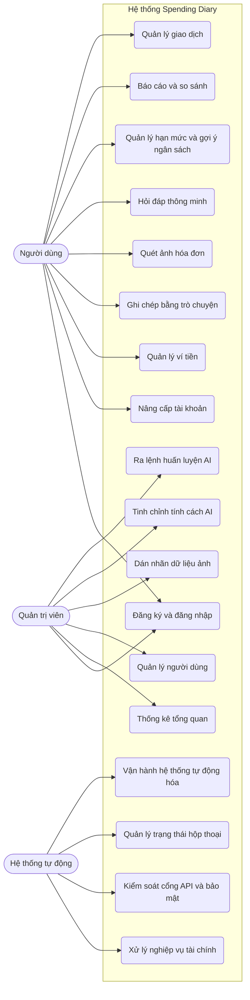

Hình 1.2: Sơ đồ Use Case tổng quát toàn bộ hệ thống.

Sơ đồ trên cho thấy phân chia trách nhiệm rõ rệt giữa người dùng thao tác nghiệp vụ thu chi cá nhân trên ứng dụng di động và quản trị viên quản lý, giám sát, huấn luyện mô hình trí tuệ nhân tạo trên trang web quản trị. Các chức năng cốt lõi này đều có bảng đặc tả chi tiết tại phụ lục của luận văn.

#### 1.3.2. Sơ đồ Use Case chi tiết phân hệ người dùng

Đối với người dùng trên ứng dụng di động, sơ đồ chi tiết mở rộng từng luồng chức năng lớn thành các chức năng nghiệp vụ cụ thể mà người dùng có thể chủ động thao tác trên giao diện.

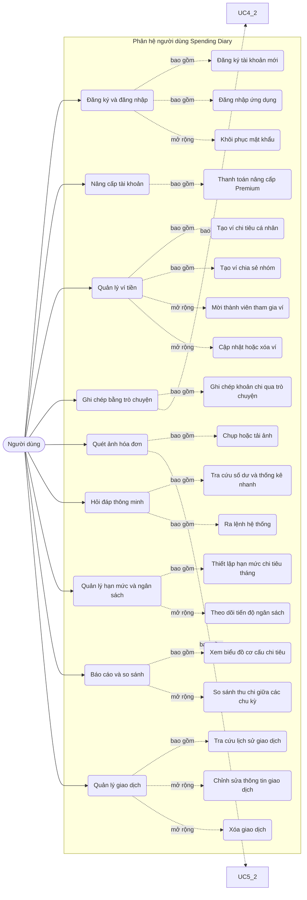

Hình 1.3: Sơ đồ Use Case chi tiết phân hệ người dùng trên ứng dụng di động.

Sơ đồ trên tập trung hoàn toàn vào góc độ người dùng di động, loại bỏ các bước xử lý kỹ thuật trung gian để làm rõ các luồng nghiệp vụ thực tế mà người dùng có thể lựa chọn thao tác, từ quản lý tài khoản, khai thác trợ lý ảo Mimo cho đến theo dõi ngân sách và báo cáo chi tiêu.

#### 1.3.3. Sơ đồ Use Case chi tiết phân hệ quản trị viên

Trên nền tảng trang web quản trị, sơ đồ mở rộng các chức năng điều hành của ban quản trị thành các nghiệp vụ theo dõi thống kê, kiểm soát tài khoản và quản trị chu trình học sâu cho bộ não AI.

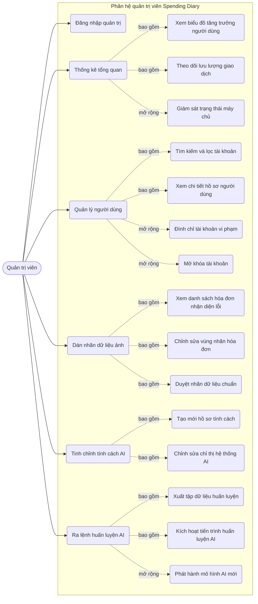

Hình 1.4: Sơ đồ Use Case chi tiết phân hệ quản trị viên trên nền tảng web.

Sơ đồ trên được xây dựng thuần túy dưới góc độ của ban quản trị hệ thống trên nền tảng web, thể hiện cụ thể các nghiệp vụ quản lý danh sách người dùng, kiểm duyệt dữ liệu hóa đơn lỗi và điều khiển toàn bộ chu trình tái huấn luyện mô hình trí tuệ nhân tạo.

### 1.4. Yêu cầu phi chức năng

Để một ứng dụng tài chính được người dùng tin tưởng và sử dụng lâu dài, hệ thống Spending Diary phải đáp ứng các tiêu chuẩn kỹ thuật khắt khe bên cạnh các tính năng cốt lõi.

Về mặt hiệu năng, ứng dụng trên thiết bị di động cần tối ưu hóa thời gian khởi động và đảm bảo các thao tác chuyển đổi giao diện diễn ra mượt mà. Trong quá trình tương tác với trợ lý ảo, cụm máy chủ máy học phải phân tích ý định ngôn ngữ và phản hồi kết quả trong khoảng thời gian dưới hai giây để duy trì trải nghiệm liền mạch.

Về tính bảo mật, toàn bộ mật khẩu và thông tin xác thực của người dùng bắt buộc phải được mã hóa một chiều an toàn trước khi lưu trữ vào cơ sở dữ liệu. Hệ thống backend cũng cần được trang bị các cơ chế giám sát lưu lượng mạng nhằm tự động nhận diện và ngăn chặn các cuộc tấn công từ chối dịch vụ do gửi yêu cầu quá tải.

Về độ tin cậy và khả năng mở rộng, hệ thống quản trị cơ sở dữ liệu phải đảm bảo tính toàn vẹn tuyệt đối cho dữ liệu tài chính. Ứng dụng cần có cơ chế chống tạo trùng lặp bản ghi trong các trường hợp đường truyền mạng gián đoạn khiến người dùng gửi một giao dịch nhiều lần. Hơn nữa, kiến trúc hệ thống phải được thiết kế phân tán độc lập, cho phép dễ dàng nâng cấp tài nguyên phần cứng khi tải trọng tăng cao mà không yêu cầu tái cấu trúc lại nền tảng mã nguồn hiện tại.

# CHƯƠNG 2. CƠ SỞ LÝ THUYẾT VÀ CÔNG NGHỆ LIÊN QUAN

### 2.1. Tổng quan các công nghệ sử dụng

Chương này sẽ trình bày các nền tảng lý thuyết và các công nghệ cốt lõi được sử dụng để xây dựng hệ thống Spending Diary. Nhằm đảm bảo tính trực quan và dễ tiếp cận, nội dung được trình bày dưới dạng các đoạn văn liên kết, bao hàm đầy đủ các yếu tố: khái niệm thực tế, mục đích sử dụng, luồng dữ liệu đầu vào và đầu ra, cùng ưu điểm chính của từng công nghệ.

Bảng 2.1: Bảng tổng hợp các công nghệ sử dụng trong hệ thống

| Phân hệ xử lý | Công nghệ | Mô tả ngắn gọn |
| :--- | :--- | :--- |
| Giao diện người dùng | Flutter và React | Công cụ xây dựng giao diện cho ứng dụng di động và cổng quản trị Web. |
| Kiến trúc phần mềm | Microservices | Kiến trúc chia nhỏ hệ thống thành các dịch vụ đám mây độc lập. |
| Giao tiếp mạng | RESTful API và WebSocket | Tiêu chuẩn kết nối tĩnh và giao thức truyền tải thời gian thực. |
| Máy chủ | Node.js và FastAPI | Môi trường xử lý luồng nghiệp vụ chính và triển khai AI. |
| Lưu trữ dữ liệu | CockroachDB và Cloud R2 | Cơ sở dữ liệu phân tán an toàn và nền tảng lưu trữ hình ảnh đám mây. |
| Thị giác máy tính | DBNet | Mạng phát hiện và định vị các khu vực chứa văn bản trên hình ảnh. |
| Thị giác máy tính | VietOCR | Mô hình nhận dạng và dịch hình ảnh chữ viết sang văn bản tiếng Việt. |
| Thị giác máy tính | LayoutLMv3 | Mô hình phân tích không gian và văn bản để trích xuất hóa đơn. |
| Xử lý ngôn ngữ tự nhiên | PhoBERT | Mô hình học sâu chuyên phân tích cấu trúc ngữ pháp tiếng Việt. |
| Trợ lý ảo AI | Qwen 2.5 | Mô hình ngôn ngữ lớn làm lõi tư vấn và sinh câu phản hồi tự nhiên. |
| Tinh chỉnh mô hình | LoRA | Kỹ thuật tinh chỉnh gọn nhẹ giúp AI hiểu sâu nghiệp vụ tài chính. |
| Bổ trợ tri thức | RAG | Kiến trúc ép AI trả lời dựa trên sự thật truy xuất từ cơ sở dữ liệu. |

Bảng 2.1 ở trên tổng hợp 12 nhóm công nghệ và mô hình máy học nòng cốt tham gia vào toàn bộ vòng đời xử lý dữ liệu của dự án. Sự kết hợp này giúp hệ thống hoạt động ổn định và thông minh.

### 2.2. Nền tảng kiến trúc và máy chủ

#### 2.2.1. Giao diện ứng dụng Flutter và React
Hệ thống đòi hỏi hai loại giao diện tách biệt: một ứng dụng trên điện thoại dành cho người dùng phổ thông và một trang web dành riêng cho ban quản trị. Để đáp ứng nhu cầu này, dự án sử dụng kết hợp hai công nghệ là Flutter và React. Đối với ứng dụng trên điện thoại, Flutter được lựa chọn. Đây là một khung lập trình do Google phát triển, cho phép viết mã một lần nhưng có thể chạy mượt mà trên cả hai hệ điều hành Android và iOS [1]. Đầu vào của Flutter là việc tiếp nhận mọi thao tác vuốt chạm, nhập liệu từ người dùng. Đầu ra của nó là các giao diện màn hình trực quan và các gói dữ liệu được đóng gói cẩn thận để gửi lên máy chủ. 

Đối với cổng quản trị, dự án sử dụng React. Đây là một thư viện chuyên biệt để xây dựng giao diện trên nền tảng web. Đầu vào của React là các thao tác nhấp chuột và gõ phím từ quản trị viên. Đầu ra của nó là các bảng biểu thống kê, biểu đồ và danh sách dữ liệu giúp ban quản trị dễ dàng theo dõi tình hình hoạt động của toàn hệ thống. Cả hai công nghệ này đều được ưu tiên sử dụng vì có cộng đồng hỗ trợ rất lớn, tài liệu phong phú, giúp cho việc xây dựng giao diện luôn đảm bảo được tính thẩm mỹ, mượt mà và thân thiện với người sử dụng.

#### 2.2.2. Kiến trúc Microservices
Microservices là một phương pháp thiết kế phần mềm, trong đó thay vì xây dựng một hệ thống tập trung quy mô lớn, người ta sẽ chia nhỏ nó thành nhiều dịch vụ hoạt động độc lập với nhau. Trong dự án này, hệ thống được tách biệt rõ ràng thành hai phần chính: máy chủ chuyên xử lý giao dịch và máy chủ chuyên chạy trí tuệ nhân tạo (AI). 

Mục đích chính của phương pháp này là đảm bảo hiệu suất hoạt động. Khi máy chủ AI đang phải dồn tài nguyên để phân tích những tờ hóa đơn phức tạp, các thao tác ghi chép thu chi thông thường của những người dùng khác trên máy chủ giao dịch vẫn diễn ra bình thường, không bị chậm trễ hay quá tải. Đầu vào của kiến trúc này là toàn bộ luồng yêu cầu từ điện thoại của người dùng. Đầu ra của nó là sự điều hướng và phân luồng dữ liệu một cách trơn tru, đảm bảo yêu cầu nào sẽ được chuyển đến đúng máy chủ có nhiệm vụ xử lý yêu cầu đó.

#### 2.2.3. Máy chủ Node.js và FastAPI
Để vận hành kiến trúc chia nhỏ ở trên, hệ thống sử dụng kết hợp hai loại máy chủ là Node.js và FastAPI, mỗi máy chủ đảm nhận một vai trò riêng biệt. Trong đó, Node.js đóng vai trò như một trạm kiểm soát trung tâm. Đầu vào của nó là các yêu cầu phổ thông từ người dùng như đăng nhập, xem báo cáo, hoặc lưu lại một giao dịch mới. Đầu ra của nó là các bản ghi được lưu an toàn vào cơ sở dữ liệu. Điểm mạnh của Node.js là khả năng xử lý bất đồng bộ, giúp nó có thể tiếp nhận và phản hồi hàng ngàn người dùng cùng một lúc mà không bắt họ phải chờ đợi lâu.

Trong khi đó, FastAPI là một khung làm việc được lập trình bằng ngôn ngữ Python [2]. Đầu vào của FastAPI là các hình ảnh hóa đơn hoặc câu lệnh mà Node.js chuyển sang nhờ hỗ trợ phân tích. Đầu ra của nó là các thông tin đã được AI đọc hiểu và bóc tách thành công. FastAPI được ưu tiên sử dụng để thiết lập máy chủ AI bởi vì hệ sinh thái của Python sở hữu sức mạnh tính toán vượt trội, đặc biệt tối ưu cho các mô hình học sâu phức tạp.

#### 2.2.4. Giao tiếp RESTful API và WebSocket
Trong dự án này, hệ thống sử dụng RESTful API đóng vai trò như một bộ quy tắc giao tiếp chuẩn mực, quy định cách thức điện thoại gửi yêu cầu và nhận phản hồi từ máy chủ. Đầu vào của API là một đường dẫn yêu cầu chứa các thông tin cần thiết, và đầu ra là một gói dữ liệu được định dạng cấu trúc JSON. Tuy nhiên, giới hạn của API là nó chỉ hoạt động theo phương thức hỏi - đáp, nghĩa là hệ thống chỉ phản hồi khi người dùng chủ động tương tác.

Để khắc phục giới hạn trên, hệ thống được tích hợp thêm giao thức WebSocket nhằm tạo ra một kênh kết nối liên tục và xuyên suốt hai chiều. Nhờ có WebSocket, ngay khi máy chủ AI hoàn tất việc phân tích một tờ hóa đơn phức tạp, hệ thống có thể chủ động đẩy ngay kết quả xuống điện thoại theo thời gian thực. Điều này mang lại trải nghiệm liền mạch, giúp người dùng nhận được thông tin lập tức mà không cần phải chủ động vuốt màn hình để tải lại dữ liệu.

#### 2.2.5. Lưu trữ CockroachDB và Cloud R2
CockroachDB là một hệ quản trị cơ sở dữ liệu phân tán hiện đại [3]. Đối với công nghệ này, dữ liệu tài chính không được tập trung trên một ổ cứng duy nhất mà được chia nhỏ và sao lưu rải rác trên nhiều máy chủ khác nhau. Mục đích của việc phân tán này là nhằm đề phòng trường hợp một máy chủ gặp sự cố phần cứng, hệ thống vẫn duy trì hoạt động và bảo toàn trọn vẹn dữ liệu giao dịch của người dùng. Đầu vào của cơ sở dữ liệu là các thông tin thu chi dạng số liệu, và đầu ra là quá trình truy vấn để hình thành các bản báo cáo tài chính chính xác.

Bên cạnh dữ liệu số, hệ thống còn tiếp nhận lượng lớn dữ liệu hình ảnh từ người dùng chụp hóa đơn. Thay vì lưu trữ hình ảnh trực tiếp vào cơ sở dữ liệu chính gây chậm trễ, dự án sử dụng dịch vụ đám mây Cloud R2 chuyên biệt để lưu trữ tài nguyên đa phương tiện. Đầu vào của Cloud R2 là các tệp hình ảnh hóa đơn vật lý, và đầu ra là các đường dẫn liên kết (URL) được trả về. Nhờ sự tách biệt này, cơ sở dữ liệu luôn giữ được sự gọn nhẹ, trong khi hình ảnh vẫn được tải lên và truy xuất một cách tốc độ.

### 2.3. Phân hệ trí tuệ nhân tạo AI

#### 2.3.1. Mạng phát hiện chữ DBNet
DBNet là một mô hình thị giác máy tính chuyên biệt [4]. Về mặt lý thuyết hoạt động, mô hình này phân tích độ tương phản của hàng ngàn điểm ảnh (pixel) để tự động học cách phân biệt đâu là vệt mực in, đâu là nền giấy trắng. Nhiệm vụ của nó giống như một người cầm bút dạ quang đi bôi vàng tất cả những khu vực có chứa chữ viết trên một tờ hóa đơn lộn xộn, đồng thời loại bỏ hoàn toàn các chi tiết thừa thãi như hình nền, logo hay vân gỗ mặt bàn. 

Đầu vào của DBNet là hình ảnh thô của hóa đơn do người dùng chụp từ camera điện thoại. Đầu ra là một danh sách các tọa độ không gian bao bọc vừa khít lấy từng dòng chữ. Điểm mạnh vượt trội của công nghệ DBNet là khả năng tính toán linh hoạt, giúp nó có thể nhận diện chính xác các dòng chữ bị nghiêng lệch, bóp méo, hoặc phát hiện chữ ngay cả khi giấy in nhiệt bị mờ, nhăn nheo hay bị chụp trong điều kiện thiếu sáng nghiêm trọng.

#### 2.3.2. Mô hình nhận dạng chữ tiếng Việt VietOCR
Sau khi DBNet đã khoanh vùng thành công vị trí của các khối chữ, hệ thống cần một công cụ khác để thực sự đọc hiểu những hình ảnh đó. Đây chính là lúc VietOCR phát huy tác dụng và tiến hành biên dịch hình ảnh thành văn bản kỹ thuật số [5]. Đầu vào của quy trình này là một loạt các mảnh ảnh nhỏ đã được cắt gọt và căn chỉnh vuông vắn từ bước trước. Đầu ra của mô hình là các chuỗi văn bản ký tự hoàn chỉnh, có thể dễ dàng sao chép và chỉnh sửa.

Về mặt lý thuyết hoạt động, VietOCR không hề đánh vần từng chữ cái một cách máy móc. Thay vào đó, nó kết hợp việc trích xuất các đặc trưng hình dáng của chữ viết với khả năng suy luận ngữ cảnh của toàn bộ từ ngữ để phán đoán. Công nghệ này được đặc biệt lựa chọn cho dự án vì hệ thống dấu thanh của tiếng Việt (sắc, hỏi, ngã, nặng) rất phức tạp và hay nằm đè lên nhau. Các mô hình nhận diện của nước ngoài thường xuyên đọc sai lệch, trong khi VietOCR được huấn luyện bằng kho dữ liệu khổng lồ của riêng nước ta, giúp nó nhận biết cực kỳ nhạy bén và chính xác từng dấu câu khó nhất.

#### 2.3.3. Mô hình phân tích bố cục LayoutLMv3
Khi đã trích xuất được những dòng chữ rời rạc, hệ thống sẽ sử dụng mô hình LayoutLMv3 để hiểu được ý nghĩa thực sự của chúng [6]. Về mặt lý thuyết, mô hình này học cách phân tích một văn bản y hệt như cách con người đọc tài liệu. Nó đóng vai trò như một kế toán viên giàu kinh nghiệm, không chỉ nhìn vào nội dung của từ ngữ mà còn quan sát hình ảnh và đặc biệt là bố cục không gian của từ ngữ đó trên tờ giấy. Ví dụ, nó tự suy luận được rằng cụm từ nằm ở góc dưới cùng, in đậm và có cỡ chữ to thường mang ý nghĩa là tổng số tiền cần thanh toán.

Về chi tiết hoạt động, đầu vào của mô hình là các đoạn văn bản thô kèm theo tọa độ ngang dọc của chúng trên hình ảnh. Đầu ra của nó là các nhãn dán định danh phân loại rõ ràng đâu là tên cửa hàng, đâu là phần tổng tiền, đâu là ngày tháng giao dịch. Mô hình này mang lại một ưu điểm vượt trội đó là nó có thể tự động đọc hiểu mọi định dạng hóa đơn của bất kỳ siêu thị hay cửa hàng tiện lợi nào mà không cần lập trình viên phải viết mã cứng nhắc trước cho từng mẫu riêng biệt.

#### 2.3.4. Mô hình xử lý ngữ nghĩa tiếng Việt PhoBERT
PhoBERT là một mô hình học sâu được tinh chỉnh và phát triển dành riêng cho ngôn ngữ tiếng Việt [7]. Xét về lý thuyết hoạt động, thay vì tìm kiếm các từ khóa theo quy tắc lập trình cứng nhắc, mô hình này có khả năng phân tích ngữ cảnh hai chiều của toàn bộ câu nói. Mục đích cốt lõi của PhoBERT là giúp hệ thống hiểu tường tận những câu lệnh trò chuyện mang cấu trúc lộn xộn, viết tắt hay thậm chí là chứa tiếng lóng đặc trưng của người dùng Việt Nam khi họ lười nhập liệu thủ công.

Đối với hệ thống này, đầu vào của mô hình là một câu tin nhắn trò chuyện hoàn toàn tự do từ phía người dùng, ví dụ như "trưa nay ăn phở hết 50 cành". Đầu ra của nó bao gồm hai thành phần: kết quả phân loại ý định (nhận diện đây là hành động thêm giao dịch mới) và các thực thể dữ liệu được bóc tách gọn gàng (như số tiền là 50000, danh mục là ăn uống). PhoBERT được tin dùng bởi vì nó giải quyết hoàn hảo bài toán nhập liệu văn bản tự nhiên mà không bắt buộc người dùng phải gõ đúng cú pháp.

#### 2.3.5. Trợ lý ảo Qwen 2.5 và phương pháp tinh chỉnh LoRA
Trong dự án này, Qwen 2.5 là một mô hình ngôn ngữ lớn được lựa chọn để đóng vai trò làm lõi tư duy trung tâm cho trợ lý ảo Mimo [8]. Xét về lý thuyết, đây là một bộ não nhân tạo đã được huấn luyện trên lượng dữ liệu khổng lồ, giúp nó có khả năng sinh ra ngôn ngữ tự nhiên và mạch lạc. Tuy nhiên, vì Qwen vốn dĩ chỉ học các kiến thức chung của nhân loại, hệ thống bắt buộc phải sử dụng thêm kỹ thuật tinh chỉnh LoRA để bổ sung kiến thức chuyên ngành.

Có thể hình dung phương pháp LoRA giống như việc trao thêm một cuốn sổ tay nhỏ chứa đầy các quy tắc kế toán cho Qwen học thêm, thay vì phải tốn kém nguồn lực để đập đi xây lại toàn bộ kiến trúc gốc của mô hình. Đầu vào của phân hệ này là bất kỳ câu hỏi tư vấn tài chính nào từ phía người dùng. Đầu ra của nó là những câu trả lời logic, bám sát chuyên môn quản lý thu chi, nhưng vẫn mang phong thái xưng hô thân thiện, tự nhiên như một con người thực thụ.

#### 2.3.6. Kiến trúc truy xuất sự thật RAG
Một vấn đề nan giải của các mô hình trí tuệ nhân tạo là chúng thường mắc phải hiện tượng tự động bịa đặt thông tin (thuật ngữ chuyên ngành gọi là ảo giác AI). Khi người dùng hỏi một câu mà AI không biết chắc chắn, nó có xu hướng tự tạo ra một con số giả mạo để làm hài lòng người hỏi. Trong lĩnh vực tài chính, việc cung cấp sai lệch số dư hay thống kê thu chi là điều hoàn toàn tối kỵ. Do đó, hệ thống đã áp dụng thêm kiến trúc RAG [9] để làm chiếc mỏ neo giữ AI lại với sự thật.

Mục đích cốt lõi của RAG là ép buộc mô hình Qwen tuyệt đối chỉ được phép phát ngôn dựa trên những số liệu có bằng chứng rõ ràng. Về cách thức hoạt động, đầu vào của hệ thống không chỉ là câu hỏi đơn thuần của người dùng, mà còn được đính kèm thêm các bản ghi lịch sử giao dịch thật được hệ thống tự động rút ra từ cơ sở dữ liệu CockroachDB. Đầu ra cuối cùng là một lời tư vấn tài chính chính xác tuyệt đối, giúp người dùng có thể hoàn toàn yên tâm và giao phó niềm tin vào trợ lý ảo.


# CHƯƠNG 3 - PHÂN TÍCH, THIẾT KẾ VÀ CÀI ĐẶT HỆ THỐNG

### 3.1. Kiến trúc Hệ thống Tổng thể

Kiến trúc của hệ thống quản lý chi tiêu được thiết kế theo mô hình phân tán (Microservices). Thay vì tập trung mọi thứ vào một nơi, hệ thống được chia cắt thành bốn khối hoạt động hoàn toàn độc lập với nhau nhằm đảm bảo tính ổn định tối đa và nâng cao khả năng xử lý lượng lớn dữ liệu cùng lúc.


*Hình 3.1: Sơ đồ kiến trúc hệ thống 4 tầng minh họa luồng luân chuyển dữ liệu*

Sơ đồ trên phác họa bức tranh toàn cảnh về cách các luồng dữ liệu di chuyển qua hệ thống. Theo nguyên tắc bảo mật, các ứng dụng điện thoại và trang web không bao giờ được phép kết nối trực tiếp vào cơ sở dữ liệu. Mọi yêu cầu bắt buộc phải gửi qua các bộ giao tiếp API để kiểm duyệt, cụ thể qua các khối như sau:

Khối đầu tiên là tầng giao diện máy khách, bao gồm một ứng dụng trên điện thoại để người dùng phổ thông ghi chép, quét hóa đơn hằng ngày, và một trang quản trị web chuyên dụng để ban quản trị theo dõi toàn bộ hệ thống. Bất kỳ thao tác vuốt chạm hay nhấp chuột nào từ phía người dùng đều sẽ tạo ra các yêu cầu xử lý số liệu và được gửi thẳng đến khối thứ hai là máy chủ trung tâm.

Khối máy chủ trung tâm đóng vai trò như một trạm kiểm soát, chuyên tiếp nhận và điều phối mọi luồng dữ liệu vào ra. Máy chủ này có nhiệm vụ kiểm tra tính hợp lệ của dữ liệu trước khi quyết định chuyển tiếp chúng đi đâu. Nếu nhận được một đoạn tin nhắn tự do hoặc một bức ảnh hóa đơn cần phân tích phức tạp, nó sẽ lập tức chuyển tiếp nhiệm vụ sang khối thứ ba là dịch vụ trí tuệ nhân tạo (AI).

Khối dịch vụ AI được đặt trên một máy chủ riêng biệt, chuyên gánh vác các tác vụ nặng nề như phân tích ngôn ngữ tự nhiên và bóc tách chữ viết trên hình ảnh. Việc tách riêng này đảm bảo máy chủ trung tâm không bao giờ bị chậm hay quá tải. Sau khi AI hoàn tất phân tích, máy chủ trung tâm sẽ nhận lại kết quả, trả về cho điện thoại, đồng thời đẩy dữ liệu xuống khối thứ tư là hệ quản trị cơ sở dữ liệu để lưu trữ vĩnh viễn.

### 3.2. Thiết kế Cơ sở Dữ liệu (Sơ đồ ERD)

Dựa trên chức năng nghiệp vụ, cơ sở dữ liệu được tổ chức thành 4 nhóm chính:

- Nhóm Tài khoản và Cài đặt: Quản lý thông tin định danh (`users`), phiên đăng nhập (`refresh_tokens`), cấu hình cá nhân hóa (`user_settings`) và tham số hệ thống (`system_settings`).
- Nhóm Giao dịch cốt lõi: Lưu trữ thông tin ví (`wallets`, `wallet_members`), các giao dịch phát sinh (`transactions`) và danh mục phân loại (`categories`).
- Nhóm Lập kế hoạch tài chính: Theo dõi thông tin ngân sách (`budgets`), mục tiêu tài chính (`goals`), khoản vay nợ (`loans`), nhật ký chi tiêu (`stories`) và giao dịch chu kỳ (`recurring_transactions`).
- Nhóm Trợ lý AI và Hóa đơn: Lưu trữ lịch sử hội thoại (`chat_sessions`, `chat_messages`) và dữ liệu hóa đơn hiệu chỉnh nhằm cải tiến mô hình (`bill_retrain_queue`).

Dưới đây là Sơ đồ Thực thể - Liên kết (ERD) minh họa cho 16 bảng cốt lõi kể trên. (Lưu ý: Chi tiết về từng trường dữ liệu, kiểu dữ liệu và các ràng buộc của cơ sở dữ liệu được trình bày đầy đủ tại phần Phụ lục).

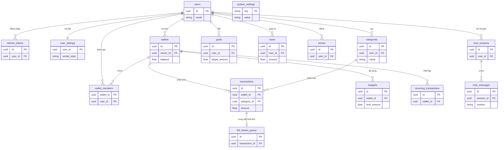
*Hình 3.2: Sơ đồ ERD chắt lọc thể hiện 16 bảng dữ liệu cốt lõi của hệ thống.*

### 3.3. Chi tiết thiết kế tầng giao diện người dùng (Client Layer)

Tầng Giao diện đóng vai trò là điểm chạm đầu tiên và duy nhất giữa con người và hệ thống. Để phục vụ tốt nhất cho hai nhóm đối tượng có hành vi sử dụng hoàn toàn trái ngược, tầng này được chia tách thành hai dự án độc lập: Ứng dụng di động (Mobile App) tập trung vào trải nghiệm mượt mà cho người dùng cuối, và Cổng quản trị (WebAdmin) tập trung vào việc giám sát, huấn luyện dữ liệu cho ban quản trị. Ở tầng này, hệ thống không lưu trữ dữ liệu nặng mà chủ yếu sử dụng cơ chế quản lý trạng thái (State Management) để giao tiếp với máy chủ.

#### 3.3.1. Ứng dụng di động (Mobile App)

Ứng dụng trên điện thoại được xây dựng bằng bộ khung Flutter. Công nghệ này cho phép lập trình một lần nhưng có thể xuất ra mã chạy mượt mà trên cả hệ điều hành Android và iOS. Giao diện được thiết kế tối giản, tập trung vào việc giúp người dùng dễ dàng thao tác bằng một tay. Ứng dụng sử dụng gói thư viện `Dio` để xử lý các luồng gọi API và `cached_query` nhằm quản lý bộ nhớ đệm (cache), giúp ứng dụng có thể hiển thị dữ liệu tức thời ngay cả khi mạng yếu.

##### 3.3.1.1. Chức năng ghi chép chi tiêu tự động bằng văn bản

Chức năng cốt lõi nhất của ứng dụng là khả năng ghi chép chi tiêu tự động thông qua ngôn ngữ tự nhiên. Ở các ứng dụng truyền thống, để ghi lại một khoản chi, người dùng thường phải trải qua nhiều bước: chọn danh mục, nhập số tiền, và gõ ghi chú. Thay vào đó, chức năng này cho phép người dùng chỉ cần gõ một câu đơn giản như "Sáng nay đi ăn phở hết 35k". Nhằm tối đa hóa sự tiện lợi, giao diện nhập liệu bằng văn bản được bố trí tại hai luồng riêng biệt: một là thanh nhập liệu nhanh tích hợp ngay tại màn hình Camera, và hai là trong giao diện Trò chuyện (Chat) chuyên sâu với trợ lý Mimo. Sự linh hoạt này giúp người dùng có thể ghi chép mọi lúc mọi nơi tùy theo ngữ cảnh.

Về mặt logic hoạt động, chức năng này được thiết kế theo luồng xử lý bất đồng bộ nhằm tránh việc giao diện bị đóng băng. Dưới đây là sơ đồ luồng (Flowchart) mô tả chi tiết các bước xử lý từ khi người dùng nhập liệu cho đến khi màn hình được cập nhật.

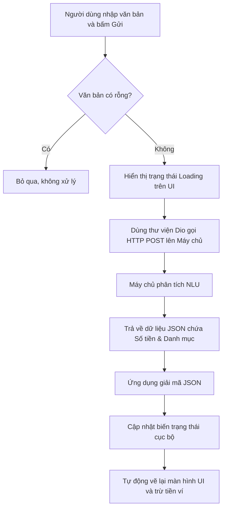
*Hình 3.3: Sơ đồ khối (Flowchart) mô tả logic luồng ghi chép chi tiêu bằng văn bản.*

Lợi thế cốt lõi của cách thiết kế logic này là giảm thiểu tối đa ma sát thao tác. Mọi sự phức tạp trong quá trình phân tích ngôn ngữ tự nhiên, bóc tách từ vựng đều được đẩy hoàn toàn về phía máy chủ (AI Engine) để gánh vác. Nhờ đó, ứng dụng trên điện thoại luôn giữ được độ phản hồi mượt mà, nhẹ nhàng, không gây nóng máy hay tốn pin cho thiết bị của người dùng. 

Hình 3.4 dưới đây minh họa thực tế thiết kế giao diện này.


*Hình 3.4: Giao diện màn hình chính và thanh nhập liệu nhanh.*

Quan sát trên giao diện, cả ở luồng màn hình Camera và khung chat, thanh nhập liệu đều được đặt nổi bật ở dưới cùng, vừa tầm ngón tay cái giúp thao tác một tay dễ dàng. Khi giao dịch được phân tích thành công, một dòng lịch sử mới với biểu tượng danh mục tương ứng sẽ lập tức xuất hiện trên màn hình, mang lại cảm giác phản hồi trực quan, liền mạch và đáng tin cậy.

##### 3.3.1.2. Chức năng quét hóa đơn

Bên cạnh việc gõ chữ, ứng dụng cung cấp thêm một công cụ vô cùng đắc lực cho người bận rộn: tính năng quét hóa đơn. Với chức năng này, người dùng chỉ cần đưa máy lên chụp tờ biên lai siêu thị hoặc quán ăn, hệ thống sẽ tự động đọc chữ trên ảnh và bóc tách ra số tiền cũng như danh mục tương ứng.

Về mặt công nghệ, ứng dụng sử dụng bộ thư viện `camera` và `image_picker` của Flutter để mở máy ảnh và truy cập thư viện ảnh của điện thoại. Một điểm mấu chốt trong thiết kế logic ở đây là thao tác xử lý ảnh nặng: những bức ảnh chụp từ điện thoại hiện đại thường có dung lượng rất lớn. Nếu đẩy thẳng lên mạng sẽ gây tốn dung lượng 4G và làm máy chủ bị nghẽn. Do đó, ứng dụng được lập trình để tự động nén thu nhỏ kích thước ảnh ngay trên điện thoại trước. Bức ảnh sau khi nén sẽ được tải lên kho lưu trữ đám mây (Cloudflare R2), sau đó ứng dụng mới gửi đường dẫn ảnh này qua API (bằng thư viện `Dio`) cho máy chủ phân tích.

Hơn nữa, vì quá trình AI phân tích ảnh tốn nhiều thời gian hơn văn bản, chức năng này được thiết kế theo luồng chạy nền (Background Task). Nghĩa là sau khi bấm gửi ảnh, người dùng không cần phải cắm mặt chờ đợi màn hình tải (loading). Họ có thể thoát ra làm việc khác, lướt xem thống kê, hệ thống sẽ âm thầm xử lý và gửi thông báo khi hoàn tất. Thiết kế này mang lại lợi thế cực lớn về mặt trải nghiệm, giúp ứng dụng không bao giờ bị đơ hay treo máy.

Dưới đây là sơ đồ mô tả luồng hoạt động thông minh này:

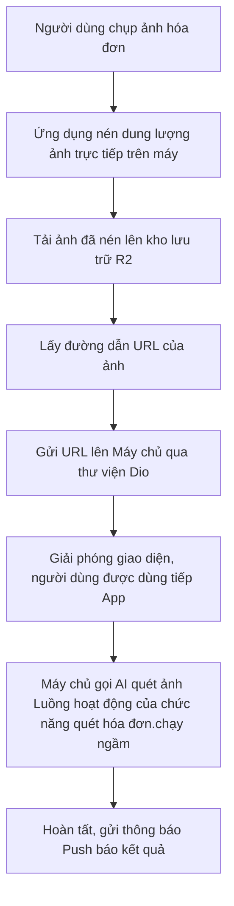
*Hình 3.5: Luồng hoạt động của chức năng quét hóa đơn.*


*Hình 3.6: Giao diện tính năng chụp hóa đơn.*

Như minh họa ở trên, giao diện chụp ảnh được tối giản hóa tối đa, mô phỏng lại y hệt màn hình chụp ảnh mặc định của điện thoại để tạo cảm giác quen thuộc. Nút chụp được đặt to, rõ ràng ở chính giữa. Đồng thời, khung ngắm của camera luôn có một khu vực khoanh vùng mờ để nhắc nhở người dùng căn lề tờ hóa đơn vào giữa, giúp quá trình nhận diện chữ (OCR) phía sau diễn ra chính xác nhất có thể.

Khi máy chủ phân tích xong, ứng dụng sẽ nhận được một tín hiệu thông báo đẩy (Push Notification) từ hệ điều hành. Khi người dùng chạm vào thông báo này, ứng dụng sẽ điều hướng thẳng đến một màn hình xác nhận đặc biệt. Tại đây, hệ thống được thiết kế với logic chỉ bóc tách và hiển thị đúng hai trường thông tin là Tổng số tiền và Tên cửa hàng. 

Trong thực tế quản lý tài chính cá nhân, việc liệt kê chi li từng món hàng lẻ tẻ (như mua mắm, muối, hành) là không cần thiết, dễ làm rác cơ sở dữ liệu và rối mắt trên màn hình điện thoại. Thêm vào đó, việc đọc từng dòng chữ quá nhỏ trên hóa đơn siêu thị rất dễ dẫn đến sai sót khi nhận diện. Vì vậy, hệ thống chỉ chắt lọc đúng con số tổng tiền để giữ cho giao diện luôn tinh gọn. Sự tinh gọn này kết hợp với cơ chế xử lý chạy ngầm giúp mang lại trải nghiệm liền mạch tuyệt đối, giấu đi toàn bộ sự phức tạp và độ trễ của hệ thống AI phía sau.

##### 3.3.1.3. Chức năng báo cáo thống kê và so sánh chi tiêu

Thay vì phải rà soát từng giao dịch nhỏ lẻ, chức năng báo cáo giúp người dùng nhìn nhanh tình hình tài chính tổng quan. Để dễ thao tác, màn hình này được chia thành nhiều thẻ (tab) riêng biệt bao gồm: Báo cáo Chi phí, Báo cáo Thu nhập, và Cân đối Thu Chi. Tại mỗi thẻ, hệ thống sử dụng thư viện `fl_chart` của Flutter để trực quan hóa dữ liệu. Biểu đồ tròn (Pie Chart) giúp cắt lớp tỷ trọng các khoản chi, cho biết ngay danh mục nào tốn tiền nhất. Ngược lại, biểu đồ cột (Bar Chart) đặt dòng tiền thu và chi cạnh nhau, giúp người dùng dễ dàng theo dõi cán cân tài chính.

Một điểm đáng chú ý trong thiết kế là người dùng có thể xem báo cáo theo Tuần, Tháng hoặc Năm. Khi đổi mốc thời gian, hệ thống sẽ gom nhóm toàn bộ giao dịch tương ứng để cộng dồn và tính tỷ lệ phần trăm. Khối lượng tính toán nặng nề này không chạy trực tiếp trên giao diện mà được đẩy sang một luồng xử lý chạy ngầm (Isolate) độc lập. Nhờ đó, dù có hàng ngàn giao dịch, màn hình vẫn cuộn và chuyển thẻ mượt mà, không hề đứng máy.

Đặc biệt, hệ thống còn cung cấp thẻ "So sánh đồng trang lứa". Khi chọn thẻ này, ứng dụng sẽ gọi API để đối chiếu mức chi tiêu của người dùng với cơ sở dữ liệu mức sống chung. Kết quả trả về là một thanh đo lường kèm nhận xét thực tế (ví dụ: "Tháng này bạn chi tiêu tiết kiệm hơn 70% người cùng độ tuổi"), tạo thêm động lực để người dùng cải thiện thói quen tiêu dùng.

Dưới đây là sơ đồ khối (Flowchart) mô tả thuật toán xử lý dữ liệu và luồng hiển thị báo cáo:

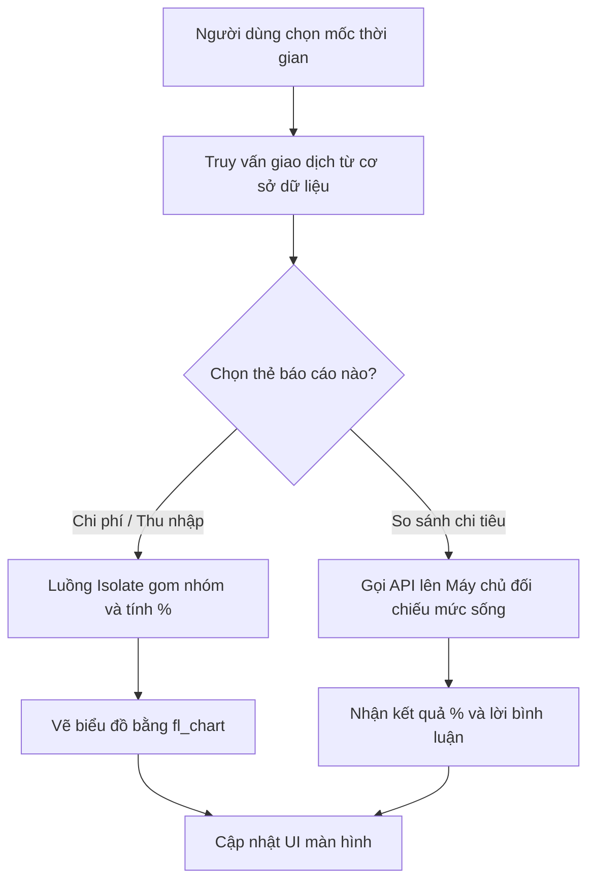
*Hình 3.7: Sơ đồ thuật toán xử lý dữ liệu thống kê và so sánh.*

Nhìn vào Hình 3.7, có thể thấy rõ luồng phân nhánh dữ liệu: nếu người dùng xem báo cáo thu/chi thông thường, hệ thống sẽ tự gom nhóm và tính toán nội bộ (Isolate); nhưng nếu chọn tính năng so sánh, hệ thống buộc phải gọi API lên máy chủ AI để đối chiếu mức sống. 

Để minh họa rõ nét hơn cho các luồng dữ liệu này, Hình 3.8 dưới đây phác họa ba màn hình tiêu biểu nhất của tính năng báo cáo.


*Hình 3.8: Giao diện biểu đồ thống kê và tính năng so sánh chi tiêu.*

Trong hình minh họa, ảnh ngoài cùng bên trái hiển thị giao diện tổng quát của các thẻ báo cáo. Ảnh ở giữa phác họa biểu đồ biến động thu chi, giúp người dùng theo dõi sát sao dòng tiền. Cuối cùng, ảnh bên phải là giao diện so sánh với những người cùng nhóm tuổi, nổi bật với thanh đo lường trực quan. Nhờ cách bóc tách từng luồng thông tin ra các thẻ riêng biệt, giao diện ứng dụng được tối ưu và không hề gây ngợp. (Các màn hình báo cáo phân tích chi tiết khác được đính kèm tại Phụ lục B).
##### 3.3.1.4. Chức năng quản lý hạn mức và gợi ý ngân sách

Để tránh tình trạng vung tay quá trán dẫn đến rỗng túi trước kỳ lương, hệ thống cung cấp tính năng quản lý hạn mức. Người dùng có thể tự do đặt ra mức chi tiêu tối đa cho từng khoản (ví dụ: chỉ tiêu 3 triệu tiền ăn một tháng). Chức năng giám sát này chạy tức thời ngay trên điện thoại. Cứ mỗi lần có một khoản chi mới, ứng dụng sẽ lập tức đối chiếu với hạn mức. Nếu số tiền tiêu vượt quá 80%, thanh tiến trình sẽ chuyển sang màu đỏ rực để tạo cảnh báo thị giác mạnh mẽ, nhắc nhở người dùng hãm phanh kịp thời.

Điểm nhấn của tính năng này là khả năng tự động gợi ý ngân sách theo quy tắc kinh điển 50/30/20. Rào cản lớn nhất của người mới học quản lý tài chính là không biết thiết lập con số bao nhiêu cho hợp lý. Thay vì bắt người dùng đoán mò, ứng dụng sẽ lấy tổng thu nhập hàng tháng và tự chia ra: 50% cho nhu cầu thiết yếu, 30% cho sở thích, và 20% để tiết kiệm. Với bộ khung gợi ý chuẩn xác này, người dùng chỉ cần một nút bấm là có ngay một kế hoạch chi tiêu khoa học mà không phải đắn đo tính toán.

Để làm rõ hơn, thuật toán của từng luồng được bóc tách thành các sơ đồ dưới đây.

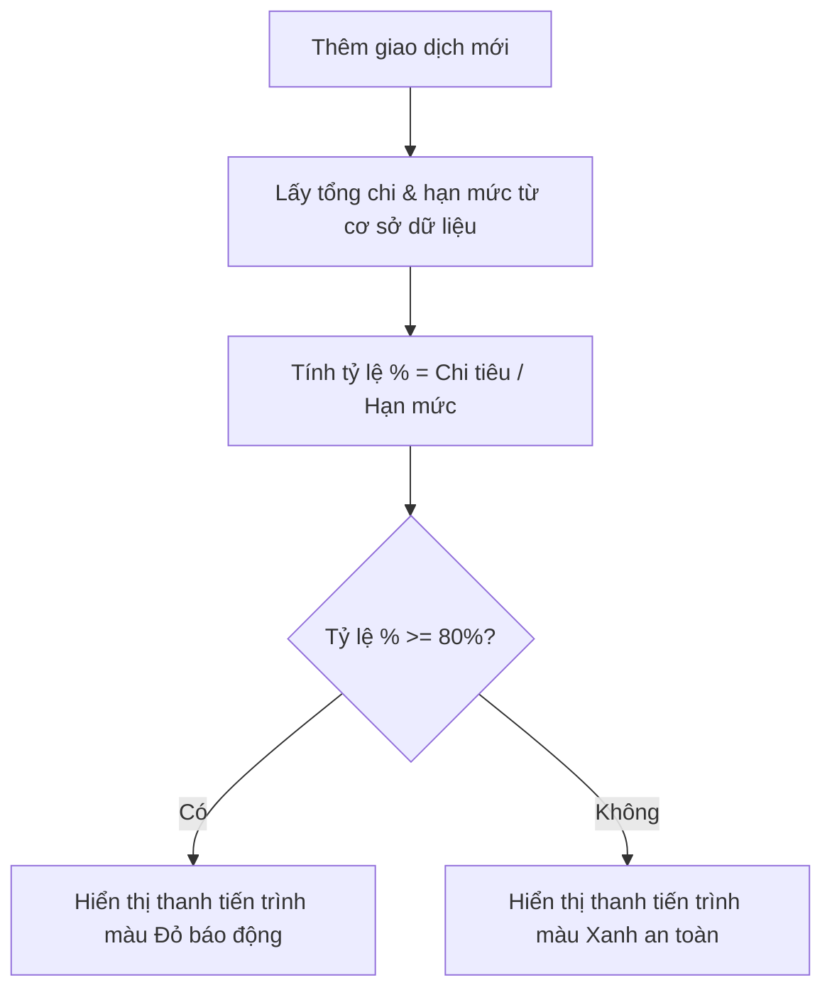
*Hình 3.9: Sơ đồ thuật toán giám sát chi tiêu.*

Như Hình 3.9 thể hiện, khi có giao dịch mới, hệ thống tính toán tỷ lệ chi tiêu trên hạn mức. Nếu chạm ngưỡng 80%, thanh báo động lập tức chuyển đỏ để cảnh báo người dùng. Đối với luồng gợi ý 50/30/20, logic tính toán được mô tả ở sơ đồ tiếp theo:

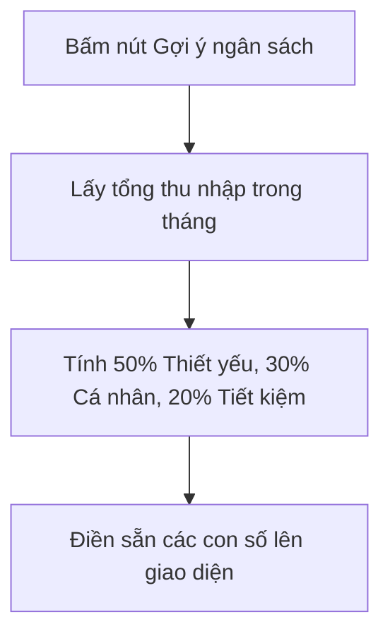
*Hình 3.10: Sơ đồ thuật toán gợi ý ngân sách 50/30/20.*

Dựa trên Hình 3.10, khi người dùng kích hoạt tính năng gợi ý, hệ thống lấy tổng thu nhập và chia theo công thức 50/30/20 rồi điền sẵn vào các ô nhập liệu. Để đối chiếu hai thuật toán này hiển thị ra sao ở góc nhìn người dùng, Hình 3.11 dưới đây phác họa màn hình giao diện thực tế.


*Hình 3.11: Giao diện quản lý hạn mức và gợi ý ngân sách.*

Khép lại phần phân tích, giao diện ở Hình 3.11 cho thấy khu vực chính hiển thị danh sách các thẻ ngân sách đi kèm số tiền còn lại và thanh tiến trình báo động. Ở màn hình tạo mới, con số đề xuất được làm nổi bật dưới ô nhập liệu. Chỉ với một nút "Áp dụng gợi ý", người dùng đã có thể nhanh chóng bắt đầu kế hoạch chi tiêu lành mạnh.

##### 3.3.1.5. Chức năng trò chuyện với trợ lý ảo MiMo

Để làm mềm hóa trải nghiệm người dùng, ứng dụng tích hợp tính năng trò chuyện với trợ lý ảo MiMo. Không gian này được thiết kế tương tự các ứng dụng nhắn tin quen thuộc, tạo cảm giác gần gũi ngay lần đầu sử dụng. Thông qua ô nhập liệu hoặc biểu tượng micro, người dùng có thể thoải mái tra cứu thông tin tài chính bằng ngôn ngữ tự nhiên (ví dụ: "Tháng này tôi còn bao nhiêu tiền ăn?"). Từ góc độ hệ thống, khi nhận được câu hỏi, ứng dụng sẽ phản hồi bằng một bong bóng tin nhắn chứa câu trả lời dạng văn bản thân thiện, giống như đang trò chuyện với một người bạn.

Không dừng lại ở việc hỏi đáp thông thường, điểm khác biệt lớn nhất của MiMo là khả năng "điều hướng chủ động". Khi người dùng nhập một yêu cầu mang tính chuyển hướng như "Tôi muốn xem báo cáo", thay vì chỉ trả lời bằng chữ, ứng dụng sẽ xuất ra một tin nhắn chứa nút bấm tương tác. Ngay khi chạm vào nút này, hệ thống định hướng sẽ kích hoạt và đưa thẳng người dùng đến màn hình phân tích thống kê. Lối thiết kế này biến MiMo thành một phím tắt thông minh, giúp truy cập nhanh các tính năng sâu bên trong mà không cần tự mò mẫm qua nhiều lớp menu.

Để làm rõ khả năng nhận diện ý định và điều hướng, sơ đồ khối dưới đây mô tả quá trình giao tiếp từ lúc người dùng gửi lệnh đến khi hệ thống hiển thị nút bấm.

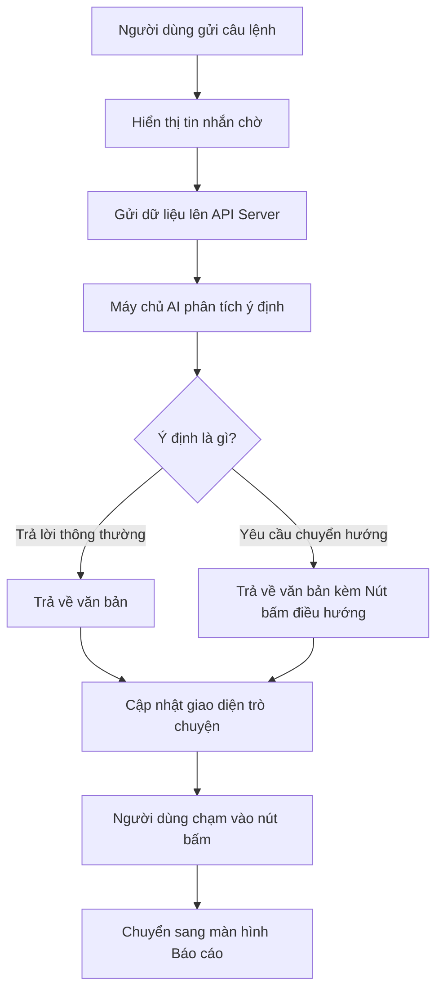
*Hình 3.12: Sơ đồ thuật toán tương tác và điều hướng của trợ lý ảo MiMo.*

Hình 3.13 dưới đây minh họa chi tiết giao diện màn hình trò chuyện từ kết quả xử lý trên. 


*Hình 3.13: Giao diện trò chuyện và tính năng điều hướng của trợ lý ảo MiMo.*

Phía dưới cùng là thanh công cụ cho phép nhập văn bản hoặc thu âm giọng nói. Ở giữa là luồng hội thoại với các bong bóng tin nhắn được phân chia màu sắc rõ ràng để phân biệt giữa người dùng và MiMo. Đáng chú ý nhất là ở cuối đoạn hội thoại, tin nhắn phản hồi của MiMo có chứa một nút bấm điều hướng nổi bật, minh chứng cho tính tương tác cao của không gian trợ lý ảo này.

##### 3.3.1.6. Chức năng công cụ tài chính và nhìn lại hành trình (Recap)

Để ứng dụng trở nên đa năng hơn, giao diện cung cấp thêm một phân hệ "Công cụ tài chính". Tại đây, người dùng dễ dàng tìm thấy các tính năng bổ trợ như Sổ nợ, Mục tiêu tiết kiệm và Lịch sử giao dịch chi tiết. Đặc biệt đối với Mục tiêu tiết kiệm, ứng dụng không chỉ cho phép lập kế hoạch cá nhân mà còn hỗ trợ tạo các "mục tiêu chung". Người dùng có thể dễ dàng gửi lời mời tham gia cho bạn bè hoặc người thân để cùng nhau đóng góp quỹ (ví dụ: quỹ du lịch, quỹ mua sắm). Các công cụ này được thiết kế theo dạng danh sách thẻ tối giản, giúp người dùng nắm bắt tiến độ thông qua các thanh trạng thái trực quan.

Điểm thú vị nhất trong nhóm này là tính năng "Nhìn lại hành trình", được lấy cảm hứng từ trào lưu "Spotify Wrapped". Thay vì xuất báo cáo cuối năm bằng những biểu đồ khô khan, ứng dụng đóng gói toàn bộ dữ liệu chi tiêu thành chuỗi các tấm thẻ đồ họa dạng "Story". Hệ thống cung cấp trải nghiệm chạm và vuốt mượt mà để lướt qua từng màn hình, khám phá "Tháng tiêu tiền nhiều nhất", "Giao dịch đắt đỏ nhất" hay "Top 3 danh mục ngốn tiền", đi kèm những lời bình luận hóm hỉnh từ AI. Lối thiết kế kể chuyện bằng hình ảnh này biến việc xem lại sổ sách thành một trải nghiệm giải trí, khích lệ thói quen ghi chép của người dùng.

Để tạo ra các thẻ Story cá nhân hóa, hệ thống cần xử lý dữ liệu phức tạp. Sơ đồ khối dưới đây mô tả thuật toán lấy dữ liệu thô, nhờ AI sinh lời bình luận, và trả về để ứng dụng hiển thị.

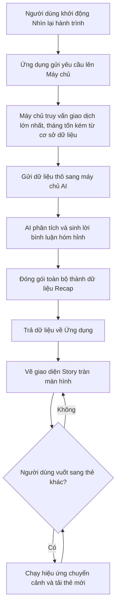
*Hình 3.14: Sơ đồ thuật toán trích xuất dữ liệu và hiển thị thẻ Recap.*

Sau khi nhận dữ liệu từ thuật toán trên, trải nghiệm tương tác thực tế của người dùng được mô phỏng ở Hình 3.15 dưới đây.


*Hình 3.15: Giao diện tổng quan công cụ tài chính, chi tiết mục tiêu và thẻ Recap.*

Như minh họa ở Hình 3.15, bộ công cụ tài chính được thể hiện qua ba màn hình tiêu biểu. Từ trái qua phải, màn hình đầu tiên cung cấp cái nhìn tổng quan về danh sách các thẻ công cụ, màn hình thứ hai hiển thị chi tiết tiến độ của một mục tiêu tiết kiệm, và màn hình cuối cùng là giao diện Recap tràn viền. Riêng ở giao diện Recap, phần trung tâm kết hợp phông chữ lớn với mảng màu tương phản giúp các con số tổng kết trở nên vô cùng thu hút. Ngoài ra, các màn hình tính năng phụ trợ khác được đính kèm chi tiết trong phần Phụ lục B.

##### 3.3.1.7. Chức năng nâng cấp tài khoản (Premium)

Để đảm bảo nguồn lực duy trì dự án, hệ thống cung cấp tùy chọn nâng cấp lên tài khoản Cao cấp. Ứng dụng thiết kế một bảng giá trực quan nhằm đối chiếu trực tiếp quyền lợi giữa phiên bản Miễn phí và Trả phí. Cụ thể, ở bản miễn phí, người dùng sẽ bị giới hạn số lượng ví tiền và gặp quảng cáo. Ngược lại, bản Trả phí dỡ bỏ hoàn toàn quảng cáo, cho phép tạo ví vô hạn và xuất dữ liệu báo cáo. Bố cục rành mạch này giúp người dùng dễ dàng cân nhắc trước khi thanh toán.

Điểm mấu chốt trong trải nghiệm nâng cấp là luồng thanh toán liền mạch. Thay vì chuyển hướng văng ra trình duyệt ngoài, ứng dụng khởi tạo một trình duyệt nhúng kết nối trực tiếp với cổng VNPay. Quá trình xử lý giao dịch khép kín này được mô tả qua sơ đồ khối dưới đây.

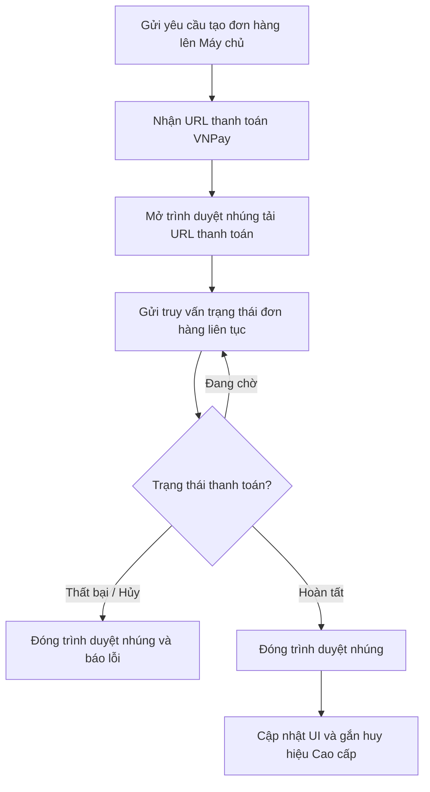
*Hình 3.16: Sơ đồ thuật toán thanh toán nâng cấp tài khoản qua VNPay.*

Như Hình 3.16 thể hiện, thay vì phó mặc cho trình duyệt, ứng dụng chủ động chạy một vòng lặp truy vấn trạng thái liên tục. Ngay khi máy chủ xác nhận giao dịch thành công, hệ thống lập tức đóng trình duyệt nhúng và nâng cấp giao diện, tạo ra trải nghiệm khép kín. Toàn bộ chu trình nâng cấp ở góc nhìn người dùng được phác họa ở Hình 3.17.


*Hình 3.17: Giao diện quyền lợi gói Cao cấp, cổng thanh toán VNPay và thông báo thành công.*

Như minh họa ở Hình 3.17, chu trình nâng cấp được chia làm ba bước. Từ trái qua phải, màn hình đầu tiên là giao diện giới thiệu các đặc quyền của gói Cao cấp để kích thích nhu cầu mua sắm. Màn hình ở giữa minh họa mã QR thanh toán an toàn của VNPay được nhúng trực tiếp vào ứng dụng. Cuối cùng, màn hình bên phải là thông báo giao dịch hoàn tất, xác nhận tài khoản đã được gắn huy hiệu liền mạch mà không cần khởi động lại.

##### 3.3.1.8. Chức năng quản lý Ví tiền

Để đáp ứng nhu cầu quản lý tài chính đa dạng, người dùng không bị gò bó trong một quỹ tiền duy nhất mà có thể tạo nhiều "Ví riêng" (như tiền mặt, tài khoản ngân hàng) và "Ví chung" (như quỹ gia đình, nhóm bạn). Đối với nhóm Ví chung, ứng dụng cũng trang bị đầy đủ các tính năng quản lý tương đương: người dùng có quyền thêm mới, chỉnh sửa thông tin hoặc gỡ bỏ khi quỹ không còn hoạt động. Điểm đặc biệt là hệ thống cho phép tự do gán màu sắc riêng biệt cho từng ví, giúp việc nhận diện bằng mắt trực quan và thao tác nhanh chóng hơn. Sự phân tách rành mạch này giúp dòng tiền được quản lý minh bạch và có tính cá nhân hóa cao. Khi có biến động thu chi, hệ thống sẽ tự động tổng hợp số dư của tất cả các ví hiện có để báo cáo tổng tài sản.

Đặc biệt, đối với nhóm Ví chung, ứng dụng cũng trang bị đầy đủ các tính năng quản lý tương đương: người dùng có quyền thêm mới, chỉnh sửa thông tin hoặc gỡ bỏ khi quỹ không còn hoạt động. Quá trình thêm mới, tham gia hoặc xóa một ví tiền được thiết kế theo góc nhìn phía ứng dụng người dùng thông qua sơ đồ khối dưới đây.

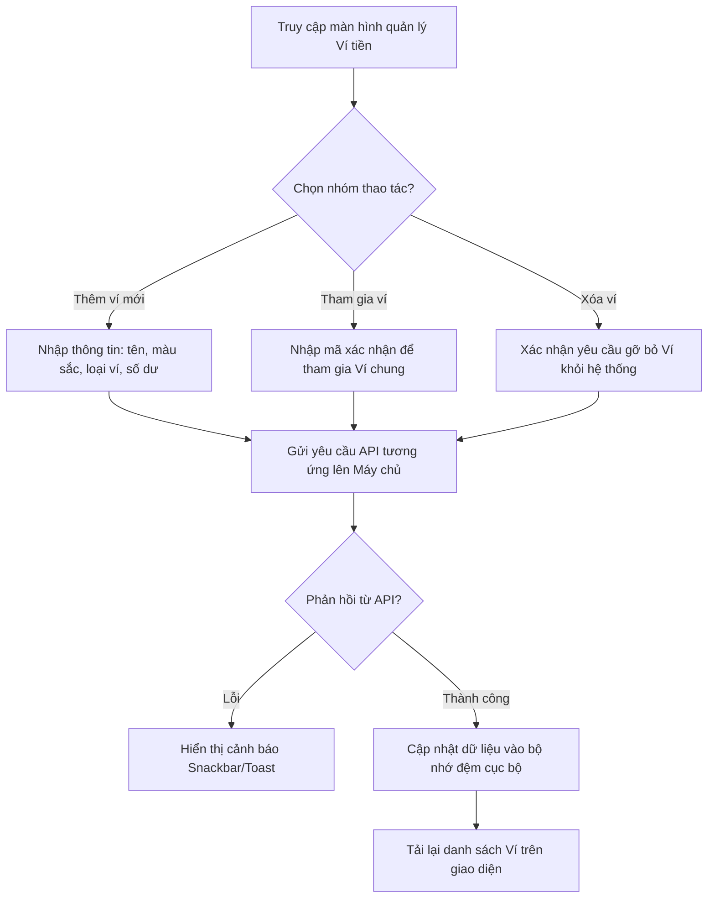
*Hình 3.18: Sơ đồ thuật toán các luồng thêm mới, tham gia và xóa Ví tiền.*

Dựa trên thuật toán xử lý này, giao diện tương tác của người dùng được khắc họa chi tiết qua Hình 3.19.


*Hình 3.19: Giao diện màn hình danh sách Ví chung và Ví riêng.*

Như minh họa ở Hình 3.19, giao diện được chia thành hai tab riêng biệt là Ví cá nhân và Ví chung để tránh gây nhầm lẫn quỹ tiền. Các ví được trình bày trực quan thành các thẻ bo góc gọn gàng, có màu sắc đồng bộ với thiết lập ban đầu kèm theo số dư hiện tại. Lối thiết kế này giúp người dùng nhanh chóng nắm bắt được tổng tài sản đang phân bổ ở từng nguồn khác nhau.

##### 3.3.1.9. Chức năng quản lý Giao dịch

Mọi khoản thu chi của người dùng đều được lưu vết minh bạch. Để mang lại trải nghiệm xem báo cáo linh hoạt và đỡ nhàm chán, ứng dụng cung cấp đến ba chế độ hiển thị lịch sử giao dịch: chế độ **Story** (lướt xem nhanh các giao dịch nổi bật như xem tin mạng xã hội), chế độ **Gallery** (hiển thị giao dịch dưới dạng lưới hình ảnh trực quan), và chế độ **Calendar** (hiển thị giao dịch theo từng ngày trên lịch âm dương). 

Từ bất kỳ chế độ xem nào, khi cần thiết, người dùng có thể chạm vào một giao dịch để xem thông tin chi tiết. Tại đây, ứng dụng cho phép toàn quyền chỉnh sửa các dữ liệu đã nhập, đặc biệt là việc phân loại lại Danh mục (Category) nếu trước đó AI gán sai, cập nhật số tiền, hoặc sửa đổi lời ghi chú (Story) đi kèm. Nếu giao dịch không còn hợp lệ, người dùng có thể xóa bỏ hoàn toàn.

Quy trình hiển thị và hiệu chỉnh giao dịch từ góc nhìn của ứng dụng di động được mô hình hóa qua sơ đồ sau.

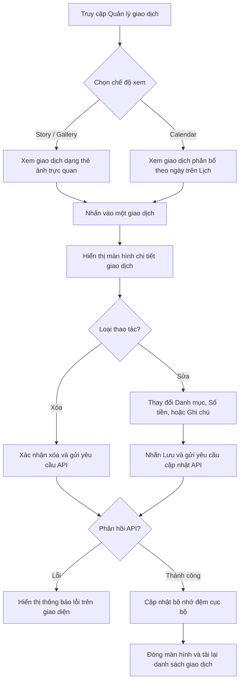
*Hình 3.20: Sơ đồ thuật toán luồng hiển thị, hiệu chỉnh và xóa giao dịch trên ứng dụng.*

Phản chiếu từ sơ đồ trên, Hình 3.21 mô phỏng giao diện khi người dùng thao tác trực tiếp với các giao dịch.


*Hình 3.21: Giao diện 3 chế độ xem (Gallery, Calendar) và màn hình xem chi tiết một giao dịch.*

Như minh họa ở Hình 3.21, ứng dụng trình bày dữ liệu rất đa dạng. Chế độ Gallery biến những con số khô khan thành một bộ sưu tập ảnh, còn chế độ Calendar giúp theo dõi sát sao tiến độ thu chi theo ngày. Ở màn hình chi tiết (hình ngoài cùng), các trường thông tin của giao dịch được hiển thị rõ ràng dưới dạng biểu mẫu, cho phép người dùng dễ dàng chạm vào để chọn lại phân loại đúng hoặc sửa lời bình. Mọi thay đổi đều được cập nhật mượt mà nhờ cơ chế bộ nhớ đệm mà không cần tải lại toàn bộ ứng dụng.

##### 3.3.1.10. Chức năng Đăng ký, Đăng nhập và Khôi phục mật khẩu

Là chốt chặn an ninh đầu tiên của ứng dụng, chức năng xác thực người dùng được thiết kế nghiêm ngặt nhằm đảm bảo quyền riêng tư và an toàn tuyệt đối cho dữ liệu tài chính cá nhân. Ứng dụng hỗ trợ đa dạng các phương thức tiếp cận, từ đăng nhập bằng thư điện tử (Email/Password) truyền thống cho đến xác thực nhanh chóng qua tài khoản Google (OAuth2). Đặc biệt, hệ thống còn tích hợp sẵn tính năng "Quên mật khẩu", cho phép người dùng tự động gửi yêu cầu đặt lại mật khẩu thông qua liên kết xác nhận gửi về email, giúp quá trình khôi phục tài khoản diễn ra liền mạch mà không cần sự can thiệp thủ công từ quản trị viên.

Quá trình kiểm chứng thông tin, xử lý khôi phục mật khẩu và cấp quyền truy cập được thực hiện khép kín giữa Ứng dụng di động, Máy chủ trung tâm và hệ thống định danh Firebase Auth.

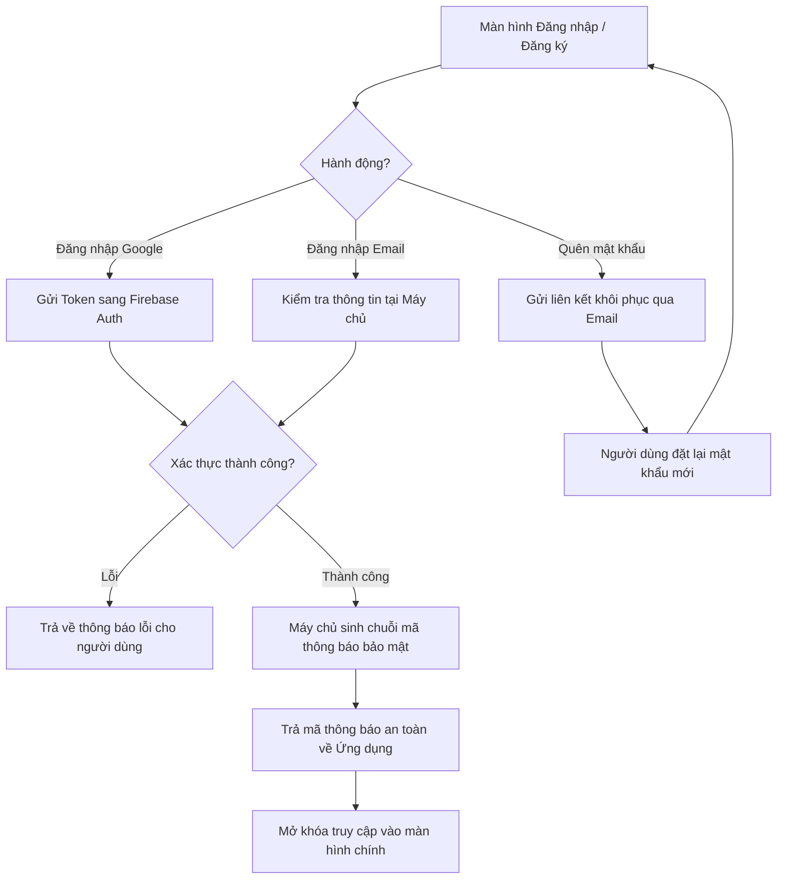
*Hình 3.22: Sơ đồ thuật toán luồng Đăng ký, Đăng nhập và Khôi phục mật khẩu.*

Bám sát quy trình xác thực chặt chẽ đó, giao diện người dùng được thiết kế hướng tới sự tối giản, hiện đại và vô cùng thân thiện, thể hiện qua Hình 3.23.


*Hình 3.23: Các màn hình Đăng nhập, Đăng ký và Quên mật khẩu.*

Như Hình 3.23 minh họa, bố cục màn hình ưu tiên sử dụng các khoảng trắng tinh tế kết hợp với các nút bấm lớn và trường nhập liệu rõ ràng. Việc đặt nút "Đăng nhập với Google" ở vị trí trung tâm giúp những người dùng mới có thể tham gia vào hệ sinh thái ứng dụng chỉ với một cú chạm duy nhất, giảm thiểu tối đa rào cản tiếp cận ban đầu. Nút "Quên mật khẩu" được bố trí gọn gàng ngay dưới ô nhập liệu mật khẩu, đóng vai trò như một phao cứu sinh luôn sẵn sàng hỗ trợ người dùng ngay lập tức khi họ lỡ quên thông tin đăng nhập.
#### 3.3.2. Cổng Quản trị (WebAdmin)
Khác với ứng dụng điện thoại dành cho người dùng cuối, cổng WebAdmin được thiết kế như một trung tâm chỉ huy dành riêng cho đội ngũ quản trị. Trang web này sử dụng công nghệ React để đảm bảo tốc độ tải trang nhanh chóng và khả năng xử lý mượt mà khi phải hiển thị một lượng lớn dữ liệu cùng lúc.

##### 3.3.2.1. Chức năng thống kê tổng quan (Dashboard)

Chức năng thống kê tổng quan đóng vai trò như một trung tâm chỉ huy chiến lược, là sự kết hợp hoàn hảo giữa việc giám sát sức khỏe trí tuệ nhân tạo (AIOps) và theo dõi dòng tiền (Monetization). Việc gộp chung hai phân hệ này lên cùng một bảng điều khiển giúp ban quản trị vừa nắm bắt được chất lượng của trợ lý ảo, vừa đối chiếu ngay lập tức với hiệu quả kinh doanh.

Về mặt hiệu suất AI, các thông số sống còn được làm nổi bật qua các thẻ chỉ số cốt lõi: Độ hội tụ phân tích (tỷ lệ AI nhận diện chính xác cùng lúc Số tiền, Ngày tháng và Hạng mục) và Tổng lượt trích xuất dữ liệu. Kế đến là phân hệ "Ngưỡng sẵn sàng huấn luyện lại" được thiết kế dạng thanh trạng thái, giúp theo dõi liên tục lượng dữ liệu người dùng sửa lỗi và số hóa đơn đã phê duyệt. Bức tranh này giúp quản trị viên biết được thời điểm "chín muồi" để tiến hành tái huấn luyện mô hình.

Về mặt kinh doanh, bảng điều khiển trang bị một biểu đồ doanh thu (Revenue Chart) trực quan, bám sát xu hướng dòng tiền trong 30 ngày gần nhất từ các gói tài khoản Cao cấp (Premium). Đi kèm biểu đồ là danh sách lịch sử các giao dịch thanh toán. Không chỉ dừng lại ở việc xem báo cáo, quản trị viên còn có quyền can thiệp trực tiếp: nếu khách hàng thanh toán thành công nhưng mạng lưới ngân hàng phản hồi chậm, quản trị viên có thể tra cứu mã đơn hàng và gạt nút (toggle) nâng cấp Premium thủ công, bảo vệ tối đa uy tín của ứng dụng.

Sơ đồ khối dưới đây mô tả thuật toán truy xuất và tổng hợp dữ liệu "kép" này từ hệ thống.

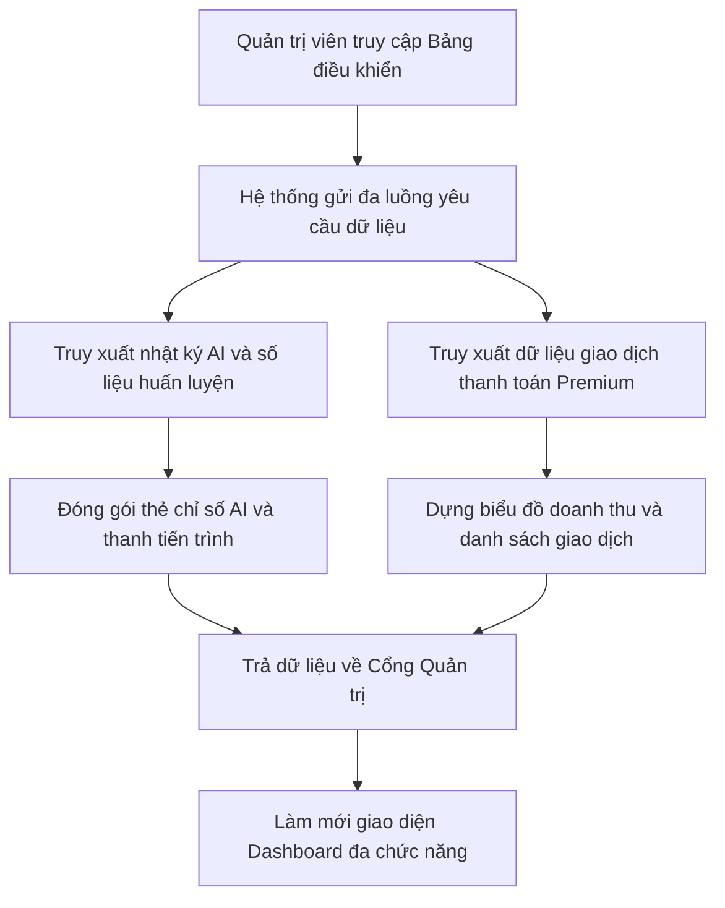
*Hình 3.24: Sơ đồ thuật toán luồng truy xuất dữ liệu thống kê AI và Doanh thu.*

Dựa trên luồng dữ liệu khép kín này, Hình 3.25 minh họa giao diện màn hình thống kê đa năng.


*Hình 3.25: Giao diện Bảng điều khiển theo dõi hiệu năng AI và lịch sử doanh thu.*

Như minh họa ở Hình 3.25, màn hình được bố cục tinh tế làm hai nửa. Nửa trên là lãnh địa của AI với các thanh tiến trình cảnh báo ngưỡng dữ liệu huấn luyện và tỷ lệ hội tụ. Nửa dưới tập trung vào biểu đồ doanh thu sinh động cùng danh sách đối soát thanh toán. Lối thiết kế gộp thông minh này giúp người quản lý không bị ngợp trước số liệu mà vẫn bao quát được trọn vẹn tình hình của toàn dự án trên một trang duy nhất.

##### 3.3.2.2. Chức năng quản lý người dùng

Chức năng quản lý người dùng đóng vai trò duy trì trật tự cộng đồng và hỗ trợ ban quản trị trong việc thấu hiểu tệp khách hàng. Giao diện của phân hệ này được thiết kế theo dạng danh sách trực quan, kết hợp với các công cụ tra cứu thông minh. Đặc biệt, để đảm bảo tính bảo mật nội bộ và tránh các thao tác nhầm lẫn, hệ thống tự động ẩn toàn bộ các tài khoản thuộc cấp bậc Quản trị viên khỏi danh sách hiển thị, chỉ cho phép thao tác trên dữ liệu của người dùng cuối.

Điểm nổi bật nhất của trang web là dải thẻ thống kê được đặt ở vị trí trên cùng, cho phép quản trị viên nắm bắt nhanh các tỷ lệ quan trọng như: số lượng tài khoản đang hoạt động, phân bổ phương thức đăng nhập (Google so với Email truyền thống), và số lượng khách hàng gói Cao cấp (được đánh dấu bằng biểu tượng vương miện). Để giải quyết bài toán tra cứu trong một cơ sở dữ liệu lớn, hệ thống cung cấp một thanh tìm kiếm linh hoạt kết hợp cùng bộ lọc đa chiều, giúp dễ dàng phân loại người dùng theo nhóm tuổi hoặc nghề nghiệp.

Về mặt kiểm soát an ninh, quản trị viên có quyền thực thi lệnh khóa đối với các tài khoản gian lận, hoặc mở khóa đối với những trường hợp khiếu nại hợp lệ. Quá trình này được minh họa thông qua Sơ đồ thuật toán tại Hình 3.26.

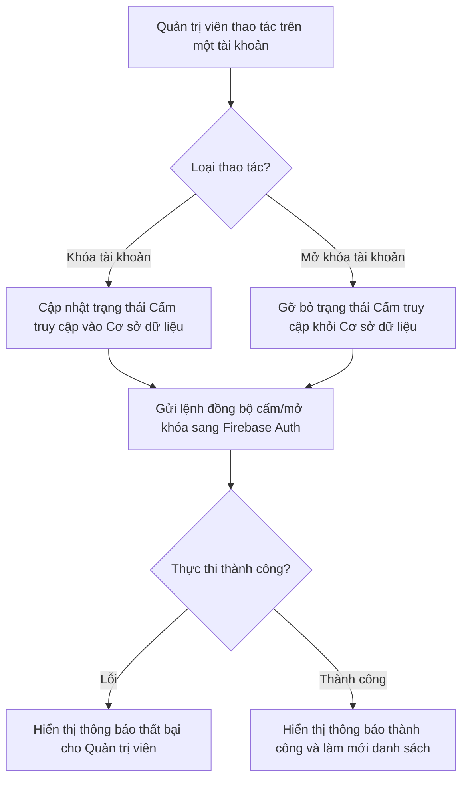
*Hình 3.26: Sơ đồ thuật toán luồng vô hiệu hóa và khôi phục tài khoản người dùng.*

Khi lệnh khóa được kích hoạt, hệ thống sẽ can thiệp thẳng vào cơ sở dữ liệu phân tán, lập tức tước bỏ mọi quyền truy cập hiện hành của tài khoản vi phạm. Ngược lại, tính năng mở khóa cung cấp một cơ chế bảo vệ quyền lợi chính đáng cho người dùng. Giao diện thực tế của chức năng này được trình bày ở Hình 3.27, thể hiện sự bố trí khoa học giữa các trường thông tin và thanh công cụ.


*Hình 3.27: Màn hình danh sách người dùng với dải thẻ thống kê và bộ lọc đa chiều.*

##### 3.3.2.3. Chức năng Quản trị và Huấn luyện Mô hình Ngôn ngữ (NLU)

Vì trí tuệ nhân tạo không thể hiểu hết mọi từ vựng mới hoặc tiếng lóng ngay từ những ngày đầu, hệ thống cần một phân hệ để thu gom dữ liệu thực tế và liên tục "dạy" lại mô hình theo chuẩn vòng đời học máy. Thay vì lãng phí những lần người dùng tự sửa lỗi phân loại trên ứng dụng điện thoại, hệ thống sẽ tự động gom toàn bộ các "đính chính" này và chuyển thẳng về phân hệ quản trị ngôn ngữ.

Quy trình xử lý dữ liệu và huấn luyện được chia thành ba lớp nghiệp vụ chính, thiết lập một quy trình khép kín từ sửa lỗi nhanh đến huấn luyện sâu:
- **Lớp 1 -  cá nhân hóa danh mục:** Cung cấp công cụ xử lý tức thời các từ vựng lóng bằng cách tạo bộ luật cứng (ví dụ: luôn gán từ "cà phê" vào danh mục "Ăn uống"). Mô hình AI sẽ ưu tiên kiểm tra tập luật này trước khi chạy thuật toán suy luận nội tại.
- **Lớp 2 -  học từ người dùng:** Nơi hiển thị các nhóm văn bản mà người dùng đã báo cáo sai. Quản trị viên sẽ duyệt qua danh sách và thực hiện "Phê duyệt" để gán nhãn chuẩn xác, biến đổi chúng thành nguồn dữ liệu sạch.
- **Lớp 3 - Lớp đánh giá và Huấn luyện lại:** Khu vực hiển thị bảng đo lường độ chính xác của mô hình hiện hành. Khi lượng dữ liệu sạch ở Lớp 2 đã đủ lớn, quản trị viên chỉ việc kích hoạt tiến trình tái huấn luyện để nâng cấp mô hình.

Sơ đồ khối dưới đây mô phỏng lại dòng chảy của dữ liệu từ thiết bị người dùng đến lúc mô hình AI được nâng cấp hoàn chỉnh.

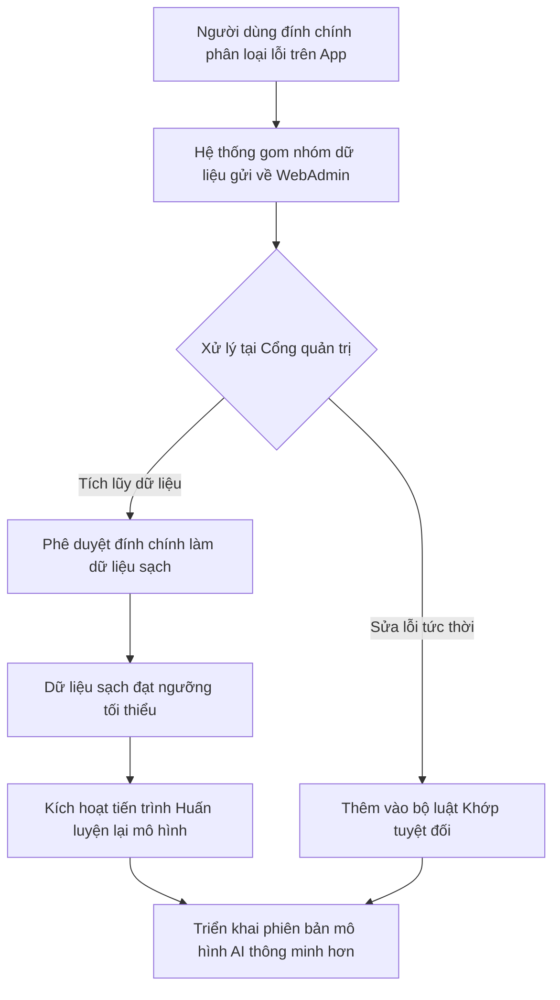
*Hình 3.28: Sơ đồ thuật toán luồng thu thập dữ liệu và tái huấn luyện mô hình ngôn ngữ.*

Toàn bộ thông tin về số lượng luật, phiên bản mô hình hiện hành và trạng thái máy chủ (đang bận huấn luyện hay đang sẵn sàng) đều được hiển thị trực tiếp trên dải trạng thái vận hành ở ngay đầu trang. Cơ chế này đảm bảo trợ lý ảo ngày càng thông minh hơn dựa trên chính dữ liệu của cộng đồng mà không cần lập trình viên phải can thiệp thủ công vào mã nguồn hệ thống. Dưới đây là giao diện thực tế của phân hệ quản trị này.


*Hình 3.29: Màn hình quản trị mô hình ngôn ngữ với thanh trạng thái vận hành và các thẻ huấn luyện.*

##### 3.3.2.4. Chức năng Tiền xử lý và Gán nhãn Hóa đơn (Bill OCR Retrain)

Bên cạnh dữ liệu văn bản, việc xử lý và nhận diện thông tin từ các bức ảnh hóa đơn mờ nhòe, nhăn nheo hoặc thiếu sáng luôn là một bài toán hóc búa đối với các mô hình trí tuệ nhân tạo. Thông thường, để giải quyết vấn đề này, các hệ thống phải trích xuất ảnh ra một máy chủ bên ngoài và sử dụng các phần mềm gán nhãn phức tạp của bên thứ ba. Tuy nhiên, cách làm đó tiềm ẩn rủi ro rất lớn về việc lộ lọt thông tin mua sắm nhạy cảm của khách hàng. Để khắc phục triệt để lỗ hổng này, Cổng Quản trị WebAdmin đã được tích hợp sẵn một phân hệ xử lý ảnh khép kín, hoạt động hoàn toàn trên nền tảng trình duyệt web.

Tại phân hệ này, quản trị viên có thể giám sát một hàng đợi chứa các bức ảnh hóa đơn bị AI phân tích lỗi hoặc có độ tự tin nhận diện (confidence score) ở mức thấp. Trái tim của giao diện là một khung vẽ tương tác trực quan (Canvas). Tại đây, quản trị viên có thể sử dụng chuột để kéo thả, vẽ các khung tọa độ bao quanh khép kín các dòng chữ mờ trên ảnh. Tương ứng với mỗi khung tọa độ vừa vẽ, hệ thống cho phép gán một nhãn nghiệp vụ cụ thể như: Tên cửa hàng kinh doanh, Địa chỉ, Thời gian phát sinh giao dịch, và Tổng số tiền thanh toán. 

Để tối ưu hóa năng suất làm việc của quản trị viên và giảm bớt thao tác thủ công, hệ thống cung cấp tính năng "Gán nhãn tự động". Khi kích hoạt, WebAdmin sẽ gọi lại mô hình AI dự đoán để gợi ý trước các khung tọa độ trên toàn bộ bức ảnh. Quản trị viên lúc này chỉ đóng vai trò người kiểm duyệt, tinh chỉnh lại những vị trí mà AI nhận diện sai sót, sau đó nhấn nút "Phê duyệt". Toàn bộ quy trình từ lúc tiếp nhận ảnh lỗi đến khi xuất dữ liệu được mô tả chi tiết tại Sơ đồ Hình 3.30.

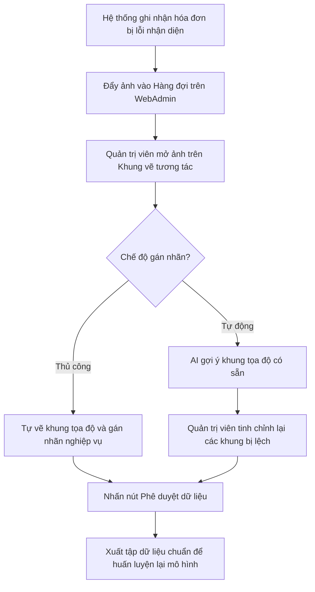
*Hình 3.30: Sơ đồ thuật toán luồng tiền xử lý và gán nhãn dữ liệu ảnh hóa đơn.*

Cuối cùng, tập hợp các hóa đơn đã được ban quản trị phê duyệt chuẩn xác sẽ được trích xuất thành định dạng dữ liệu huấn luyện chuyên dụng. Khối dữ liệu quý giá này sẽ được dùng làm nguyên liệu đầu vào để liên tục nâng cấp độ chính xác cho mô hình học sâu chuyên đọc hiểu tài liệu của hệ thống. Hình 3.31 thể hiện giao diện làm việc thực tế của công cụ này.


*Hình 3.31: Giao diện khung vẽ tương tác dùng để sửa lỗi nhận diện trên ảnh hóa đơn.*

##### 3.3.2.5. Chức năng Quản trị Cấu hình và Hiệu chỉnh Trợ lý ảo (LLM Calibrator)

Thay vì gắn chặt cách giao tiếp của trợ lý ảo vào mã nguồn tĩnh, Cổng Quản trị cung cấp một phân hệ chuyên sâu cho phép cấu hình và hiệu chỉnh các câu lệnh chỉ thị hệ thống từ xa. Điểm đặc biệt của kiến trúc này là trợ lý ảo được thiết kế theo mô hình đa nhân cách bao gồm các trạng thái: Vui vẻ, Hay khóc, Khó tính (Kỷ luật), và Ngọt ngào (Chữa lành). Quản trị viên có thể linh hoạt chuyển đổi giữa các tính cách này để tùy biến lại câu lệnh nền. Đồng thời, hệ thống cung cấp thanh trượt để điều chỉnh các tham số sinh ngôn ngữ cốt lõi (như độ sáng tạo Temperature hay tham số phân rã Top-K) nhằm kiểm soát chặt chẽ tính chính xác của mô hình ngôn ngữ lớn.

Bên cạnh đó, trang quản trị còn tích hợp sẵn một môi trường kiểm thử hộp cát cô lập. Tại đây, quản trị viên chỉ cần nhập thử một câu nói ngẫu nhiên của người dùng (ví dụ: "chi tiêu ăn sáng hết 45k"), chọn tính cách mong muốn, và nhấn kiểm thử. Kết quả phản hồi từ trí tuệ nhân tạo sẽ được kết xuất ngay lập tức mà không ảnh hưởng đến dữ liệu thực. Sơ đồ dưới đây minh họa luồng thao tác khép kín từ lúc điều chỉnh đến khi triển khai xuống thiết bị người dùng.

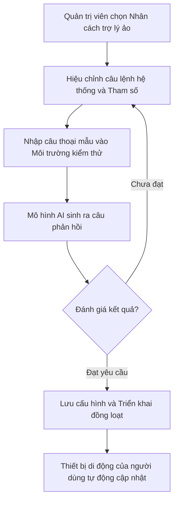
*Hình 3.32: Sơ đồ thuật toán luồng kiểm thử và triển khai cấu hình trợ lý ảo.*

Tính năng này giúp ban quản trị tinh chỉnh từ ngữ sao cho tự nhiên và phù hợp nhất. Khi kết quả đã đạt độ hoàn thiện cao, quản trị viên chỉ cần nhấn nút lưu để phát hành cấu hình mới. Sự thay đổi này sẽ được đồng bộ tức thời xuống hàng ngàn người dùng trên ứng dụng di động một cách an toàn và đồng nhất.


*Hình 3.33: Giao diện cấu hình nhân cách trợ lý ảo và môi trường kiểm thử khép kín.*


---

### 3.4. Thiết kế Máy chủ Xử lý Trung tâm (Backend Node.js)

#### 3.4.1. Lõi nghiệp vụ tài chính
Phân hệ này đảm nhận việc xử lý các giao dịch thu chi và quản lý ví tiền, đóng vai trò cốt lõi trong toàn bộ hệ thống máy chủ. Khi ứng dụng di động gửi dữ liệu giao dịch mới, máy chủ Node.js sẽ tiếp nhận và tiến hành tính toán số dư. Để đảm bảo tính chính xác tuyệt đối, số dư ví không bao giờ được hệ thống trí tuệ nhân tạo tự suy đoán. Thay vào đó, máy chủ sử dụng thư viện node-postgres để truy vấn trực tiếp vào cơ sở dữ liệu PostgreSQL. Dữ liệu sau khi kiểm tra hợp lệ sẽ được lưu vào bảng giao dịch và bảng ví tiền. Lợi thế của việc tách bạch trí tuệ nhân tạo và logic tài chính là giúp hệ thống hoạt động ổn định, tránh rủi ro sai lệch số dư do thuật toán sinh ảo giác. Ngay sau khi lưu thành công, hệ thống tiếp tục đối chiếu số tiền vừa nhập với mục tiêu ngân sách của tháng. Nếu phát hiện người dùng chi tiêu vượt mức, máy chủ sẽ kích hoạt dịch vụ Firebase Cloud Messaging để gửi một thông báo đẩy cảnh báo trực tiếp về màn hình điện thoại.

Hình 3.x: Giao diện ứng dụng khi nhận thông báo cảnh báo chi tiêu vượt ngân sách.

#### 3.4.2. Cơ chế bảo mật cổng giao tiếp trung gian
Để bảo vệ an toàn cho cơ sở dữ liệu, máy chủ được thiết kế như một cổng giao tiếp trung gian ứng dụng bộ khung Express.js. Ở lớp ngoài cùng, mọi luồng yêu cầu từ thiết bị di động đều bắt buộc phải đính kèm mã thông báo xác thực JWT. Máy chủ sử dụng thư viện jsonwebtoken kết hợp cùng nền tảng Firebase Auth để giải mã và xác minh danh tính người dùng. Nếu mã xác thực hợp lệ, dữ liệu đầu vào tiếp tục được kiểm tra tính đúng đắn thông qua thư viện Zod trước khi đưa vào xử lý sâu hơn. Cơ chế này giúp loại bỏ ngay lập tức các gói tin rác hoặc bị sai định dạng. Bên cạnh đó, để chống lại các cuộc tấn công gửi yêu cầu hàng loạt, một bộ lọc tần suất được tích hợp trực tiếp trên bộ nhớ tạm của máy chủ. Nếu một thiết bị gửi yêu cầu vượt quá giới hạn trong một phút, kết nối sẽ bị từ chối ngay lập tức. Lợi thế của kiến trúc này là tốc độ phản hồi chỉ mất vài mili-giây, giúp bảo vệ cơ sở dữ liệu bên dưới luôn an toàn.

Hình 3.x: Sơ đồ thuật toán lọc yêu cầu bằng JWT và Zod trên máy chủ.

#### 3.4.3. Quản lý trạng thái hộp thoại trí tuệ nhân tạo
Khi tích hợp trợ lý ảo Mimo vào hệ thống, một thách thức kỹ thuật lớn là xử lý các câu lệnh giao tiếp thiếu thông tin từ người dùng. Ví dụ, khi người dùng nhập nội dung đi ăn nhà hàng nhưng quên không ghi số tiền. Để giải quyết bài toán này, phân hệ hội thoại trên máy chủ Node.js đóng vai trò làm điểm trung gian giao tiếp với lõi nhận thức viết bằng Python. Khi hệ thống phân tích và phát hiện thiếu thông số quan trọng, máy chủ Node.js sẽ tự động lưu lại trạng thái bản nháp của phiên hội thoại vào bảng dữ liệu phiên trò chuyện. Lúc này, hệ thống sẽ điều hướng ứng dụng di động hiển thị câu hỏi yêu cầu người dùng bổ sung số tiền. Ngay khi nhận được con số phản hồi, máy chủ gọi lại bản nháp cũ, ghép thông tin mới vào và đúc kết thành một bản ghi giao dịch hoàn chỉnh. Hướng tiếp cận này mang lại lợi thế lớn về hiệu năng vì không bắt mô hình ngôn ngữ lớn phải tự ghi nhớ và quản lý toàn bộ ngữ cảnh phức tạp, đồng thời giữ được sự tự nhiên trong tương tác.

Hình 3.x: Trợ lý ảo Mimo yêu cầu người dùng bổ sung số tiền giao dịch.

#### 3.4.4. Hệ thống tự động hóa và tiến trình ngầm
Nhằm giảm thiểu thao tác vận hành thủ công, máy chủ được tích hợp các phân hệ tự động hóa hoạt động hoàn toàn độc lập với luồng giao dịch chính. Đầu tiên là hệ thống tiến trình ngầm sử dụng thư viện node-cron. Các tiến trình này được lên lịch để tự động rà soát cơ sở dữ liệu và phát đi thông báo nhắc nhở nạp dữ liệu hàng ngày. Thứ hai là cơ chế nhận diện thanh toán tự động thông qua giao thức Webhook kết nối với hệ thống ngân hàng SePay. Khi có giao dịch nâng cấp tài khoản thành công, ngân hàng sẽ gửi một thông điệp báo hiệu về hệ thống. Để xác thực đây là luồng dữ liệu chuẩn từ ngân hàng mà không phải tin tặc giả mạo, máy chủ áp dụng thuật toán băm bảo mật HMAC-SHA256 để đối chiếu chữ ký điện tử. Lợi thế của việc tách riêng các tác vụ tự động chạy ngầm là giúp hệ thống chính không bị treo hoặc tắc nghẽn khi phải chờ đợi phản hồi từ bên thứ ba, từ đó tối ưu hóa trải nghiệm sử dụng xuyên suốt của người dùng.

Hình 3.x: Giao diện thông báo tự động cộng gói nâng cấp khi nhận phản hồi từ ngân hàng.

---

### 3.5. Thiết kế Tầng Trí tuệ Nhân tạo (AI Pipeline - FastAPI)

Tầng Trí tuệ Nhân tạo đóng vai trò là "bộ não" xử lý ngôn ngữ và bóc tách hình ảnh của toàn bộ dự án. Vì các phép toán Học sâu (Deep Learning) đòi hỏi sức mạnh tính toán cực lớn, phân hệ này được thiết kế tách biệt hoàn toàn khỏi máy chủ Node.js. Thay vào đó, nó được xây dựng bằng bộ khung **FastAPI** (ngôn ngữ Python) và triển khai trên hạ tầng điện toán đám mây **Modal Serverless GPU**. Kiến trúc vi dịch vụ (Microservices) này đảm bảo hệ thống Node.js không bị treo khi xử lý hàng ngàn giao dịch, đồng thời cho phép API AI linh hoạt khởi động các Card đồ họa (GPU) trong tích tắc chỉ khi có yêu cầu.

#### 3.5.1. Phân hệ Xử lý Ngôn ngữ Tự nhiên (NLU)

Phân hệ này đảm nhận nhiệm vụ đọc hiểu những câu nói tiếng Việt tự nhiên của người dùng, từ đó xác định ý định và bóc tách các con số để lưu vào sổ chi tiêu. Để AI có thể hiểu được văn phong đa dạng của người Việt Nam, hệ thống được huấn luyện trên một kho ngữ liệu chuyên biệt với quy mô lên tới 385.205 mẫu câu (đã qua tăng cường dữ liệu). Tập dữ liệu được chia thành ba nhóm chính: dữ liệu ghi chép chi tiêu (chiếm 49,6%), lệnh điều khiển (32,9%), và hội thoại thông thường (17,5%). Toàn bộ dữ liệu được phân chia thành tập huấn luyện (Train) để tinh chỉnh mô hình và tập kiểm thử độc lập (Test) để đo lường độ chính xác.

```mermaid
flowchart TD
    Input([Tin nhắn người dùng]) --> Pers{Kiểm tra lịch sử\nđã từng nhập chưa?}
    
    Pers -->|Đã từng nhập| Output([Kết quả hoàn chỉnh])
    
    Pers -->|Chưa từng nhập| Registry{Cấu hình chọn mô hình\n(nlu_model_registry)}
    
    Registry -->|Chế độ Mặc định| Qwen[Mô hình ngôn ngữ Qwen 2.5]
    Registry -->|Chế độ Thử nghiệm| Phobert[Mô hình PhoBERT]
    Registry -->|Chế độ Thử nghiệm| TFIDF[Mô hình TF-IDF]
    
    Qwen & Phobert & TFIDF --> NLP[Phân tích câu văn:\nLấy Ý định, Số tiền, Danh mục]
    
    NLP --> NLG[Khối NLG: Mô hình tự động\nsoạn câu trả lời giao tiếp]
    
    NLG --> Output
```
*Hình 3.17: Sơ đồ thuật toán luồng xử lý ngôn ngữ tự nhiên thực tế.*

Về luồng hoạt động, máy chủ xử lý ngôn ngữ được thiết kế rất linh hoạt. Thay vì bị gò bó vào một bộ phân tích duy nhất, hệ thống cho phép người quản trị chuyển đổi qua lại giữa ba mô hình khác nhau thông qua một tệp cấu hình. Trong môi trường sử dụng thực tế, hệ thống ưu tiên chọn mô hình ngôn ngữ lớn Qwen 2.5 làm mặc định nhờ khả năng đọc hiểu tiếng Việt xuất sắc. Hai mô hình còn lại là PhoBERT và TF-IDF chủ yếu được dùng trong môi trường thử nghiệm để so sánh hiệu năng. Điểm nhấn của kiến trúc này nằm ở chỗ: dù câu nói của người dùng được bóc tách ý định bằng mô hình nào, kết quả cuối cùng đều được truyền qua khối sinh ngôn ngữ tự nhiên (NLG) để mô hình tự động soạn ra một câu trả lời giao tiếp thân thiện trước khi đóng gói gửi về điện thoại.

Nhằm chứng minh tính ưu việt của kiến trúc sử dụng mô hình ngôn ngữ lớn Qwen 2.5, hệ thống đã tiến hành chuẩn đối sánh (Benchmark) với hai mô hình tinh gọn là TF-IDF và PhoBERT. Dưới đây là bảng tổng hợp kết quả đánh giá hiệu năng:

| Tác vụ đánh giá | TF-IDF (Thống kê) | PhoBERT (Học sâu) | Qwen 2.5 LoRA (LLM) |
| :--- | :---: | :---: | :---: |
| Phân loại Ý định (Accuracy / F1) | 84.17% / 79.20% | 86.67% / 83.57% | 95.83% / 95.45% |
| Phân loại Danh mục (Accuracy / F1) | 68.33% / 65.87% | 71.67% / 62.88% | 91.67% / 86.14% |
| Phân loại Giao dịch (Accuracy / F1) | 85.00% / 76.56% | 91.67% / 86.52% | 96.67% / 95.45% |
| Phân loại Hành động (Accuracy / F1) | 85.00% / 67.60% | 80.83% / 50.08% | 95.83% / 92.29% |
| Độ trễ (Trung bình / P95) | 4.36 ms / 9.20 ms | 103.85 ms / 55.74 ms | 14.62 s / 19.93 s |

*Bảng 3.1: Bảng tổng hợp kết quả chuẩn đối sánh hiệu năng của các kiến trúc xử lý ngôn ngữ.*

Dựa vào bảng số liệu trên, có thể thấy hệ thống đang phải đối mặt với bài toán đánh đổi kinh điển giữa tốc độ và độ chính xác. Hai mô hình TF-IDF và PhoBERT mang lại tốc độ phản hồi siêu nhanh (chỉ từ 4 đến 104 mili-giây) nhưng độ chính xác trong việc phân loại ý định và danh mục lại khá thấp, dễ dẫn đến sai sót khi gặp các câu lệnh phức tạp. Ngược lại, việc quyết định sử dụng Qwen 2.5 LoRA làm mô hình chính yếu đòi hỏi phải đánh đổi độ trễ khá cao (khoảng 14,6 giây cho mỗi yêu cầu) để thu về độ chính xác vượt trội lên đến 95.83% đối với ý định và 91.67% đối với danh mục. Sự hy sinh về mặt thời gian này là hoàn toàn xứng đáng nhằm đảm bảo sổ thu chi luôn ghi nhận chính xác dữ liệu tài chính, hạn chế tối đa trải nghiệm tiêu cực do trí tuệ nhân tạo hiểu sai ý.


#### 3.5.2. Phân hệ nhận diện hóa đơn (Bill OCR)

Đặc thù của các loại hóa đơn bán lẻ tại Việt Nam là sự đa dạng về bố cục, phông chữ và chất lượng hình ảnh đầu vào thường không ổn định do chụp từ thiết bị di động. Các phương pháp trích xuất thông tin dựa trên biểu thức chính quy (Regex) truyền thống tỏ ra kém hiệu quả đối với bài toán này, điển hình là tỷ lệ nhận diện đúng tên cửa hàng chỉ đạt mức 52.1%. Để giải quyết vấn đề, phân hệ nhận diện hóa đơn được thiết kế với quy trình xử lý ba bước, vận hành trên hạ tầng máy chủ Modal Cloud nhằm tận dụng khả năng tính toán song song của GPU.

```mermaid
flowchart TD
    A([Ảnh hóa đơn chụp từ Mobile]) --> B[Bước 1: Phát hiện chữ\n(PaddleOCR)]
    B -->|Tọa độ khung chữ| C[Bước 2: Giải mã ký tự\n(VietOCR)]
    C -->|Văn bản thuần túy| D[Bước 3: Phân tích không gian\n(LayoutLMv3)]
    D -->|Nhận diện quy luật bố cục| E([Trích xuất JSON:\nTổng tiền & Tên cửa hàng])
```
*Hình 3.19: Sơ đồ dây chuyền ba bước nhận diện và bóc tách thông tin hóa đơn.*

Sơ đồ trên thể hiện quy trình liên hoàn ba bước từ khi tiếp nhận ảnh hóa đơn thô đến khi trích xuất ra được thông tin cụ thể, đáp ứng yêu cầu bóc tách thông tin phức tạp.

Về dữ liệu huấn luyện, dự án sử dụng bộ dữ liệu chuẩn từ cuộc thi RIVF2021 MC-OCR bao gồm 1.321 hình ảnh hóa đơn thu thập từ các hệ thống siêu thị và nhà hàng tại Việt Nam. Toàn bộ hình ảnh được gán nhãn tọa độ khung bao (bounding box) cho các trường thông tin mục tiêu (địa chỉ, tên cửa hàng, ngày giao dịch, tổng tiền). Quá trình tiền xử lý đã lọc bỏ các mẫu dữ liệu lỗi, giữ lại 1.159 hình ảnh hợp lệ. Tập dữ liệu này được phân chia ngẫu nhiên theo tỷ lệ 90:10, trong đó 90% dữ liệu được dùng để huấn luyện mô hình (Training set) và 10% được dùng để xác thực và đánh giá (Validation set) nhằm theo dõi, ngăn chặn hiện tượng quá khớp (overfitting). Việc tinh chỉnh (fine-tuning) được thực thi trên máy chủ GPU Modal Cloud giúp tối ưu hóa thời gian hội tụ.

Chi tiết quy trình nhận diện thực thi như sau: Tại bước đầu tiên, thuật toán PaddleOCR quét ảnh để trích xuất tọa độ không gian của các khối chữ (text detection). Ở bước thứ hai, các khối hình ảnh chứa chữ này được nạp qua mô hình VietOCR để tiến hành nhận dạng ký tự quang học (OCR) tiếng Việt. Cuối cùng, tập hợp văn bản kèm tọa độ tương ứng được nạp vào mô hình đa phương thức LayoutLMv3. Khác biệt cốt lõi của LayoutLMv3 nằm ở khả năng phân tích đồng thời cả nội dung văn bản và bố cục không gian hai chiều, qua đó xác định được mối liên hệ ngữ nghĩa giữa các dòng chữ (chẳng hạn tên cửa hàng thường in khổ lớn ở trên cùng).


*Hình 3.20: Minh họa trực quan khả năng nhận diện vùng không gian của LayoutLMv3.*

Hình 3.20 minh họa kết quả đầu ra của LayoutLMv3, trong đó hệ thống đã xác định chính xác các vùng chứa dữ liệu mục tiêu trên một hóa đơn có bố cục tự do.

Để đo lường hiệu năng thực tế, mô hình LayoutLMv3 sau khi tinh chỉnh được đánh giá độc lập trên tập Validation (khoảng 116 hình ảnh hóa đơn) không xuất hiện trong quá trình huấn luyện. Kết quả phân loại cấp độ từ (token-level classification) đối với 1.960 thực thể (token) từ tập dữ liệu này được trình bày chi tiết trong Bảng 3.2:

| Trường thông tin | Precision | Recall | F1-Score | Số lượng (Support) |
| :--- | :---: | :---: | :---: | :---: |
| Địa chỉ (Address) | 0.91 | 0.98 | 0.94 | 489 |
| Tên cửa hàng (Seller) | 0.93 | 0.98 | 0.95 | 333 |
| Thời gian (Timestamp) | 0.82 | 0.94 | 0.88 | 355 |
| Tổng tiền (Total cost) | 0.87 | 0.89 | 0.88 | 783 |
| Trung bình (Macro Avg) | 0.88 | 0.95 | 0.91 | 1960 |

*Bảng 3.2: Kết quả đánh giá F1-Score của mô hình LayoutLMv3 trên tập xác thực.*

Số liệu từ Bảng 3.2 cho thấy mô hình đạt chỉ số F1 trung bình (Macro Avg F1) 0.91. Cụ thể, các trường quan trọng nhất để ghi nhận chi tiêu là tên cửa hàng và tổng tiền đạt mức F1 lần lượt là 0.95 và 0.88. Với chỉ số Recall rất cao ở mức 0.95, hệ thống hiếm khi bỏ sót dữ liệu trên hóa đơn, qua đó đảm bảo khả năng số hóa thông tin chính xác và khắc phục được các hạn chế cố hữu của phương pháp đối sánh từ khóa truyền thống. Mặc dù hệ thống cũng được triển khai để nhận diện 391 hình ảnh thô thuộc tập Test ẩn của cuộc thi, các chỉ số đo lường trong bảng trên đã phản ánh chính xác năng lực thực tế của mô hình trước các dữ liệu hoàn toàn mới.

## 3.6. Thiết kế cơ sở dữ liệu và lưu trữ

Tầng dữ liệu đóng vai trò lưu trữ toàn bộ thông tin chi tiêu cá nhân và hình ảnh hóa đơn của người dùng. Việc thiết kế phân hệ này đòi hỏi tính chính xác, khả năng vận hành ổn định, đồng thời phải đáp ứng yêu cầu mở rộng và tối ưu hóa chi phí bảo trì hệ thống.

### 3.6.1. Hệ thống cơ sở dữ liệu phân tán CockroachDB
Thay vì sử dụng các hệ quản trị cơ sở dữ liệu tập trung như MySQL hay PostgreSQL trên một máy chủ đơn lẻ, dự án ứng dụng CockroachDB làm nền tảng cơ sở dữ liệu phân tán.

Về nguyên lý vận hành, máy chủ trung tâm Node.js không tương tác trực tiếp với cơ sở dữ liệu thông qua các câu lệnh truy vấn thuần túy mà sử dụng công cụ ánh xạ đối tượng Prisma ORM. Khi có yêu cầu ghi nhận chi tiêu từ thiết bị di động, luồng dữ liệu được định tuyến đến máy chủ. Tại đây, Prisma ORM tiến hành chuẩn hóa cấu trúc và duy trì một bể kết nối để lưu bản ghi vào CockroachDB một cách an toàn. Ngay sau khi hoàn tất giao dịch, hệ quản trị cơ sở dữ liệu sẽ trả về kết quả tương ứng để máy chủ phản hồi cho phía máy trạm.

Kiến trúc phân tán được lựa chọn nhờ vào khả năng chịu lỗi cao. Dữ liệu trong CockroachDB không lưu trữ tập trung tại một điểm mà được tự động nhân bản và phân mảnh trải đều qua nhiều nút mạng. Trong trường hợp một nút gặp sự cố phần cứng, các nút còn lại sẽ tự động tiếp quản luồng truy vấn, đảm bảo tính sẵn sàng cao và giảm thiểu thời gian gián đoạn dịch vụ. Cơ chế này giúp bảo vệ toàn vẹn lịch sử giao dịch của người dùng, đồng thời hỗ trợ khả năng mở rộng hệ thống linh hoạt bằng cách bổ sung thêm máy chủ vật lý vào cụm.

### 3.6.2. Hệ thống lưu trữ hình ảnh đám mây Cloudflare R2
Để giải quyết bài toán lưu trữ số lượng lớn hình ảnh hóa đơn từ phía người dùng, hệ thống tích hợp dịch vụ lưu trữ đối tượng đám mây Cloudflare R2 thay vì sử dụng đĩa cứng cục bộ.

Về quy trình xử lý, hình ảnh chụp từ ứng dụng di động được đóng gói dưới định dạng dữ liệu nhiều phần và truyền tải đến máy chủ trung tâm. Máy chủ sử dụng thư viện AWS S3 SDK để chuyển tiếp tệp tin vào các khoang lưu trữ của Cloudflare R2. Ngay khi quá trình tải lên hoàn tất, nền tảng sẽ tự động khởi tạo một đường dẫn truy cập công khai. Đường dẫn này sau đó được lưu trữ vào cơ sở dữ liệu CockroachDB nhằm liên kết chặt chẽ với bản ghi chi tiêu tương ứng.

Giải pháp lưu trữ Cloudflare R2 mang lại hai ưu điểm kỹ thuật nổi bật. Đầu tiên, nền tảng này tương thích hoàn toàn với giao thức S3 tiêu chuẩn, cho phép ứng dụng phía máy chủ giao tiếp dễ dàng mà không yêu cầu tái cấu trúc mã nguồn. Thứ hai, hệ thống tận dụng được mạng lưới phân phối nội dung toàn cầu của Cloudflare. Nhờ vậy, hình ảnh luôn được phục vụ từ máy chủ biên gần nhất với vị trí địa lý của người dùng, làm giảm độ trễ tải trang. Bên cạnh đó, chính sách miễn phí cước truyền tải dữ liệu chiều ra của nền tảng này cũng góp phần đáng kể vào việc tối ưu hóa chi phí duy trì cụm máy chủ.

### 3.6.3. Phân hệ khởi tạo dữ liệu giả lập
Nhằm kiểm chứng khả năng chịu tải của hệ thống và xây dựng dữ liệu nền tảng cho các tính năng phân tích, một phân hệ độc lập được lập trình riêng biệt để thực thi hai tác vụ khởi tạo dữ liệu chính.

Tác vụ thứ nhất là sinh tự động hồ sơ người dùng ảo. Thuật toán kết hợp thư viện Faker cùng các trọng số xác suất để tạo lập hàng loạt tài khoản. Dựa trên bộ tài khoản này, hệ thống tiếp tục mô phỏng các chuỗi giao dịch phản ánh thói quen chi tiêu thực tế. Lượng dữ liệu tổng hợp này được dùng làm nguyên liệu để kiểm thử chịu tải, qua đó đánh giá chính xác giới hạn băng thông và hiệu năng phản hồi của CockroachDB trước khi hệ thống chính thức đi vào hoạt động.

Tác vụ thứ hai là khởi tạo bộ dữ liệu tham chiếu chi tiêu. Quá trình này hỗ trợ trực tiếp cho tính năng phân tích so sánh tài chính. Hệ thống tự động chạy kịch bản để tạo 25 hồ sơ đại diện nhân khẩu học, là sự kết hợp chéo giữa 5 nhóm độ tuổi và 5 nhóm nghề nghiệp khác nhau. Các chỉ số trung bình và định mức trần đối với từng danh mục chi tiêu được thu thập từ báo cáo khảo sát mức sống dân cư Việt Nam năm 2024 để nạp vào hệ thống. Thông qua bộ dữ liệu tham chiếu này, ứng dụng có khả năng đối chiếu hành vi tài chính của từng cá nhân với mặt bằng chung của nhóm đồng trang lứa, tạo cơ sở để trợ lý ảo đưa ra các khuyến nghị điều chỉnh chi tiêu phù hợp.

# CHƯƠNG 4: KIỂM THỬ VÀ ĐÁNH GIÁ

## 4.1. Mục tiêu và phương pháp kiểm thử

Mục tiêu của quy trình kiểm thử là đảm bảo hệ thống Spending Diary vận hành ổn định, chính xác và đáp ứng toàn bộ các yêu cầu kỹ thuật đã đề ra. Quá trình này giúp phát hiện và khắc phục các khiếm khuyết phần mềm trước khi phát hành, từ đó tối ưu hóa trải nghiệm và xây dựng lòng tin cho người dùng cuối. Quy trình đánh giá được tiến hành toàn diện qua bốn phương diện chính:

- **Kiểm thử tính khả dụng:** Đánh giá mức độ thân thiện của giao diện người dùng trên cả nền tảng di động và quản trị web. Quá trình kiểm tra đảm bảo tính nhất quán của nội dung, độ chính xác của các thông báo lỗi theo ngữ cảnh và tính hợp lý trong luồng điều hướng giữa các màn hình chức năng.
- **Kiểm thử chức năng:** Xác minh tính đúng đắn của toàn bộ các luồng nghiệp vụ. Việc kiểm thử tập trung vào khả năng bóc tách dữ liệu của hệ thống trí tuệ nhân tạo (xử lý ngôn ngữ tự nhiên và thị giác máy tính), tính chính xác của các thuật toán thống kê, và các thao tác tương tác cơ bản (thêm, đọc, sửa, xóa) đối với dữ liệu người dùng.
- **Kiểm thử cơ sở dữ liệu:** Đối chiếu tính đồng nhất giữa dữ liệu hiển thị trên giao diện người dùng và dữ liệu vật lý lưu trữ trong hệ quản trị CockroachDB. Các kịch bản kiểm tra đảm bảo thông tin không bị thất thoát hoặc sai lệch trong quá trình truyền tải và truy vấn.
- **Kiểm thử tính bảo mật:** Rà soát các lỗ hổng tiềm ẩn trong luồng xác thực. Quá trình kiểm thử xác nhận cơ chế mã hóa mật khẩu và tính toàn vẹn của hệ thống xác thực mã thông báo (token) nhằm bảo vệ quyền truy cập giao diện lập trình ứng dụng (API).

**Môi trường kiểm thử:**
- **Thiết bị di động:** Điện thoại ViVo iQOO Neo 10 (Hệ điều hành Android, 12GB RAM).
- **Trình duyệt Web:** Google Chrome và Microsoft Edge phiên bản mới nhất.
- **Cơ sở dữ liệu:** Cụm máy chủ CockroachDB.

## 4.2. Kịch bản kiểm thử

Các kịch bản kiểm thử được thiết kế nhằm mô phỏng lại toàn bộ hành trình trải nghiệm của người dùng trên hệ thống, từ các thao tác đăng nhập cơ bản đến các tính năng cốt lõi sử dụng trí tuệ nhân tạo và các phân hệ quản trị.

*Bảng 4.1: Danh sách tổng hợp kịch bản kiểm thử chức năng*

| STT | Tên kịch bản kiểm thử | Nền tảng | Ngày test |
|:---:|:---|:---|:---|
| 1 | Đăng ký tài khoản | Ứng dụng di động | 01/08/2026 |
| 2 | Đăng nhập hệ thống | Ứng dụng di động | 01/08/2026 |
| 3 | Quên mật khẩu và khôi phục | Ứng dụng di động | 01/08/2026 |
| 4 | Gửi lý do khiếu nại | Ứng dụng di động | 01/08/2026 |
| 5 | Tạo ví cá nhân | Ứng dụng di động | 01/08/2026 |
| 6 | Tham gia ví chung | Ứng dụng di động | 01/08/2026 |
| 7 | Tạo mục tiêu (Tiết kiệm, Vay mượn, Thử thách) | Ứng dụng di động | 01/08/2026 |
| 8 | Tham gia mục tiêu của bạn bè | Ứng dụng di động | 01/08/2026 |
| 9 | Ghi chép chi tiêu bằng văn bản (action, record, chitchat) | Ứng dụng di động | 01/08/2026 |
| 10 | Trích xuất thông tin hóa đơn (OCR) | Ứng dụng di động | 01/08/2026 |
| 11 | Sửa và xóa thẻ giao dịch (Story) | Ứng dụng di động | 01/08/2026 |
| 12 | Truy xuất dữ liệu cho Báo cáo | Ứng dụng di động | 01/08/2026 |
| 13 | Xem Recap (Tổng kết chu kỳ chi tiêu) | Ứng dụng di động | 01/08/2026 |
| 14 | Đặt hạn mức mới và gợi ý ngân sách | Ứng dụng di động | 01/08/2026 |
| 15 | Đổi phong cách phản hồi AI | Ứng dụng di động | 01/08/2026 |
| 16 | Bật/tắt thông báo (Push Notification) | Ứng dụng di động | 01/08/2026 |
| 17 | Nâng cấp tài khoản (Premium) | Ứng dụng di động | 01/08/2026 |
| 18 | Xem Dashboard thống kê tổng quan | Quản trị Web | 02/08/2026 |
| 19 | Quản lý người dùng (Xem, Ban, Unban) | Quản trị Web | 02/08/2026 |
| 20 | Gán nhãn dữ liệu ảnh hóa đơn | Quản trị Web | 02/08/2026 |
| 21 | Tinh chỉnh tính cách AI | Quản trị Web | 02/08/2026 |
| 22 | Ra lệnh huấn luyện lại AI | Quản trị Web | 02/08/2026 |
| 23 | Tự động Autoban và gửi thông báo | Máy chủ Backend | 03/08/2026 |
| 24 | Quản lý hội thoại thiếu Slot | Máy chủ Backend | 03/08/2026 |

Bảng 4.1 liệt kê đầy đủ 24 kịch bản kiểm thử chức năng chi tiết, bao phủ toàn bộ mọi tính năng của hệ thống, từ luồng tương tác của người dùng cuối trên di động, công cụ của ban quản trị trên web, cho đến các cơ chế xử lý ngầm phức tạp của máy chủ.

*Bảng 4.2: Danh sách tổng hợp kịch bản kiểm thử tính khả dụng, cơ sở dữ liệu và bảo mật*

| STT | Hạng mục kiểm thử | Trọng tâm đánh giá | Ngày test |
|:---:|:---|:---|:---|
| 1 | Tính khả dụng giao diện | Bố cục, điều hướng, phản hồi thao tác | 03/08/2026 |
| 2 | Tính toàn vẹn cơ sở dữ liệu | Đồng bộ dữ liệu máy trạm và máy chủ CockroachDB | 03/08/2026 |
| 3 | Bảo mật hệ thống | Mã hóa mật khẩu, phân quyền, rò rỉ token | 03/08/2026 |

Bảng 4.2 liệt kê các hạng mục kiểm thử phi chức năng, tập trung vào trải nghiệm người dùng, độ tin cậy của luồng dữ liệu phân tán và tính toàn vẹn của hệ thống xác thực.

## 4.3. Kết quả kiểm thử chức năng hệ thống

### 4.3.1. Chức năng Quản lý Tài khoản và Bảo mật

*Bảng 4.3: Trường hợp kiểm thử luồng xác thực và tương tác cơ bản*

| STT | Miêu tả test case | Các bước kiểm thử | Kết quả mong đợi | Kết quả thực tế | Thành công / Thất bại | Ngày test |
|:---:|:---|:---|:---|:---|:---:|:---:|
| 1 | Đăng ký & Đăng nhập | - Bước 1: Mở app, chọn Đăng ký<br>- Bước 2: Điền thông tin<br>- Bước 3: Đăng nhập lại | Hệ thống ghi nhận tài khoản mới, cấp quyền truy cập Home | Tài khoản được tạo, đăng nhập mượt mà | Thành công | 01/08/2026 |
| 2 | Quên mật khẩu | - Bước 1: Bấm "Quên mật khẩu"<br>- Bước 2: Nhập email<br>- Bước 3: Check mail | Gửi liên kết đặt lại mật khẩu thành công qua Firebase | Email đến hòm thư, đặt lại MK thành công | Thành công | 01/08/2026 |
| 3 | Gửi lý do khiếu nại | - Bước 1: Chọn mục Khiếu nại<br>- Bước 2: Nhập lý do (Ví dụ: Lỗi giao dịch) | Đẩy phiếu khiếu nại lên hệ thống kèm thông báo ghi nhận | Hệ thống phản hồi đã tiếp nhận khiếu nại | Thành công | 01/08/2026 |

Kết quả từ Bảng 4.3 cho thấy các luồng tương tác đầu vào của người dùng hoạt động cực kỳ ổn định, bảo vệ quá trình định danh và đảm bảo kênh giao tiếp giữa người dùng và quản trị viên được thông suốt.

### 4.3.2. Chức năng Quản lý Ví và Mục tiêu Tài chính

*Bảng 4.4: Trường hợp kiểm thử cấu trúc dòng tiền và kết nối cộng đồng*

| STT | Miêu tả test case | Các bước kiểm thử | Kết quả mong đợi | Kết quả thực tế | Thành công / Thất bại | Ngày test |
|:---:|:---|:---|:---|:---|:---:|:---:|
| 1 | Tạo & Tham gia ví chung | - Bước 1: Tạo Ví Chung<br>- Bước 2: Bạn bè nhập mã tham gia | Nhiều người có thể cùng đọc và ghi biến động số dư | Dữ liệu đồng bộ realtime giữa các thành viên | Thành công | 01/08/2026 |
| 2 | Tạo Mục tiêu | - Bước 1: Mở mục Mục tiêu<br>- Bước 2: Chọn Thử thách/Tiết kiệm/Vay mượn | Hệ thống tạo kho chứa ngân sách độc lập để theo dõi tiến độ | Biểu đồ tiến độ mục tiêu hiển thị chuẩn xác | Thành công | 01/08/2026 |
| 3 | Tham gia Mục tiêu bạn bè | - Bước 1: Quét mã QR mục tiêu của bạn<br>- Bước 2: Bấm Tham gia | Trở thành người đóng góp, chia sẻ chung tiến độ mục tiêu | Tham gia thành công, số tiền đóng góp gộp chung | Thành công | 01/08/2026 |

Dựa vào Bảng 4.4, hệ thống thể hiện năng lực tuyệt vời trong việc phân tách quỹ tiền, đồng thời hỗ trợ mạnh mẽ các hoạt động tài chính mang tính cộng đồng như lập nhóm tiết kiệm hay thử thách chi tiêu.

### 4.3.3. Chức năng Trí tuệ Nhân tạo: Văn bản và Hóa đơn

*Bảng 4.5: Trường hợp kiểm thử năng lực nhận thức của AI*

| STT | Miêu tả test case | Các bước kiểm thử | Kết quả mong đợi | Kết quả thực tế | Thành công / Thất bại | Ngày test |
|:---:|:---|:---|:---|:---|:---:|:---:|
| 1 | Ghi chép đa ý định (NLU) | - Bước 1: Nhập chitchat "Chào MiMo"<br>- Bước 2: Nhập record "Ăn sáng 30k"<br>- Bước 3: Lệnh action "Mở báo cáo" | AI phân biệt rõ 3 ý định: Trò chuyện (chitchat), Ghi chép (record), Điều khiển (action) | Nhận diện đúng ý định, phản hồi và điều hướng chuẩn | Thành công | 01/08/2026 |
| 2 | Trích xuất hóa đơn (OCR) | - Bước 1: Chụp ảnh hóa đơn<br>- Bước 2: Đợi hệ thống quét | LayoutLMv3 bóc tách chính xác: Tên cửa hàng, Giá tiền, Ngày tháng | Thông tin trích dẫn hoàn hảo, tự điền vào form | Thành công | 01/08/2026 |

Số liệu tại Bảng 4.5 khẳng định sức mạnh của các mô hình học sâu khi giải quyết mượt mà các tác vụ đa phương thức, từ hiểu đa ý định trong văn bản đến bóc tách không gian hóa đơn phức tạp.

### 4.3.4. Chức năng Quản lý Giao dịch và Báo cáo

*Bảng 4.6: Trường hợp kiểm thử truy xuất và hiệu chỉnh dữ liệu*

| STT | Miêu tả test case | Các bước kiểm thử | Kết quả mong đợi | Kết quả thực tế | Thành công / Thất bại | Ngày test |
|:---:|:---|:---|:---|:---|:---:|:---:|
| 1 | Sửa & Xóa Story | - Bước 1: Mở giao dịch dạng thẻ (Story)<br>- Bước 2: Thay đổi danh mục và xóa | Cập nhật lại số dư ví và xóa bỏ thẻ ảnh hiển thị | Thao tác mượt mà, số dư tính lại tức thì | Thành công | 01/08/2026 |
| 2 | Dữ liệu Báo cáo | - Bước 1: Mở tab Báo cáo<br>- Bước 2: Lọc theo tuần/tháng | Aggregation API gom nhóm dữ liệu trả về để vẽ biểu đồ | Biểu đồ cập nhật tức thời theo bộ lọc | Thành công | 01/08/2026 |
| 3 | Xem Recap | - Bước 1: Nhấn Xem Recap tổng kết | Hệ thống tạo video/slideshow tổng kết chi tiêu sinh động | Hoạt ảnh Recap chạy mượt, số liệu logic | Thành công | 01/08/2026 |

Bảng 4.6 minh chứng cho khả năng luân chuyển dữ liệu linh hoạt của ứng dụng, vừa đáp ứng nhu cầu chỉnh sửa khắt khe, vừa mang lại trải nghiệm xem báo cáo và Recap đầy thú vị.

### 4.3.5. Chức năng Ngân sách và Cấu hình cá nhân

*Bảng 4.7: Trường hợp kiểm thử thiết lập hệ thống cảnh báo*

| STT | Miêu tả test case | Các bước kiểm thử | Kết quả mong đợi | Kết quả thực tế | Thành công / Thất bại | Ngày test |
|:---:|:---|:---|:---|:---|:---:|:---:|
| 1 | Đặt hạn mức & Gợi ý | - Bước 1: Chọn Tính ngân sách<br>- Bước 2: Đặt hạn mức mới | Hệ thống tự động gợi ý phân bổ 50/30/20 và lưu hạn mức | Tính toán thông minh, thiết lập thành công | Thành công | 01/08/2026 |
| 2 | Đổi phong cách AI | - Bước 1: Mở Cài đặt AI<br>- Bước 2: Đổi sang "Khó tính" | AI thay đổi văn phong trả lời sang nhắc nhở gắt gao | Phản hồi chuyển biến ngay ở câu chat tiếp theo | Thành công | 01/08/2026 |
| 3 | Bật/tắt thông báo | - Bước 1: Tắt Push Notification<br>- Bước 2: Nhận tin nhắn | Hệ thống không đẩy popup làm phiền | Cấu hình lưu trữ cục bộ hoạt động tốt | Thành công | 01/08/2026 |

Kết quả Bảng 4.7 cho thấy hệ thống rất tôn trọng tính cá nhân hóa, cho phép người dùng toàn quyền kiểm soát cách thức thông báo, quản lý hạn mức và định hình tính cách trợ lý ảo.

### 4.3.6. Chức năng Nâng cấp Tài khoản (Premium)

*Bảng 4.8: Trường hợp kiểm thử thao tác mua sắm trong ứng dụng*

| STT | Miêu tả test case | Các bước kiểm thử | Kết quả mong đợi | Kết quả thực tế | Thành công / Thất bại | Ngày test |
|:---:|:---|:---|:---|:---|:---:|:---:|
| 1 | Mở luồng thanh toán | - Bước 1: Chọn gói Cao cấp<br>- Bước 2: Nhấn Nâng cấp | Ứng dụng sinh mã QR thanh toán cá nhân hóa | QR sinh ra tức thời, đúng số dư và nội dung | Thành công | 01/08/2026 |
| 2 | Kích hoạt gói | - Bước 1: Hoàn tất chuyển khoản<br>- Bước 2: Mở lại ứng dụng | Giao diện tự động mở khóa các tính năng Premium | Hệ thống hiển thị hiệu ứng chúc mừng ngay | Thành công | 01/08/2026 |

Thông qua Bảng 4.8, luồng chuyển đổi người dùng trả phí hoạt động hoàn hảo, cung cấp trải nghiệm thanh toán không độ trễ.

### 4.3.7. Chức năng Quản trị Cộng đồng (Web)

*Bảng 4.9: Trường hợp kiểm thử bảng điều khiển trung tâm*

| STT | Miêu tả test case | Các bước kiểm thử | Kết quả mong đợi | Kết quả thực tế | Thành công / Thất bại | Ngày test |
|:---:|:---|:---|:---|:---|:---:|:---:|
| 1 | Xem thống kê tổng | - Bước 1: Truy cập Dashboard | Biểu đồ doanh thu, lượng user hiển thị đầy đủ số liệu | Layout render chính xác, lấy số liệu nhanh | Thành công | 02/08/2026 |
| 2 | Quản lý người dùng | - Bước 1: Tra cứu một user<br>- Bước 2: Ban và Unban | Hệ thống chặn hoặc mở khóa đăng nhập lập tức (thu hồi token) | Thao tác Ban/Unban có hiệu lực bảo mật tức thì | Thành công | 02/08/2026 |

Theo Bảng 4.9, quản trị viên có trong tay một bộ công cụ mạnh mẽ để giám sát sức khỏe toàn hệ thống và thực thi các biện pháp trừng phạt tài khoản vi phạm.

### 4.3.8. Chức năng Quản trị và Huấn luyện AI (Web)

*Bảng 4.10: Trường hợp kiểm thử vòng đời học máy*

| STT | Miêu tả test case | Các bước kiểm thử | Kết quả mong đợi | Kết quả thực tế | Thành công / Thất bại | Ngày test |
|:---:|:---|:---|:---|:---|:---:|:---:|
| 1 | Gán nhãn ảnh hóa đơn | - Bước 1: Mở ảnh trên Web Canvas<br>- Bước 2: Vẽ khung và gán nhãn | Tọa độ điểm ảnh được hệ thống lưu lại chuẩn xác định dạng JSON | Dữ liệu hình học lưu chính xác, thao tác mượt | Thành công | 02/08/2026 |
| 2 | Tinh chỉnh & Huấn luyện | - Bước 1: Thay đổi tính cách AI<br>- Bước 2: Ra lệnh Huấn luyện lại | Máy chủ AI nhận lệnh Retrain và lưu trọng số mới | Tiến trình FastAPI kích hoạt ngầm thành công | Thành công | 02/08/2026 |

Bảng 4.10 khẳng định năng lực tự động hóa vòng đời AI, từ việc làm sạch dữ liệu hình ảnh trực quan trên trình duyệt đến việc tái huấn luyện mô hình sâu.

### 4.3.9. Chức năng Xử lý Ngầm (Backend)

*Bảng 4.11: Trường hợp kiểm thử các cơ chế hệ thống tự động*

| STT | Miêu tả test case | Các bước kiểm thử | Kết quả mong đợi | Kết quả thực tế | Thành công / Thất bại | Ngày test |
|:---:|:---|:---|:---|:---|:---:|:---:|
| 1 | Autoban & Thông báo | - Bước 1: Spam API liên tục<br>- Bước 2: Hệ thống nhận diện | Tự động Ban IP, gửi thông báo cảnh báo về Dashboard | Rate-limiter bắt lỗi và khóa kết nối tức thời | Thành công | 03/08/2026 |
| 2 | Xử lý thiếu Slot | - Bước 1: User chat "Đi cafe"<br>- Bước 2: Hệ thống lưu State | Backend phát hiện thiếu giá tiền, treo trạng thái, hỏi lại người dùng | Nối ghép ngữ cảnh thành công khi user điền tiền | Thành công | 03/08/2026 |

Số liệu Bảng 4.11 cho thấy bộ máy Backend là một chốt chặn an toàn xuất sắc, vừa xử lý mượt mà các đoạn hội thoại bị đứt gãy, vừa chống lại các cuộc tấn công hệ thống một cách chủ động.

## 4.4. Kết quả kiểm thử tính khả dụng, cơ sở dữ liệu và bảo mật

### 4.4.1. Kết quả kiểm thử tính khả dụng

*Bảng 4.12: Trường hợp kiểm thử tính khả dụng của giao diện*

| STT | Miêu tả test case | Các bước kiểm thử | Kết quả mong đợi | Kết quả thực tế | Thành công / Thất bại | Ngày test |
|:---:|:---|:---|:---|:---|:---:|:---:|
| 1 | Kiểm tra điều hướng | - Bước 1: Khởi động app<br>- Bước 2: Chuyển đổi giữa 5 tab chính | Không giật lag, màn hình chuyển tiếp mượt mà dưới 1 giây | Tốc độ khung hình 60fps, điều hướng nhanh | Thành công | 03/08/2026 |
| 2 | Kiểm tra phản hồi | - Bước 1: Thêm một chi tiêu mới<br>- Bước 2: Nhấn nút Lưu | Hiển thị thông báo (Snackbar) thành công | Hiển thị thông báo rõ ràng, dễ nhìn | Thành công | 03/08/2026 |

Bảng 4.12 cho thấy ứng dụng duy trì tốc độ khung hình lý tưởng, phản hồi thao tác ngay lập tức, mang lại trải nghiệm người dùng liền mạch.

### 4.4.2. Kết quả kiểm thử cơ sở dữ liệu

*Bảng 4.13: Trường hợp kiểm thử đối soát cơ sở dữ liệu CockroachDB*

| STT | Miêu tả test case | Các bước kiểm thử | Kết quả mong đợi | Kết quả thực tế | Thành công / Thất bại | Ngày test |
|:---:|:---|:---|:---|:---|:---:|:---:|
| 1 | Lưu trữ giao dịch | - Bước 1: Tạo giao dịch 150k trên app<br>- Bước 2: Dùng truy vấn SQL kiểm tra DB | Dữ liệu lưu xuống CockroachDB đúng kiểu dữ liệu và số tiền | Dữ liệu chính xác hoàn toàn trong bảng Transaction | Thành công | 03/08/2026 |
| 2 | Xử lý đa luồng | - Bước 1: Gửi 100 giao dịch cùng lúc qua script (stress test) | Prisma ORM phân luồng, CockroachDB không bị rớt kết nối | 100/100 bản ghi được lưu an toàn | Thành công | 03/08/2026 |

Dựa vào Bảng 4.13, CockroachDB chứng minh năng lực xử lý đa luồng ưu việt khi vượt qua bài kiểm thử chịu tải mà không rớt bất kỳ bản ghi nào.

### 4.4.3. Kết quả kiểm thử tính bảo mật

*Bảng 4.14: Trường hợp kiểm thử bảo mật dữ liệu và phiên bản*

| STT | Miêu tả test case | Các bước kiểm thử | Kết quả mong đợi | Kết quả thực tế | Thành công / Thất bại | Ngày test |
|:---:|:---|:---|:---|:---|:---:|:---:|
| 1 | Mã hóa mật khẩu | - Bước 1: Đăng ký tài khoản<br>- Bước 2: Xem mật khẩu trong DB | Mật khẩu hiển thị chuỗi băm (Hash Bcrypt) không thể dịch ngược | Mật khẩu đã được băm an toàn | Thành công | 03/08/2026 |
| 2 | Hết hạn Token | - Bước 1: Lấy JWT Token<br>- Bước 2: Chờ 24h và gửi request API | Máy chủ Node.js từ chối request với mã lỗi 401 Unauthorized | API từ chối truy cập chính xác | Thành công | 03/08/2026 |

Bảng 4.14 khẳng định dữ liệu nhạy cảm được băm chuẩn xác, cùng với cơ chế vô hiệu hóa mã thông báo nghiêm ngặt giúp chống rò rỉ phiên làm việc.

Đánh giá tổng quan, toàn bộ kịch bản kiểm thử trên cả phân hệ ứng dụng di động và nền tảng quản trị web đều đạt trạng thái nghiệm thu. Các chức năng ứng dụng trí tuệ nhân tạo (OCR, NLU) vận hành ổn định trong môi trường thực tế, đáp ứng được các tiêu chuẩn khắt khe về độ chính xác dữ liệu và tốc độ phản hồi. Cơ sở dữ liệu phân tán CockroachDB thể hiện năng lực truy xuất dữ liệu đồng bộ và mượt mà, đảm bảo khả năng đáp ứng quy mô mở rộng (scalability) của dự án.


# Phần 3: Kết luận và hướng phát triển

### 3.1. Kết luận

Đề tài đã hoàn thành xuất sắc các mục tiêu nghiên cứu và ứng dụng thực tiễn đề ra, đáp ứng tốt cả phương diện đóng góp kỹ thuật phần mềm lẫn tính ứng dụng trong cuộc sống.

Về công nghệ và trải nghiệm người dùng, đề tài đã hoàn thiện ứng dụng di động quản lý chi tiêu kết hợp với hệ thống web trung tâm. Hệ thống giải quyết triệt để sự bất tiện của việc nhập liệu thủ công bằng giao diện nhắn tin tự nhiên. Người dùng chỉ cần nhắn tin hoặc chụp ảnh hóa đơn, hệ thống tự động nhận diện và ghi nhận giao dịch chính xác. Việc tích hợp trợ lý ảo thông minh hỗ trợ tra cứu số liệu tài chính nhanh chóng thông qua hội thoại, kết hợp cùng tính năng so sánh, tổng kết định kỳ để tạo động lực duy trì thói quen quản lý tài chính.

Về nghiên cứu trí tuệ nhân tạo, hệ thống đã xử lý thành công bài toán nhận diện hóa đơn và tin nhắn dựa trên cấu trúc ngữ pháp tự do của tiếng Việt. Việc kết hợp các mô hình ngôn ngữ và thị giác máy tính tiên tiến giúp trích xuất nhanh các thông tin quan trọng. Kết quả kiểm thử cho thấy hệ thống đạt độ chính xác rất cao khi phân loại danh mục và lấy thông tin thanh toán, khẳng định tính đúng đắn của việc áp dụng học sâu vào nhật ký chi tiêu.

Về kiến trúc và vận hành, nền tảng được thiết kế theo dạng dịch vụ phân tán, đảm bảo xử lý an toàn lượng lớn dữ liệu. Điểm sáng là sự ổn định ở phần lõi xử lý số liệu tài chính, vượt qua tuyệt đối các kịch bản kiểm thử. Hơn nữa, hệ thống đã tích hợp cổng thanh toán tự động bằng mã quét ngân hàng để nâng cấp tài khoản. Giao diện giám sát cũng giúp ban quản trị theo dõi hệ thống và cập nhật luật phản hồi cho trí tuệ nhân tạo tức thời mà không cần khởi động lại máy chủ.

### 5.2. Hạn chế của đề tài

Dù đạt kết quả khả quan, hệ thống vẫn tồn tại một số giới hạn thực tế. Đầu tiên là bài toán xử lý hình ảnh hóa đơn chất lượng thấp. Độ chính xác của mô hình thị giác máy tính bị giảm sút khi gặp hóa đơn in nhiệt phai màu, giấy vò nhàu hoặc chụp thiếu sáng. Các yếu tố nhiễu này làm mờ đặc trưng hình học, khiến hệ thống thỉnh thoảng nhận diện sai số tiền hoặc bỏ sót danh mục.

Thứ hai là thách thức từ thói quen viết tắt đa dạng ở các siêu thị. Mỗi chuỗi bán lẻ có hệ thống mã ký hiệu và cách viết tắt đặc thù, hiếm khi tuân theo quy tắc ngôn ngữ chuẩn. Điều này gây khó khăn cho mô hình ngôn ngữ khi suy luận ngữ cảnh, làm giảm độ chính xác khi xếp loại giao dịch vào các nhóm chi tiêu.

Cuối cùng là độ trễ khi khởi động lại máy chủ học sâu. Nhằm tối ưu chi phí, máy chủ trí tuệ nhân tạo thường chuyển sang trạng thái ngủ khi không có truy cập. Do dung lượng mô hình lớn, thao tác đánh thức hệ thống mất vài giây để nạp lại dữ liệu, tạo ra khoảng thời gian chờ ngắn và ảnh hưởng nhẹ đến trải nghiệm mượt mà của người dùng ở lần thao tác đầu tiên.

### 5.3. Hướng phát triển tương lai

Để hoàn thiện trải nghiệm người dùng, định hướng tương lai sẽ tập trung tối ưu hóa hiệu suất và mở rộng hệ sinh thái. Về công nghệ lõi, đề tài tiếp tục làm giàu dữ liệu huấn luyện và ứng dụng các kiến trúc mạng nơ-ron tiên tiến nhằm cải thiện độ chính xác, giảm thiểu thời gian phản hồi của máy chủ, mang lại trải nghiệm tương tác tức thời.

Về tính năng, ứng dụng sẽ bổ sung cơ chế chia sẻ thành tích tài chính cá nhân. Người dùng có thể xuất biểu đồ chi tiêu hoặc bảng mục tiêu để chia sẻ lên mạng xã hội, tạo động lực từ sự công nhận của cộng đồng. Bên cạnh đó, hệ thống sẽ tích hợp bộ lọc nội dung nhạy cảm tự động ngay trên thiết bị để kiểm duyệt hình ảnh và văn bản trước khi đăng tải vào các ví tiền nhóm, đảm bảo môi trường sinh hoạt chung văn minh và an toàn.

Trong tầm nhìn dài hạn, đột phá lớn nhất dự kiến là việc tích hợp giao diện lập trình mở của các ngân hàng. Sự kết nối xuyên suốt này giúp đồng bộ mọi biến động số dư ngay khi phát sinh giao dịch. Từ đó, ứng dụng sẽ phát triển chức năng cố vấn đầu tư thông minh, đưa ra gợi ý phân bổ dòng tiền và cảnh báo rủi ro cá nhân hóa, trở thành một quản gia tài chính đích thực.

# Tài liệu tham khảo

[1] X.-S. Vu, Q. A. Bui, N.-V. Nguyen, T.-T.-H. Nguyen, and T. Vu, "MC-OCR challenge: Mobile-captured image document recognition for Vietnamese receipts," in *2021 RIVF International Conference on Computing and Communication Technologies (RIVF)*, 2021, pp. 1-6.
[2] A. Vaswani *et al.*, "Attention is all you need," in *Advances in Neural Information Processing Systems (NeurIPS)*, 2017, pp. 5998-6008.
[3] M. Liao, Z. Wan, C. Yao, K. Chen, and X. Bai, "Real-time scene text detection with differentiable binarization," in *AAAI Conference on Artificial Intelligence*, 2020.
[4] A. Howard *et al.*, "Searching for MobileNetV3," in *Proceedings of the IEEE/CVF International Conference on Computer Vision (ICCV)*, 2019.
[5] D. Bahdanau, K. Cho, and Y. Bengio, "Neural machine translation by jointly learning to align and translate," in *International Conference on Learning Representations (ICLR)*, 2015.
[6] Y. Huang, T. Lv, L. Cui, Y. Lu, and F. Wei, "LayoutLMv3: Pre-training for document AI with unified text and image masking," in *ACM Multimedia*, 2022.
[7] D. Q. Nguyen and A. T. Nguyen, "PhoBERT: Pre-trained language models for Vietnamese," in *Findings of the Association for Computational Linguistics: EMNLP*, 2020.
[8] A. Niculescu-Mizil and R. Caruana, "Predicting good probabilities with supervised learning," in *Proceedings of the 22nd international conference on Machine learning (ICML)*, 2005.
[9] E. J. Hu *et al.*, "LoRA: Low-rank adaptation of large language models," in *International Conference on Learning Representations (ICLR)*, 2022.
# Phụ lục

## Phụ lục A: Đặc tả quy trình sử dụng chi tiết

Dưới đây là các bảng đặc tả chi tiết cho mười bốn chức năng lớn tương ứng với các Use Case trong sơ đồ tổng quát của hệ thống, giúp làm rõ tác nhân, điều kiện, luồng sự kiện và kết quả đạt được.

### A.1. Đặc tả chức năng đăng ký và đăng nhập (UC1)

| Đặc tính | Nội dung chi tiết |
| :--- | :--- |
| Tên chức năng | Đăng ký tài khoản mới và đăng nhập xác thực hệ thống |
| Tác nhân | Người dùng cuối, Quản trị viên |
| Mô tả | Cho phép người dùng và quản trị viên tạo tài khoản mới hoặc đăng nhập vào hệ thống thông qua địa chỉ email và mật khẩu an toàn. |
| Điều kiện | Thiết bị có kết nối mạng, địa chỉ email hợp lệ và chưa bị cấm trên hệ thống. |
| Luồng sự kiện chính | 1. Tác nhân mở màn hình đăng nhập hoặc đăng ký tài khoản.<br>2. Nhập thông tin tài khoản bao gồm email và chuỗi mật khẩu.<br>3. Máy chủ kiểm tra định dạng và đối soát chuỗi mật khẩu băm.<br>4. Hệ thống cấp mã thông báo bảo mật JWT và chuyển hướng vào màn hình làm việc chính. |
| Luồng sự kiện rẽ nhánh | Nếu email chưa đăng ký khi đăng nhập hoặc mật khẩu nhập sai, hệ thống hiển thị cảnh báo lỗi và yêu cầu nhập lại; trường hợp tài khoản bị đình chỉ, từ chối quyền truy cập. |
| Kết quả | Tác nhân được xác thực thành công và có thể khai thác các nghiệp vụ tương ứng theo phân quyền. |

Bảng đặc tả luồng xác thực danh tính và cấp quyền truy cập cho toàn bộ tác nhân sử dụng hệ thống.

### A.2. Đặc tả chức năng nâng cấp tài khoản (UC2)

| Đặc tính | Nội dung chi tiết |
| :--- | :--- |
| Tên chức năng | Nâng cấp tài khoản lên gói cao cấp tự động qua mã chuyển khoản |
| Tác nhân | Người dùng cuối |
| Mô tả | Cho phép người dùng thanh toán phí dịch vụ thông qua quét mã QR chuyển khoản ngân hàng để nâng cấp lên gói tài khoản cao cấp Premium. |
| Điều kiện | Người dùng đang sử dụng gói miễn phí và cổng thanh toán ngân hàng hoạt động ổn định. |
| Luồng sự kiện chính | 1. Người dùng chọn chức năng nâng cấp tài khoản tại mục cài đặt.<br>2. Ứng dụng hiển thị mã QR chuyển khoản ngân hàng chứa mã nội dung định danh riêng.<br>3. Người dùng thực hiện chuyển khoản bằng ứng dụng ngân hàng.<br>4. Máy chủ phát hiện biến động số dư, đối soát mã nội dung và cập nhật trạng thái tài khoản lên mức cao cấp ngay lập tức. |
| Luồng sự kiện rẽ nhánh | Nếu giao dịch chuyển khoản sai nội dung định danh hoặc thiếu số tiền quy định, hệ thống ghi nhận trạng thái chờ và hướng dẫn người dùng liên hệ hỗ trợ viên để xử lý thủ công. |
| Kết quả | Tài khoản người dùng được mở khóa toàn bộ quyền lợi và tính năng cao cấp không giới hạn. |

Bảng đặc tả quy trình tự động hóa thanh toán và kích hoạt gói quyền lợi nâng cao cho người dùng.

### A.3. Đặc tả chức năng quản lý ví tiền (UC3)

| Đặc tính | Nội dung chi tiết |
| :--- | :--- |
| Tên chức năng | Quản lý ví chi tiêu cá nhân, ví dùng chung và mời thành viên |
| Tác nhân | Người dùng cuối |
| Mô tả | Cho phép người dùng tạo mới, chỉnh sửa, theo dõi ví chi tiêu cá nhân hoặc khởi tạo ví dùng chung và mời thành viên khác cùng tham gia chia sẻ quỹ. |
| Điều kiện | Người dùng đã đăng nhập và tài khoản ở trạng thái hoạt động bình thường. |
| Luồng sự kiện chính | 1. Người dùng truy cập danh sách ví tiền và chọn lệnh tạo ví mới hoặc chọn ví hiện có.<br>2. Nhập tên ví, loại ví và số dư ban đầu.<br>3. Trường hợp tạo ví chung, chủ sở hữu tạo mã mời hoặc mã QR để chia sẻ cho thành viên khác.<br>4. Hệ thống ghi nhận số dư và đồng bộ lịch sử giao dịch cho toàn bộ thành viên thuộc ví chung. |
| Luồng sự kiện rẽ nhánh | Nếu người dùng nhập sai mã mời ví nhóm hoặc tài khoản được mời đã tồn tại trong ví, hệ thống hiển thị thông báo lỗi từ chối gia nhập. |
| Kết quả | Ví tiền được khởi tạo hoặc cập nhật thông tin, đảm bảo đồng bộ số dư chi tiêu theo thời gian thực. |

Bảng đặc tả luồng thao tác quản lý các nguồn quỹ chi tiêu cá nhân và chia sẻ ngân sách nhóm.

### A.4. Đặc tả chức năng ghi chép bằng trò chuyện (UC4)

| Đặc tính | Nội dung chi tiết |
| :--- | :--- |
| Tên chức năng | Ghi chép chi tiêu bằng ngôn ngữ tự nhiên qua trò chuyện AI |
| Tác nhân | Người dùng cuối |
| Mô tả | Cho phép người dùng ghi nhận các khoản thu nhập hoặc chi tiêu thông qua việc nhắn tin bằng ngôn ngữ tiếng Việt tự nhiên với trợ lý ảo Mimo. |
| Điều kiện | Máy chủ trí tuệ nhân tạo Qwen 2.5 hoạt động bình thường và thiết bị di động có kết nối mạng. |
| Luồng sự kiện chính | 1. Người dùng mở màn hình trò chuyện và nhập câu lệnh chi tiêu tự nhiên.<br>2. Máy chủ gửi câu lệnh đến mô hình ngôn ngữ lớn để phân tích ngữ nghĩa.<br>3. Mô hình bóc tách ý định ghi chép, số tiền, danh mục tương ứng và ngày tháng.<br>4. Hệ thống tạo giao dịch mới vào cơ sở dữ liệu và tự động cập nhật số dư ví.<br>5. Trợ lý ảo Mimo gửi tin nhắn phản hồi xác nhận chi tiết khoản thu chi vừa tạo. |
| Luồng sự kiện rẽ nhánh | Nếu tin nhắn của người dùng chưa rõ ràng hoặc thiếu thông tin số tiền, trợ lý ảo chủ động đặt câu hỏi phản hồi để yêu cầu bổ sung trước khi lưu. |
| Kết quả | Giao dịch mới được lưu trữ chính xác mà không cần chọn thủ công qua biểu mẫu truyền thống. |

Bảng đặc tả quy trình ghi chép thông minh thông qua tương tác hội thoại tự nhiên với trợ lý ảo.

### A.5. Đặc tả chức năng quét ảnh hóa đơn (UC5)

| Đặc tính | Nội dung chi tiết |
| :--- | :--- |
| Tên chức năng | Quét ảnh hóa đơn bán lẻ và trích xuất thông số giao dịch tự động |
| Tác nhân | Người dùng cuối |
| Mô tả | Cho phép người dùng chụp ảnh trực tiếp hoặc tải lên ảnh hóa đơn để hệ thống tự động bóc tách số tiền, danh mục và thời gian mua sắm. |
| Điều kiện | Ảnh hóa đơn có đủ ánh sáng, rõ nét ký tự và ứng dụng được cấp quyền truy cập máy ảnh hoặc thư viện ảnh. |
| Luồng sự kiện chính | 1. Người dùng chụp ảnh hóa đơn hoặc tải ảnh từ bộ nhớ thiết bị lên hệ thống.<br>2. Máy chủ bóc tách ký tự bằng mô hình VietOCR kết hợp phân tích bố cục LayoutLMv3.<br>3. Hệ thống trích xuất thông số tổng tiền, ngày giao dịch và tên cửa hàng để hiển thị bảng bản nháp.<br>4. Người dùng rà soát lại kết quả, chỉnh sửa nếu cần và bấm nút xác nhận lưu. |
| Luồng sự kiện rẽ nhánh | Nếu hình ảnh quá mờ, bị nhòe hoặc không chứa thông tin hóa đơn hợp lệ, hệ thống báo lỗi nhận diện và yêu cầu người dùng cung cấp ảnh rõ nét hơn. |
| Kết quả | Dữ liệu từ hóa đơn giấy được số hóa nhanh chóng thành bản ghi giao dịch hợp lệ trên hệ thống. |

Bảng đặc tả quy trình số hóa hóa đơn giấy bằng các kỹ thuật nhận diện thị giác máy tính.

### A.6. Đặc tả chức năng hỏi đáp thông minh (UC6)

| Đặc tính | Nội dung chi tiết |
| :--- | :--- |
| Tên chức năng | Tra cứu số liệu và tư vấn tài chính cá nhân hóa cùng Mimo |
| Tác nhân | Người dùng cuối |
| Mô tả | Cho phép người dùng đặt câu hỏi tra cứu tình hình tài chính, kiểm tra số dư hoặc xin lời khuyên chi tiêu cá nhân hóa từ trợ lý ảo Mimo. |
| Điều kiện | Người dùng đã có lịch sử chi tiêu trong ví tiền và cụm máy chủ AI sẵn sàng phục vụ. |
| Luồng sự kiện chính | 1. Người dùng gõ câu hỏi truy vấn số dư, thống kê chi tiêu hoặc xin lời khuyên tài chính.<br>2. Hệ thống áp dụng cơ chế tạo văn bản tăng cường truy xuất để trích xuất số liệu thực tế từ cơ sở dữ liệu.<br>3. Mô hình ngôn ngữ tổng hợp thông tin và khởi tạo câu trả lời tư vấn phù hợp với hồ sơ chi tiêu.<br>4. Trợ lý ảo Mimo hiển thị nội dung phản hồi chi tiết và mạch lạc trên giao diện trò chuyện. |
| Luồng sự kiện rẽ nhánh | Nếu câu hỏi nằm ngoài phạm vi nghiệp vụ tài chính cá nhân, trợ lý ảo lịch sự từ chối trả lời và hướng dẫn người dùng quay lại chủ đề quản lý chi tiêu. |
| Kết quả | Người dùng nhận được lời khuyên tài chính sát thực tế, tuyệt đối không bị ảnh hưởng bởi hiện tượng bịa đặt số liệu. |

Bảng đặc tả luồng tư vấn và tra cứu thông tin tài chính dựa trên số liệu giao dịch thực tế.

### A.7. Đặc tả chức năng quản lý hạn mức và gợi ý ngân sách (UC7)

| Đặc tính | Nội dung chi tiết |
| :--- | :--- |
| Tên chức năng | Thiết lập hạn mức ngân sách chi tiêu và nhận cảnh báo vượt hạn mức |
| Tác nhân | Người dùng cuối |
| Mô tả | Cho phép người dùng thiết lập mức giới hạn chi tiêu tối đa cho từng tháng hoặc danh mục, đồng thời nhận cảnh báo từ AI khi có nguy cơ vượt ngân sách. |
| Điều kiện | Người dùng đã lựa chọn danh mục áp dụng hạn mức và đặt mức tiền tối đa lớn hơn không. |
| Luồng sự kiện chính | 1. Người dùng mở màn hình ngân sách và thiết lập số tiền hạn mức tối đa cho chu kỳ tháng hoặc danh mục.<br>2. Hệ thống tự động tổng hợp tiến độ chi tiêu thực tế dựa trên lịch sử giao dịch tương ứng.<br>3. Khi số tiền chi tiêu đạt ngưỡng 80% hoặc 100% hạn mức, hệ thống tự động sinh thông báo cảnh báo.<br>4. Trợ lý ảo đề xuất phương án cân đối chi tiêu cho những ngày còn lại trong chu kỳ. |
| Luồng sự kiện rẽ nhánh | Nếu người dùng thay đổi hoặc xóa bỏ hạn mức đang áp dụng, hệ thống tính toán lại tiến độ mới và ngưng phát đi các thông báo cảnh báo của hạn mức cũ. |
| Kết quả | Hạn mức chi tiêu được kiểm soát liên tục, giúp người dùng duy trì kỷ luật quản lý chi tiêu. |

Bảng đặc tả quy trình kiểm soát hạn mức chi tiêu và cảnh báo rủi ro vượt ngân sách.

### A.8. Đặc tả chức năng báo cáo và so sánh (UC8)

| Đặc tính | Nội dung chi tiết |
| :--- | :--- |
| Tên chức năng | Xem biểu đồ thống kê phân tích thu chi và so sánh chu kỳ |
| Tác nhân | Người dùng cuối |
| Mô tả | Cho phép người dùng xem biểu đồ phân tích cơ cấu chi tiêu theo danh mục, thời gian và đối soát xu hướng thu chi giữa các chu kỳ tuần hoặc tháng. |
| Điều kiện | Có ít nhất một giao dịch thu chi được ghi nhận trong mốc thời gian tra cứu báo cáo. |
| Luồng sự kiện chính | 1. Người dùng chọn chức năng báo cáo và chọn khoảng thời gian xem theo tuần, tháng hoặc năm.<br>2. Máy chủ truy vấn, phân nhóm dữ liệu giao dịch theo từng danh mục thu chi.<br>3. Ứng dụng hiển thị biểu đồ cơ cấu tỷ trọng danh mục và biểu đồ cột so sánh chu kỳ.<br>4. Người dùng chạm vào từng chi tiết trên biểu đồ để xem danh sách giao dịch chi tiết tương ứng. |
| Luồng sự kiện rẽ nhánh | Nếu mốc thời gian được chọn không có bất kỳ dữ liệu giao dịch nào, biểu đồ hiển thị trạng thái trống kèm gợi ý người dùng thêm mới giao dịch. |
| Kết quả | Người dùng nắm bắt được cấu trúc chi tiêu cũng như xu hướng tăng giảm tài chính cá nhân qua từng giai đoạn. |

Bảng đặc tả quy trình trích xuất báo cáo phân tích và so sánh số liệu chi tiêu trực quan.

### A.9. Đặc tả chức năng quản lý giao dịch (UC14)

| Đặc tính | Nội dung chi tiết |
| :--- | :--- |
| Tên chức năng | Tra cứu, lọc, chỉnh sửa hoặc xóa lịch sử giao dịch thu chi |
| Tác nhân | Người dùng cuối |
| Mô tả | Cho phép người dùng tìm kiếm, xem chi tiết, chỉnh sửa số tiền, danh mục, ghi chú hoặc xóa bỏ các khoản giao dịch thu chi đã được ghi nhận. |
| Điều kiện | Người dùng có quyền sở hữu đối với ví tiền cá nhân hoặc quyền tham gia hợp lệ trong ví chung. |
| Luồng sự kiện chính | 1. Người dùng truy cập danh sách lịch sử giao dịch và sử dụng bộ lọc theo ngày, khoảng tiền hoặc danh mục.<br>2. Chọn một bản ghi giao dịch để xem thông tin chi tiết.<br>3. Người dùng chỉnh sửa lại thông số khoản chi hoặc nhấn lệnh xóa bỏ giao dịch.<br>4. Hệ thống cập nhật lại dữ liệu, tự động tính toán lại số dư trong ví và đồng bộ báo cáo mới. |
| Luồng sự kiện rẽ nhánh | Nếu người dùng không có quyền xóa giao dịch do người khác tạo trong ví chung, nút xóa sẽ bị vô hiệu hóa hoặc hệ thống hiển thị từ chối thao tác. |
| Kết quả | Lịch sử giao dịch được bảo trì chính xác và số dư của các ví liên quan được cập nhật lại theo đúng số liệu mới. |

Bảng đặc tả luồng thao tác cập nhật và kiểm soát chi tiết từng bản ghi giao dịch trong hệ thống.

### A.10. Đặc tả chức năng thống kê tổng quan (UC9)

| Đặc tính | Nội dung chi tiết |
| :--- | :--- |
| Tên chức năng | Giám sát chỉ số tăng trưởng người dùng và tổng lưu lượng vận hành |
| Tác nhân | Quản trị viên |
| Mô tả | Cho phép ban quản trị theo dõi biểu đồ tăng trưởng người dùng mới, tổng số lượng giao dịch toàn hệ thống và tần suất gọi API của trợ lý ảo AI. |
| Điều kiện | Quản trị viên đã đăng nhập vào trang web quản trị với quyền truy cập bảng điều khiển. |
| Luồng sự kiện chính | 1. Quản trị viên truy cập màn hình bảng điều khiển quản trị trên trình duyệt.<br>2. Máy chủ tải và tổng hợp các số liệu thống kê từ cơ sở dữ liệu CockroachDB.<br>3. Hệ thống hiển thị các biểu đồ tăng trưởng người dùng, tỷ lệ hoạt động và lưu lượng máy chủ.<br>4. Quản trị viên thay đổi khoảng thời gian quan sát để đánh giá xu hướng phát triển hệ thống. |
| Luồng sự kiện rẽ nhánh | Nếu kết nối đến máy chủ thống kê bị phản hồi trễ, trang quản trị hiển thị dữ liệu lưu tạm trong bộ nhớ đệm và thông báo trạng thái đang cập nhật số liệu mới. |
| Kết quả | Ban quản trị nắm bắt được toàn cảnh tình trạng quy mô vận hành và mức độ tải của hệ thống. |

Bảng đặc tả quy trình tra cứu thống kê vận hành toàn hệ thống cho quản trị viên.

### A.11. Đặc tả chức năng quản lý người dùng (UC10)

| Đặc tính | Nội dung chi tiết |
| :--- | :--- |
| Tên chức năng | Tìm kiếm, xem hồ sơ, đình chỉ hoặc mở khóa tài khoản người dùng |
| Tác nhân | Quản trị viên |
| Mô tả | Cho phép quản trị viên tra cứu danh sách tài khoản, kiểm tra trạng thái gói sử dụng và đình chỉ hoặc mở khóa đối với người dùng vi phạm quy định. |
| Điều kiện | Quản trị viên được phân quyền quản lý người dùng cấp cao trên nền tảng web. |
| Luồng sự kiện chính | 1. Quản trị viên mở màn hình quản lý danh sách người dùng trên trang quản trị.<br>2. Sử dụng thanh tìm kiếm theo địa chỉ email hoặc tên hiển thị để tìm hồ sơ cần kiểm tra.<br>3. Xem thông tin chi tiết về gói tài khoản, trạng thái hoạt động và số lượng ví tiền.<br>4. Chọn lệnh đình chỉ tài khoản đối với trường hợp lạm dụng tài nguyên hoặc lệnh mở khóa cho tài khoản hợp lệ. |
| Luồng sự kiện rẽ nhánh | Nếu quản trị viên cố thao tác khóa một tài khoản quản trị viên cấp cao khác, hệ thống tự động ngăn chặn và cảnh báo thao tác không hợp lệ. |
| Kết quả | Trạng thái quyền truy cập của các tài khoản người dùng được kiểm soát chặt chẽ theo nội quy hệ thống. |

Bảng đặc tả luồng tra cứu, giám sát và xử lý vi phạm tài khoản người dùng.

### A.12. Đặc tả chức năng dán nhãn dữ liệu ảnh (UC11)

| Đặc tính | Nội dung chi tiết |
| :--- | :--- |
| Tên chức năng | Kiểm tra hóa đơn lỗi, căn chỉnh nhãn bounding box và chuẩn hóa dữ liệu |
| Tác nhân | Quản trị viên |
| Mô tả | Cho phép quản trị viên kiểm tra các mẫu ảnh hóa đơn nhận dạng sai, chỉnh sửa lại khung nhận diện chữ và gán nhãn lại đúng thông số để chuẩn bị học lại. |
| Điều kiện | Có danh sách ảnh hóa đơn lỗi được hệ thống lưu trong kho dữ liệu chờ rà soát. |
| Luồng sự kiện chính | 1. Quản trị viên mở công cụ gán nhãn hóa đơn trên giao diện quản trị.<br>2. Chọn một ảnh hóa đơn có tỷ lệ nhận diện OCR thấp hoặc được người dùng báo cáo lỗi.<br>3. Thao tác vẽ lại khung nhận dạng cho các thông số tổng tiền, ngày và tên nhà cung cấp.<br>4. Nhập lại văn bản chuẩn cho từng vùng chữ tương ứng và bấm xác nhận chuẩn hóa nhãn. |
| Luồng sự kiện rẽ nhánh | Nếu hình ảnh hóa đơn bị nhòe hoàn toàn không thể đọc hoặc không chứa nội dung mua sắm, quản trị viên chọn lệnh loại bỏ ảnh khỏi bộ dữ liệu mẫu. |
| Kết quả | Kho dữ liệu hình ảnh hóa đơn được sửa chữa nhãn chuẩn xác, sẵn sàng phục vụ cho huấn luyện lại mô hình. |

Bảng đặc tả quy trình rà soát, gán nhãn và chuẩn hóa tập dữ liệu hình ảnh hóa đơn.

### A.13. Đặc tả chức năng tinh chỉnh tính cách AI (UC12)

| Đặc tính | Nội dung chi tiết |
| :--- | :--- |
| Tên chức năng | Cấu hình hồ sơ tính cách Persona và chỉnh sửa chỉ thị hệ thống AI |
| Tác nhân | Quản trị viên |
| Mô tả | Cho phép quản trị viên tạo mới, chỉnh sửa nội dung chỉ thị hệ thống System Prompt cho từng hồ sơ tính cách của trợ lý ảo Mimo. |
| Điều kiện | Quản trị viên có quyền hạn chỉnh sửa cấu hình cốt lõi của trợ lý ảo. |
| Luồng sự kiện chính | 1. Quản trị viên truy cập màn hình quản lý tính cách AI trên giao diện web.<br>2. Chọn một hồ sơ tính cách Persona hiện có hoặc khởi tạo hồ sơ tính cách mới.<br>3. Chỉnh sửa văn bản chỉ thị hệ thống nhằm thiết lập cách xưng hô, giọng văn và quy tắc tư vấn.<br>4. Bấm lưu cấu hình và áp dụng thay đổi ngay cho máy chủ ngôn ngữ. |
| Luồng sự kiện rẽ nhánh | Nếu chỉ thị hệ thống nhập vào bị bỏ trống hoặc vượt quá giới hạn độ dài cho phép, hệ thống cảnh báo lỗi và khôi phục về cấu hình an toàn trước đó. |
| Kết quả | Trợ lý ảo Mimo được cập nhật phong cách giao tiếp và tuân thủ các nguyên tắc tư vấn chuyên nghiệp. |

Bảng đặc tả luồng cấu hình phong cách phản hồi và nguyên tắc làm việc cho AI.

### A.14. Đặc tả chức năng ra lệnh huấn luyện AI (UC13)

| Đặc tính | Nội dung chi tiết |
| :--- | :--- |
| Tên chức năng | Xuất tập dữ liệu sạch và kích hoạt chu trình tinh chỉnh mô hình LoRA |
| Tác nhân | Quản trị viên |
| Mô tả | Cho phép ban quản trị kích hoạt quá trình huấn luyện lại mô hình Qwen 2.5 với kỹ thuật LoRA từ nguồn dữ liệu hội thoại và hóa đơn đã được gán nhãn. |
| Điều kiện | Kho dữ liệu huấn luyện đã đạt số lượng mẫu tối thiểu và máy chủ GPU sẵn sàng. |
| Luồng sự kiện chính | 1. Quản trị viên mở màn hình quản lý huấn luyện AI trên giao diện web.<br>2. Kiểm tra chỉ số phân bố dữ liệu và chọn nút xuất tập dữ liệu huấn luyện đã làm sạch.<br>3. Bấm lệnh kích hoạt chu trình huấn luyện tinh chỉnh LoRA trên máy chủ tự động.<br>4. Theo dõi đồ thị hội tụ và kiểm tra chỉ số độ chính xác của mô hình mới.<br>5. Bấm phát hành bản trọng số mới để cập nhật cho trợ lý ảo trên hệ thống chính. |
| Luồng sự kiện rẽ nhánh | Nếu máy chủ GPU bị quá tải bộ nhớ hoặc chu trình huấn luyện không hội tụ, hệ thống tự động hủy tiến trình và gửi cảnh báo lỗi cho quản trị viên. |
| Kết quả | Mô hình AI được tích hợp kiến thức mới từ dữ liệu thực tế, giúp nâng cao độ chính xác khi nhận diện ý định ghi chép. |

Bảng đặc tả quy trình điều khiển chu trình tái huấn luyện mô hình trí tuệ nhân tạo.

## Phụ lục B: Mô tả chi tiết dữ liệu hệ thống

Hệ thống được thiết kế với cơ sở dữ liệu quan hệ chặt chẽ nhằm đảm bảo tính nhất quán của dữ liệu tài chính. Dưới đây là mô tả cấu trúc của các bảng dữ liệu thực thể trong hệ thống.

**Bảng người dùng (Users)**
Bảng này lưu trữ thông tin định danh và thông tin xác thực của toàn bộ người dùng.

| Tên trường | Kiểu dữ liệu | Đặc tính | Ý nghĩa và mô tả |
| :--- | :--- | :--- | :--- |
| id | Chuỗi | Khóa chính | Chuỗi định danh duy nhất của người dùng |
| name | Chuỗi | Bắt buộc | Tên gọi dùng để giao tiếp trong ứng dụng |
| email | Chuỗi | Bắt buộc | Email dùng để đăng nhập và nhận thông báo |
| password | Chuỗi | Bắt buộc | Chuỗi mật khẩu đã được băm an toàn |
| tier | Chuỗi | Mặc định | Xác định trạng thái tài khoản thường hay cao cấp |
| status | Chuỗi | Mặc định | Cho biết tài khoản đang bình thường hay đã bị cấm |
| persona | Chuỗi | Tùy chọn | Lựa chọn phong cách phản hồi của trợ lý ảo |
| budget | Số nguyên | Tùy chọn | Ngân sách tối đa một tháng do người dùng tự đặt |
| created_at | Thời gian | Tự động | Thời điểm tài khoản được hệ thống ghi nhận lần đầu |

Bảng cấu trúc chi tiết các trường dữ liệu của đối tượng người dùng.

**Bảng ví tiền (Wallets)**
Bảng này quản lý thông tin các nguồn tiền của người dùng.

| Tên trường | Kiểu dữ liệu | Đặc tính | Ý nghĩa và mô tả |
| :--- | :--- | :--- | :--- |
| id | Chuỗi | Khóa chính | Chuỗi định danh duy nhất của ví |
| name | Chuỗi | Bắt buộc | Tiêu đề ví do người dùng đặt |
| balance | Số nguyên | Mặc định | Số tiền thực tế đang có trong ví |
| type | Chuỗi | Bắt buộc | Phân biệt giữa ví cá nhân và ví dùng chung |
| owner_id | Chuỗi | Khóa ngoại | Liên kết đến bảng người dùng chủ sở hữu |
| updated_at | Thời gian | Tự động | Lần gần nhất ví có phát sinh thay đổi số dư |

Bảng cấu trúc chi tiết các trường dữ liệu của đối tượng ví tiền.

**Bảng thành viên ví nhóm (WalletMembers)**
Bảng trung gian quản lý danh sách người dùng tham gia vào các ví chung.

| Tên trường | Kiểu dữ liệu | Đặc tính | Ý nghĩa và mô tả |
| :--- | :--- | :--- | :--- |
| wallet_id | Chuỗi | Khóa ngoại | Liên kết đến bảng ví tiền gốc |
| user_id | Chuỗi | Khóa ngoại | Liên kết đến bảng người dùng được mời |
| role | Chuỗi | Bắt buộc | Xác định quyền quản trị viên hay thành viên thường |
| joined_at | Thời gian | Tự động | Thời điểm người dùng gia nhập ví chung |

Bảng cấu trúc chi tiết các trường dữ liệu kết nối thành viên và ví nhóm.

**Bảng danh mục chi tiêu (Categories)**
Bảng quy định các loại danh mục thu chi được phép sử dụng trong ứng dụng.

| Tên trường | Kiểu dữ liệu | Đặc tính | Ý nghĩa và mô tả |
| :--- | :--- | :--- | :--- |
| id | Chuỗi | Khóa chính | Chuỗi định danh của danh mục |
| name | Chuỗi | Bắt buộc | Tên danh mục hiển thị trên giao diện phân loại |
| icon | Chuỗi | Bắt buộc | Tên định danh của biểu tượng hình ảnh đi kèm |
| color | Chuỗi | Bắt buộc | Mã màu sắc dùng để vẽ đồ thị thống kê |
| type | Chuỗi | Bắt buộc | Xác định danh mục thuộc nhóm thu nhập hay chi tiêu |

Bảng cấu trúc chi tiết các trường dữ liệu của đối tượng danh mục.

**Bảng giao dịch lịch sử (Transactions)**
Bảng dữ liệu cốt lõi lưu trữ toàn bộ các khoản thu chi phát sinh trên hệ thống.

| Tên trường | Kiểu dữ liệu | Đặc tính | Ý nghĩa và mô tả |
| :--- | :--- | :--- | :--- |
| id | Chuỗi | Khóa chính | Chuỗi định danh của một giao dịch đơn lẻ |
| amount | Số nguyên | Bắt buộc | Số tiền giao dịch thực tế |
| description | Chuỗi | Tùy chọn | Nội dung ghi chú chi tiết về khoản chi |
| category_id | Chuỗi | Khóa ngoại | Tham chiếu đến bảng danh mục chi tiêu |
| wallet_id | Chuỗi | Khóa ngoại | Tham chiếu đến nguồn tiền đã bị trừ hoặc được cộng |
| receipt_url | Chuỗi | Tùy chọn | Liên kết đến ảnh chụp hóa đơn trên kho lưu trữ |
| created_at | Thời gian | Tự động | Ngày giờ phát sinh giao dịch trong thực tế |

Bảng cấu trúc chi tiết các trường dữ liệu của đối tượng giao dịch tài chính.

**Bảng mục tiêu tài chính (Goals)**
Bảng quản lý các kế hoạch tiết kiệm hoặc thử thách tài chính của người dùng.

| Tên trường | Kiểu dữ liệu | Đặc tính | Ý nghĩa và mô tả |
| :--- | :--- | :--- | :--- |
| id | Chuỗi | Khóa chính | Chuỗi định danh mục tiêu cá nhân |
| title | Chuỗi | Bắt buộc | Chủ đề của kế hoạch tài chính |
| type | Chuỗi | Bắt buộc | Xác định là tiết kiệm, vay mượn hay thử thách |
| target_amount| Số nguyên | Bắt buộc | Mức tài chính mục tiêu cần đạt được |
| current_amount| Số nguyên | Mặc định | Tiến độ đóng góp thực tế đã tích lũy |
| deadline | Thời gian | Bắt buộc | Ngày dự kiến đến hạn của kế hoạch |
| owner_id | Chuỗi | Khóa ngoại | Liên kết đến người dùng khởi tạo mục tiêu |

Bảng cấu trúc chi tiết các trường dữ liệu của đối tượng mục tiêu tài chính.

**Bảng nhật ký chi tiêu đa phương tiện (Stories)**
Bảng lưu trữ các trạng thái cảm xúc và hình ảnh người dùng chia sẻ theo dạng câu chuyện hằng ngày.

| Tên trường | Kiểu dữ liệu | Đặc tính | Ý nghĩa và mô tả |
| :--- | :--- | :--- | :--- |
| id | Chuỗi | Khóa chính | Chuỗi định danh bản tin nhật ký |
| transaction_id| Chuỗi | Khóa ngoại | Liên kết đến giao dịch gốc phát sinh |
| image_url | Chuỗi | Tùy chọn | Đường dẫn lưu trữ hình chụp minh họa |
| emoji | Chuỗi | Bắt buộc | Biểu tượng thể hiện trạng thái vui buồn |
| privacy | Chuỗi | Mặc định | Xác định bản tin được công khai hay ẩn danh |

Bảng cấu trúc chi tiết các trường dữ liệu của đối tượng nhật ký câu chuyện.

## Phụ lục C: Cấu trúc chỉ thị điều khiển mô hình trí tuệ nhân tạo

Để đảm bảo hệ thống trợ lý ảo hoạt động chính xác theo nghiệp vụ tài chính, máy chủ sử dụng một bộ chỉ thị nền đi kèm với các biện pháp bảo mật nhằm định hướng vai trò và cấu trúc trả lời của mô hình ngôn ngữ. Đoạn chỉ thị này được thiết kế để phân tách rõ ràng ý định của người dùng thành ba nhóm hành động chính: ghi chép giao dịch, truy vấn thống kê và trò chuyện thông thường. 

Nội dung chỉ thị điều khiển được lập trình trong hệ thống như sau:

Nhiệm vụ của bạn là phân tích câu nói của người dùng trong bối cảnh quản lý tài chính cá nhân và trả về kết quả định dạng chuẩn dữ liệu chuỗi có cấu trúc JSON.
Bạn phải xác định rõ mục đích của người dùng thuộc một trong bốn loại hành động sau:
Loại thứ nhất là ghi chép mới: Dùng khi người dùng muốn thêm một khoản thu hoặc chi. Bạn phải trích xuất chính xác số tiền và mô tả ngắn gọn.
Loại thứ hai là báo cáo tổng quan: Dùng khi người dùng hỏi về tổng chi tiêu, thu nhập hoặc số dư hiện tại của họ trong một khoảng thời gian.
Loại thứ ba là báo cáo so sánh: Dùng khi người dùng muốn đối chiếu mức chi tiêu của mình với các chu kỳ thời gian trước đây như tháng trước, tuần trước hoặc tuần vừa rồi.
Loại thứ tư là trò chuyện: Dùng cho các câu hỏi giao tiếp thông thường, hoặc nhờ tư vấn cách tiết kiệm.

Cấu trúc đối tượng JSON cốt lõi cần trả về được định nghĩa như sau:

```json
{
  "intent": "Phân loại ý định (Record, Action, Chitchat)",
  "record_type": "Phân loại thu chi (Income, Expense)",
  "action_type": "Loại hành động hệ thống",
  "slots": {
    "item": "Tên món đồ hoặc giao dịch",
    "amount": "Số tiền trích xuất",
    "time_range": "Khoảng thời gian nhắc đến"
  },
  "emotion": "Trạng thái biểu cảm của trợ lý ảo",
  "response": "Câu phản hồi giao tiếp tự nhiên"
}
```

Về cơ chế bảo mật và phòng chống tấn công chèn mã lệnh (Prompt Injection), mô hình được chỉ thị tuyệt đối từ chối mọi nỗ lực yêu cầu đóng vai nhân vật khác hoặc bỏ qua các quy tắc đã thiết lập. Đồng thời, hệ thống cũng tích hợp bộ quy tắc kiểm duyệt nội dung, nghiêm cấm trợ lý ảo hùa theo các câu nói xúc phạm, chửi thề hoặc nhạy cảm về chính trị, bạo lực.

Để tránh hiện tượng ảo giác (Hallucination), trong trường hợp người dùng ra lệnh ghi chép nhưng quên không nhập số tiền cụ thể, trợ lý ảo không được tự ý bịa ra một con số. Thay vào đó, mô hình sẽ gán nhãn trạng thái thiếu dữ liệu và tạo ra một câu hỏi tự nhiên để yêu cầu người dùng bổ sung mức giá. Chỉ trả lời dựa trên dữ liệu được cung cấp, tuyệt đối không bịa đặt số liệu thống kê.

## Phụ lục D: Danh mục giao diện chi tiết của ứng dụng

Nhằm cung cấp cái nhìn tổng quan về hệ sinh thái phần mềm, toàn bộ các màn hình chức năng trên cả hai nền tảng được tổng hợp chi tiết tại đây.

### D.1. Nhóm màn hình trên ứng dụng di động

1. Màn hình đăng nhập và đăng ký: Hỗ trợ xác thực qua địa chỉ thư điện tử và mật khẩu, thiết kế đơn giản và dễ thao tác.
[CHÈN ẢNH CHỤP PL.1: MÀN HÌNH ĐĂNG NHẬP VÀ ĐĂNG KÝ TÀI KHOẢN]

2. Màn hình khôi phục mật khẩu: Quy trình nhập email và xác minh mã tự động để đặt lại mật khẩu an toàn.
[CHÈN ẢNH CHỤP PL.2: MÀN HÌNH QUÊN MẬT KHẨU VÀ NHẬP MÃ XÁC NHẬN]

3. Màn hình trang chủ tổng quan: Khung nhìn tóm tắt số dư hiện tại, biểu đồ thu chi trong tuần và danh sách giao dịch gần nhất.
[CHÈN ẢNH CHỤP PL.3: MÀN HÌNH TRANG CHỦ TỔNG QUAN ỨNG DỤNG]

4. Màn hình lịch sử giao dịch và bộ lọc: Danh sách toàn bộ các khoản chi tiêu cùng với công cụ lọc chi tiết theo ngày tháng, danh mục và ví sở hữu.
[CHÈN ẢNH CHỤP PL.4: MÀN HÌNH DANH SÁCH GIAO DỊCH VÀ BỘ LỌC]

5. Màn hình chi tiết giao dịch: Hiển thị thông số của một khoản chi kèm ảnh hóa đơn, cho phép người dùng sửa đổi hoặc xóa bỏ thủ công.
[CHÈN ẢNH CHỤP PL.5: MÀN HÌNH BIỂU MẪU CHI TIẾT VÀ CHỈNH SỬA]

6. Màn hình quản lý danh sách ví tiền: Liệt kê các ví cá nhân và ví chung cùng tổng số dư đang có, hỗ trợ thêm ví mới và lấy mã mời.
[CHÈN ẢNH CHỤP PL.6: MÀN HÌNH QUẢN LÝ DANH SÁCH VÍ TIỀN]

7. Màn hình quản lý mục tiêu tài chính: Hiển thị các kế hoạch tiết kiệm hoặc thử thách và theo dõi tiến độ hoàn thành dựa trên tổng đóng góp.
[CHÈN ẢNH CHỤP PL.7: MÀN HÌNH THEO DÕI MỤC TIÊU VÀ THỬ THÁCH]

8. Màn hình cấu hình ngân sách: Giao diện cho phép thiết lập mức chi tiêu tối đa mỗi tháng và nhận cảnh báo khi sắp vượt ngưỡng.
[CHÈN ẢNH CHỤP PL.8: MÀN HÌNH THIẾT LẬP NGÂN SÁCH CÁ NHÂN]

9. Màn hình trò chuyện cùng trợ lý ảo: Giao diện nhắn tin trực tiếp để nhập liệu chi tiêu bằng văn bản và truy vấn báo cáo số liệu hằng ngày.
[CHÈN ẢNH CHỤP PL.9: MÀN HÌNH TRÒ CHUYỆN VÀ NHẬP LIỆU THÔNG MINH]

10. Màn hình trích xuất hình ảnh hóa đơn: Giao diện chụp ảnh hoặc chọn ảnh từ thư viện, sau đó hiển thị bảng phân tích kết quả nhận diện tự động.
[CHÈN ẢNH CHỤP PL.10: MÀN HÌNH QUÉT HÓA ĐƠN VÀ DUYỆT KẾT QUẢ]

11. Màn hình nhật ký chi tiêu cảm xúc: Giao diện lướt xem các khoản chi tiêu được trình bày dưới dạng câu chuyện sinh động kèm biểu tượng trạng thái.
[CHÈN ẢNH CHỤP PL.11: MÀN HÌNH BẢNG TIN NHẬT KÝ CHI TIÊU HẰNG NGÀY]

12. Màn hình cấu hình ứng dụng và nâng cấp: Nơi thiết lập tùy chỉnh phong cách phản hồi của máy, bật tắt thông báo đẩy và lấy mã thanh toán nâng cấp tài khoản.
[CHÈN ẢNH CHỤP PL.12: MÀN HÌNH CÀI ĐẶT ỨNG DỤNG VÀ NÂNG CẤP TÀI KHOẢN]

### D.2. Nhóm màn hình trên hệ thống quản trị trung tâm

13. Màn hình tổng quan hoạt động: Bảng tin theo dõi lưu lượng truy cập hệ thống, tổng số giao dịch xử lý trong ngày và tỷ lệ lỗi máy chủ.
[CHÈN ẢNH CHỤP PL.13: MÀN HÌNH BẢNG ĐIỀU KHIỂN TỔNG QUAN MÁY CHỦ]

14. Màn hình quản lý tài khoản người dùng: Bảng dữ liệu liệt kê thông tin tài khoản, hỗ trợ tìm kiếm và thao tác đình chỉ hoặc mở khóa tài khoản vi phạm.
[CHÈN ẢNH CHỤP PL.14: MÀN HÌNH QUẢN LÝ VÀ XỬ LÝ VI PHẠM NGƯỜI DÙNG]

15. Màn hình giám sát giao dịch toàn cục: Trang tra cứu nhanh các giao dịch phát sinh trên hệ thống để hỗ trợ kỹ thuật hoặc phát hiện gian lận khi cần.
[CHÈN ẢNH CHỤP PL.15: MÀN HÌNH GIÁM SÁT TOÀN BỘ GIAO DỊCH HỆ THỐNG]

16. Màn hình tinh chỉnh dữ liệu và huấn luyện lại: Giao diện duyệt lại các bức ảnh hoặc tin nhắn mà máy nhận diện sai, xác nhận bộ nhãn dữ liệu chuẩn và kích hoạt chu trình học lại của mô hình ngôn ngữ.
[CHÈN ẢNH CHỤP PL.16: MÀN HÌNH TINH CHỈNH DỮ LIỆU VÀ HUẤN LUYỆN LẠI]

