# ĐỀ TÀI: ỨNG DỤNG QUẢN LÝ CHI TIÊU CÁ NHÂN THÔNG MINH

*(Sinh viên có thể sử dụng tên gọi tắt: Xây dựng ứng dụng quản lý chi tiêu cá nhân thông minh Spending Diary)*

---

TÓM TẮT ĐỀ TÀI

Quản lý chi tiêu cá nhân là một thói quen thiết yếu, tuy nhiên, đa số phần mềm hiện hành đều yêu cầu người dùng nhập liệu thủ công qua các biểu mẫu khô cứng, làm giảm động lực duy trì việc ghi chép dài hạn. Xuất phát từ thực trạng đó, đề tài tập trung phát triển ứng dụng Spending Diary nhằm mang lại một giải pháp theo dõi tài chính nhanh chóng và liền mạch thông qua xử lý ngôn ngữ tự nhiên và thị giác máy tính. Về mặt triển khai, hệ thống tích hợp trợ lý ảo Mimo cho phép người dùng khai báo thu chi bằng cách nhắn tin trò chuyện thông thường. Động cơ trí tuệ nhân tạo phía sau sử dụng các mô hình ngôn ngữ lớn kết hợp học sâu để phân tích ngữ nghĩa tiếng Việt, bóc tách chính xác các tham số tài chính bất chấp việc sử dụng tiếng lóng hay từ viết tắt. Đối với các giao dịch giấy tờ, hệ thống ứng dụng mạng nơ-ron tích chập và mô hình ngôn ngữ không gian (LayoutLMv3) để tự động đọc thông tin từ ảnh chụp hóa đơn. Đặc biệt, để ngăn chặn hiện tượng trí tuệ nhân tạo tự bịa đặt thông tin, kiến trúc truy xuất tăng cường sinh văn bản (RAG) được áp dụng nhằm ép buộc mô hình chỉ được phép tư vấn dựa trên số liệu giao dịch thực tế đã lưu trong cơ sở dữ liệu.

Bên cạnh ứng dụng di động dành cho người dùng cuối, hệ thống còn trang bị một trang web quản trị toàn diện để giám sát hoạt động và tái huấn luyện mô hình học máy. Kết quả kiểm thử trên nhiều kịch bản thực tế minh chứng rằng phần mềm có khả năng nhận diện đa ý định, điều khiển hệ thống và bóc tách thông tin hóa đơn với độ chính xác cùng tốc độ phản hồi cực kỳ ấn tượng. Tóm lại, thông qua việc tự động hóa quá trình nhập liệu bằng trí tuệ nhân tạo, Spending Diary đã cung cấp một công cụ quản lý tài chính thông minh, trực quan và thân thiện, góp phần giúp người dùng dễ dàng theo dõi dòng tiền và duy trì kỷ luật chi tiêu bền vững.

---

# LỜI CẢM ƠN

Để hoàn thành đề tài luận văn này, trước hết em xin gửi lời cảm ơn chân thành đến gia đình em. Ba mẹ và người thân đã luôn ở bên, động viên và tạo điều kiện để em có thể yên tâm học tập và nghiên cứu trong suốt quãng thời gian đại học.

Em đặc biệt xin cảm ơn Thầy Thái Minh Tuấn, Giảng viên hướng dẫn của em. Từ những ngày đầu chọn đề tài, Thầy đã tận tình hướng dẫn và đồng hành cùng em qua từng giai đoạn. Những góp ý chuyên môn của Thầy đã giúp em tháo gỡ được nhiều vấn đề kỹ thuật khó trong quá trình xây dựng hệ thống.

Em cũng xin cảm ơn những người bạn đã luôn đồng hành cùng em. Cảm ơn các bạn Dương Quốc Kiệt, Thạch Ly Na, Hà Nhã Uyên, Thạch Thị Bảo Trân và Lâm Thị Bích Như đã nhiệt tình giúp đỡ trong việc thu thập dữ liệu, thử nghiệm các tính năng và đóng góp những ý kiến rất thực tế. Nhờ có các bạn mà ứng dụng trở nên hoàn thiện và gần gũi với người dùng hơn.

Cuối cùng, em xin trân trọng cảm ơn quý Thầy Cô trong Hội đồng bảo vệ luận văn đã dành thời gian đánh giá đề tài. Dù đã cố gắng hết sức, em biết đề tài vẫn còn nhiều điểm cần được bổ sung và hoàn thiện thêm. Em rất mong nhận được nhận xét và góp ý của quý Thầy Cô.

Trân trọng cảm ơn!

---

# DANH MỤC TỪ VIẾT TẮT VÀ KÝ HIỆU

| STT | Từ viết tắt | Thuật ngữ tiếng Anh | Diễn giải tiếng Việt |
|:---:|:---|:---|:---|
| 1 | AI | Artificial Intelligence | Trí tuệ nhân tạo |
| 2 | API | Application Programming Interface | Giao diện lập trình ứng dụng |
| 3 | ERD | Entity-Relationship Diagram | Sơ đồ thực thể kết hợp |
| 4 | FCM | Firebase Cloud Messaging | Dịch vụ thông báo đám mây Firebase |
| 5 | GPU | Graphics Processing Unit | Bộ xử lý đồ họa |
| 6 | JWT | JSON Web Token | Mã thông báo xác thực web |
| 7 | LLM | Large Language Model | Mô hình ngôn ngữ lớn |
| 8 | ML | Machine Learning | Học máy |
| 9 | NLU | Natural Language Understanding | Hiểu ngôn ngữ tự nhiên |
| 10 | OCR | Optical Character Recognition | Nhận dạng ký tự quang học |
| 11 | ORM | Object-Relational Mapping | Ánh xạ dữ liệu quan hệ đối tượng |
| 12 | RAG | Retrieval-Augmented Generation | Tạo văn bản tăng cường truy xuất |
| 13 | RPC | Remote Procedure Call | Gọi hàm từ xa |
| 14 | TF-IDF | Term Frequency-Inverse Document Frequency | Thống kê tần suất xuất hiện của từ |
---
# MỤC LỤC
1. Phần Giới thiệu
2. Chương 1 - Tổng quan đề tài và Đặc tả yêu cầu
   1.1. Mô tả đề tài
   1.2. Kiến trúc giải pháp và mô hình kỹ thuật đề xuất
   1.3. Phân tích yêu cầu chức năng
   1.4. Sơ đồ Use Case tổng quát
   1.5. Yêu cầu phi chức năng
3. Chương 2 - Cơ sở lý thuyết và thiết kế giải pháp
4. Chương 3 - Cài đặt và triển khai hệ thống
5. Chương 4 - Đánh giá và Kiểm thử mô hình
6. Chương 5 - Kết luận và Hướng phát triển

---

# PHẦN GIỚI THIỆU

### 1. Đặt vấn đề

Trong cuộc sống hiện nay, việc quản lý tài chính cá nhân ngày càng trở nên quan trọng, đặc biệt với nhóm người trẻ khi thu nhập bắt đầu ổn định nhưng thói quen chi tiêu chưa được kiểm soát tốt. Trên các kho ứng dụng đã có nhiều công cụ hỗ trợ quản lý chi tiêu, nhưng hầu hết vẫn yêu cầu người dùng tự tay nhập từng khoản thu chi qua các biểu mẫu cứng nhắc. Sự lặp đi lặp lại của các bước điền số tiền, chọn danh mục và viết ghi chú khiến người dùng nhanh chóng chán nản và thường bỏ cuộc chỉ sau vài tuần sử dụng. Về lâu dài, điều này khiến việc theo dõi tài chính cá nhân trở thành một thói quen khó duy trì hơn là một công cụ thực sự có ích.

Trong những năm gần đây, trí tuệ nhân tạo phát triển mạnh, đặc biệt là các công nghệ xử lý ngôn ngữ tự nhiên và nhận dạng văn bản trên hình ảnh. Tuy nhiên, việc áp dụng những công nghệ này vào ứng dụng quản lý tài chính thực tế vẫn còn nhiều thách thức. Tiếng Việt là ngôn ngữ có thanh điệu phức tạp, cách viết tắt và từ lóng của giới trẻ thay đổi liên tục, trong khi các tờ hóa đơn in nhiệt thường có độ tương phản thấp và phông chữ không đồng nhất, gây khó khăn cho các hệ thống nhận dạng thông thường. Từ thực trạng đó, đề tài được thực hiện nhằm xây dựng ứng dụng Spending Diary — một hệ thống quản lý chi tiêu thông minh cho phép người dùng ghi chép thu chi chỉ bằng cách nhắn tin tự nhiên hoặc chụp ảnh hóa đơn, thay thế hoàn toàn các biểu mẫu nhập liệu thủ công truyền thống.

### Các nghiên cứu và giải pháp liên quan
Để xây dựng hệ thống hỗ trợ quản lý tài chính cá nhân, đề tài tham khảo các công trình nghiên cứu liên quan đến xử lý tài liệu, nhận dạng văn bản, xử lý ngôn ngữ tự nhiên và các giải pháp quản lý tài chính đang được triển khai trên thị trường.

2.1. Tình hình nghiên cứu khoa học

Trong lĩnh vực xử lý hình ảnh và trích xuất thông tin từ hóa đơn, các nghiên cứu gần đây ngày càng tập trung vào việc ứng dụng các mô hình học sâu thay cho các phương pháp dựa hoàn toàn trên luật được xây dựng thủ công. Một trong những hướng tiếp cận tiêu biểu là LayoutLMv3, mô hình kết hợp thông tin văn bản, bố cục không gian và đặc trưng hình ảnh để biểu diễn và phân tích cấu trúc của tài liệu. Cách tiếp cận này cho phép khai thác đồng thời nội dung và vị trí của các thành phần văn bản, qua đó hỗ trợ các bài toán trích xuất thông tin từ tài liệu có bố cục khác nhau. Đối với bài toán nhận dạng văn bản tiếng Việt, VietOCR được phát triển cho tác vụ chuyển đổi vùng ảnh chứa chữ thành chuỗi ký tự và hỗ trợ nhận dạng tiếng Việt có dấu, phù hợp với dữ liệu hóa đơn được sử dụng trong đề tài.
Trong lĩnh vực xử lý ngôn ngữ tự nhiên, các mô hình tiền huấn luyện như PhoBERT và các mô hình ngôn ngữ lớn đã mở rộng khả năng xử lý ngữ nghĩa, phân loại ý định và trích xuất thông tin từ câu tiếng Việt. Bên cạnh đó, các phương pháp kết hợp mô hình ngôn ngữ với nguồn dữ liệu bên ngoài cũng được nghiên cứu nhằm hạn chế việc sinh thông tin không dựa trên dữ liệu thực tế. Đối với bài toán quản lý tài chính, việc kết hợp khả năng xử lý ngôn ngữ với dữ liệu giao dịch được lưu trữ trong hệ thống giúp phản hồi các truy vấn của người dùng dựa trên thông tin tài chính đã được ghi nhận.

2.2. Các giải pháp và ứng dụng trên thị trường

Qua quá trình khảo sát, đề tài tham khảo một số ứng dụng quản lý tài chính cá nhân như MoneyLover [10], Sổ thu chi MISA [11] và các nền tảng ngân hàng số như Timo [12]. MoneyLover và Sổ thu chi MISA cung cấp các chức năng như ghi nhận thu chi, quản lý danh mục, thống kê và báo cáo tài chính cá nhân. Các ứng dụng này đáp ứng tốt nhu cầu ghi chép và theo dõi tài chính, tuy nhiên quá trình nhập dữ liệu vẫn yêu cầu người dùng thực hiện một số thao tác lựa chọn thông tin hoặc xác nhận giao dịch.

Đối với các ứng dụng ngân hàng số, dữ liệu giao dịch có thể được ghi nhận trực tiếp từ các hoạt động thanh toán được thực hiện thông qua hệ thống ngân hàng. Tuy nhiên, phạm vi dữ liệu phụ thuộc vào các giao dịch được thực hiện và ghi nhận trên nền tảng tương ứng, trong khi các khoản chi tiêu bằng tiền mặt có thể cần được bổ sung bằng phương thức khác.

Từ kết quả khảo sát, Spending Diary được xây dựng theo hướng hỗ trợ nhiều phương thức nhập liệu, bao gồm hội thoại bằng ngôn ngữ tự nhiên và nhận dạng thông tin từ ảnh hóa đơn. Hệ thống đồng thời kết hợp dữ liệu giao dịch được lưu trữ trong cơ sở dữ liệu với mô hình xử lý ngôn ngữ để hỗ trợ người dùng tra cứu và quản lý thông tin tài chính cá nhân.

### 3. Mục tiêu của đề tài

Đề tài xác định ba nhóm mục tiêu chính. Mục tiêu đầu tiên là xây dựng cơ chế nhập liệu thông minh, cho phép người dùng ghi chép thu chi mà không cần điền biểu mẫu. Thay vào đó, người dùng chỉ cần nhắn tin theo cách nói thông thường hoặc chụp ảnh hóa đơn, hệ thống sẽ tự động nhận diện và phân loại đúng số tiền cùng danh mục tương ứng.

Mục tiêu thứ hai là nghiên cứu, tinh chỉnh và tích hợp thành công các mô hình AI vào hệ thống. Với phần xử lý ngôn ngữ, mô hình Qwen 2.5 được tinh chỉnh trên tập dữ liệu tiếng Việt để nhận diện đúng ý định người dùng ngay cả khi họ dùng từ lóng hoặc viết tắt; kết quả được đánh giá đối chiếu với PhoBERT và TF-IDF. Với phần xử lý hình ảnh, kiến trúc LayoutLMv3 kết hợp VietOCR được áp dụng để trích xuất chính xác số tiền và ngày tháng từ các tờ hóa đơn bán lẻ có bố cục không đồng nhất.

Mục tiêu thứ ba là phát triển và triển khai hệ thống hoàn chỉnh trên hai nền tảng: ứng dụng di động dành cho người dùng cuối và trang web dành cho quản trị viên. Ứng dụng di động cung cấp giao diện trực quan giúp người dùng tương tác thuận tiện với các tính năng AI, quản lý thu chi và tra cứu báo cáo tài chính. Trang web quản trị hỗ trợ quản trị viên giám sát hoạt động hệ thống và quản lý tài khoản người dùng một cách hiệu quả. Bên cạnh đó, hệ thống tích hợp cơ chế kiểm soát dữ liệu chặt chẽ, bắt buộc mọi thông tin truy vấn phải lấy từ cơ sở dữ liệu và cho phép người dùng kiểm tra, chỉnh sửa kết quả nhận diện trước khi lưu, nhằm đảm bảo tính chính xác tuyệt đối cho các giao dịch.

### 4. Đối tượng và phạm vi nghiên cứu

Để đảm bảo tính khả thi và tập trung giải quyết triệt để vấn đề đặt ra, đề tài giới hạn rõ ràng đối tượng phục vụ và phạm vi ứng dụng thực tế. Sự phân định này giúp hệ thống hoạt động chính xác trong giới hạn đã định, tránh việc phát triển lan man các tính năng không cần thiết.

#### 4.1. Đối tượng nghiên cứu

Đề tài hướng đến phục vụ đối tượng chính là nhóm người dùng trẻ tại Việt Nam, đặc biệt là sinh viên và người mới đi làm. Đây là nhóm có nhu cầu quản lý tài chính cá nhân cao nhưng thường gặp khó khăn trong việc duy trì thói quen ghi chép do trở ngại từ các bước nhập liệu thủ công của ứng dụng truyền thống.

Về mặt công nghệ, đề tài tập trung nghiên cứu và ứng dụng các kỹ thuật học sâu tiên tiến. Trong lĩnh vực xử lý ngôn ngữ tự nhiên, đối tượng nghiên cứu là mô hình ngôn ngữ lớn Qwen 2.5 để phân tích câu lệnh tiếng Việt. Đối với xử lý hình ảnh, đề tài khảo sát kiến trúc LayoutLMv3 kết hợp cùng VietOCR nhằm nhận dạng thông tin từ hóa đơn tiếng Việt [1]. Bên cạnh đó, hệ thống cũng ứng dụng cơ sở dữ liệu PostgreSQL để đảm bảo tính an toàn và toàn vẹn cho các dữ liệu giao dịch.

#### 4.2. Phạm vi nghiên cứu

Về mặt nghiệp vụ, phạm vi của ứng dụng được giới hạn ở việc quản lý các khoản chi tiêu cá nhân hoặc các giao dịch dùng chung trong một nhóm nhỏ như gia đình và nhóm bạn bè. Hệ thống không mở rộng sang các nghiệp vụ tài chính phức tạp như kế toán doanh nghiệp, tính thuế thu nhập hay phân tích biểu đồ chứng khoán, nhằm giữ cho ứng dụng luôn đơn giản và đúng với định hướng thân thiện với người dùng phổ thông.

Về mặt dữ liệu đầu vào, nghiên cứu chỉ tập trung xử lý các câu giao tiếp bằng tiếng Việt thông dụng hằng ngày, bao gồm cả từ lóng và cách viết tắt phổ biến của giới trẻ. Đối với tính năng chụp ảnh, hệ thống chỉ giới hạn giải quyết bài toán trích xuất dữ liệu từ các loại hóa đơn bán lẻ đặc thù tại thị trường Việt Nam.

### 5. Phương pháp nghiên cứu

Đề tài kết hợp phương pháp nghiên cứu thực nghiệm đối với trí tuệ nhân tạo và mô hình phát triển linh hoạt đối với kỹ thuật phần mềm. Về mặt dữ liệu, nghiên cứu tiến hành thu thập, làm sạch và gán nhãn tập lệnh tiếng Việt giao tiếp hằng ngày cùng hình ảnh hóa đơn thực tế tại Việt Nam để tiền xử lý và huấn luyện, đồng thời sử dụng độ chính xác và chỉ số F1 để đánh giá hiệu năng nhận diện của mô hình. Về quy trình xây dựng phần mềm, hệ thống được phân rã thành các phân hệ độc lập gồm giao diện di động Flutter, máy chủ trung tâm Node.js và máy chủ xử lý thông minh Python, được lập trình, tích hợp và kiểm thử liên tục theo từng giai đoạn để đảm bảo tốc độ phản hồi mượt mà và duy trì tính toàn vẹn dữ liệu.

### 6. Nội dung nghiên cứu

Thứ nhất, đề tài khảo sát nhu cầu tài chính cá nhân của người dùng trẻ để thiết kế kiến trúc phần mềm phân tầng cho ứng dụng Spending Diary. Hệ sinh thái bao gồm ứng dụng di động Flutter dành cho người dùng cuối, trang web quản trị React cùng máy chủ điều phối Node.js kết nối cơ sở dữ liệu phân tán CockroachDB, nhằm đảm bảo hiệu năng chịu tải và bảo toàn tính toàn vẹn của lịch sử giao dịch.

Thứ hai, đề tài nghiên cứu và ứng dụng các kỹ thuật trí tuệ nhân tạo để giải quyết bài toán nhập liệu tự động. Hệ thống sử dụng mô hình ngôn ngữ lớn Qwen 2.5 với kỹ thuật tinh chỉnh LoRA để bóc tách ý định ghi chép từ câu lệnh tiếng Việt tự nhiên, kết hợp mô hình LayoutLMv3 cùng VietOCR để số hóa hóa đơn bán lẻ. Đồng thời, cơ chế tạo văn bản tăng cường truy xuất được tích hợp giúp trợ lý ảo Mimo phản hồi số dư thực tế, loại bỏ hiện tượng bịa đặt số liệu.

Thứ ba, đề tài tiến hành cài đặt hoàn chỉnh ứng dụng với các chức năng cốt lõi như ghi chép qua trò chuyện, quét hóa đơn, quản lý ngân sách và ví chung, đi kèm công cụ gán nhãn dữ liệu trên trang quản trị để huấn luyện lại mô hình từ xa. Hiệu năng hệ thống được đánh giá thực nghiệm bằng chỉ số độ chính xác nhằm chứng minh tính khả thi và độ tin cậy khi vận hành thực tế.

### 7. Bố cục luận văn

Luận văn được chia thành ba phần chính, đi kèm tài liệu tham khảo và phụ lục. Cấu trúc cụ thể như sau:

PHẦN 1: GIỚI THIỆU
Trình bày tổng quan về đề tài bao gồm: đặt vấn đề, mục tiêu, đối tượng, phạm vi, phương pháp nghiên cứu, nội dung nghiên cứu và bố cục luận văn.

PHẦN 2: NỘI DUNG NGHIÊN CỨU VÀ TRIỂN KHAI
Phần cốt lõi của luận văn, bao gồm 4 chương:
- Chương 1: Tổng quan đề tài. Phân tích bài toán, mô tả kiến trúc tổng quát và các đặc tả yêu cầu của hệ thống.
- Chương 2: Cơ sở lý thuyết. Khảo sát các giải pháp hiện tại và tổng hợp nền tảng công nghệ về trí tuệ nhân tạo (LLM, LayoutLMv3, OCR).
- Chương 3: Thiết kế và cài đặt. Trình bày chi tiết kiến trúc hệ thống, quy trình xử lý thông tin, cơ chế trợ lý ảo Mimo và quá trình xây dựng ứng dụng.
- Chương 4: Kiểm thử và đánh giá. Đánh giá thực nghiệm hiệu năng hệ thống qua các chỉ số định lượng (Accuracy, F1-Score) và thảo luận kết quả đạt được.

PHẦN 3: KẾT LUẬN VÀ HƯỚNG PHÁT TRIỂN
Tổng kết các đóng góp thực tiễn của đề tài, đồng thời đề xuất hướng tối ưu hóa và mở rộng tính năng trong tương lai.
---

# PHẦN 2: NỘI DUNG NGHIÊN CỨU VÀ TRIỂN KHAI

# CHƯƠNG 1. TỔNG QUAN ĐỀ TÀI VÀ ĐẶC TẢ YÊU CẦU

### 1.1. Mô tả tổng quan và kiến trúc đề xuất

Đề tài tập trung thiết kế và phát triển hệ sinh thái phần mềm quản lý tài chính cá nhân mang tên Spending Diary. Đây là một hệ thống khép kín ứng dụng trí tuệ nhân tạo để tự động hóa quy trình ghi chép thu chi hằng ngày, giúp thay thế hoàn toàn phương pháp nhập liệu thủ công truyền thống. Hệ thống được tổ chức thành một chuỗi các dịch vụ tương tác chặt chẽ với nhau, bao gồm hai điểm chạm chính là ứng dụng di động dành cho người dùng cuối và trang web dành riêng cho quản trị viên. Toàn bộ kiến trúc được phân tầng rõ ràng nhằm đảm bảo tính ổn định, khả năng mở rộng và tính toàn vẹn của dữ liệu xuyên suốt quá trình vận hành.

Ở tầng giao diện người dùng, ứng dụng di động đóng vai trò như một trợ lý kế toán cá nhân thông minh được phát triển trên nền tảng Flutter đa hệ điều hành. Người dùng bắt đầu bằng việc tạo tài khoản, đăng nhập an toàn và có thể nâng cấp lên các gói dịch vụ cao cấp để mở khóa toàn bộ trải nghiệm. Điểm nổi bật nhất của ứng dụng là khả năng ghi chép giao dịch tự động. Thay vì nhập số liệu thủ công, người dùng có thể tương tác trực tiếp với trợ lý ảo Mimo thông qua ngôn ngữ tự nhiên hoặc sử dụng máy ảnh để quét hóa đơn mua sắm. Hệ thống sẽ tự động phân tích ý định, bóc tách dữ liệu và khởi tạo các bản ghi thu chi hoàn chỉnh. Bên cạnh đó, ứng dụng cung cấp cơ chế quản lý ví tiền linh hoạt, cho phép người dùng theo dõi riêng rẽ các quỹ cá nhân hoặc chia sẻ ví dùng chung với nhiều thành viên khác. Để kiểm soát dòng tiền hiệu quả, tính năng quản lý ngân sách giúp người dùng thiết lập các hạn mức chi tiêu hàng tháng và tự động gửi cảnh báo khi có nguy cơ vượt hạn mức. Hơn thế nữa, ứng dụng còn tích hợp bộ công cụ tài chính đa dạng, hỗ trợ người dùng tính toán các khoản vay, tính lãi suất gửi tiết kiệm, quản lý nợ và hoạch định mục tiêu tài chính dài hạn. Mọi lịch sử giao dịch đều được tổng hợp chi tiết qua các chế độ xem dạng danh sách, thẻ ảnh, lịch tháng hoặc các biểu đồ báo cáo tài chính trực quan, đồng thời hỗ trợ đóng gói giao dịch thành thẻ ảnh sinh động để chia sẻ lên các nền tảng mạng xã hội.

Song song với trải nghiệm người dùng, trang web quản trị được xây dựng dựa trên thư viện React, đóng vai trò là trung tâm kiểm soát và vận hành AI cốt lõi. Chức năng quan trọng nhất của nền tảng này là theo dõi hiệu suất, huấn luyện và quản lý vòng đời của các mô hình học máy. Đội ngũ quản trị có thể giám sát độ chính xác của AI qua các biểu đồ phân tích, đồng thời sử dụng công cụ dán nhãn dữ liệu trực quan để sửa lỗi cho các hóa đơn bị mờ hoặc câu lệnh phân loại sai. Lượng dữ liệu sạch này được dùng để liên tục huấn luyện lại mô hình. Đặc biệt, web quản trị tích hợp quy trình kiểm duyệt chặt chẽ, bắt buộc các phiên bản mô hình AI mới sau khi huấn luyện phải trải qua bước kiểm thử và được quản trị viên duyệt trước khi triển khai thực tế. Bên cạnh đó, hệ thống cũng cung cấp các chức năng quản lý người dùng truyền thống như theo dõi tăng trưởng, xử lý khiếu nại, và tùy chỉnh tính cách cho trợ lý ảo Mimo.

Để liên kết và vận hành trơn tru hai nền tảng trên, kiến trúc hệ thống được chống đỡ bởi một tầng máy chủ mạnh mẽ và bảo mật. Tầng máy chủ trung tâm sử dụng Node.js kết hợp bộ khung Express để tiếp nhận và điều phối mọi luồng dữ liệu, xác thực quyền truy cập và bảo vệ hệ thống khỏi các yêu cầu độc hại. Mọi dữ liệu tài chính cốt lõi được lưu trữ an toàn tuyệt đối tại hệ quản trị cơ sở dữ liệu phân tán PostgreSQL tương thích với CockroachDB, trong khi các tệp phương tiện đa phương tiện được tối ưu hóa lưu trữ trên nền tảng đám mây Cloudflare R2. Nhằm đảm bảo hiệu suất tính toán, phần trí tuệ nhân tạo được cô lập thành một máy chủ độc lập sử dụng ngôn ngữ Python và bộ khung FastAPI. Tại cụm máy chủ này, mô hình ngôn ngữ lớn Qwen 2.5 và kiến trúc LayoutLMv3 phối hợp nhịp nhàng để giải quyết các bài toán phức tạp từ việc hiểu ngữ nghĩa câu lệnh tiếng Việt cho đến trích xuất thông tin bố cục đa phương thức từ hình ảnh hóa đơn.

Dưới đây là sơ đồ kiến trúc tổng quan thể hiện luồng tương tác giữa các thành phần trong hệ sinh thái (Hình 1.1):

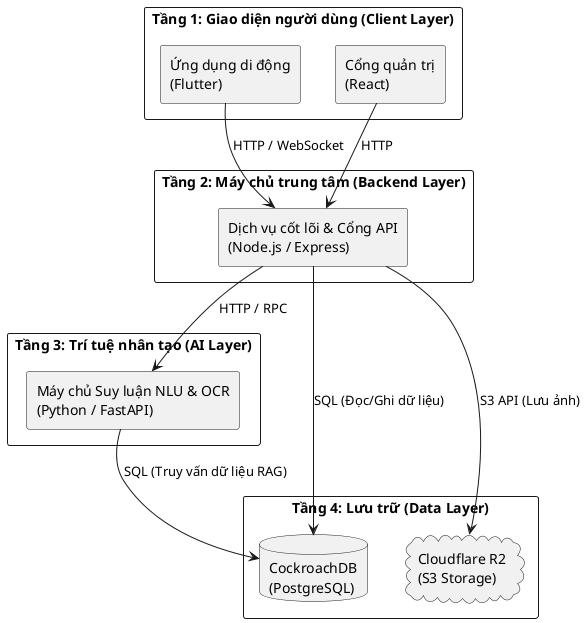
*Hình 1.1: Sơ đồ kiến trúc 4 tầng tổng quát của hệ thống Spending Diary.*

Sơ đồ minh họa mô hình tương tác đa dịch vụ, nơi dữ liệu từ ứng dụng di động được chuyển đến máy chủ Node.js để kiểm duyệt, sau đó luân chuyển đến cụm máy chủ FastAPI để phân tích bằng trí tuệ nhân tạo và cuối cùng được lưu trữ an toàn tại cơ sở dữ liệu.

### 1.2. Phân tích yêu cầu chức năng

Dựa vào kiến trúc tổng thể, các yêu cầu của hệ thống được bóc tách và phân rã chi tiết thành bốn vùng độc lập. Việc phân rã này giúp xác định rõ giới hạn trách nhiệm của từng nền tảng phần mềm trong toàn bộ hệ sinh thái. Bảng 1.1 dưới đây định nghĩa cụ thể các yêu cầu chức năng cốt lõi mà hệ thống bắt buộc phải đáp ứng, chia theo từng phân hệ.

Bảng 1.1: Bảng phân rã yêu cầu chức năng chi tiết theo từng phân hệ

| Phân hệ kiến trúc | Chức năng cụ thể | Mô tả yêu cầu chi tiết |
| :--- | :--- | :--- |
| Người dùng trên app | Đăng ký và đăng nhập | Tạo tài khoản, xác thực thông tin đăng nhập và hỗ trợ khôi phục mật khẩu. |
| Người dùng trên app | Nâng cấp tài khoản | Cho phép người dùng thanh toán trực tuyến để mở khóa các tính năng cao cấp. |
| Người dùng trên app | Quản lý ví tiền | Tạo, chỉnh sửa, xóa các loại ví cá nhân hoặc tạo ví dùng chung với nhiều thành viên. |
| Người dùng trên app | Ghi chép chi tiêu bằng văn bản | Sử dụng ngôn ngữ tự nhiên để mô hình hoặc trợ lý ảo tự động phân tích và ghi chép giao dịch. |
| Người dùng trên app | Quét ảnh hóa đơn | Chụp ảnh hóa đơn mua sắm để hệ thống tự động nhận diện số tiền và danh mục chi tiêu. |
| Người dùng trên app | Giao tiếp thông minh và ra lệnh | Sử dụng trợ lý ảo để ra lệnh điều khiển ứng dụng như xem báo cáo, tạo mục tiêu, đặt hạn mức, đổi giọng, tìm kiếm giao dịch thông qua ngôn ngữ tự nhiên. |
| Người dùng trên app | Báo cáo lỗi nhận diện AI | Cho phép người dùng bấm nút báo sai khi trợ lý ảo hiểu nhầm ý định, dữ liệu phản hồi này được thu thập để cải thiện mô hình. |
| Người dùng trên app | Quản lý hạn mức và gợi ý ngân sách | Đặt giới hạn chi tiêu, tự động gợi ý phân bổ ngân sách 50/30/20 và gửi cảnh báo khi sắp vượt hạn mức. |
| Người dùng trên app | Báo cáo và so sánh | Cung cấp biểu đồ thu chi, xem tổng kết cuối tháng và so sánh mức chi tiêu với cộng đồng. |
| Người dùng trên app | Quản lý giao dịch | Xem chi tiết, chỉnh sửa số tiền, đổi danh mục hoặc xóa giao dịch đã ghi nhận. |
| Người dùng trên app | Quản lý mục tiêu tiết kiệm | Tạo quỹ tiết kiệm cá nhân hoặc rủ bạn bè cùng đóng góp cho mục tiêu chung. |
| Người dùng trên app | Chia tiền và thanh toán nhóm | Tạo nhóm chia sẻ chi phí (chia bill) và theo dõi công nợ giữa các thành viên. |
| Người dùng trên app | Quản lý sổ nợ | Ghi chép và theo dõi các khoản cho vay hoặc đi vay cá nhân. |
| Người dùng trên app | Thiết lập giao dịch định kỳ | Lên lịch tự động ghi nhận các khoản thu chi lặp lại. |
| Người dùng trên app | Điểm danh và chuỗi hoạt động | Điểm danh mỗi ngày (Streak) để nhận phần thưởng và duy trì thói quen ghi chép tài chính. |
| Quản trị trên web | Thống kê doanh thu | Giám sát biểu đồ tăng trưởng người dùng, tỷ lệ lỗi máy chủ và tổng doanh thu. |
| Quản trị trên web | Quản lý người dùng | Tra cứu thông tin người dùng, duyệt khiếu nại và ra lệnh khóa các tài khoản vi phạm. |
| Quản trị trên web | Dán nhãn dữ liệu ảnh | Công cụ vẽ khung chữ nhật để khoanh vùng lại các đoạn chữ trên hóa đơn bị nhận diện sai. |
| Quản trị trên web | Quản lý Prompt | Chỉnh sửa câu lệnh nền tảng định hướng phản hồi của AI. |
| Quản trị trên web | Quản lý tiến trình huấn luyện AI | Kích hoạt quá trình huấn luyện lại mô hình học máy từ tập dữ liệu đã dán nhãn. |
| Quản trị trên web | Phê duyệt phiên bản trợ lý ảo | So sánh chỉ số hiệu năng và phê duyệt mô hình ứng viên trước khi áp dụng vào hệ thống thực tế. |
| Quản trị trên web | Trích xuất dữ liệu huấn luyện | Cho phép quản trị viên xuất tập dữ liệu huấn luyện tăng cường định dạng JSONL từ cơ sở dữ liệu hệ thống. |
| Máy chủ backend | Xử lý nghiệp vụ tài chính | Tiếp nhận giao dịch, tính toán số dư ví và đối chiếu liên tục với hạn mức ngân sách. |
| Máy chủ backend | Cổng API và bảo mật | Điều hướng yêu cầu, xác thực quyền truy cập và tự động khóa các kết nối rác. |
| Máy chủ backend | Lưu trữ và duy trì ngữ cảnh | Lưu nháp ngữ cảnh khi AI nhận diện thiếu thông tin và điều phối luồng hỏi đáp bổ sung. |
| Máy chủ backend | Hệ thống tự động hóa | Lắng nghe webhook ngân hàng để nâng cấp tài khoản và chạy tiến trình ngầm gửi thông báo. |
| Máy chủ AI | Nhận diện ý định và trích xuất thông tin | Phân loại ý định bằng mô hình học máy, sau đó trích xuất thực thể chuyên biệt kết hợp mô hình ngôn ngữ lớn. |
| Máy chủ AI | Trích xuất hình ảnh | Áp dụng kỹ thuật thị giác máy tính để số hóa hóa đơn giấy thành các bản ghi tài chính. |
| Máy chủ AI | Quản trị vòng đời mô hình | Quản lý ba trạng thái mô hình, hỗ trợ phê duyệt và hoán đổi phiên bản mà không cần khởi động lại máy chủ. |

### 1.3. Sơ đồ Use Case tổng quát và chi tiết

Để có cái nhìn toàn diện từ bao quát đến chuyên sâu về hành vi của các tác nhân, hệ thống Spending Diary được mô hình hóa bằng sơ đồ Use Case tổng quát và hai sơ đồ Use Case chi tiết cho từng phân hệ.

#### 1.3.1. Sơ đồ Use Case tổng quát của hệ thống

Sơ đồ tổng quát thể hiện mối quan hệ giữa hai tác nhân chính gồm người dùng cuối, quản trị viên. Cả người dùng và quản trị viên đều bắt buộc phải trải qua bước xác thực tài khoản trước khi truy cập các luồng nghiệp vụ riêng biệt.

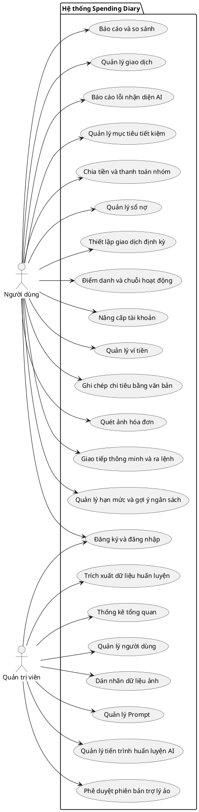

Hình 1.2: Sơ đồ Use Case tổng quát toàn bộ hệ thống.

Hình 1.2 cho thấy phân chia trách nhiệm rõ rệt giữa người dùng thao tác nghiệp vụ thu chi cá nhân trên ứng dụng di động và quản trị viên quản lý, giám sát, huấn luyện mô hình trí tuệ nhân tạo trên trang web quản trị. Các chức năng cốt lõi này đều có bảng đặc tả chi tiết tại phụ lục của luận văn.

#### 1.3.2. Sơ đồ Use Case chi tiết phân hệ người dùng

Đối với người dùng trên ứng dụng di động, sơ đồ chi tiết mở rộng từng luồng chức năng lớn thành các chức năng nghiệp vụ cụ thể mà người dùng có thể chủ động thao tác trên giao diện.

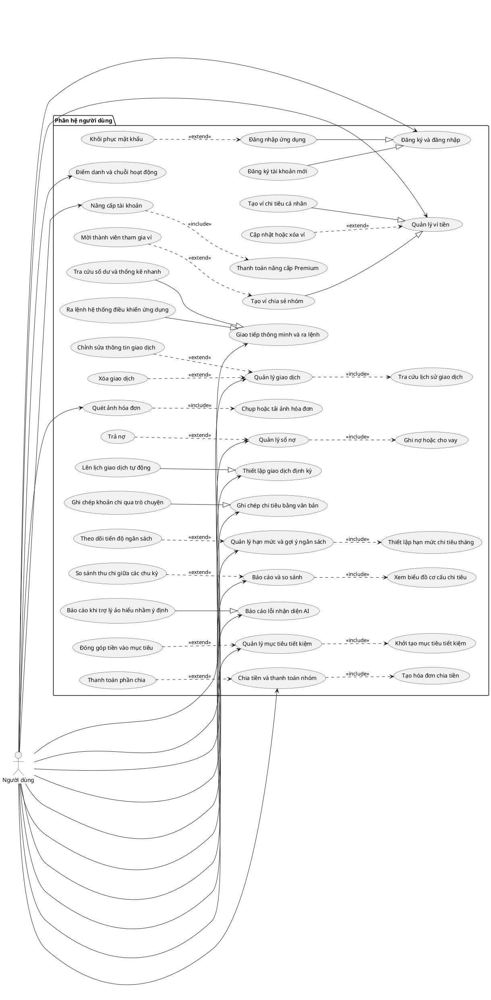

Hình 1.3: Sơ đồ Use Case chi tiết phân hệ người dùng trên ứng dụng di động.

Hình 1.3 tập trung hoàn toàn vào góc độ người dùng di động, loại bỏ các bước xử lý kỹ thuật trung gian để làm rõ các luồng nghiệp vụ thực tế mà người dùng có thể lựa chọn thao tác, từ quản lý tài khoản, khai thác trợ lý ảo Mimo cho đến theo dõi ngân sách và báo cáo chi tiêu.

#### 1.3.3. Sơ đồ Use Case chi tiết phân hệ quản trị viên

Trên nền tảng trang web quản trị, sơ đồ mở rộng các chức năng điều hành của ban quản trị thành các nghiệp vụ theo dõi thống kê, kiểm soát tài khoản và quản trị chu trình học sâu cho bộ não AI.

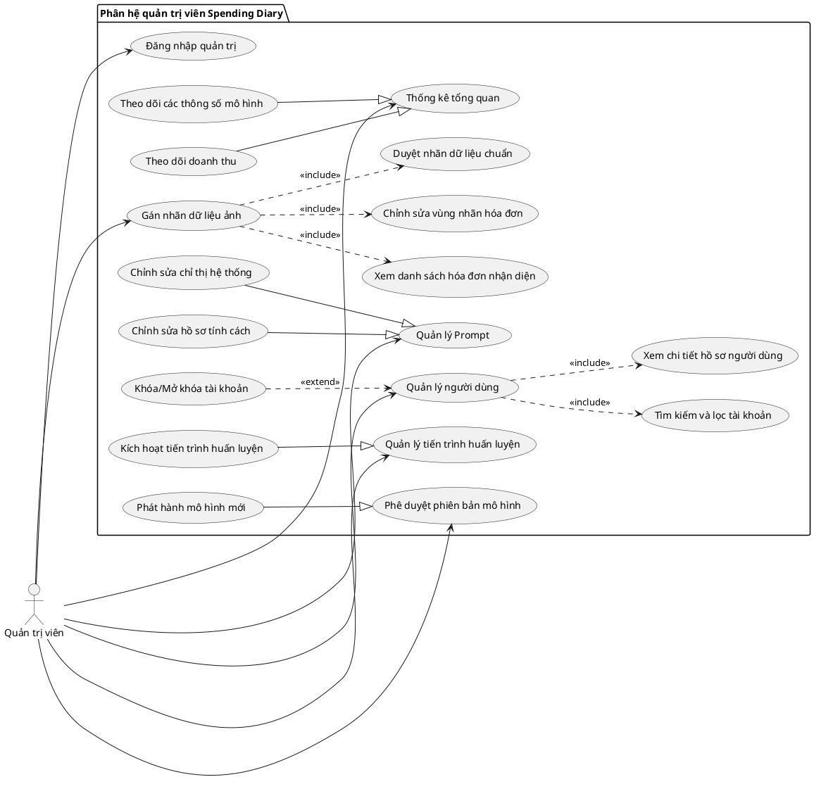

Hình 1.4: Sơ đồ Use Case chi tiết phân hệ quản trị viên trên nền tảng web.

Hình 1.4 được xây dựng thuần túy dưới góc độ của ban quản trị hệ thống trên nền tảng web, thể hiện cụ thể các nghiệp vụ quản lý danh sách người dùng, kiểm duyệt dữ liệu hóa đơn lỗi và điều khiển toàn bộ chu trình tái huấn luyện mô hình trí tuệ nhân tạo.

### 1.4. Yêu cầu phi chức năng

Để một ứng dụng tài chính được người dùng tin tưởng và sử dụng lâu dài, hệ thống Spending Diary phải đáp ứng các tiêu chuẩn kỹ thuật khắt khe bên cạnh các tính năng cốt lõi.

Về mặt hiệu năng, ứng dụng trên thiết bị di động cần tối ưu hóa thời gian khởi động và đảm bảo các thao tác chuyển đổi giao diện diễn ra mượt mà. Trong quá trình tương tác với trợ lý ảo, cụm máy chủ máy học phải phân tích ý định ngôn ngữ và phản hồi kết quả trong khoảng thời gian dưới hai giây để duy trì trải nghiệm liền mạch.

Về tính bảo mật, toàn bộ mật khẩu và thông tin xác thực của người dùng bắt buộc phải được mã hóa một chiều an toàn trước khi lưu trữ vào cơ sở dữ liệu. Hệ thống backend cũng cần được trang bị các cơ chế giám sát lưu lượng mạng nhằm tự động nhận diện và ngăn chặn các cuộc tấn công từ chối dịch vụ do gửi yêu cầu quá tải.

Về độ tin cậy và khả năng mở rộng, hệ thống quản trị cơ sở dữ liệu phải đảm bảo tính toàn vẹn tuyệt đối cho dữ liệu tài chính. Ứng dụng cần có cơ chế chống tạo trùng lặp bản ghi trong các trường hợp đường truyền mạng gián đoạn khiến người dùng gửi một giao dịch nhiều lần. Hơn nữa, kiến trúc hệ thống phải được thiết kế phân tán độc lập, cho phép dễ dàng nâng cấp tài nguyên phần cứng khi tải trọng tăng cao mà không yêu cầu tái cấu trúc lại nền tảng mã nguồn hiện tại.

# CHƯƠNG 2. CƠ SỞ LÝ THUYẾT VÀ CÔNG NGHỆ LIÊN QUAN

### 2.1. Tổng quan các công nghệ sử dụng

Chương này sẽ trình bày các nền tảng lý thuyết và các công nghệ cốt lõi được sử dụng để xây dựng hệ thống Spending Diary. Nhằm đảm bảo tính trực quan và dễ tiếp cận, nội dung được trình bày dưới dạng các đoạn văn liên kết, bao hàm đầy đủ các yếu tố: khái niệm thực tế, mục đích sử dụng, luồng dữ liệu đầu vào và đầu ra, cùng ưu điểm chính của từng công nghệ.

Bảng 2.1: Bảng tổng hợp các công nghệ sử dụng trong hệ thống

| Phân hệ xử lý | Công nghệ | Mô tả ngắn gọn |
| :--- | :--- | :--- |
| Giao diện người dùng | Flutter và React | Công cụ xây dựng giao diện cho ứng dụng di động và cổng quản trị Web. |
| Kiến trúc phần mềm | Kiến trúc dịch vụ phân tách | Kiến trúc phân rã hệ thống thành các dịch vụ độc lập, chuyên trách. |
| Giao tiếp mạng | RESTful API và WebSocket | Tiêu chuẩn kết nối tĩnh và giao thức truyền tải thời gian thực. |
| Máy chủ | Node.js và FastAPI | Môi trường xử lý luồng nghiệp vụ chính và triển khai AI. |
| Lưu trữ dữ liệu | CockroachDB và Cloud R2 | Cơ sở dữ liệu phân tán an toàn và nền tảng lưu trữ hình ảnh đám mây. |
| Thị giác máy tính | DBNet | Mạng phát hiện và định vị các khu vực chứa văn bản trên hình ảnh. |
| Thị giác máy tính | VietOCR | Mô hình nhận dạng và dịch hình ảnh chữ viết sang văn bản tiếng Việt. |
| Thị giác máy tính | LayoutLMv3 | Mô hình phân tích không gian và văn bản để trích xuất hóa đơn. |
| Xử lý ngôn ngữ tự nhiên | PhoBERT | Mô hình học sâu chuyên phân tích cấu trúc ngữ pháp tiếng Việt. |
| Xử lý ngôn ngữ tự nhiên | TF-IDF | Thuật toán trích xuất đặc trưng văn bản hỗ trợ phân loại ý định người dùng với độ trễ thấp. |
| Xử lý ngôn ngữ tự nhiên | NER | Kỹ thuật nhận dạng thực thể có tên để bóc tách các thông số giao dịch. |
| Trợ lý ảo AI | Qwen 2.5 | Mô hình ngôn ngữ lớn làm lõi tư vấn và sinh câu phản hồi tự nhiên. |
| Tinh chỉnh mô hình | LoRA | Kỹ thuật tinh chỉnh gọn nhẹ giúp AI hiểu sâu nghiệp vụ tài chính. |
| Bổ trợ tri thức | RAG | Kiến trúc ép AI trả lời dựa trên sự thật truy xuất từ cơ sở dữ liệu. |

Bảng 2.1 ở trên tổng hợp 14 nhóm công nghệ và mô hình máy học nòng cốt tham gia vào toàn bộ vòng đời xử lý dữ liệu của dự án. Sự kết hợp này giúp hệ thống hoạt động ổn định và thông minh.

### 2.2. Nền tảng kiến trúc và máy chủ

Để xây dựng một hệ thống đa nền tảng có khả năng đáp ứng luồng dữ liệu theo thời gian thực, đề tài lựa chọn kết hợp các công nghệ linh hoạt và mạnh mẽ nhất hiện nay. Các công nghệ này được phân bổ hợp lý từ tầng giao diện người dùng cho đến hệ thống máy chủ xử lý trung tâm.

#### 2.2.1. Giao diện ứng dụng Flutter và React
Hệ thống đòi hỏi hai loại giao diện tách biệt: một ứng dụng trên điện thoại dành cho người dùng phổ thông và một trang web dành riêng cho ban quản trị. Để đáp ứng nhu cầu này, dự án sử dụng kết hợp hai công nghệ là Flutter và React. Đối với ứng dụng trên điện thoại, Flutter [13] được lựa chọn. Đây là một khung lập trình do Google phát triển, cho phép viết mã một lần nhưng có thể chạy mượt mà trên cả hai hệ điều hành Android và iOS. Đầu vào của Flutter là việc tiếp nhận mọi thao tác vuốt chạm, nhập liệu từ người dùng. Đầu ra của nó là các giao diện màn hình trực quan và các gói dữ liệu được đóng gói cẩn thận để gửi lên máy chủ. 

Đối với cổng quản trị, dự án sử dụng React [14]. Đây là một thư viện chuyên biệt để xây dựng giao diện trên nền tảng web. Đầu vào của React là các thao tác nhấp chuột và gõ phím từ quản trị viên. Đầu ra của nó là các bảng biểu thống kê, biểu đồ và danh sách dữ liệu giúp ban quản trị dễ dàng theo dõi tình hình hoạt động của toàn hệ thống. Cả hai công nghệ này đều được ưu tiên sử dụng vì có cộng đồng hỗ trợ rất lớn, tài liệu phong phú, giúp cho việc xây dựng giao diện luôn đảm bảo được tính thẩm mỹ, mượt mà và thân thiện với người sử dụng.

#### 2.2.2. Kiến trúc dịch vụ phân tách (Decoupled Architecture)
Kiến trúc dịch vụ phân tách là một phương pháp thiết kế phần mềm, trong đó thay vì xây dựng một hệ thống nguyên khối (monolithic) tập trung quy mô lớn, người ta sẽ phân rã nó thành các khối dịch vụ hoạt động độc lập với nhau theo từng ranh giới nghiệp vụ chuyên trách. Trong dự án này, hệ thống được tách biệt rõ ràng thành hai phần chính: máy chủ Backend (Node.js) chuyên xử lý giao dịch và máy chủ AI (FastAPI) chuyên chạy các mô hình trí tuệ nhân tạo. 

Mục đích chính của phương pháp này là đảm bảo hiệu suất hoạt động và cô lập tài nguyên. Khi máy chủ AI đang phải dồn tài nguyên tính toán để phân tích những tờ hóa đơn phức tạp, các thao tác ghi chép thu chi thông thường của những người dùng khác trên máy chủ giao dịch vẫn diễn ra bình thường, không bị chậm trễ hay quá tải. Hơn nữa, việc giao tiếp giữa hai dịch vụ diễn ra hoàn toàn độc lập, cho phép bảo trì và triển khai riêng biệt. Đầu vào của kiến trúc này là toàn bộ luồng yêu cầu từ điện thoại của người dùng. Đầu ra của nó là sự điều hướng và phân luồng dữ liệu một cách trơn tru, đảm bảo yêu cầu nào sẽ được chuyển đến đúng máy chủ có nhiệm vụ xử lý yêu cầu đó.

#### 2.2.3. Máy chủ Node.js và FastAPI
Để vận hành kiến trúc chia nhỏ ở trên, hệ thống sử dụng kết hợp hai loại máy chủ là Node.js và FastAPI, mỗi máy chủ đảm nhận một vai trò riêng biệt. Trong đó, Node.js [15] đóng vai trò như một trạm kiểm soát trung tâm. Đầu vào của nó là các yêu cầu phổ thông từ người dùng như đăng nhập, xem báo cáo, hoặc lưu lại một giao dịch mới. Đầu ra của nó là các bản ghi được lưu an toàn vào cơ sở dữ liệu. Điểm mạnh của Node.js là khả năng xử lý bất đồng bộ, giúp nó có thể tiếp nhận và phản hồi hàng ngàn người dùng cùng một lúc mà không bắt họ phải chờ đợi lâu.

Trong khi đó, FastAPI [16] là một khung làm việc được lập trình bằng ngôn ngữ Python. Đầu vào của FastAPI là các hình ảnh hóa đơn hoặc câu lệnh mà Node.js chuyển sang nhờ hỗ trợ phân tích. Đầu ra của nó là các thông tin đã được AI đọc hiểu và bóc tách thành công. FastAPI được ưu tiên sử dụng để thiết lập máy chủ AI bởi vì hệ sinh thái của Python sở hữu sức mạnh tính toán vượt trội, đặc biệt tối ưu cho các mô hình học sâu phức tạp.

#### 2.2.4. Giao tiếp RESTful API và WebSocket
Trong dự án này, hệ thống sử dụng RESTful API đóng vai trò như một bộ quy tắc giao tiếp chuẩn mực, quy định cách thức điện thoại gửi yêu cầu và nhận phản hồi từ máy chủ. Đầu vào của API là một đường dẫn yêu cầu chứa các thông tin cần thiết, và đầu ra là một gói dữ liệu được định dạng cấu trúc JSON. Tuy nhiên, giới hạn của API là nó chỉ hoạt động theo phương thức hỏi - đáp, nghĩa là hệ thống chỉ phản hồi khi người dùng chủ động tương tác.

Để khắc phục giới hạn trên, hệ thống được tích hợp thêm giao thức WebSocket [17] nhằm tạo ra một kênh kết nối liên tục và xuyên suốt hai chiều. Nhờ có WebSocket, ngay khi máy chủ AI hoàn tất việc phân tích một tờ hóa đơn phức tạp, hệ thống có thể chủ động đẩy ngay kết quả xuống điện thoại theo thời gian thực. Điều này mang lại trải nghiệm liền mạch, giúp người dùng nhận được thông tin lập tức mà không cần phải chủ động vuốt màn hình để tải lại dữ liệu.

#### 2.2.5. Lưu trữ CockroachDB và Cloud R2
CockroachDB [18] là một hệ quản trị cơ sở dữ liệu phân tán hiện đại. Đối với công nghệ này, dữ liệu tài chính không được tập trung trên một ổ cứng duy nhất mà được chia nhỏ và sao lưu rải rác trên nhiều máy chủ khác nhau. Mục đích của việc phân tán này là nhằm đề phòng trường hợp một máy chủ gặp sự cố phần cứng, hệ thống vẫn duy trì hoạt động và bảo toàn trọn vẹn dữ liệu giao dịch của người dùng. Đầu vào của cơ sở dữ liệu là các thông tin thu chi dạng số liệu, và đầu ra là quá trình truy vấn để hình thành các bản báo cáo tài chính chính xác.

Bên cạnh dữ liệu số, hệ thống còn tiếp nhận lượng lớn dữ liệu hình ảnh từ người dùng chụp hóa đơn. Thay vì lưu trữ hình ảnh trực tiếp vào cơ sở dữ liệu chính gây chậm trễ, dự án sử dụng dịch vụ đám mây Cloud R2 [19] chuyên biệt để lưu trữ tài nguyên đa phương tiện. Đầu vào của Cloud R2 là các tệp hình ảnh hóa đơn vật lý, và đầu ra là các đường dẫn liên kết (URL) được trả về. Nhờ sự tách biệt này, cơ sở dữ liệu luôn giữ được sự gọn nhẹ, trong khi hình ảnh vẫn được tải lên và truy xuất một cách tốc độ.

### 2.3. Phân hệ trí tuệ nhân tạo AI

Lõi thông minh của hệ thống dựa trên sự phối hợp của nhiều mô hình học sâu chuyên biệt. Mỗi mô hình đảm nhận một tác vụ cụ thể từ phân tích hình ảnh, nhận dạng ký tự, cho đến hiểu sâu ngữ nghĩa văn bản.

#### 2.3.1. Mạng phát hiện chữ DBNet
DBNet [2] là một mô hình thị giác máy tính chuyên biệt, kết hợp cùng các kiến trúc mạng chập gọn nhẹ. Về mặt lý thuyết hoạt động, mô hình này phân tích độ tương phản của hàng ngàn điểm ảnh (pixel) để tự động học cách phân biệt đâu là vệt mực in, đâu là nền giấy trắng. Nhiệm vụ của nó giống như một người cầm bút dạ quang đi bôi vàng tất cả những khu vực có chứa chữ viết trên một tờ hóa đơn lộn xộn, đồng thời loại bỏ hoàn toàn các chi tiết thừa thãi như hình nền, logo hay vân gỗ mặt bàn. 

Đầu vào của DBNet là hình ảnh thô của hóa đơn do người dùng chụp từ camera điện thoại. Đầu ra là một danh sách các tọa độ không gian bao bọc vừa khít lấy từng dòng chữ. Điểm mạnh vượt trội của công nghệ DBNet là khả năng tính toán linh hoạt, giúp nó có thể nhận diện chính xác các dòng chữ bị nghiêng lệch, bóp méo, hoặc phát hiện chữ ngay cả khi giấy in nhiệt bị mờ, nhăn nheo hay bị chụp trong điều kiện thiếu sáng nghiêm trọng.

#### 2.3.2. Mô hình nhận dạng chữ tiếng Việt VietOCR
Sau khi DBNet đã khoanh vùng thành công vị trí của các khối chữ, hệ thống cần một công cụ khác để thực sự đọc hiểu những hình ảnh đó. Đây chính là lúc VietOCR [3] phát huy tác dụng và tiến hành biên dịch hình ảnh thành văn bản kỹ thuật số. Đầu vào của quy trình này là một loạt các mảnh ảnh nhỏ đã được cắt gọt và căn chỉnh vuông vắn từ bước trước. Đầu ra của mô hình là các chuỗi văn bản ký tự hoàn chỉnh, có thể dễ dàng sao chép và chỉnh sửa.

Về mặt lý thuyết hoạt động, VietOCR không hề đánh vần từng chữ cái một cách máy móc. Thay vào đó, nó kết hợp việc trích xuất các đặc trưng hình dáng của chữ viết với khả năng suy luận ngữ cảnh của toàn bộ từ ngữ để phán đoán. Công nghệ này được đặc biệt lựa chọn cho dự án vì hệ thống dấu thanh của tiếng Việt (sắc, hỏi, ngã, nặng) rất phức tạp và hay nằm đè lên nhau. Các mô hình nhận diện của nước ngoài thường xuyên đọc sai lệch, trong khi VietOCR được huấn luyện bằng kho dữ liệu khổng lồ của riêng nước ta, giúp nó nhận biết cực kỳ nhạy bén và chính xác từng dấu câu khó nhất.

#### 2.3.3. Mô hình phân tích bố cục LayoutLMv3
Khi đã trích xuất được những dòng chữ rời rạc, hệ thống sẽ sử dụng mô hình LayoutLMv3 để hiểu được ý nghĩa thực sự của chúng [4]. Về mặt lý thuyết, mô hình này học cách phân tích một văn bản y hệt như cách con người đọc tài liệu. Nó đóng vai trò như một kế toán viên giàu kinh nghiệm, không chỉ nhìn vào nội dung của từ ngữ mà còn quan sát hình ảnh và đặc biệt là bố cục không gian của từ ngữ đó trên tờ giấy. Ví dụ, nó tự suy luận được rằng cụm từ nằm ở góc dưới cùng, in đậm và có cỡ chữ to thường mang ý nghĩa là tổng số tiền cần thanh toán.

Về chi tiết hoạt động, đầu vào của mô hình là các đoạn văn bản thô kèm theo tọa độ ngang dọc của chúng trên hình ảnh. Đầu ra của nó là các nhãn dán định danh phân loại rõ ràng đâu là tên cửa hàng, đâu là phần tổng tiền, đâu là ngày tháng giao dịch. Mô hình này mang lại một ưu điểm vượt trội đó là nó có thể tự động đọc hiểu mọi định dạng hóa đơn của bất kỳ siêu thị hay cửa hàng tiện lợi nào mà không cần lập trình viên phải viết mã cứng nhắc trước cho từng mẫu riêng biệt.

#### 2.3.4. Thuật toán trích xuất đặc trưng văn bản TF-IDF
TF-IDF (Term Frequency - Inverse Document Frequency) [5] là một thuật toán thống kê được sử dụng rộng rãi trong xử lý ngôn ngữ tự nhiên để đánh giá mức độ quan trọng của một từ trong một văn bản thuộc một tập dữ liệu (corpus). Giá trị TF-IDF của một từ tỷ lệ thuận với số lần xuất hiện của từ đó trong văn bản (TF), nhưng bị giới hạn bởi tần suất xuất hiện của từ đó trong toàn bộ tập dữ liệu (IDF). Điều này giúp làm nổi bật các từ mang đặc trưng riêng của văn bản và tự động hạ thấp trọng số của các từ phổ biến xuất hiện quá nhiều. Đầu ra của quá trình này là ma trận các véc-tơ đặc trưng (Feature Vectors) biểu diễn văn bản, đóng vai trò là nền tảng cốt lõi cho các mô hình học máy truyền thống (như SVM, Logistic Regression) trong các bài toán phân loại và tìm kiếm văn bản.


#### 2.3.5. Mô hình xử lý ngữ nghĩa tiếng Việt PhoBERT
PhoBERT là một mô hình học sâu được tinh chỉnh và phát triển dành riêng cho ngôn ngữ tiếng Việt [6]. Xét về lý thuyết hoạt động, thay vì tìm kiếm các từ khóa theo quy tắc lập trình cứng nhắc, mô hình này có khả năng phân tích ngữ cảnh hai chiều của toàn bộ câu nói. Mục đích cốt lõi của PhoBERT là giúp hệ thống hiểu tường tận những câu lệnh trò chuyện mang cấu trúc lộn xộn, viết tắt hay thậm chí là chứa tiếng lóng đặc trưng của người dùng Việt Nam khi họ lười nhập liệu thủ công.

Đối với hệ thống này, đầu vào của mô hình là một câu tin nhắn trò chuyện hoàn toàn tự do từ phía người dùng, ví dụ như "trưa nay ăn phở hết 50 cành". Đầu ra của nó bao gồm hai thành phần: kết quả phân loại ý định (nhận diện đây là hành động thêm giao dịch mới) và các thực thể dữ liệu được bóc tách gọn gàng (như số tiền là 50000, danh mục là ăn uống). PhoBERT được tin dùng bởi vì nó giải quyết hoàn hảo bài toán nhập liệu văn bản tự nhiên mà không bắt buộc người dùng phải gõ đúng cú pháp.

#### 2.3.6. Trợ lý ảo Qwen 2.5 và phương pháp tinh chỉnh LoRA
Trong dự án này, Qwen 2.5 [7] là một mô hình ngôn ngữ lớn được lựa chọn để đóng vai trò làm lõi tư duy trung tâm cho trợ lý ảo Mimo. Xét về lý thuyết, đây là một bộ não nhân tạo đã được huấn luyện trên lượng dữ liệu khổng lồ, giúp nó có khả năng sinh ra ngôn ngữ tự nhiên và mạch lạc. Tuy nhiên, vì Qwen vốn dĩ chỉ học các kiến thức chung của nhân loại, hệ thống bắt buộc phải sử dụng thêm kỹ thuật tinh chỉnh LoRA để bổ sung kiến thức chuyên ngành [8].

Có thể hình dung phương pháp LoRA giống như việc trao thêm một cuốn sổ tay nhỏ chứa đầy các quy tắc kế toán cho Qwen học thêm, thay vì phải tốn kém nguồn lực để đập đi xây lại toàn bộ kiến trúc gốc của mô hình. Đầu vào của phân hệ này là bất kỳ câu hỏi tư vấn tài chính nào từ phía người dùng. Đầu ra của nó là những câu trả lời logic, bám sát chuyên môn quản lý thu chi, nhưng vẫn mang phong thái xưng hô thân thiện, tự nhiên như một con người thực thụ.

#### 2.3.7. Kiến trúc RAG 
Retrieval-Augmented Generation (RAG) [9] là một khung kiến trúc trí tuệ nhân tạo tiên tiến nhằm giải quyết nhược điểm cố hữu của các mô hình ngôn ngữ lớn (LLM): hiện tượng ảo giác (hallucination) - tức việc mô hình tự động sinh ra các thông tin sai lệch nhưng với văn phong tự tin. Về mặt lý thuyết, RAG chia tách quá trình xử lý của hệ thống thành hai giai đoạn độc lập: Truy xuất (Retrieval) và Sinh tạo (Generation). 

Trong giai đoạn truy xuất, thay vì dựa hoàn toàn vào bộ nhớ nội tại được mã hóa trong các trọng số nơ-ron, hệ thống sẽ chủ động tìm kiếm thông tin từ một nguồn cơ sở dữ liệu ngoại vi đáng tin cậy. Dữ liệu truy xuất có thể là văn bản phi cấu trúc (thông qua Vector Database) hoặc dữ liệu có cấu trúc (thông qua Relational Database). Ở giai đoạn sinh tạo, các dữ kiện thực tế vừa được rút trích này sẽ được đóng gói cùng với truy vấn ban đầu thành một ngữ cảnh duy nhất. Kết quả đầu ra là mô hình ngôn ngữ bị ép buộc phải suy luận và trả lời nghiêm ngặt dựa trên tập dữ kiện đã cung cấp, qua đó đảm bảo tính chính xác tuyệt đối của thông tin đầu ra mà không cần phải tiêu tốn tài nguyên để huấn luyện lại mô hình.


# CHƯƠNG 3 - PHÂN TÍCH, THIẾT KẾ VÀ CÀI ĐẶT HỆ THỐNG

### 3.1. Kiến trúc Hệ thống Tổng thể

Kiến trúc của hệ thống quản lý chi tiêu được thiết kế theo mô hình dịch vụ phân tách (Decoupled Architecture). Thay vì tập trung mọi thứ vào một nơi, hệ thống được chia cắt thành bốn khối hoạt động độc lập với ranh giới rõ ràng nhằm đảm bảo tính ổn định tối đa, tránh nút thắt cổ chai và nâng cao khả năng xử lý lượng lớn dữ liệu cùng lúc.


*Hình 3.1: Sơ đồ kiến trúc hệ thống 4 tầng minh họa luồng luân chuyển dữ liệu*

Hình 3.1 phác họa bức tranh toàn cảnh về cách các luồng dữ liệu di chuyển qua hệ thống. Theo nguyên tắc bảo mật, các ứng dụng điện thoại và trang web không bao giờ được phép kết nối trực tiếp vào cơ sở dữ liệu. Mọi yêu cầu bắt buộc phải gửi qua các bộ giao tiếp API để kiểm duyệt, cụ thể qua các khối như sau:

Khối đầu tiên là tầng giao diện máy khách, bao gồm một ứng dụng trên điện thoại để người dùng phổ thông ghi chép, quét hóa đơn hằng ngày, và một trang quản trị web chuyên dụng để ban quản trị theo dõi toàn bộ hệ thống. Bất kỳ thao tác vuốt chạm hay nhấp chuột nào từ phía người dùng đều sẽ tạo ra các yêu cầu xử lý số liệu và được gửi thẳng đến khối thứ hai là máy chủ trung tâm.

Khối máy chủ trung tâm đóng vai trò như một trạm kiểm soát, chuyên tiếp nhận và điều phối mọi luồng dữ liệu vào ra. Máy chủ này có nhiệm vụ kiểm tra tính hợp lệ của dữ liệu trước khi quyết định chuyển tiếp chúng đi đâu. Nếu nhận được một đoạn tin nhắn tự do hoặc một bức ảnh hóa đơn cần phân tích phức tạp, nó sẽ lập tức chuyển tiếp nhiệm vụ sang khối thứ ba là dịch vụ trí tuệ nhân tạo (AI).

Khối dịch vụ AI được đặt trên một máy chủ riêng biệt, chuyên gánh vác các tác vụ nặng nề như phân tích ngôn ngữ tự nhiên và bóc tách chữ viết trên hình ảnh. Việc tách riêng này đảm bảo máy chủ trung tâm không bao giờ bị chậm hay quá tải. Sau khi AI hoàn tất phân tích, máy chủ trung tâm sẽ nhận lại kết quả, trả về cho điện thoại, đồng thời đẩy dữ liệu xuống khối thứ tư là hệ quản trị cơ sở dữ liệu để lưu trữ vĩnh viễn.

### 3.2. Thiết kế Cơ sở Dữ liệu (Sơ đồ ERD)

Dựa trên chức năng nghiệp vụ, cơ sở dữ liệu được tổ chức thành 5 nhóm chính:

- Nhóm Tài khoản: Quản lý thông tin định danh người dùng (`users`).
- Nhóm Giao dịch cốt lõi: Lưu trữ thông tin ví (`wallets`, `wallet_members`), các giao dịch phát sinh (`transactions`) và danh mục phân loại (`categories`).
- Nhóm Lập kế hoạch tài chính: Theo dõi thông tin ngân sách (`budgets`), mục tiêu tài chính (`goals`), khoản vay nợ (`loans`), giao dịch lặp lại định kỳ (`recurring_rules`) và nhật ký chi tiêu (`stories`, `story_items`).
- Nhóm Chia tiền (Bill Splitting): Quản lý các nhóm thanh toán chung (`expense_groups`), thành viên nhóm (`group_members`), giao dịch nội bộ nhóm (`group_transactions`) và chi tiết công nợ (`group_transaction_splits`).
- Nhóm Trợ lý AI và Hóa đơn: Lưu trữ lịch sử hội thoại (`chat_sessions`, `chat_messages`).

Dưới đây là Sơ đồ Thực thể - Liên kết (ERD) minh họa cho 17 bảng cốt lõi kể trên. (Lưu ý: Chi tiết về từng trường dữ liệu, kiểu dữ liệu và các ràng buộc của cơ sở dữ liệu được trình bày đầy đủ tại phần Phụ lục B).

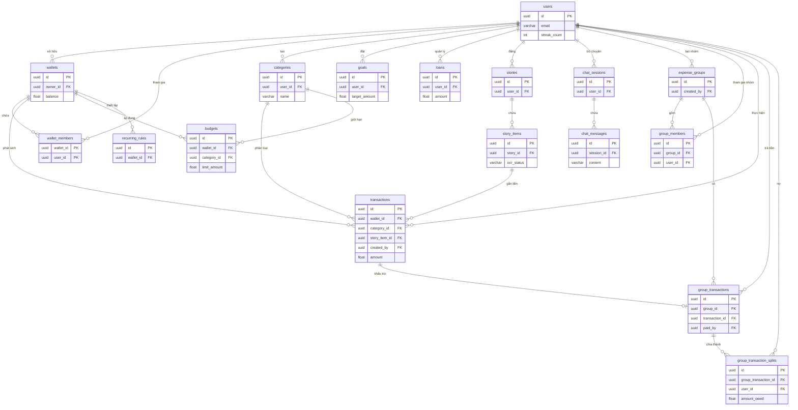
*Hình 3.2: Sơ đồ ERD chắt lọc thể hiện 17 bảng dữ liệu cốt lõi của hệ thống.*

### 3.3. Chi tiết thiết kế tầng giao diện người dùng (Client Layer)

Tầng Giao diện đóng vai trò là điểm chạm đầu tiên và duy nhất giữa con người và hệ thống. Để phục vụ tốt nhất cho hai nhóm đối tượng có hành vi sử dụng hoàn toàn trái ngược, tầng này được chia tách thành hai dự án độc lập: Ứng dụng di động (Mobile App) tập trung vào trải nghiệm mượt mà cho người dùng cuối, và Cổng quản trị (WebAdmin) tập trung vào việc giám sát, huấn luyện dữ liệu cho ban quản trị.
DưDư\

#### 3.3.1. Ứng dụng di động (Mobile App)

Ứng dụng trên điện thoại được xây dựng bằng bộ khung Flutter. Công nghệ này cho phép lập trình một lần nhưng có thể xuất ra mã chạy mượt mà trên cả hệ điều hành Android và iOS. Giao diện được thiết kế tối giản, tập trung vào việc giúp người dùng dễ dàng thao tác bằng một tay. Ứng dụng sử dụng gói thư viện `Dio` để xử lý các luồng gọi API và `cached_query` nhằm quản lý bộ nhớ đệm (cache), giúp ứng dụng có thể hiển thị dữ liệu tức thời ngay cả khi mạng yếu.

##### 3.3.1.1. Chức năng ghi chép chi tiêu tự động bằng văn bản

Chức năng cốt lõi nhất của ứng dụng là khả năng ghi chép chi tiêu tự động thông qua ngôn ngữ tự nhiên. Ở các ứng dụng truyền thống, để ghi lại một khoản chi, người dùng thường phải trải qua nhiều bước: chọn danh mục, nhập số tiền, và gõ ghi chú. Thay vào đó, chức năng này cho phép người dùng chỉ cần gõ một câu đơn giản như "Sáng nay đi ăn phở hết 35k". Nhằm tối đa hóa sự tiện lợi, giao diện nhập liệu bằng văn bản được bố trí tại hai luồng riêng biệt: một là thanh nhập liệu nhanh tích hợp ngay tại màn hình Camera, và hai là trong giao diện Trò chuyện (Chat) chuyên sâu với trợ lý Mimo. Sự linh hoạt này giúp người dùng có thể ghi chép mọi lúc mọi nơi tùy theo ngữ cảnh.

Về mặt logic hoạt động, chức năng này được thiết kế theo luồng xử lý bất đồng bộ nhằm tránh việc giao diện bị đóng băng. Dưới đây là sơ đồ luồng (Flowchart) mô tả chi tiết các bước xử lý từ khi người dùng nhập liệu cho đến khi màn hình được cập nhật.

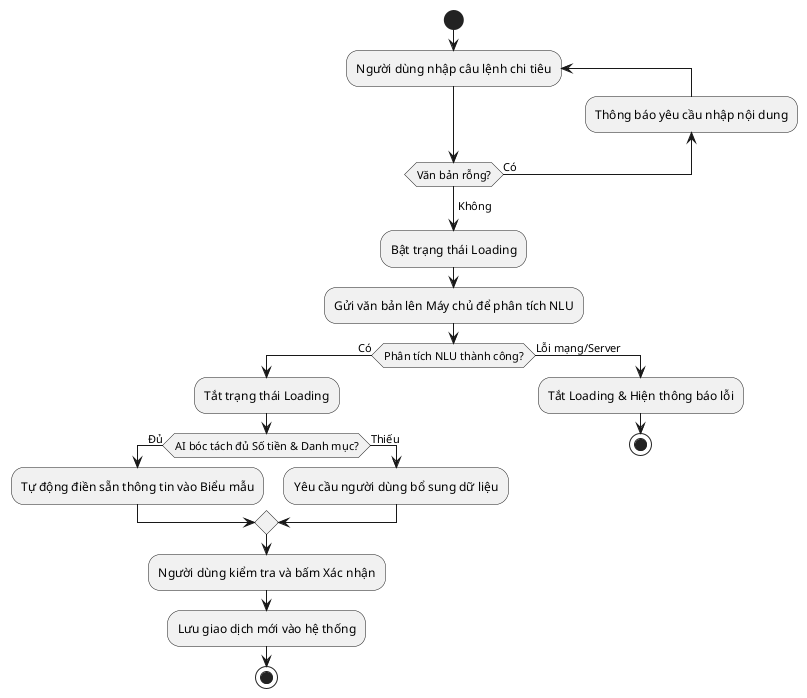
*Hình 3.3: Sơ đồ khối (Flowchart) mô tả logic luồng ghi chép chi tiêu bằng văn bản.*

Sơ đồ trên trình bày cơ chế kiểm soát lỗi kép trong quá trình tự động hóa nhập liệu. Hệ thống không chỉ xử lý các ngoại lệ về kết nối mạng mà còn bắt buộc người dùng xác nhận lại biểu mẫu do AI bóc tách, qua đó ngăn chặn rủi ro lưu trữ sai lệch dữ liệu tài chính.

Lợi thế cốt lõi của cách thiết kế logic này là giảm thiểu tối đa ma sát thao tác. Mọi sự phức tạp trong quá trình phân tích ngôn ngữ tự nhiên, bóc tách từ vựng đều được đẩy hoàn toàn về phía máy chủ (AI Engine) để gánh vác. Nhờ đó, ứng dụng trên điện thoại luôn giữ được độ phản hồi mượt mà, nhẹ nhàng, không gây nóng máy hay tốn pin cho thiết bị của người dùng. 

Hình 3.4 dưới đây minh họa thực tế thiết kế giao diện này.


*Hình 3.4: Giao diện màn hình chính và thanh nhập liệu nhanh.*

Quan sát trên giao diện, cả ở luồng màn hình Camera và khung chat, thanh nhập liệu đều được đặt nổi bật ở dưới cùng, vừa tầm ngón tay cái giúp thao tác một tay dễ dàng. Khi giao dịch được phân tích thành công, một dòng lịch sử mới với biểu tượng danh mục tương ứng sẽ lập tức xuất hiện trên màn hình, mang lại cảm giác phản hồi trực quan, liền mạch và đáng tin cậy.

##### 3.3.1.2. Chức năng quét hóa đơn

Bên cạnh việc gõ chữ, ứng dụng cung cấp thêm một công cụ vô cùng đắc lực cho người bận rộn: tính năng quét hóa đơn. Với chức năng này, người dùng chỉ cần đưa máy lên chụp tờ biên lai siêu thị hoặc quán ăn, hệ thống sẽ tự động đọc chữ trên ảnh và bóc tách ra số tiền cũng như danh mục tương ứng. Dưới đây là sơ đồ mô tả luồng hoạt động của chức năng này:

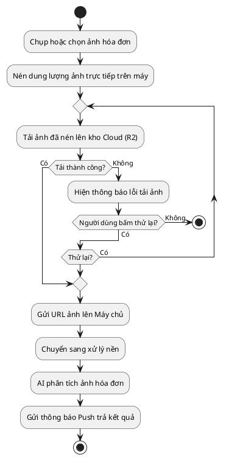
*Hình 3.5: Luồng hoạt động của chức năng quét hóa đơn.*

Để hiện thực hóa luồng hoạt động trên, về mặt công nghệ, ứng dụng sử dụng bộ thư viện `camera` và `image_picker` của Flutter để mở máy ảnh và truy cập thư viện ảnh của điện thoại. Một điểm mấu chốt trong thiết kế logic ở đây là thao tác xử lý ảnh nặng: những bức ảnh chụp từ điện thoại hiện đại thường có dung lượng rất lớn. Nếu đẩy thẳng lên mạng sẽ gây tốn dung lượng 4G và làm máy chủ bị nghẽn. Do đó, ứng dụng được lập trình để tự động nén thu nhỏ kích thước ảnh ngay trên điện thoại trước. Bức ảnh sau khi nén sẽ được tải lên kho lưu trữ đám mây (Cloudflare R2), sau đó ứng dụng mới gửi đường dẫn ảnh này qua API (bằng thư viện `Dio`) cho máy chủ phân tích.

Hơn nữa, sơ đồ cũng minh họa chiến lược xử lý bất đồng bộ nhằm tối ưu hóa hiệu năng ứng dụng. Vì quá trình AI phân tích ảnh tốn nhiều thời gian hơn văn bản, chức năng này được thiết kế theo luồng chạy nền (Background Task). Nghĩa là sau khi bấm gửi ảnh, người dùng không cần phải cắm mặt chờ đợi màn hình tải (loading). Việc nén ảnh và đẩy các tác vụ nặng như phân tích AI sang chạy nền giúp giải phóng giao diện ngay lập tức. Người dùng có thể thoát ra làm việc khác, lướt xem thống kê, hệ thống sẽ âm thầm xử lý và gửi thông báo khi hoàn tất. Thiết kế này mang lại lợi thế cực lớn về mặt trải nghiệm, giúp ứng dụng không bao giờ bị đơ hay treo máy, đảm bảo trải nghiệm liền mạch không bị gián đoạn.


*Hình 3.6: Màn hình chờ hệ thống xử lý hóa đơn chạy ngầm.*


*Hình 3.7: Giao diện tính năng chụp hóa đơn.*

Như minh họa ở trên, giao diện chụp ảnh được tối giản hóa tối đa, mô phỏng lại y hệt màn hình chụp ảnh mặc định của điện thoại để tạo cảm giác quen thuộc. Nút chụp được đặt to, rõ ràng ở chính giữa. Đồng thời, khung ngắm của camera luôn có một khu vực khoanh vùng mờ để nhắc nhở người dùng căn lề tờ hóa đơn vào giữa, giúp quá trình nhận diện chữ (OCR) phía sau diễn ra chính xác nhất có thể.

Khi máy chủ phân tích xong, ứng dụng sẽ nhận được một tín hiệu thông báo đẩy (Push Notification) từ hệ điều hành. Khi người dùng chạm vào thông báo này, ứng dụng sẽ điều hướng thẳng đến một màn hình xác nhận đặc biệt. Tại đây, hệ thống được thiết kế với logic chỉ bóc tách và hiển thị đúng hai trường thông tin là Tổng số tiền và Tên cửa hàng. 

Trong thực tế quản lý tài chính cá nhân, việc liệt kê chi li từng món hàng lẻ tẻ (như mua mắm, muối, hành) là không cần thiết, dễ làm rác cơ sở dữ liệu và rối mắt trên màn hình điện thoại. Thêm vào đó, việc đọc từng dòng chữ quá nhỏ trên hóa đơn siêu thị rất dễ dẫn đến sai sót khi nhận diện. Vì vậy, hệ thống chỉ chắt lọc đúng con số tổng tiền để giữ cho giao diện luôn tinh gọn. Sự tinh gọn này kết hợp với cơ chế xử lý chạy ngầm giúp mang lại trải nghiệm liền mạch tuyệt đối, giấu đi toàn bộ sự phức tạp và độ trễ của hệ thống AI phía sau.

##### 3.3.1.3. Chức năng báo cáo thống kê và so sánh chi tiêu

Thay vì phải rà soát từng giao dịch nhỏ lẻ, chức năng báo cáo giúp người dùng nhìn nhanh tình hình tài chính tổng quan. Để dễ thao tác, màn hình này được chia thành nhiều thẻ (tab) riêng biệt bao gồm: Báo cáo Chi phí, Báo cáo Thu nhập, và Cân đối Thu Chi. Tại mỗi thẻ, hệ thống sử dụng thư viện `fl_chart` của Flutter để trực quan hóa dữ liệu. Biểu đồ tròn (Pie Chart) giúp cắt lớp tỷ trọng các khoản chi, cho biết ngay danh mục nào tốn tiền nhất. Ngược lại, biểu đồ cột (Bar Chart) đặt dòng tiền thu và chi cạnh nhau, giúp người dùng dễ dàng theo dõi cán cân tài chính.

Một điểm đáng chú ý trong thiết kế là người dùng có thể xem báo cáo theo Tuần, Tháng hoặc Năm. Khi đổi mốc thời gian, hệ thống sẽ gom nhóm toàn bộ giao dịch tương ứng để cộng dồn và tính tỷ lệ phần trăm. Khối lượng tính toán nặng nề này không chạy trực tiếp trên giao diện mà được đẩy sang một luồng xử lý chạy ngầm (Isolate) độc lập. Nhờ đó, dù có hàng ngàn giao dịch, màn hình vẫn cuộn và chuyển thẻ mượt mà, không hề đứng máy.

Đặc biệt, hệ thống còn cung cấp thẻ "So sánh đồng trang lứa". Khi chọn thẻ này, ứng dụng sẽ gọi API để đối chiếu mức chi tiêu của người dùng với cơ sở dữ liệu mức sống chung. Kết quả trả về là một thanh đo lường kèm nhận xét thực tế (ví dụ: "Tháng này bạn chi tiêu tiết kiệm hơn 70% người cùng độ tuổi"), tạo thêm động lực để người dùng cải thiện thói quen tiêu dùng.

Dưới đây là sơ đồ khối (Flowchart) mô tả thuật toán xử lý dữ liệu và luồng hiển thị báo cáo:

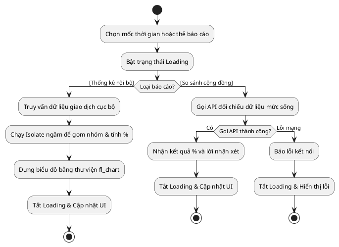
*Hình 3.8: Sơ đồ thuật toán xử lý dữ liệu thống kê và so sánh.*

Nhìn vào Hình 3.8, có thể thấy rõ luồng phân nhánh dữ liệu: nếu người dùng xem báo cáo thu/chi thông thường, hệ thống sẽ tự gom nhóm và tính toán nội bộ (Isolate); nhưng nếu chọn tính năng so sánh, hệ thống buộc phải gọi API lên máy chủ AI để đối chiếu mức sống. 

Để minh họa rõ nét hơn cho các luồng dữ liệu này, Hình 3.9 dưới đây phác họa ba màn hình tiêu biểu nhất của tính năng báo cáo.


*Hình 3.9: Giao diện biểu đồ thống kê và tính năng so sánh chi tiêu.*

Trong hình minh họa, ảnh ngoài cùng bên trái hiển thị giao diện tổng quát của các thẻ báo cáo. Ảnh ở giữa phác họa biểu đồ biến động thu chi, giúp người dùng theo dõi sát sao dòng tiền. Cuối cùng, ảnh bên phải là giao diện so sánh với những người cùng nhóm tuổi, nổi bật với thanh đo lường trực quan. Nhờ cách bóc tách từng luồng thông tin ra các thẻ riêng biệt, giao diện ứng dụng được tối ưu và không hề gây ngợp. (Các màn hình báo cáo phân tích chi tiết khác được đính kèm tại Phụ lục C).
##### 3.3.1.4. Chức năng quản lý hạn mức và gợi ý ngân sách

Để tránh tình trạng vung tay quá trán dẫn đến rỗng túi trước kỳ lương, hệ thống cung cấp tính năng quản lý hạn mức. Người dùng có thể tự do đặt ra mức chi tiêu tối đa cho từng khoản (ví dụ: chỉ tiêu 3 triệu tiền ăn một tháng). Chức năng giám sát này chạy tức thời ngay trên điện thoại. Cứ mỗi lần có một khoản chi mới, ứng dụng sẽ lập tức đối chiếu với hạn mức. Nếu số tiền tiêu vượt quá 80%, thanh tiến trình sẽ chuyển sang màu đỏ rực để tạo cảnh báo thị giác mạnh mẽ, nhắc nhở người dùng hãm phanh kịp thời.

Điểm nhấn của tính năng này là khả năng tự động gợi ý ngân sách thích nghi theo thực tế sử dụng và quy tắc kinh điển 50/30/20. Rào cản lớn nhất của người mới học quản lý tài chính là không biết thiết lập con số bao nhiêu cho hợp lý. Thay vì bắt người dùng đoán mò hay áp dụng con số cố định cứng nhắc, ứng dụng lấy trung bình trượt có trọng số của chi tiêu ba tháng gần nhất, sau đó đối chiếu với độ lệch hạn mức tháng trước theo công thức sử dụng trừ hạn mức. Trường hợp người dùng chi tiêu vượt hạn mức cũ, hệ thống điều chỉnh tăng nhẹ hạn mức đề xuất để con số khả thi hơn, tránh gây tâm lý nản chí khi theo dõi. Ngược lại, nếu người dùng chi tiêu dưới hạn mức, hệ thống tự động thu gọn hạn mức đề xuất để giảm dư thừa ngân sách và tối ưu tiền tích lũy. Cuối cùng, tổng đề xuất được cân đối trong khung tỷ lệ thu nhập 50% cho thiết yếu, 30% cho cá nhân và 20% cho tiết kiệm.

Để làm rõ hơn, thuật toán của từng luồng được bóc tách thành các sơ đồ tương ứng.

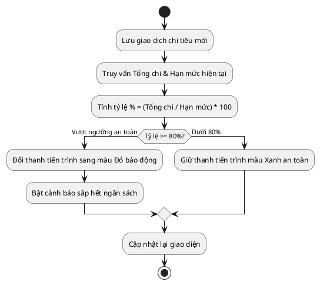
*Hình 3.10: Sơ đồ thuật toán giám sát chi tiêu.*

Như Hình 3.10 thể hiện, khi có giao dịch mới, hệ thống tính toán tỷ lệ chi tiêu trên hạn mức. Nếu chạm ngưỡng 80%, thanh báo động lập tức chuyển đỏ để cảnh báo người dùng. Đối với luồng gợi ý ngân sách thông minh, logic tính toán điều chỉnh theo lịch sử và tỷ lệ 50/30/20 được mô tả ở sơ đồ tiếp theo, đặc biệt có tích hợp cơ chế dự phòng (Fallback) cho người dùng mới chưa có dữ liệu lịch sử:

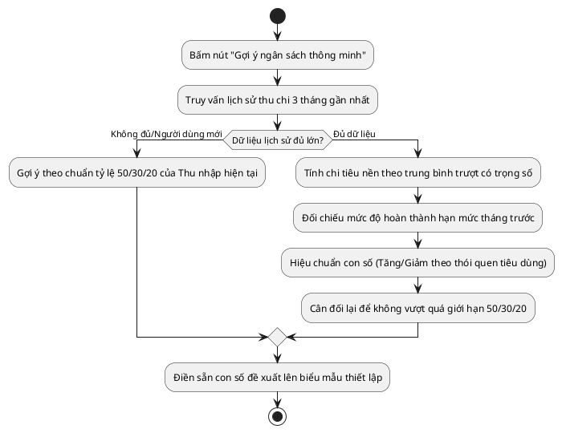
*Hình 3.11: Sơ đồ thuật toán gợi ý ngân sách thích nghi theo thực tế.*

Dựa trên Hình 3.11, khi người dùng kích hoạt tính năng gợi ý, hệ thống lấy lịch sử chi tiêu thực tế, hiệu chuẩn tăng giảm dựa trên mức độ sử dụng so với hạn mức cũ rồi chia theo khung 50/30/20 trước khi điền sẵn vào ô nhập liệu. Để đối chiếu hai thuật toán này hiển thị ra sao ở góc nhìn người dùng, Hình 3.12 dưới đây phác họa màn hình giao diện thực tế.


*Hình 3.12: Giao diện quản lý hạn mức và gợi ý ngân sách.*

Khép lại phần phân tích, giao diện ở Hình 3.12 cho thấy khu vực chính hiển thị danh sách các thẻ ngân sách đi kèm số tiền còn lại và thanh tiến trình báo động. Ở màn hình tạo mới, con số đề xuất được làm nổi bật dưới ô nhập liệu. Chỉ với một nút "Áp dụng gợi ý", người dùng đã có thể nhanh chóng bắt đầu kế hoạch chi tiêu lành mạnh.

##### 3.3.1.5. Chức năng trò chuyện với trợ lý ảo MiMo

Nhằm gia tăng tính tương tác và mang lại trải nghiệm cá nhân hóa, ứng dụng tích hợp tính năng trò chuyện với trợ lý ảo MiMo. Không gian hội thoại được thiết kế tương đồng với các nền tảng nhắn tin phổ biến, tạo cảm giác thân thuộc và giảm thiểu đường cong học tập cho người sử dụng. Thông qua khu vực nhập liệu, người dùng có thể linh hoạt tra cứu thông tin tài chính bằng ngôn ngữ tự nhiên, điển hình như các câu lệnh hỏi về số dư tiền ăn trong tháng. Đứng từ góc độ kiến trúc hệ thống, mỗi khi tiếp nhận luồng câu hỏi, trí tuệ nhân tạo sẽ phân tích ngữ nghĩa và phản hồi lại bằng một bong bóng tin nhắn chứa văn bản tự nhiên, đáp ứng chính xác nhu cầu tra cứu thông tin một cách mượt mà.

Để làm rõ khả năng nhận diện ý định và quy trình phản hồi trực quan, sơ đồ khối dưới đây sẽ mô phỏng lại toàn bộ chu trình giao tiếp, từ thời điểm người dùng phát lệnh đến khi hệ thống hiển thị kết quả cuối cùng.

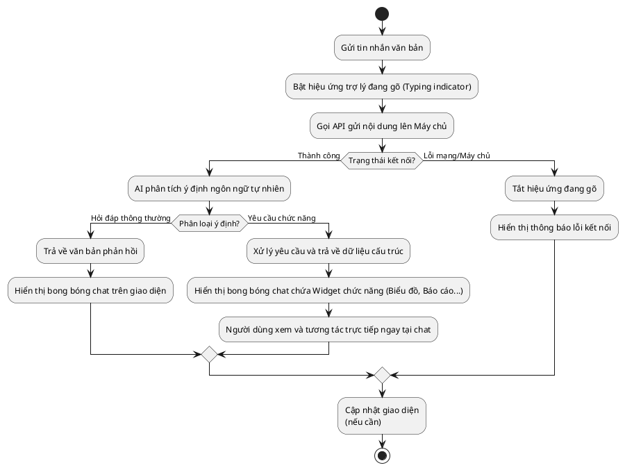
*Hình 3.13: Sơ đồ thuật toán tương tác và xử lý tác vụ trực tiếp của trợ lý ảo MiMo.*

Dựa trên sơ đồ luồng hoạt động, điểm khác biệt tạo nên giá trị cốt lõi của MiMo so với các chatbot thông thường nằm ở năng lực thực thi tác vụ trực tiếp tại khung chat khi hệ thống phát hiện các yêu cầu chức năng mang tính chuyên sâu. Cụ thể, khi nhận được yêu cầu xem báo cáo thống kê, thay vì phải chuyển hướng sang một màn hình chức năng độc lập, hệ thống máy chủ sẽ truy xuất dữ liệu và trả về một bộ kết quả có cấu trúc. Từ đó, ứng dụng di động tiến hành biên dịch bộ dữ liệu này và kết xuất thành một thành phần giao diện động (widget) chứa biểu đồ báo cáo trực quan ngay bên trong bong bóng tin nhắn. Giải pháp thiết kế này biến MiMo thành một kênh điều khiển trung tâm, giúp người dùng khai thác triệt để các dữ liệu phân tích phức tạp mà không phải thao tác qua nhiều lớp giao diện, đảm bảo tính liên tục cho luồng suy nghĩ và mạch giao tiếp.


*Hình 3.14: Giao diện trò chuyện và tính năng trả kết quả trực quan của trợ lý ảo MiMo.*

Như được minh họa thực tế ở hình ảnh phía trên, khu vực bên dưới của màn hình đóng vai trò là thanh công cụ hỗ trợ thao tác nhập liệu văn bản truyền thống. Di chuyển lên phần trung tâm là không gian hiển thị toàn bộ lịch sử hội thoại, được quy chuẩn hóa bằng cấu trúc bong bóng tin nhắn và vận dụng màu sắc tương phản nhằm phân định rạch ròi giữa câu lệnh đầu vào và phản hồi từ hệ thống. Điểm nổi bật nhất của giao diện chính là khả năng nhúng liền mạch các thành phần biểu đồ thống kê vào ngay bên trong nội dung phản hồi, qua đó hiện thực hóa triết lý thiết kế lấy sự tiện lợi làm trung tâm.

##### 3.3.1.6. Chức năng công cụ tài chính

Bên cạnh việc theo dõi thu chi thông thường, ứng dụng cung cấp một hệ sinh thái công cụ tài chính nâng cao nhằm trực tiếp giải quyết các bài toán quản lý dòng tiền phức tạp trong đời sống thực tế. Sơ đồ hoạt động dưới đây mô tả chi tiết luồng xử lý và kiến trúc luân chuyển dữ liệu của bốn trụ cột tính năng cốt lõi trong phân hệ này:

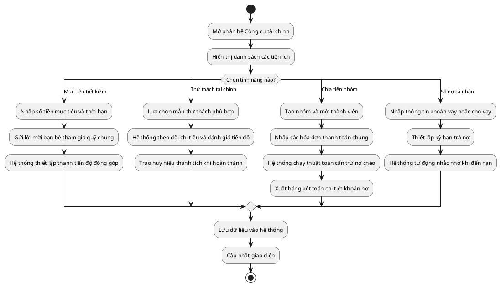
*Hình 3.15: Sơ đồ hoạt động (Activity Diagram) của phân hệ Công cụ tài chính.*

Như sơ đồ đã phác họa, hệ thống gom nhóm bốn tiện ích chuyên sâu vào chung một không gian tương tác đa nhiệm. Đầu tiên là nhánh tính năng mục tiêu tiết kiệm, hỗ trợ người dùng thiết lập quỹ tài chính cá nhân và cho phép tạo quỹ chung để kêu gọi bạn bè đóng góp cho các kế hoạch dài hạn. Kế tiếp là thử thách tài chính, một tiện ích ứng dụng khéo léo phương pháp trò chơi hóa (gamification) nhằm duy trì kỷ luật chi tiêu thông qua các mục tiêu giới hạn định kỳ. Điểm sáng nổi bật nhất trong luồng xử lý này là chức năng chia tiền nhóm (Bill Splitting). Cụ thể, sau khi người dùng khởi tạo nhóm và nhập hóa đơn chung, hệ thống sẽ tự động kích hoạt thuật toán cấn trừ nợ chéo để phân bổ số dư và xuất ra bảng kết toán minh bạch. Cuối cùng, nhánh nghiệp vụ sổ nợ cá nhân đảm nhiệm vai trò ghi chép chi tiết lịch sử vay mượn, đi kèm với cơ chế thông báo nhắc nhở tự động. Dù hoạt động độc lập, tất cả các nhánh nghiệp vụ này đều hội tụ về một quy trình lưu trữ dữ liệu thống nhất, qua đó tối ưu hóa tính tiện dụng và độ ổn định của toàn ứng dụng.

Ngoài bốn trụ cột trên, phân hệ còn tích hợp thêm tiện ích giải trí nhìn lại hành trình (Recap) nhằm chuyển hóa các thống kê khô khan thành chuỗi thẻ sinh động kèm lời bình AI, qua đó khích lệ thói quen ghi chép tài chính của người dùng. Trải nghiệm tương tác thực tế đối với hệ sinh thái công cụ này được mô phỏng chi tiết ở Hình 3.16 dưới đây.


*Hình 3.16: Giao diện công cụ tài chính, chi tiết mục tiêu và chia Bill.*

Như minh họa ở Hình 3.16, hệ sinh thái công cụ tài chính được thể hiện qua ba màn hình tiêu biểu. Từ trái qua phải, màn hình đầu tiên cung cấp cái nhìn tổng quan về danh sách các tiện ích quản lý hiện có. Màn hình thứ hai hiển thị chi tiết tiến độ của một mục tiêu tiết kiệm, sử dụng thanh biểu đồ trực quan để đo lường mức độ hoàn thành. Màn hình cuối cùng là giao diện của tính năng chia tiền nhóm, nơi người dùng nhận ngay bảng kết toán nợ minh bạch nhờ thuật toán cấn trừ chéo. Các giao diện tính năng phụ trợ khác được đính kèm chi tiết trong phần Phụ lục C.

##### 3.3.1.7. Chức năng nâng cấp tài khoản (Premium)

Để đảm bảo nguồn lực duy trì và phát triển dự án trong dài hạn, hệ thống cung cấp tùy chọn nâng cấp lên tài khoản cao cấp. Điểm mấu chốt trong trải nghiệm nâng cấp là quy trình thanh toán tự động hóa được tích hợp trực tiếp thông qua chuẩn mã QR quốc gia (VietQR). Sơ đồ thuật toán dưới đây mô tả chi tiết toàn bộ chu trình xử lý giao dịch, từ bước khởi tạo đơn hàng đến cơ chế đồng bộ trạng thái thanh toán theo thời gian thực:

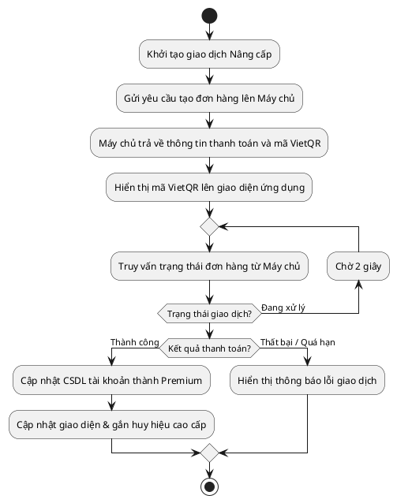
*Hình 3.17: Sơ đồ thuật toán thanh toán nâng cấp tài khoản qua VietQR.*

Dựa trên sơ đồ thuật toán, quy trình nâng cấp được thiết kế nhằm tối ưu hóa trải nghiệm người dùng bằng cách loại bỏ các thao tác chuyển hướng trung gian phức tạp. Thay vì điều hướng sang một cổng thanh toán bên thứ ba, ứng dụng trực tiếp hiển thị mã VietQR kèm theo toàn bộ thông tin chuyển khoản ngay trên màn hình. Song song với quá trình người dùng sử dụng ứng dụng ngân hàng để quét mã, hệ thống chủ động kích hoạt một vòng lặp chạy ngầm, liên tục gửi các truy vấn trạng thái (polling) về máy chủ định kỳ mỗi hai giây. Ngay khi máy chủ xác thực nhận được tiền, hệ thống sẽ lập tức can thiệp, cập nhật cơ sở dữ liệu và làm mới giao diện với huy hiệu cao cấp. Cơ chế xử lý này không chỉ đảm bảo tính bảo mật, toàn vẹn dữ liệu mà còn mang lại cảm giác tiện lợi, mượt mà.

Trải nghiệm nâng cấp từ góc nhìn của người dùng đầu cuối được phác họa chi tiết ở Hình 3.18.


*Hình 3.18: Giao diện quyền lợi gói cao cấp, mã thanh toán VietQR và thông báo thành công.*

Như minh họa ở Hình 3.18, chu trình thao tác được chuẩn hóa qua ba màn hình giao diện. Từ trái qua phải, màn hình đầu tiên trình bày một bảng giá đối chiếu trực quan, nêu bật các đặc quyền của gói trả phí như dỡ bỏ giới hạn tạo ví, vô hiệu hóa hoàn toàn quảng cáo và mở khóa chức năng xuất dữ liệu báo cáo. Màn hình ở giữa hiển thị mã thanh toán VietQR sắc nét, đi kèm nút tải ảnh mã QR và các nút bấm sao chép nhanh thông tin chuyển khoản nhằm triệt tiêu rủi ro nhập liệu sai sót. Cuối cùng, màn hình bên phải xuất hiện thông báo xác nhận giao dịch hoàn tất, đồng thời tài khoản được tự động gắn huy hiệu cao cấp mà không yêu cầu người dùng khởi động lại phần mềm.


##### 3.3.1.8. Chức năng quản lý ví tiền

Nhằm đáp ứng trọn vẹn nhu cầu phân bổ tài chính đa dạng, hệ thống được thiết kế để vượt qua giới hạn của một quỹ tiền duy nhất. Người dùng được trao quyền khởi tạo không giới hạn số lượng ví tiền trực thuộc hai phân loại chính: ví cá nhân (dành cho tiền mặt, tài khoản ngân hàng riêng) và ví chung (phục vụ các quỹ gia đình, nhóm bạn bè). Sơ đồ khối dưới đây mô tả chi tiết luồng thuật toán xử lý vòng đời của một ví tiền từ góc độ ứng dụng di động, bao gồm các nghiệp vụ cốt lõi như thêm mới, tham gia ví chung và gỡ bỏ dữ liệu:

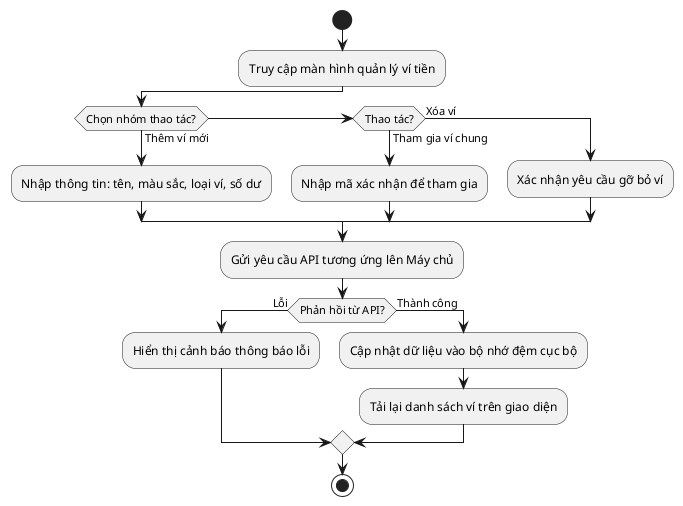
*Hình 3.19: Sơ đồ thuật toán các luồng thêm mới, tham gia và xóa ví tiền.*

Bóc tách chi tiết luồng xử lý trên, hệ thống cung cấp một bộ công cụ quản lý toàn diện đối với cả hai nhóm ví. Điểm nhấn đặc biệt nằm ở cơ chế cá nhân hóa, cho phép gán mã màu sắc độc lập cho từng ví, giúp đẩy nhanh tốc độ nhận diện trực quan khi thao tác. Đối với chức năng tham gia ví chung, hệ thống bảo mật bằng cơ chế xác thực qua mã định danh, đảm bảo chỉ những thành viên được mời mới có quyền truy cập. Sau khi người dùng xác nhận các tác vụ cập nhật hoặc gỡ bỏ, ứng dụng sẽ gọi API đồng bộ hóa với máy chủ. Ngay khi nhận được tín hiệu thành công, thay vì bắt buộc phải tải lại toàn bộ dữ liệu từ đầu, hệ thống lập tức cập nhật trạng thái vào bộ nhớ đệm cục bộ (local cache) và làm mới giao diện, qua đó loại bỏ độ trễ và mang lại trải nghiệm mượt mà. Đáng chú ý, mỗi khi có bất kỳ biến động thu chi nào xảy ra bên trong các ví lẻ, hệ thống sẽ tự động quét qua toàn bộ dữ liệu và chạy thuật toán cộng dồn để đưa ra con số báo cáo tổng tài sản chính xác.

Giao diện tương tác thực tế của người dùng đối với phân hệ quản lý này được minh họa chi tiết ở Hình 3.20.


*Hình 3.20: Giao diện màn hình danh sách ví chung và ví riêng.*

Như minh họa ở Hình 3.20, giao diện được chia thành hai vùng riêng biệt dành cho ví cá nhân và ví chung nhằm triệt tiêu rủi ro nhầm lẫn quỹ tiền. Mỗi ví được trình bày trực quan thành một thẻ thông tin bo góc gọn gàng, mang màu sắc đồng bộ với thiết lập ban đầu và đi kèm số dư khả dụng hiện tại. Lối thiết kế giao diện này giúp người dùng nhanh chóng bao quát được dòng tiền đang phân bổ ở từng nguồn khác nhau, từ đó đưa ra các quyết định chi tiêu hoặc thuyên chuyển tài sản hợp lý.

##### 3.3.1.9. Chức năng quản lý Giao dịch

Mọi khoản thu chi của người dùng đều được lưu vết minh bạch. Để mang lại trải nghiệm xem báo cáo linh hoạt và đỡ nhàm chán, ứng dụng cung cấp đến ba chế độ hiển thị lịch sử giao dịch: chế độ Story (lướt xem nhanh các giao dịch nổi bật như xem tin mạng xã hội), chế độ Gallery (hiển thị giao dịch dưới dạng lưới hình ảnh trực quan), và chế độ Calendar (hiển thị giao dịch theo từng ngày trên lịch âm dương). 

Từ bất kỳ chế độ xem nào, khi cần thiết, người dùng có thể chạm vào một giao dịch để xem thông tin chi tiết. Tại đây, ứng dụng cho phép toàn quyền chỉnh sửa các dữ liệu đã nhập, đặc biệt là việc phân loại lại Danh mục (Category) nếu trước đó AI gán sai, cập nhật số tiền, hoặc sửa đổi lời ghi chú (Story) đi kèm. Nếu giao dịch không còn hợp lệ, người dùng có thể xóa bỏ hoàn toàn.

Quy trình hiển thị và hiệu chỉnh giao dịch từ góc nhìn của ứng dụng di động được mô hình hóa qua Hình 3.21.

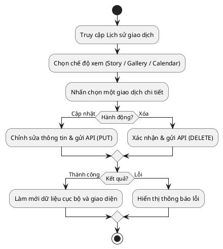
*Hình 3.21: Sơ đồ thuật toán luồng hiển thị, hiệu chỉnh và xóa giao dịch trên ứng dụng.*

Phản chiếu từ Hình 3.21, Hình 3.22 mô phỏng giao diện khi người dùng thao tác trực tiếp với các giao dịch.


*Hình 3.22: Giao diện 3 chế độ xem (Gallery, Calendar) và màn hình xem chi tiết một giao dịch.*

Như minh họa ở Hình 3.22, ứng dụng trình bày dữ liệu rất đa dạng. Chế độ Gallery biến những con số khô khan thành một bộ sưu tập ảnh, còn chế độ Calendar giúp theo dõi sát sao tiến độ thu chi theo ngày. Ở màn hình chi tiết (hình ngoài cùng), các trường thông tin của giao dịch được hiển thị rõ ràng dưới dạng biểu mẫu, cho phép người dùng dễ dàng chạm vào để chọn lại phân loại đúng hoặc sửa lời bình. Mọi thay đổi đều được cập nhật mượt mà nhờ cơ chế bộ nhớ đệm mà không cần tải lại toàn bộ ứng dụng.

##### 3.3.1.10. Chức năng Đăng ký, Đăng nhập và Khôi phục mật khẩu

Là chốt chặn an ninh đầu tiên của ứng dụng, chức năng xác thực người dùng được thiết kế nghiêm ngặt nhằm đảm bảo quyền riêng tư và an toàn tuyệt đối cho dữ liệu tài chính cá nhân. Ứng dụng hỗ trợ đa dạng các phương thức tiếp cận, từ đăng nhập bằng thư điện tử (Email/Password) truyền thống cho đến xác thực nhanh chóng qua tài khoản Google (OAuth2 [22]). Đặc biệt, hệ thống còn tích hợp sẵn tính năng "Quên mật khẩu", cho phép người dùng tự động gửi yêu cầu đặt lại mật khẩu thông qua liên kết xác nhận gửi về email, giúp quá trình khôi phục tài khoản diễn ra liền mạch mà không cần sự can thiệp thủ công từ quản trị viên.

Quá trình kiểm chứng thông tin, xử lý khôi phục mật khẩu và cấp quyền truy cập được thực hiện khép kín thông qua một kiến trúc xác thực kép (Dual Authentication) giữa Ứng dụng di động, Máy chủ trung tâm và hệ thống định danh Firebase Auth [21]. Cụ thể, đối với phương thức đăng nhập bằng Google, Firebase Authentication đóng vai trò là nhà cung cấp danh tính trung gian, chịu trách nhiệm xác minh và cấp mã định danh. Ngược lại, đối với phương thức đăng nhập truyền thống bằng email, Máy chủ trung tâm hoàn toàn tự quản lý luồng xử lý thông qua việc băm mật khẩu (Bcrypt) và đối soát trực tiếp với cơ sở dữ liệu. 

Dù người dùng xác thực danh tính qua Firebase hay qua Máy chủ, bước kiểm duyệt cuối cùng đều được quy về một mối: Máy chủ trung tâm sẽ là nơi duy nhất phát hành một mã thông báo bảo mật thống nhất (Custom JWT) chứa thông tin phân quyền riêng biệt của dự án. Ứng dụng di động sẽ lưu trữ JWT này làm "chìa khóa" để giao tiếp với mọi luồng nghiệp vụ phía sau. Việc thiết kế kiến trúc phân tách này giúp hệ thống vừa tận dụng được sự tiện lợi của đăng nhập mạng xã hội, vừa giữ được toàn quyền kiểm soát định danh và bảo mật cho luồng đăng nhập cốt lõi.

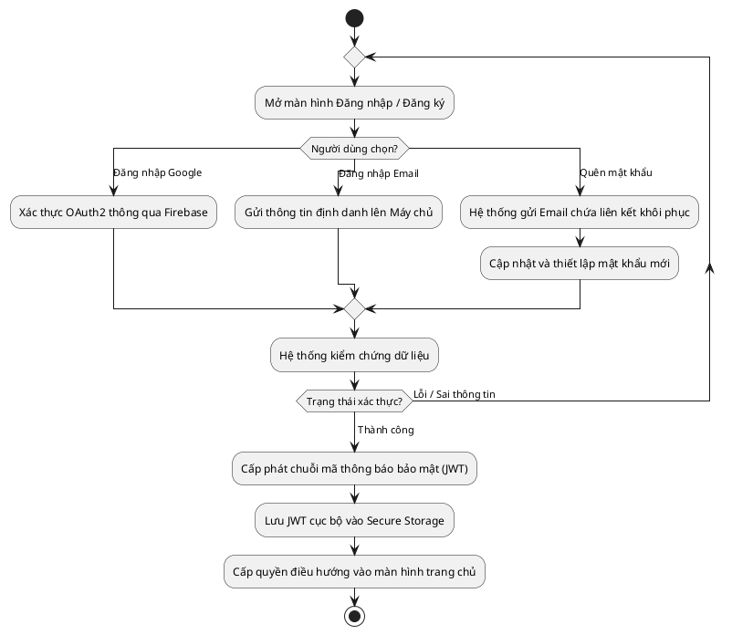
*Hình 3.23: Sơ đồ thuật toán luồng Đăng ký, Đăng nhập và Khôi phục mật khẩu.*

Bám sát quy trình xác thực chặt chẽ đó, giao diện người dùng được thiết kế hướng tới sự tối giản, hiện đại và vô cùng thân thiện, thể hiện qua Hình 3.24.


*Hình 3.24: Các màn hình Đăng nhập, Đăng ký và Quên mật khẩu.*

Như Hình 3.24 minh họa, bố cục màn hình ưu tiên sử dụng các khoảng trắng tinh tế kết hợp với các nút bấm lớn và trường nhập liệu rõ ràng. Việc đặt nút "Đăng nhập với Google" ở vị trí trung tâm giúp những người dùng mới có thể tham gia vào hệ sinh thái ứng dụng chỉ với một cú chạm duy nhất, giảm thiểu tối đa rào cản tiếp cận ban đầu. Nút "Quên mật khẩu" được bố trí gọn gàng ngay dưới ô nhập liệu mật khẩu, đóng vai trò như một phao cứu sinh luôn sẵn sàng hỗ trợ người dùng ngay lập tức khi họ lỡ quên thông tin đăng nhập.
#### 3.3.2. Cổng Quản trị (WebAdmin)
Khác với ứng dụng điện thoại dành cho người dùng cuối, cổng WebAdmin được thiết kế như một trung tâm chỉ huy dành riêng cho đội ngũ quản trị. Trang web này sử dụng công nghệ React để đảm bảo tốc độ tải trang nhanh chóng và khả năng xử lý mượt mà khi phải hiển thị một lượng lớn dữ liệu cùng lúc.

##### 3.3.2.1. Chức năng thống kê tổng quan (Dashboard)

Bảng điều khiển thống kê tổng quan (Dashboard) đóng vai trò là trung tâm chỉ huy chiến lược, giúp ban quản trị giám sát đồng thời hiệu suất của mô hình trí tuệ nhân tạo và dòng tiền doanh thu. Sơ đồ khối dưới đây mô tả luồng thuật toán truy xuất và tổng hợp luồng dữ liệu kép từ hệ thống để kết xuất lên giao diện:

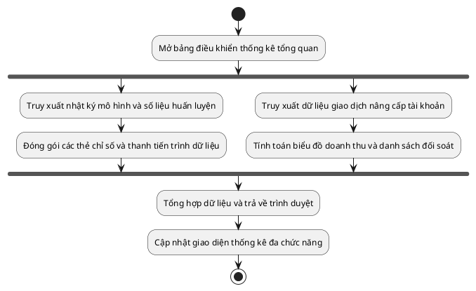
*Hình 3.25: Sơ đồ thuật toán truy xuất dữ liệu thống kê mô hình và doanh thu.*

Bóc tách chi tiết thuật toán xử lý dữ liệu, hệ thống ưu tiên thực thi hai tiến trình truy vấn hoàn toàn song song nhằm giảm tải áp lực cho máy chủ và tối ưu hóa thời gian kết xuất trang. Hướng truy vấn thứ nhất đóng vai trò như một màng lọc kiểm soát chất lượng, tập trung vào việc trích xuất các thông số vận hành cốt lõi của hệ thống trí tuệ nhân tạo. Luồng dữ liệu này được phân tách để hiển thị lên bốn thẻ chỉ số hiệu suất sống còn (bao gồm tổng số lượt trích xuất thành công, độ tin cậy phân loại trung bình, tỷ lệ nhận diện chính xác tham số và tỷ lệ hóa đơn xử lý thành công), kết hợp cùng ba thanh tiến trình cảnh báo ngưỡng sẵn sàng của dữ liệu phục vụ cho công tác tái huấn luyện mô hình. 

Song hành với đó, hướng truy vấn thứ hai phụ trách phân tích trực tiếp cơ sở dữ liệu giao dịch tài chính. Thuật toán sẽ tính toán các biến động dòng tiền để xây dựng nên một biểu đồ doanh thu trực quan trong chu kỳ 30 ngày gần nhất, đi kèm với đó là bảng đối soát chi tiết từng luồng thanh toán nâng cấp tài khoản. Không chỉ giới hạn ở việc cung cấp các báo cáo mang tính chất quan sát tĩnh, bảng điều khiển còn cấp cho quản trị viên đặc quyền can thiệp trực tiếp vào lịch sử giao dịch. Nhờ đó, trong những trường hợp cá biệt khi mạng lưới ngân hàng phản hồi chậm trễ, người quản lý hoàn toàn có thể chủ động tra cứu mã đơn hàng và kích hoạt gói cao cấp thủ công nhằm bảo vệ tuyệt đối trải nghiệm của người dùng.

Sự kết hợp đồng điệu giữa hai luồng dữ liệu giám sát kỹ thuật và báo cáo kinh doanh này được thể hiện rõ nét qua giao diện ở Hình 3.26.


*Hình 3.26: Giao diện bảng điều khiển theo dõi hiệu năng hệ thống, ngưỡng dữ liệu và lịch sử doanh thu.*

Như minh họa ở Hình 3.26, màn hình được phân chia bố cục một cách khoa học nhằm truyền tải lượng thông tin lớn nhưng không gây rối mắt. Nửa không gian phía trên dành riêng cho việc chẩn đoán sức khỏe mô hình AI thông qua các thẻ chỉ số và thanh tiến trình trực quan. Nửa không gian phía dưới tập trung phác họa bức tranh tài chính với biểu đồ xu hướng doanh thu và bảng đối soát thanh toán chi tiết. Lối thiết kế gộp thông minh này giúp người quản lý bao quát được trọn vẹn tình hình của toàn dự án trên một trang hiển thị duy nhất.

##### 3.3.2.2. Chức năng quản lý người dùng

Chức năng quản lý người dùng đóng vai trò nòng cốt trong việc duy trì trật tự hệ thống và thấu hiểu hành vi của tệp khách hàng. Giao diện của phân hệ này được tổ chức theo cấu trúc danh sách, tích hợp với dải thẻ thống kê ở vị trí cao nhất nhằm đối soát nhanh các chỉ số trọng yếu (tổng lượng tài khoản, tỷ lệ phương thức xác thực, và số lượng gói cao cấp). Để kiểm soát tập dữ liệu lớn, hệ thống trang bị thanh tìm kiếm kết hợp bộ lọc đa chiều, cho phép phân nhóm chính xác người dùng theo độ tuổi hoặc ngành nghề. Nhằm bảo mật thông tin nội bộ, thuật toán hiển thị tự động che khuất toàn bộ tài khoản mang đặc quyền quản trị.

Xét trên phương diện kiểm soát an ninh, tài khoản quản trị được cấp quyền can thiệp sâu vào vòng đời của người dùng, điển hình là nghiệp vụ vô hiệu hóa hoặc khôi phục quyền truy cập. Cơ chế xử lý bảo mật và giải quyết khiếu nại này được mô hình hóa chi tiết thông qua sơ đồ hoạt động tại Hình 3.27.

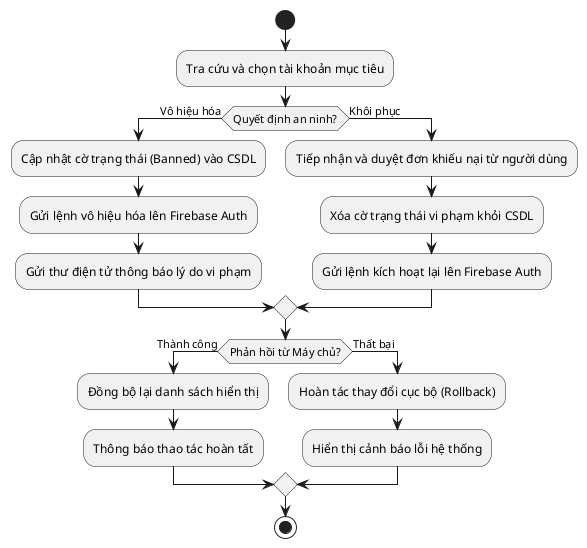
*Hình 3.27: Sơ đồ thuật toán luồng vô hiệu hóa, duyệt khiếu nại và khôi phục tài khoản.*

Bóc tách thuật toán trên, khi phát hiện tài khoản có hành vi gian lận, hệ thống sẽ thực thi lệnh khóa bằng cách can thiệp thẳng vào cơ sở dữ liệu phân tán (Firebase Auth), lập tức tước bỏ mọi quyền truy cập hiện hành. Đồng thời, một hệ thống tự động sẽ soạn thảo và gửi thư điện tử (email) đến hộp thư của người vi phạm để thông báo rõ lý do hình phạt. Ngược lại, tính năng khôi phục cung cấp một cơ chế bảo vệ quyền lợi chính đáng thông qua quy trình xét duyệt. Khi người dùng gửi đơn khiếu nại, ban quản trị sẽ tiến hành xác minh tính hợp lệ, gỡ bỏ cờ trạng thái vi phạm và tái kích hoạt tài khoản. Bất kể thao tác nào được thực thi, hệ thống đều áp dụng thuật toán hoàn tác (rollback) dự phòng chặt chẽ nhằm bảo vệ tính nhất quán của dữ liệu khi xảy ra sự cố mạng.

Giao diện thực tế của chức năng quản lý và kiểm duyệt người dùng được trình bày ở Hình 3.28, thể hiện sự bố trí khoa học giữa các trường thông tin và thanh công cụ.


*Hình 3.28: Màn hình danh sách người dùng với dải thẻ thống kê và bộ lọc đa chiều.*

Như minh họa tại Hình 3.28, giao diện được bố cục thành ba vùng chính: dải thẻ thống kê tổng quan ở trên cùng, bộ công cụ tra cứu đa chiều ở giữa, và bảng dữ liệu chi tiết kèm các nút thao tác vô hiệu hóa hoặc khôi phục tài khoản ở dưới cùng nhằm tối ưu hóa quá trình quản trị.

##### 3.3.2.3. Chức năng quản trị và huấn luyện mô hình ngôn ngữ tự nhiên (NLU Ops)

Đứng trước thách thức hệ thống không thể lập tức am hiểu toàn bộ từ vựng mới hoặc phương ngữ địa phương trong giai đoạn đầu triển khai, kiến trúc phần mềm đã tích hợp một phân hệ chuyên trách nhằm giám sát và tinh chỉnh liên tục bộ máy trí tuệ nhân tạo. Phân hệ NLU Ops được thiết kế xoay quanh ba trụ cột nghiệp vụ cốt lõi, bảo đảm mang lại tính linh hoạt và độ chuẩn xác tối đa cho khâu vận hành.

Trụ cột thứ nhất là cơ chế cá nhân hóa danh mục (Layer 1 Overrides). Thông qua giao diện quản trị, người điều hành được cấp quyền thiết lập các quy tắc ưu tiên tuyệt đối dựa trên mã định danh người dùng (User ID) và từ khóa mục tiêu. Các quy tắc này có khả năng ghi đè trực tiếp lên phán đoán của thuật toán học máy, giúp hệ thống giải quyết triệt để những trường hợp từ lóng đặc thù hoặc thói quen ghi chú cá biệt mà không cần phải tiêu tốn tài nguyên chờ đợi quá trình đào tạo lại toàn hệ thống.

Trụ cột thứ hai tập trung vào khả năng quản trị cấu trúc suy luận AI hai tầng độc lập. Hệ thống phân rã luồng xử lý ngôn ngữ tự nhiên thành hai giai đoạn: Tầng 1 đảm nhiệm nhận diện ý định và Tầng 2 chuyên biệt cho việc phân loại danh mục. Điểm đột phá về mặt kiến trúc nằm ở cơ chế cho phép quản trị viên tự do phối hợp và chuyển đổi linh hoạt các bộ máy suy luận (backend) cho từng tầng riêng biệt. Lấy ví dụ, hệ thống hoàn toàn có thể sử dụng kiến trúc PhoBERT cho Tầng 1 và mô hình LLM cho Tầng 2. Toàn bộ thao tác cấu hình chéo này được thực thi ngay trên giao diện trực quan và áp dụng cơ chế nạp nóng (hot-reload) vào bộ nhớ, triệt tiêu hoàn toàn rủi ro gián đoạn dịch vụ máy chủ.

Trụ cột thứ ba chịu trách nhiệm quản lý toàn bộ vòng đời tái huấn luyện mô hình trên quy mô toàn hệ thống. Để bảo vệ chất lượng đầu ra, tiến trình đào tạo lại bị ràng buộc bởi một ngưỡng điều kiện kỹ thuật: quá trình này chỉ được phép kích hoạt khi cơ sở dữ liệu đã tích lũy đủ số lượng dữ liệu theo ngưỡng cấu hình thử nghiệm (ví dụ đề xuất: 10.000 bản ghi giao dịch và 1.000 ảnh hóa đơn). Khi tiêu chí này được thỏa mãn, quản trị viên có thể kết xuất dữ liệu nhằm tinh chỉnh các mô hình ngôn ngữ lớn (LLM fine-tuning) hoặc trực tiếp khởi chạy tiến trình huấn luyện cục bộ. Luồng công việc này vận hành hoàn toàn dưới nền thông qua sáu giai đoạn tự động: chuẩn bị, làm sạch, huấn luyện, đánh giá, đồng bộ và thành công. Mô hình sau khi hoàn tất sẽ được hệ thống lưu trữ tại phân vùng ứng viên (Candidate). Dựa trên đối sánh các chỉ số đo lường hiệu năng như độ chính xác (Accuracy) hay điểm F1 (F1-score), thao tác phê duyệt sẽ lập tức hoán đổi vị trí mô hình; ngược lại, hệ thống luôn sẵn sàng một lệnh khôi phục (rollback) để bảo vệ tính toàn vẹn của nền tảng.

Sơ đồ ở Hình 3.29 khắc họa quy trình tổng thể của cả ba phân luồng quản trị nói trên.

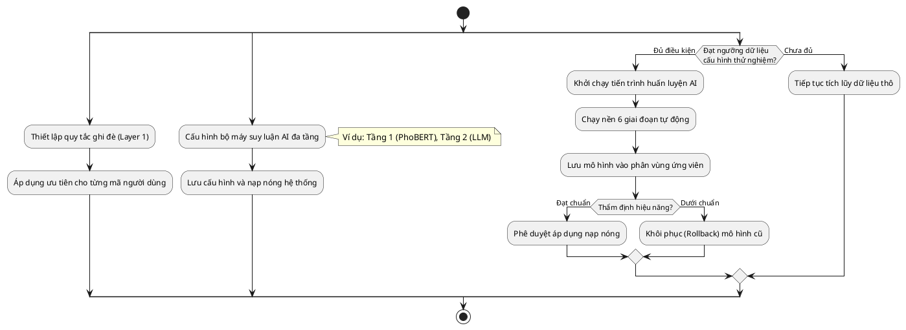
*Hình 3.29: Sơ đồ thuật toán các luồng quản trị quy tắc tĩnh, thay đổi kiến trúc suy luận và tái huấn luyện mô hình AI.*

Giao diện thực tế của phân hệ NLU Ops được tổ chức thành các thẻ chức năng riêng biệt nhằm tối ưu hóa trải nghiệm điều hành, minh họa chi tiết tại Hình 3.30 và Hình 3.31.


*Hình 3.30: Màn hình quản trị danh sách quy tắc ghi đè kết quả phân loại (Layer 1 Overrides).*


*Hình 3.31: Màn hình cấu hình bộ máy suy luận đa tầng và bảng điều khiển tiến trình tái huấn luyện học máy.*

Phân tích Hình 3.30 và 3.31, phân hệ NLU Ops được tổ chức thành hai luồng thao tác cốt lõi. Thẻ cá nhân hóa hỗ trợ can thiệp nhanh vào kết quả phân loại bằng cách gán từ khóa ưu tiên cho từng người dùng. Trong khi đó, thẻ quản trị mô hình bao quát toàn bộ vòng đời học máy theo chiều dọc: từ việc linh hoạt chuyển đổi kiến trúc đa tầng ở trên cùng, khởi chạy tiến trình huấn luyện ở vùng trung tâm, cho đến đối sánh hiệu năng và phê duyệt nạp nóng phiên bản mới tại phân khu dưới cùng.

##### 3.3.2.4. Chức năng quản trị và tái huấn luyện mô hình thị giác máy tính

Bên cạnh luồng xử lý văn bản, việc bóc tách thông tin từ các bức ảnh hóa đơn mờ nhòe, nhăn nheo hoặc thiếu sáng luôn là một bài toán hóc búa đối với công nghệ học máy. Thông thường, nền tảng phải chuyển tiếp hình ảnh ra một máy chủ bên ngoài và sử dụng các phần mềm gán nhãn phức tạp của bên thứ ba, tiềm ẩn rủi ro nghiêm trọng về việc rò rỉ thông tin mua sắm nhạy cảm. Nhằm khắc phục triệt để lỗ hổng bảo mật này, hệ thống đã được thiết kế tích hợp một phân hệ thị giác máy tính khép kín, vận hành hoàn toàn trên cổng quản trị trung tâm. Kiến trúc thuật toán của quá trình này được mô hình hóa tại Hình 3.32.

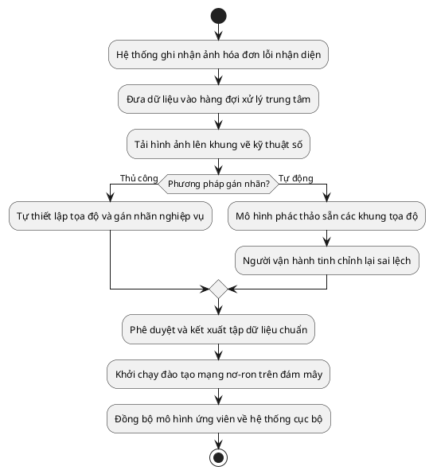
*Hình 3.32: Sơ đồ thuật toán luồng tiền xử lý, gán nhãn dữ liệu và tái huấn luyện mô hình thị giác.*

Phân tích Hình 3.32, luồng nghiệp vụ bắt đầu bằng việc giám sát một hàng đợi chuyên biệt chứa các bức ảnh hóa đơn bị hệ thống phân tích lỗi hoặc có ngưỡng tin cậy nhận diện ở mức thấp. Thay vì thao tác thủ công, ban quản trị có thể kích hoạt tính năng gán nhãn tự động để nền tảng triệu gọi mô hình suy luận đa phương thức phác thảo trước các khung tọa độ bao quanh vùng văn bản. Người vận hành lúc này chỉ đóng vai trò kiểm duyệt, tinh chỉnh lại những vị trí nhận diện sai lệch trên khung vẽ kỹ thuật số trước khi tiến hành phê duyệt dữ liệu.


*Hình 3.33: Giao diện tương tác dùng để khoanh vùng nhận diện trên ảnh hóa đơn và quản lý vòng đời mô hình.*

Điểm đột phá của phân hệ này không chỉ dừng lại ở khâu chuẩn bị dữ liệu mà còn bao gồm một cơ chế quản lý vòng đời mô hình thị giác toàn diện, được minh họa một phần tại Hình 3.33. Khi lượng hóa đơn chuẩn xác đạt đủ quy mô, hệ thống cho phép kết xuất dữ liệu và kích hoạt quá trình tái huấn luyện mạng nơ-ron đa phương thức trực tiếp trên cụm máy chủ đám mây hiệu năng cao. Sau khi hoàn tất, mô hình mới sẽ được lưu trữ dưới dạng ứng viên chờ thẩm định. Ban quản trị có toàn quyền đồng bộ trọng số từ đám mây về máy chủ cục bộ, phê duyệt đưa mô hình ứng viên vào vận hành chính thức, hoặc khôi phục lại phiên bản cũ nếu phát sinh sự cố, qua đó bảo đảm luồng công việc học máy diễn ra liên tục và an toàn tuyệt đối.

##### 3.3.2.5. Chức năng quản lý Prompt trợ lý ảo

Để tối ưu hóa mức độ linh hoạt của trợ lý ảo, thay vì gắn cứng các kịch bản giao tiếp vào mã nguồn tĩnh, hệ thống cung cấp một phân hệ chuyên dụng nhằm quản lý tập trung toàn bộ cấu trúc Prompt. Dữ liệu cấu hình được lưu trữ và đồng bộ hóa trực tiếp thông qua tệp tin `llm_rules.json`. Tại không gian này, quản trị viên có quyền kiểm soát toàn diện các kịch bản lõi của trí tuệ nhân tạo, trải dài từ bộ quy tắc phân loại ý định, trích xuất thông tin giao dịch, cho đến xử lý câu lệnh và duy trì hội thoại tự nhiên. Hơn thế nữa, người vận hành có thể chủ động chuyển đổi văn phong của trợ lý thông qua bốn trạng thái tâm lý đặc trưng, kết hợp cùng các thanh công cụ hiệu chỉnh tham số sinh ngôn ngữ nhằm tinh chỉnh đồng thời độ chính xác và sắc thái biểu cảm của mô hình học máy.

Điểm nổi bật của phân hệ là việc tích hợp một môi trường kiểm thử hộp cát cô lập, cho phép chuyên viên vận hành can thiệp sâu vào các tham số đầu vào. Cụ thể, người dùng có thể giả lập luồng trò chuyện thông thường hoặc thao tác qua phím tắt ghi chép nhanh, đồng thời thử nghiệm cơ chế ép buộc LLM định tuyến theo các nhánh quy tắc chuyên biệt. Ngay sau khi nhập câu lệnh thử nghiệm, hệ thống sẽ kết xuất phản hồi tức thời, đi kèm các chỉ số kỹ thuật chi tiết về độ trễ xử lý và bộ quy tắc Prompt vừa được áp dụng. Cơ chế kiểm chứng khép kín này đóng vai trò then chốt trong việc đánh giá chất lượng luồng NLU mà không gây tác động đến cơ sở dữ liệu thực, trước khi chính thức phát hành bản cập nhật cấu hình xuống thiết bị di động như được mô hình hóa tại Hình 3.34.

```plantuml
@startuml
start
repeat
  :Chọn nhân cách và thiết lập tham số sinh ngôn ngữ;
  :Cấu hình ngữ cảnh gọi lệnh và ý định ép buộc;
  :Nhập câu thoại mẫu vào môi trường kiểm thử hộp cát;
  :Hệ thống đối chiếu quy tắc Prompt và triệu gọi mô hình;
repeat while (Đánh giá phản hồi và quy tắc định tuyến?) is (Chưa đạt)
->Đạt yêu cầu;
:Lưu trữ cấu hình Prompt và phát hành đồng loạt;
:Ứng dụng di động tự động đồng bộ tham số mới;
stop
@enduml
```
*Hình 3.34: Sơ đồ thuật toán luồng kiểm thử đa ngữ cảnh và triển khai cấu hình Prompt.*


*Hình 3.35: Giao diện quản lý Prompt và môi trường kiểm thử đa ngữ cảnh khép kín.*

Như minh họa tại Hình 3.35, giao diện làm việc được phân bổ một cách trực quan. Khu vực bên trái tập trung hiển thị trình soạn thảo văn bản Prompt và khung kiểm thử phản hồi thời gian thực, trong khi cột bên phải được dành riêng để quản lý các thanh trượt tham số sinh ngôn ngữ và lựa chọn cấu hình máy chủ trí tuệ nhân tạo.


---

### 3.4. Thiết kế Máy chủ Xử lý Trung tâm (Backend Node.js)

Máy chủ trung tâm được xây dựng trên nền tảng Node.js, đóng vai trò như một trạm trung chuyển và xử lý logic nghiệp vụ chính của toàn hệ thống. Dưới đây là sơ đồ kiến trúc chi tiết của Tầng 2 (Hình 3.4a):

```plantuml
@startuml
skinparam componentStyle rectangle
skinparam handwritten false
skinparam packageStyle rectangle

package "Tầng 2: Backend Layer (Node.js)" {
  [Cổng kết nối\n(Express HTTP / WebSocket)] as gateway
  [Xác thực & Bảo mật\n(Firebase Admin JWT)] as auth
  [Lõi Nghiệp vụ Tài chính\n(Quản lý Ví, Giao dịch)] as core
  [Hệ thống tự động hóa\n(Cron Job / Triggers)] as automation
  [Quản lý trạng thái AI\n(Dialog State)] as state
  
  gateway --> auth
  gateway --> core
  gateway --> state
  automation --> core
}
@enduml
```
*Hình 3.4a: Sơ đồ kiến trúc chi tiết tầng máy chủ xử lý trung tâm (Tầng 2).*

#### 3.4.1. Cổng giao tiếp trung gian và cơ chế phân phối hàm chức năng

Để đảm bảo tính toàn vẹn cho hệ thống và phân tải nghiệp vụ hiệu quả, máy chủ trung tâm được kiến trúc theo chuẩn thiết kế cổng giao tiếp tập trung dựa trên bộ khung Express.js. Ở tuyến phòng thủ ngoài cùng, mọi luồng yêu cầu phát lệnh từ thiết bị di động đều bắt buộc đi qua một chuỗi hệ thống phần mềm trung gian. Đầu tiên, bộ lọc kiểm soát tần suất truy cập sẽ đánh giá lưu lượng để ngăn chặn nguy cơ tấn công từ chối dịch vụ. Kế tiếp, hệ thống tích hợp nền tảng Firebase kết hợp cùng bộ giải mã chuẩn xác để xác minh mã thông báo định danh của người dùng một cách an toàn.

Điểm mấu chốt của kiến trúc này nằm ở cơ chế định tuyến thông minh. Sau khi vượt qua các rào chắn bảo mật toàn cục, bộ định tuyến trung tâm sẽ đóng vai trò như một tổng đài điều phối, tự động phân phối yêu cầu về đúng các phân hệ nghiệp vụ tương ứng. Tuy nhiên, trước khi tiến vào lõi xử lý, toàn bộ dữ liệu đầu vào tại mỗi nhánh định tuyến sẽ tiếp tục trải qua bước kiểm duyệt cấu trúc khắt khe thông qua thư viện đối sánh Zod. Việc đặt lớp xác nhận Zod ngay tại cửa ngõ của từng phân hệ nghiệp vụ (ví dụ: cụm quản lý giao dịch, thị giác máy tính, xử lý ngôn ngữ tự nhiên) giúp loại bỏ triệt để các gói tin rác hoặc sai định dạng, bảo vệ an toàn tuyệt đối cho cơ sở dữ liệu.

```plantuml
@startuml
skinparam componentStyle rectangle
skinparam handwritten false

actor "Thiết bị di động" as client

package "Cổng giao tiếp trung gian (Express.js)" {
  component "Giới hạn truy cập\n(Rate Limit)" as ratelimit
  component "Xác thực danh tính\n(Firebase JWT)" as auth
  component "Bộ định tuyến API\n(Express Router)" as router
  component "Kiểm duyệt dữ liệu\n(Zod Validator)" as zod
}

package "Các phân hệ nghiệp vụ" {
  component "Quản lý Giao dịch\n(Transactions API)" as record
  component "Thị giác máy tính\n(Bill OCR API)" as bill
  component "Trợ lý Trò chuyện\n(Chat API)" as chat
  component "Quản lý Ngân sách\n(Budgets API)" as budget
  component "Các phân hệ khác\n(User, Goal, ...)" as others
}

client --> ratelimit : Gửi yêu cầu HTTP
ratelimit --> auth : Chuyển tiếp nếu hợp lệ
auth --> router : Mã thông báo hợp lệ
router --> zod : Phân phối theo URL

zod --> record : /transactions
zod --> bill : /ai/expense/from-bill
zod --> chat : /chat
zod --> budget : /budgets
zod --> others : /...
@enduml
```
*Hình 3.37: Sơ đồ kiến trúc luồng kiểm duyệt bảo mật và phân phối hàm chức năng trên máy chủ.*

Như được mô phỏng tại Hình 3.37, quy trình phân phối và kiểm duyệt được thiết kế theo luồng xử lý tuần tự nhưng linh hoạt, giúp bóc tách rõ ràng các lớp bảo mật trước khi cho phép dữ liệu tiến vào các cụm lõi nghiệp vụ, qua đó đảm bảo thời gian phản hồi luôn duy trì ở mức phần nghìn giây.

#### 3.4.2. Lõi nghiệp vụ tài chính và xử lý giao dịch

Phân hệ nghiệp vụ tài chính đóng vai trò tiếp nhận, đối soát và lưu trữ toàn bộ các luồng giao dịch thu chi phát sinh từ ứng dụng di động. Để đảm bảo tính toàn vẹn của dữ liệu trước khi đưa vào lưu trữ, một cơ chế chặn lọc thông minh kết hợp cùng giao diện cảnh báo trực quan đã được xây dựng như thể hiện tại Hình 3.38.

|  |  |
|:---:|:---:|

*Hình 3.38: Giao diện Trang chủ với thẻ cảnh báo và danh sách giao dịch nháp đang chờ bổ sung số tiền.*

Khi tiếp nhận dữ liệu mới, máy chủ Node.js sẽ ngay lập tức tiến hành bước kiểm duyệt tính toàn vẹn. Theo quy tắc cốt lõi của hệ thống, một giao dịch chỉ được chấp thuận xử lý khi cung cấp đầy đủ cả số tiền và tên hạng mục. Tuy nhiên, trong môi trường vận hành thực tế, cụm trí tuệ nhân tạo đôi khi không thể trích xuất trọn vẹn thông tin do người dùng nhập các câu lệnh quá vắn tắt. Lúc này, thay vì ủy thác cho mô hình học máy tự động phỏng đoán và gây ra rủi ro sai lệch tài chính, máy chủ sẽ lập tức chặn luồng xử lý hiện tại và lưu trữ giao dịch dưới dạng bản nháp. Ngay sau đó, một thẻ thông báo sẽ xuất hiện trên màn hình Trang chủ để định hướng người dùng chủ động điền bù số tiền còn thiếu. Phương pháp phản hồi khuyết dữ liệu này giúp luồng tương tác diễn ra hết sức tự nhiên, đồng thời bảo vệ tuyệt đối sự trong sạch của cơ sở dữ liệu.

Bước vào giai đoạn cuối cùng, chỉ khi mọi thông tin đã được xác minh đầy đủ, máy chủ mới bắt đầu tính toán lại số dư. Nhằm đảm bảo độ chuẩn xác tối đa trong nghiệp vụ kế toán, tác vụ cộng trừ dòng tiền không bao giờ được giao phó cho các mạng nơ-ron nhân tạo. Khối hệ thống backend sử dụng thư viện `node-postgres` để khởi tạo các lệnh truy vấn an toàn trực tiếp trên hệ quản trị cơ sở dữ liệu phân tán CockroachDB. Các bản ghi sẽ được cập nhật đồng thời vào bảng quản lý giao dịch và bảng ví tiền thông qua cơ chế khép kín nhằm loại trừ triệt để nguy cơ thất thoát dữ liệu do nghẽn mạng. Việc thiết kế tách bạch hoàn toàn luồng suy luận của trí tuệ nhân tạo ra khỏi logic toán học nền tảng là một quyết định kiến trúc then chốt, giúp ứng dụng duy trì sự ổn định và miễn nhiễm hoàn toàn với hiện tượng sinh ảo giác thuật toán.

#### 3.4.3. Hệ thống tự động hóa và thông báo thời gian thực

Nhằm tối ưu hóa trải nghiệm người dùng và giảm thiểu thao tác thủ công, hệ thống được trang bị cơ chế tự động hóa và phát thông báo đẩy theo thời gian thực. Phân hệ tự động hóa bao gồm ba tiến trình nòng cốt được vận hành song song trên nền tảng máy chủ. Thứ nhất là hệ thống đối soát ngân sách: ngay sau mỗi giao dịch, máy chủ tự động so sánh số dư với mục tiêu tài chính trong tháng. Nếu phát hiện lạm chi, hệ thống lập tức kích hoạt luồng cảnh báo khẩn cấp. Thứ hai là tiến trình ngầm sử dụng thư viện `node-cron`, chịu trách nhiệm rà soát dữ liệu định kỳ và tự động nhắc nhở người dùng ghi chép chi tiêu nhằm duy trì kỷ luật tài chính. Cuối cùng là cơ chế nhận diện thanh toán tự động thông qua giao thức Webhook kết nối liên thông với hệ thống ngân hàng SePay. Khi phát sinh giao dịch nâng cấp tài khoản, máy chủ tự động đối chiếu chữ ký bảo mật HMAC-SHA256 để chống tin tặc giả mạo và tiến hành mở khóa tính năng cao cấp.

Điểm đột phá của kiến trúc tự động hóa này nằm ở phương thức truyền tải thông điệp thông qua cơ chế dự phòng kép hay Hybrid Fallback, kết hợp đồng thời giữa thông báo nội bộ hay Local Notification và thông báo đẩy hay Push Notification. Ở điều kiện lý tưởng khi ứng dụng đang mở, hệ thống tận dụng cổng kết nối WebSocket thời gian thực để kích hoạt thông báo nội bộ ngay trên thiết bị, giúp tối ưu hóa tối đa tốc độ phản hồi. Đồng thời, nhằm giải quyết triệt để rủi ro mất kết nối khi người dùng đã tắt hẳn ứng dụng, máy chủ luôn phát đi song song một luồng thông điệp điều phối thông qua nền tảng Firebase Cloud Messaging hay FCM.

Xét về mặt mã nguồn lõi tại máy chủ, hệ thống tích hợp thư viện `firebase-admin` để thiết lập kết nối an toàn với máy chủ Google. Bất cứ khi nào các sự kiện quan trọng như lạm chi hoặc thanh toán ngân hàng thành công được ghi nhận, mã nguồn sẽ song song gọi hàm truyền tải dữ liệu tới chính xác mã định danh của thiết bị. Phương pháp thiết kế hướng sự kiện kép này đảm bảo mọi cảnh báo đều được phát đi tức thời và hiển thị ổn định trong mọi hoàn cảnh. Sơ đồ luồng xử lý thông báo theo cơ chế dự phòng kép được mô tả chi tiết tại Hình 3.39.

```mermaid
graph TD
    classDef node fill:#f9f9f9,stroke:#333,stroke-width:1px;
    classDef highlight fill:#e8f4f8,stroke:#3498db,stroke-width:2px;

    A([Phát sinh sự kiện nghiệp vụ]) ::: node
    B[Máy chủ Node.js] ::: highlight
    
    C[Thư viện Firebase Admin] ::: node
    D[Cổng kết nối WebSocket] ::: node
    
    E((Máy chủ đám mây Google FCM)) ::: node
    
    F[Ứng dụng đang hoạt động] ::: node
    G[Ứng dụng đang tắt ngầm] ::: node
    
    H(((Hiển thị thông báo trên thiết bị))) ::: highlight

    A --> B
    B -- Gọi hàm API --> C
    B -- Gửi tín hiệu --> D
    
    C -- Giao thức HTTP v1 --> E
    E -- Push Notification --> G
    
    D -- Tín hiệu thời gian thực --> F
    
    G -- Dịch vụ hệ điều hành --> H
    F -- Thư viện Local Notification --> H
```

*Hình 3.39: Sơ đồ luồng xử lý thông báo theo cơ chế dự phòng kép.*

Nhờ vào kiến trúc truyền tải vững chắc trên, người dùng sẽ luôn nhận được các cảnh báo tức thời một cách chính xác, mang lại trải nghiệm liền mạch và chuyên nghiệp tối đa. Giao diện tiếp nhận thông báo trên thiết bị di động được minh họa cụ thể tại Hình 3.40.

|  |  |
|:---:|:---:|

*Hình 3.40: Giao diện thiết bị di động hiển thị thông báo đẩy thời gian thực từ hệ thống máy chủ.*

---

### 3.5. Thiết kế Tầng Trí tuệ nhân tạo

Tầng Trí tuệ nhân tạo hoạt động độc lập như một bộ não chuyên xử lý ngôn ngữ và nhận diện hình ảnh. Do các mô hình học sâu đòi hỏi khối lượng tính toán lớn, phân hệ này được xây dựng tách biệt bằng bộ khung FastAPI và triển khai trên nền tảng đám mây Modal Serverless GPU. Thiết kế vi dịch vụ này giúp máy chủ Node.js không bị quá tải, đồng thời tận dụng tối đa sức mạnh của card đồ họa để xử lý dữ liệu với tốc độ cao.

Dưới đây là sơ đồ chi tiết kiến trúc của Tầng 3 (Hình 3.17a):

```plantuml
@startuml
skinparam componentStyle rectangle
skinparam handwritten false
skinparam packageStyle rectangle

package "Tầng 3: AI Layer (FastAPI)" {
  [Cổng giao tiếp\n(FastAPI HTTP)] as gateway
  
  package "Phân hệ NLU" {
    [Bộ định tuyến Ý định\n(Rule Engine / TF-IDF)] as nlu_router
    [Mô hình Ngôn ngữ Lớn\n(Qwen 2.5 + LoRA)] as nlu_llm
    nlu_router --> nlu_llm
  }
  
  package "Phân hệ OCR" {
    [Phát hiện Chữ\n(DBNet)] as ocr_dbnet
    [Nhận dạng Ký tự\n(VietOCR)] as ocr_vietocr
    [Phân tích Bố cục\n(LayoutLMv3)] as ocr_layout
    ocr_dbnet --> ocr_vietocr
    ocr_vietocr --> ocr_layout
  }
  
  gateway --> nlu_router
  gateway --> ocr_dbnet
}
@enduml
```
*Hình 3.17a: Sơ đồ kiến trúc chi tiết tầng xử lý AI (Tầng 3).*

#### 3.5.1. Phân hệ xử lý ngôn ngữ tự nhiên hai tầng (NLU)

Phân hệ này đảm nhận nhiệm vụ đọc hiểu những câu nói tiếng Việt tự nhiên của người dùng, từ đó xác định ý định và bóc tách các thông số để lưu vào sổ chi tiêu hoặc thực thi lệnh điều khiển. Để hệ thống có thể hiểu được văn phong đa dạng, kho ngữ liệu huấn luyện được xây dựng chuyên biệt với quy mô lên tới 385.205 mẫu câu đã qua tăng cường dữ liệu. Tập dữ liệu phân bổ thành ba nhóm chính: dữ liệu ghi chép chi tiêu chiếm 49.6%, lệnh điều khiển chiếm 32.9% và hội thoại thông thường chiếm 17.5%.

```plantuml
@startuml
start
:Nhận tin nhắn người dùng và ngữ cảnh gọi lệnh;
if (Ngữ cảnh gọi?) then (Phím tắt ghi chép)
  :Bỏ qua tầng 1, gán nhãn ý định là Record;
else (Trò chuyện tự do)
  :Tầng 1: Phân loại ý định bằng Mô hình AI;
endif
:Trích xuất quy tắc tầng 2 từ hệ thống;
switch (Nhãn ý định)
case (Record)
  :Nạp bộ quy tắc bóc tách chi tiêu;
  :Tầng 2: Gọi mô hình bóc tách được cấu hình\n(TF-IDF / PhoBERT / LLM);
case (Action)
  :Nạp bộ quy tắc lệnh điều khiển;
  :Tầng 2: Gọi Mô hình ngôn ngữ lớn (LLM);
case (Chitchat)
  :Nạp bộ quy tắc trò chuyện xã giao;
  :Tầng 2: Gọi Mô hình ngôn ngữ lớn (LLM);
endswitch
:Trả về cấu trúc JSON gồm thông số và câu trả lời;
stop
@enduml
```
*Hình 3.18: Sơ đồ kiến trúc xử lý ngôn ngữ tự nhiên hai tầng.*

Như minh họa tại Hình 3.18, hệ thống được thiết kế theo luồng xử lý hai tầng phân tách rõ ràng nhằm cân bằng giữa tốc độ và độ chính xác, khác biệt hoàn toàn với kiến trúc đơn khối truyền thống. Tầng thứ nhất đóng vai trò điều phối siêu tốc, sử dụng một trong ba mô hình (TF-IDF, PhoBERT, hoặc Qwen 2.5) dựa trên thiết lập của quản trị viên để phân loại ý định cốt lõi của câu nói. Ngay sau khi tầng thứ nhất xác định xong hướng đi, luồng dữ liệu được rẽ nhánh thông minh để trích xuất quy tắc. Tại Tầng thứ hai, hệ thống sẽ kích hoạt mô hình xử lý tương ứng với từng nhánh. Cụ thể, tác vụ ghi chép chi tiêu (Record) tiếp tục được bóc tách thông qua một trong ba mô hình tùy chọn cấu hình. Trong khi đó, các tác vụ đòi hỏi suy luận phức tạp hơn như thực thi lệnh (Action) và trò chuyện (Chitchat) sẽ được gửi độc quyền cho mô hình ngôn ngữ lớn (LLM). Kiến trúc linh hoạt này không những loại bỏ triệt để sự nhầm lẫn giữa các nhóm lệnh mà còn cho phép tuỳ biến hoàn toàn sự cân bằng giữa tốc độ và độ chính xác ở cả hai tầng xử lý.

##### 3.5.1.1. Đánh giá và lựa chọn mô hình

4.1.1. Đánh giá và lựa chọn mô hình
Hệ thống hỗ trợ cấu hình linh hoạt mô hình học máy thông qua cổng quản trị, cho phép quản trị viên lựa chọn TF-IDF, PhoBERT hoặc Qwen 2.5 để đảm nhận Tầng 1, thực hiện phân loại ý định, và Tầng 2, thực hiện phân loại danh mục. 
Để xác định cấu hình phù hợp, hệ thống tiến hành đánh giá đối sánh giữa ba mô hình trên một tập dữ liệu kiểm thử độc lập với dữ liệu huấn luyện. Cụ thể, trong khi toàn bộ dữ liệu (hơn 40.000 mẫu) được phân chia thành ba tập Train, Validation và Test theo tỷ lệ 80:10:10 để huấn luyện, thì khâu đánh giá cuối cùng được thực hiện trên một tập kiểm thử benchmark độc lập gồm 200 mẫu giao dịch thực tế khó. Tập dữ liệu này được phân bổ sát với tỷ lệ sử dụng thực tế của các nhóm nghiệp vụ chính: 80 mẫu ghi chép thu chi, 80 mẫu lệnh điều khiển, và 40 mẫu hội thoại xã giao. Trong quá trình đánh giá, toàn bộ tập kiểm thử được lần lượt đưa qua từng mô hình, sau đó kết quả dự đoán được đối chiếu với nhãn chuẩn để tính các chỉ số đánh giá. 
Bên cạnh độ chính xác, hệ thống đồng thời đo thời gian phản hồi nhằm đánh giá sự cân bằng giữa hiệu quả phân loại và chi phí xử lý của từng mô hình, từ đó lựa chọn cấu hình phù hợp với yêu cầu vận hành thực tế. Thời gian phản hồi (độ trễ) được đo lường trên nền tảng máy chủ Modal Cloud sử dụng GPU NVIDIA A100, trong đó độ trễ là trung bình trên 5 lần chạy độc lập đối với từng yêu cầu. Thời gian này chỉ bao gồm độ trễ suy luận, không tính thời gian truyền tải mạng đường truyền internet và thời gian khởi động mô hình.
Hệ thống sử dụng hai chỉ số chính để đánh giá hiệu quả mô hình là Accuracy và Macro F1. Accuracy phản ánh tỷ lệ dự đoán đúng trên toàn bộ tập kiểm thử, trong khi Macro F1 được tính bằng cách xác định F1-Score riêng cho từng lớp rồi lấy trung bình cộng, qua đó đánh giá đồng đều hiệu quả phân loại giữa các lớp và hạn chế ảnh hưởng của sự chênh lệch về số lượng mẫu. Việc sử dụng đồng thời hai chỉ số này giúp đánh giá cả độ chính xác tổng thể và mức độ ổn định của mô hình trên từng nhóm dữ liệu.
 
Bảng 3.1: Đánh giá Tầng 1 - Hiệu năng phân loại ý định người dùng
Mô hình suy luận	Accuracy	F1-Score	Độ trễ Tầng 1
TF-IDF 	86,00%	83,74%	1,05 ms
PhoBERT	93,00%	91,92%	12,17 ms
Qwen 2.5 Base	95,00%	94,77%	6.670,75 ms
Qwen 2.5 LoRA	95,00%	95,12%	5.351,10 ms
Ghi chú: F1-Score được tính theo phương pháp Macro Average. Độ trễ ghi nhận là thời gian xử lý trung bình của một yêu cầu riêng lẻ tại tầng này.
Bảng 3.1 cho thấy Qwen 2.5 LoRA đạt kết quả tốt nhất trong nhiệm vụ phân loại ý định với Accuracy 95,00% và F1-Score 95,12%, cao hơn PhoBERT và TF-IDF. Mặc dù độ trễ suy luận của mô hình còn tương đối cao, khoảng 5,35 giây, đề tài ưu tiên độ chính xác của kết quả phân loại nhằm hạn chế sai lệch ngay từ bước định tuyến ban đầu. Vì vậy, Qwen 2.5 LoRA được lựa chọn làm mô hình mặc định tại Tầng 1. Việc sử dụng mô hình ngôn ngữ lớn ở tầng này giúp hệ thống xử lý tốt hơn các câu đầu vào có cách diễn đạt đa dạng, phụ thuộc ngữ cảnh hoặc không tuân theo cấu trúc cố định.

Bảng 3.2: Đánh giá Tầng 2 - Hiệu năng xử lý giao dịch
Mô hình suy luận	Category (Accuracy)	Category (F1)	Record Type (Accuracy)	Record Type (F1)	Action (Accuracy)	Action (F1)	Độ trễ Tầng 2
TF-IDF 	82,15%	80,45%	90,00%	88,54%	-	-	0,79 ms
PhoBERT 	88,60%	87,20%	93,75%	92,45%	-	-	12,03 ms
Qwen 2.5 Base	94,20%	93,10%	93,75%	92,81%	94,15%	93,50%	9.926,80 ms
Qwen 2.5 LoRA	96,50%	95,80%	93,75%	94,15%	96,25%	96,05%	10.166,16 ms
Ghi chú: F1-Score được tính theo phương pháp Macro Average. Độ trễ ghi nhận là thời gian xử lý trung bình của một yêu cầu tại riêng Tầng 2. Dấu "-" biểu thị mô hình không hỗ trợ phân loại tác vụ đó do giới hạn phân luồng kiến trúc.
Bảng 3.2 cho thấy Qwen 2.5 LoRA đạt kết quả tốt nhất trong các nhiệm vụ xử lý giao dịch tại Tầng 2. Đối với bài toán phân loại danh mục, mô hình đạt Accuracy 96,50% và F1-Score 95,80%. Với nhiệm vụ xác định loại giao dịch Income/Expense, mô hình đạt Accuracy 93,75% và F1-Score 94,15%. Đối với nhóm lệnh điều khiển hệ thống (Action), Qwen 2.5 LoRA tiếp tục đạt kết quả cao với Accuracy 96,25% và F1-Score 96,05%. Các kết quả này cho thấy mô hình có khả năng xử lý tốt các đầu vào có cách diễn đạt đa dạng và phụ thuộc vào ngữ cảnh. Đáng lưu ý, do hệ thống hoạt động theo kiến trúc hai tầng tuần tự, một yêu cầu đi qua cả hai tầng Qwen có thể gặp tổng độ trễ vượt qua mức 15 giây.
Tuy nhiên, Qwen 2.5 Base được lựa chọn trong phạm vi triển khai thử nghiệm do cho kết quả đầu ra ổn định hơn qua quá trình kiểm tra thực tế. Dù bản LoRA có độ chính xác trên tập kiểm thử nhỉnh hơn, nhưng trong vận hành thực tiễn phiên bản này đôi khi sinh phản hồi thiếu ổn định (như tỷ lệ JSON hợp lệ thấp hơn, phản hồi sai ngôn ngữ, hoặc trích xuất thiếu các trường bắt buộc). Mô hình Base được kết hợp với hệ thống chỉ thị chặt chẽ đảm bảo duy trì định dạng đầu ra nhất quán, qua đó thực hiện trích xuất tham số và tạo kết quả phục vụ các chức năng nghiệp vụ mà không làm gãy vỡ luồng xử lý tự động của hệ thống.


##### 3.5.1.2. Cơ chế hoạt động của cấu hình tối ưu

Với cấu hình tối ưu đã được thiết lập, tại Tầng 1, PhoBERT đóng vai trò gác cổng nhờ khả năng phân tích ngữ cảnh hai chiều vượt trội. Thay vì đếm tần suất từ vựng rời rạc như phương pháp truyền thống, PhoBERT áp dụng cơ chế tự chú ý để đo lường liên kết ngữ nghĩa giữa các từ. Qua đó, mô hình xử lý triệt để hiện tượng từ đồng nghĩa, trái nghĩa và cấu trúc ngữ pháp phức tạp của tiếng Việt. Quá trình này gồm ba bước: mã hóa câu, rút trích véc-tơ đại diện không gian 768 chiều, và chạy qua mạng nơ-ron phân loại để chốt nhãn ý định.

Sau khi tầng một hoàn tất định tuyến, hệ thống chuyển giao bộ quy tắc tương ứng cho tầng hai. Tại đây, một quyết định thiết kế quan trọng đã được đưa ra: dự án quyết định sử dụng phiên bản gốc của mô hình ngôn ngữ lớn (Qwen 2.5 Base) thay vì phiên bản tinh chỉnh (Qwen 2.5 LoRA) để tiếp nhận nhiệm vụ đọc hiểu văn bản và bóc tách các tham số chi tiết. Quyết định này xuất phát từ thực tế quá trình triển khai: mặc dù mô hình tinh chỉnh cho thấy điểm số phân loại lý thuyết rất ấn tượng, nhưng quá trình can thiệp trọng số lại làm suy giảm năng lực ngôn ngữ tổng quát của mô hình. Trong quá trình sinh dữ liệu thực tế, mô hình tinh chỉnh thỉnh thoảng tự động chuyển sang phản hồi bằng tiếng nước ngoài thay vì tiếng Việt, kèm theo đó là văn phong giao tiếp máy móc và thiếu sự tự nhiên. Không chỉ ảnh hưởng nghiêm trọng đến trải nghiệm hội thoại, hiện tượng này đôi khi còn đi kèm với việc làm hỏng định dạng cấu trúc JSON, gây gãy vỡ luồng xử lý tự động của máy chủ. Do đó, việc giữ lại mô hình gốc kết hợp với hệ thống chỉ thị (Prompt) chặt chẽ đã được chứng minh là một giải pháp toàn diện hơn. Nó vừa bảo toàn được khả năng đối đáp tiếng Việt trôi chảy, vừa đảm bảo định dạng dữ liệu trả về luôn chuẩn xác. Hơn nữa, tầng hai được thiết kế hoàn toàn phi trạng thái, cho phép hạ tầng máy chủ Modal tự động gom lô xử lý song song. Điều này giúp hệ thống mở rộng năng lực tính toán linh hoạt mà vẫn đảm bảo tính độc lập dữ liệu giữa các người dùng.


##### 3.5.1.3. Ứng dụng RAG vào hệ thống tư vấn tài chính

Bên cạnh phân tích ý định người dùng, mô hình ngôn ngữ lớn còn đóng vai trò nòng cốt trong chức năng tư vấn tài chính. Nhằm khắc phục triệt để hiện tượng ảo giác của trí tuệ nhân tạo, hệ thống ứng dụng kiến trúc truy xuất tăng cường sinh văn bản RAG. Kiến trúc này hoạt động theo nguyên tắc phân tách hoàn toàn quá trình truy xuất dữ kiện thực tế và quá trình sinh văn bản tự nhiên. Cơ chế RAG được kích hoạt khi hệ thống nhận diện các ý định truy vấn chuyên sâu như xem báo cáo hoặc so sánh thu chi. Lúc này, máy chủ Backend đảm nhận việc truy vấn cơ sở dữ liệu CockroachDB để thu thập số liệu tài chính chính xác nhất. Kết quả thu được sẽ được nhúng vào chỉ thị hệ thống nhằm tạo thành ngữ cảnh thực tế. Sau đó, ngữ cảnh này được giao cho mô hình ngôn ngữ lớn để diễn đạt lại thành câu trả lời tự nhiên. Việc tách bạch giữa truy xuất số liệu và sinh ngôn ngữ giúp triệt tiêu hoàn toàn rủi ro mô hình tự bịa đặt thông tin. Nhờ vậy, trợ lý Mimo vừa giao tiếp mượt mà vừa đảm bảo độ tin cậy tuyệt đối cho toàn bộ hệ thống. Sơ đồ luồng xử lý dưới đây sẽ minh họa cụ thể quá trình này.

```plantuml
@startuml
start
:Người dùng đặt câu hỏi truy vấn;
:Mô hình AI (Tầng 1) phân loại ý định (Kết quả: Action);
:Mô hình LLM (Tầng 2 - Lần 1) bóc tách tham số JSON;
if (Tham số hành động là Report hoặc Compare?) then (Đúng)
  :Backend truy xuất dữ liệu giao dịch;
  :CockroachDB tính toán và trả về số liệu thực tế;
  :Backend nhúng số liệu vào chỉ thị (RAG Prompt);
  :Mô hình LLM (Tầng 2 - Lần 2) sinh câu trả lời tự nhiên;
else (Sai - Các lệnh điều khiển khác)
  :Backend thực thi lệnh điều khiển hệ thống;
endif
:Hiển thị kết quả cho Người dùng;
stop
@enduml
```

*Hình 3.41: Sơ đồ luồng xử lý câu hỏi tư vấn tài chính theo kiến trúc truy xuất tăng cường sinh văn bản.*

Thông qua cơ chế truy xuất dữ liệu độc lập trước khi tiến hành sinh ngôn ngữ, hệ thống đảm bảo mọi lời khuyên và báo cáo tài chính đều được tham chiếu từ số liệu giao dịch thực tế của người dùng, mang lại sự chính xác tuyệt đối.

#### 3.5.2. Phân hệ nhận diện hóa đơn (Bill OCR)

Đặc thù của các loại hóa đơn bán lẻ tại Việt Nam là sự đa dạng về bố cục, phông chữ và chất lượng hình ảnh đầu vào thường không ổn định do chụp từ thiết bị di động. Các phương pháp trích xuất thông tin dựa trên biểu thức chính quy (Regex) truyền thống tỏ ra kém hiệu quả đối với bài toán này, điển hình là tỷ lệ nhận diện đúng tên cửa hàng chỉ đạt mức 52,1%. Để giải quyết vấn đề, phân hệ nhận diện hóa đơn được thiết kế với quy trình xử lý ba bước, vận hành trên hạ tầng máy chủ Modal Cloud nhằm tận dụng khả năng tính toán song song của GPU.
Luồng hoạt động của phân hệ được tổ chức thành các bước xử lý liên hoàn. Đầu tiên, khi ảnh hóa đơn được tải lên, PaddleOCR thực hiện phát hiện và định vị các vùng chứa văn bản, đồng thời trả về tọa độ của các khung bao tương ứng. Tiếp theo, VietOCR tiếp nhận các vùng ảnh này để nhận dạng và chuyển đổi nội dung thành chuỗi văn bản. Dựa trên chuỗi văn bản cùng thông tin tọa độ không gian, LayoutLMv3 phân tích cấu trúc tổng thể của hóa đơn và trích xuất các trường dữ liệu quan trọng như tổng tiền, tên cửa hàng và ngày giao dịch dưới định dạng JSON.
Ở bước cuối, mô hình ngôn ngữ lớn (LLM) được sử dụng để phân loại danh mục chi tiêu. Việc sử dụng LLM xuất phát từ đặc điểm tên cửa hàng và hàng hóa trên hóa đơn thực tế rất đa dạng và thường không thể xác định danh mục chỉ dựa trên các quy tắc cố định. Chẳng hạn, các tên như “Circle K”, “Phúc Long” hoặc tên của các cửa hàng địa phương không trực tiếp thể hiện danh mục chi tiêu. Trong khi LayoutLMv3 đảm nhiệm việc trích xuất thông tin từ hóa đơn, LLM sử dụng tên cửa hàng và các thông tin liên quan đã được trích xuất để suy luận ngữ nghĩa và xác định danh mục phù hợp. Cách tiếp cận này giúp hệ thống tự động hóa quá trình phân loại và giảm sự phụ thuộc vào các bộ quy tắc được xây dựng thủ công.
Toàn bộ quy trình nhận diện, trích xuất và phân loại thông tin hóa đơn được minh họa tại Hình 3.38.
 
Hình 3.38: Sơ đồ dây chuyền ba bước nhận diện và bóc tách thông tin hóa đơn
Về nguồn gốc triển khai, mô hình DBNet được tích hợp thông qua bộ công cụ mã nguồn mở PaddleOCR [13], trong khi VietOCR sử dụng trực tiếp các trọng số đã được huấn luyện sẵn (pre-trained) chuyên biệt cho tiếng Việt [15]. Vì hai mô hình này chỉ đóng vai trò nền tảng để trích xuất văn bản thô và đã được chứng minh có độ chính xác rất cao, đề tài quyết định tái sử dụng nguyên bản (off-the-shelf) mà không tiến hành huấn luyện lại hay đánh giá độc lập. Thay vào đó, toàn bộ trọng tâm nghiên cứu, tinh chỉnh (fine-tuning) và đánh giá hiệu năng được dồn vào mô hình đa phương thức LayoutLMv3. Khác biệt cốt lõi của LayoutLMv3 nằm ở khả năng phân tích đồng thời cả nội dung văn bản và bố cục không gian hai chiều, qua đó xác định được mối liên hệ ngữ nghĩa phức tạp giữa các dòng chữ (chẳng hạn tên cửa hàng thường in khổ lớn ở trên cùng) để bóc tách chính xác các trường dữ liệu của hóa đơn.
Để phục vụ việc tinh chỉnh LayoutLMv3, dự án sử dụng bộ dữ liệu chuẩn từ cuộc thi RIVF2021 MC-OCR [4] bao gồm 1.321 hình ảnh hóa đơn thu thập từ các hệ thống siêu thị và nhà hàng tại Việt Nam. Toàn bộ hình ảnh được gán nhãn tọa độ khung bao (bounding box) cho các trường thông tin mục tiêu (địa chỉ, tên cửa hàng, ngày giao dịch, tổng tiền). Quá trình tiền xử lý đã lọc bỏ các mẫu dữ liệu lỗi, giữ lại 1.159 hình ảnh hợp lệ. Tập dữ liệu này được phân chia ngẫu nhiên theo tỷ lệ 90:10, trong đó 90% dữ liệu được dùng để huấn luyện mô hình (Training set) và 10% được dùng để xác thực và đánh giá (Validation set) nhằm theo dõi, ngăn chặn hiện tượng quá khớp (overfitting). Việc tinh chỉnh (fine-tuning) được thực thi trên máy chủ GPU Modal Cloud giúp tối ưu hóa thời gian hội tụ.
Để đánh giá độ chính xác, mô hình LayoutLMv3 sau khi tinh chỉnh được đánh giá trên tập xác thực gồm 116 ảnh không tham gia vào quá trình cập nhật trọng số. Kết quả phân loại cấp độ từ (token-level classification) đối với 1.960 thực thể (token) từ tập dữ liệu này được trình bày chi tiết trong Bảng 3.3:
Bảng 3.3: Kết quả đánh giá của mô hình LayoutLMv3 trên tập xác thực
Trường thông tin	Precision	Recall	F1-Score	Support
Address	0.91	0.98	0.94	489
Seller	0.93	0.98	0.95	333
Timestamp	0.82	0.94	0.88	355
Total cost	0.87	0.89	0.88	783
Macro Avg	0.88	0.95	0.91	1960
Số liệu từ Bảng 3.3 cho thấy mô hình đạt chỉ số F1 trung bình (Macro Avg F1) 0.91. Cụ thể, các trường quan trọng nhất để ghi nhận chi tiêu là tên cửa hàng và tổng tiền đạt mức F1 lần lượt là 0.95 và 0.88. Với chỉ số Recall rất cao ở mức 0.95, hệ thống hiếm khi bỏ sót dữ liệu trên hóa đơn, qua đó đảm bảo khả năng số hóa thông tin chính xác và khắc phục được các hạn chế cố hữu của phương pháp đối sánh từ khóa truyền thống. Do tập Test ẩn của cuộc thi không công bố nhãn, đề tài chỉ sử dụng tập này để kiểm tra khả năng thực thi suy luận, không sử dụng để tính các chỉ số Precision, Recall và F1-Score.
Để làm rõ năng lực này, Hình 3.39 minh họa kết quả đầu ra thực tế của LayoutLMv3, trong đó hệ thống đã xác định chính xác các vùng chứa dữ liệu mục tiêu trên một hóa đơn có bố cục tự do.
 
Hình 3.39: Minh họa trích xuất thông tin hóa đơn của LayoutLMv3


## 3.6. Thiết kế cơ sở dữ liệu và lưu trữ

Tầng dữ liệu đóng vai trò lưu trữ toàn bộ thông tin chi tiêu cá nhân và hình ảnh hóa đơn của người dùng. Việc thiết kế phân hệ này đòi hỏi tính chính xác, khả năng vận hành ổn định, đồng thời phải đáp ứng yêu cầu mở rộng và tối ưu hóa chi phí bảo trì hệ thống.

### 3.6.1. Hệ thống cơ sở dữ liệu phân tán CockroachDB
Thay vì sử dụng các hệ quản trị cơ sở dữ liệu tập trung như MySQL hay PostgreSQL trên một máy chủ đơn lẻ, dự án ứng dụng CockroachDB làm nền tảng cơ sở dữ liệu phân tán.

Về nguyên lý vận hành, máy chủ trung tâm Node.js tương tác trực tiếp với cơ sở dữ liệu thông qua thư viện `pg` (node-postgres) bằng các câu lệnh truy vấn SQL thuần túy thay vì sử dụng các công cụ ánh xạ đối tượng (ORM) cồng kềnh. Khi có yêu cầu ghi nhận chi tiêu từ thiết bị di động, luồng dữ liệu được định tuyến đến máy chủ. Tại đây, hệ thống duy trì một bể kết nối (Connection Pool) để tối ưu hóa hiệu suất và tiến hành lưu bản ghi vào CockroachDB một cách an toàn thông qua cơ chế tham số hóa nhằm chống lại các cuộc tấn công tiêm mã SQL. Ngay sau khi hoàn tất giao dịch, hệ quản trị cơ sở dữ liệu sẽ trả về kết quả tương ứng để máy chủ phản hồi cho phía máy trạm.

Kiến trúc phân tán được lựa chọn nhờ vào khả năng chịu lỗi cao. Dữ liệu trong CockroachDB không lưu trữ tập trung tại một điểm mà được tự động nhân bản và phân mảnh trải đều qua nhiều nút mạng. Trong trường hợp một nút gặp sự cố phần cứng, các nút còn lại sẽ tự động tiếp quản luồng truy vấn, đảm bảo tính sẵn sàng cao và giảm thiểu thời gian gián đoạn dịch vụ. Cơ chế này giúp bảo vệ toàn vẹn lịch sử giao dịch của người dùng, đồng thời hỗ trợ khả năng mở rộng hệ thống linh hoạt bằng cách bổ sung thêm máy chủ vật lý vào cụm.

### 3.6.2. Hệ thống lưu trữ hình ảnh đám mây Cloudflare R2
Để giải quyết bài toán lưu trữ số lượng lớn hình ảnh hóa đơn từ phía người dùng, hệ thống tích hợp dịch vụ lưu trữ đối tượng đám mây Cloudflare R2 thay vì sử dụng đĩa cứng cục bộ.

Về quy trình xử lý, hình ảnh chụp từ ứng dụng di động được đóng gói dưới định dạng dữ liệu nhiều phần và truyền tải đến máy chủ trung tâm. Máy chủ sử dụng thư viện AWS S3 SDK để chuyển tiếp tệp tin vào các khoang lưu trữ của Cloudflare R2. Ngay khi quá trình tải lên hoàn tất, nền tảng sẽ tự động khởi tạo một đường dẫn truy cập công khai. Đường dẫn này sau đó được lưu trữ vào cơ sở dữ liệu CockroachDB nhằm liên kết chặt chẽ với bản ghi chi tiêu tương ứng.

Giải pháp lưu trữ Cloudflare R2 mang lại hai ưu điểm kỹ thuật nổi bật. Đầu tiên, nền tảng này tương thích hoàn toàn với giao thức S3 tiêu chuẩn, cho phép ứng dụng phía máy chủ giao tiếp dễ dàng mà không yêu cầu tái cấu trúc mã nguồn. Thứ hai, hệ thống tận dụng được mạng lưới phân phối nội dung toàn cầu của Cloudflare. Nhờ vậy, hình ảnh luôn được phục vụ từ máy chủ biên gần nhất với vị trí địa lý của người dùng, làm giảm độ trễ tải trang. Bên cạnh đó, chính sách miễn phí cước truyền tải dữ liệu chiều ra của nền tảng này cũng góp phần đáng kể vào việc tối ưu hóa chi phí duy trì cụm máy chủ.

# CHƯƠNG 4: KIỂM THỬ VÀ ĐÁNH GIÁ

## 4.1. Mục tiêu và phương pháp kiểm thử

Mục tiêu của quy trình kiểm thử là đảm bảo hệ thống Spending Diary vận hành ổn định, chính xác và đáp ứng toàn bộ các yêu cầu kỹ thuật đã đề ra. Quá trình này giúp phát hiện và khắc phục các khiếm khuyết phần mềm trước khi phát hành, từ đó tối ưu hóa trải nghiệm và xây dựng lòng tin cho người dùng cuối. Quy trình đánh giá được tiến hành toàn diện qua bốn phương diện chính:

- Kiểm thử khả năng phản hồi của giao diện: Đánh giá sự ổn định và tốc độ phản hồi của giao diện người dùng trên cả nền tảng di động và quản trị web. Quá trình kiểm tra đảm bảo tính nhất quán của nội dung, độ chính xác của các thông báo lỗi theo ngữ cảnh và tính hợp lý trong luồng điều hướng giữa các màn hình chức năng.
- Kiểm thử chức năng: Xác minh tính đúng đắn của toàn bộ các luồng nghiệp vụ. Việc kiểm thử tập trung vào khả năng bóc tách dữ liệu của hệ thống trí tuệ nhân tạo (xử lý ngôn ngữ tự nhiên và thị giác máy tính), tính chính xác của các thuật toán thống kê, và các thao tác tương tác cơ bản (thêm, đọc, sửa, xóa) đối với dữ liệu người dùng.
- Kiểm thử cơ sở dữ liệu: Đối chiếu tính đồng nhất giữa dữ liệu hiển thị trên giao diện người dùng và dữ liệu vật lý lưu trữ trong hệ quản trị CockroachDB. Các kịch bản kiểm tra đảm bảo thông tin không bị thất thoát hoặc sai lệch trong quá trình truyền tải và truy vấn.
- Kiểm thử tính bảo mật: Rà soát các lỗ hổng tiềm ẩn trong luồng xác thực. Quá trình kiểm thử xác nhận cơ chế mã hóa mật khẩu và tính toàn vẹn của hệ thống xác thực mã thông báo (token) nhằm bảo vệ quyền truy cập giao diện lập trình ứng dụng (API).

Môi trường kiểm thử:
- Thiết bị di động: Điện thoại ViVo iQOO Neo 10 (Hệ điều hành Android, 12GB RAM).
- Trình duyệt Web: Google Chrome và Microsoft Edge phiên bản mới nhất.
- Cơ sở dữ liệu: Cụm máy chủ CockroachDB.

## 4.2. Kịch bản kiểm thử

Các kịch bản kiểm thử được thiết kế nhằm mô phỏng lại toàn bộ hành trình trải nghiệm của người dùng trên hệ thống, từ các thao tác đăng nhập cơ bản đến các tính năng cốt lõi sử dụng trí tuệ nhân tạo và các phân hệ quản trị.

*Bảng 4.1: Danh sách tổng hợp kịch bản kiểm thử chức năng*

| STT | Tên kịch bản kiểm thử | Nền tảng | Ngày test |
|:---:|:---|:---|:---|
| 1 | Đăng ký tài khoản | Ứng dụng di động | 01/08/2026 |
| 2 | Đăng nhập hệ thống | Ứng dụng di động | 01/08/2026 |
| 3 | Quên mật khẩu và khôi phục | Ứng dụng di động | 01/08/2026 |
| 4 | Gửi lý do khiếu nại | Ứng dụng di động | 01/08/2026 |
| 5 | Khảo sát đầu vào (Onboarding) | Ứng dụng di động | 01/08/2026 |
| 6 | Tạo ví cá nhân | Ứng dụng di động | 01/08/2026 |
| 7 | Tạo và tham gia ví chung | Ứng dụng di động | 01/08/2026 |
| 8 | Tạo mục tiêu (Tiết kiệm, Vay mượn, Thử thách) | Ứng dụng di động | 01/08/2026 |
| 9 | Tham gia mục tiêu của bạn bè | Ứng dụng di động | 01/08/2026 |
| 10 | Chia tiền hóa đơn (Split Bill) | Ứng dụng di động | 01/08/2026 |
| 11 | Ghi chép chi tiêu bằng văn bản (action, record, chitchat) | Ứng dụng di động | 01/08/2026 |
| 12 | Trích xuất thông tin hóa đơn (OCR) | Ứng dụng di động | 01/08/2026 |
| 13 | Sửa và xóa thẻ giao dịch (Story) | Ứng dụng di động | 01/08/2026 |
| 14 | Truy xuất dữ liệu cho Báo cáo | Ứng dụng di động | 01/08/2026 |
| 15 | Xem Recap (Tổng kết chu kỳ chi tiêu) | Ứng dụng di động | 01/08/2026 |
| 16 | Đặt hạn mức mới và gợi ý ngân sách | Ứng dụng di động | 01/08/2026 |
| 17 | Đổi phong cách phản hồi AI | Ứng dụng di động | 01/08/2026 |
| 18 | Bật/tắt thông báo (Push Notification) | Ứng dụng di động | 01/08/2026 |
| 19 | Nâng cấp tài khoản (Premium) | Ứng dụng di động | 01/08/2026 |
| 20 | Xem Dashboard thống kê tổng quan | Quản trị Web | 02/08/2026 |
| 21 | Quản lý người dùng (Xem, Ban, Unban) | Quản trị Web | 02/08/2026 |
| 22 | Gán nhãn dữ liệu ảnh hóa đơn | Quản trị Web | 02/08/2026 |
| 23 | Tái huấn luyện và duyệt version AI | Quản trị Web | 02/08/2026 |
| 24 | Kiểm thử Bot Prompts trực tiếp | Quản trị Web | 02/08/2026 |
| 25 | Tự động Autoban và gửi thông báo | Máy chủ Backend | 03/08/2026 |
| 26 | Quản lý hội thoại thiếu Slot | Máy chủ Backend | 03/08/2026 |
| 27 | Nhận cảnh báo lạm chi (Push Notification) qua API | Máy chủ Backend / Postman | 03/08/2026 |

Bảng 4.1 liệt kê đầy đủ 27 kịch bản kiểm thử chức năng chi tiết, bao phủ toàn bộ mọi tính năng của hệ thống, từ luồng tương tác của người dùng cuối trên di động, công cụ của ban quản trị trên web, cho đến các cơ chế xử lý ngầm phức tạp của máy chủ.

*Bảng 4.2: Danh sách tổng hợp kịch bản kiểm thử khả năng phản hồi của giao diện, cơ sở dữ liệu và bảo mật*

| STT | Hạng mục kiểm thử | Trọng tâm đánh giá | Ngày test |
|:---:|:---|:---|:---|
| 1 | Khả năng phản hồi giao diện | Bố cục, điều hướng, phản hồi thao tác | 03/08/2026 |
| 2 | Tính toàn vẹn cơ sở dữ liệu | Đồng bộ dữ liệu máy trạm và máy chủ CockroachDB | 03/08/2026 |
| 3 | Bảo mật hệ thống | Mã hóa mật khẩu, phân quyền, rò rỉ token | 03/08/2026 |

Bảng 4.2 liệt kê các hạng mục kiểm thử phi chức năng, tập trung vào trải nghiệm người dùng, độ tin cậy của luồng dữ liệu phân tán và tính toàn vẹn của hệ thống xác thực.

## 4.3. Kết quả kiểm thử chức năng hệ thống

### 4.3.1. Chức năng Quản lý Tài khoản và Bảo mật

*Bảng 4.3: Trường hợp kiểm thử luồng xác thực và tương tác cơ bản*

| STT | Miêu tả test case | Các bước kiểm thử | Kết quả mong đợi | Kết quả thực tế | Ngày test |
|:---:|:---|:---|:---|:---|:---:|
| 1 | Đăng ký & Đăng nhập | - Bước 1: Mở app, chọn Đăng ký<br>- Bước 2: Điền thông tin<br>- Bước 3: Đăng nhập lại | Hệ thống ghi nhận tài khoản mới, cấp quyền truy cập Home | Tài khoản được tạo, đăng nhập mượt mà | 01/08/2026 |
| 2 | Khảo sát đầu vào (Onboarding) | - Bước 1: Mở app lần đầu<br>- Bước 2: Trả lời khảo sát tài chính | Hệ thống lưu trữ hồ sơ tài chính cá nhân để thiết lập AI | Lưu trữ hồ sơ thành công, gợi ý chuẩn xác | 01/08/2026 |
| 3 | Quên mật khẩu | - Bước 1: Bấm "Quên mật khẩu"<br>- Bước 2: Nhập email<br>- Bước 3: Check mail | Gửi liên kết đặt lại mật khẩu thành công qua Firebase | Email đến hòm thư, đặt lại MK thành công | 01/08/2026 |
| 4 | Gửi lý do khiếu nại | - Bước 1: Chọn mục Khiếu nại<br>- Bước 2: Nhập lý do (Ví dụ: Lỗi giao dịch) | Đẩy phiếu khiếu nại lên hệ thống kèm thông báo ghi nhận | Hệ thống phản hồi đã tiếp nhận khiếu nại | 01/08/2026 |
| 5 | Nâng cấp tài khoản (Premium) | - Bước 1: Chọn gói Premium<br>- Bước 2: Thực hiện thanh toán | Kích hoạt đặc quyền, xóa bỏ giới hạn sử dụng AI | Tài khoản hiện huy hiệu Premium, mở khóa tính năng AI | 01/08/2026 |

Kết quả từ Bảng 4.3 cho thấy các luồng tương tác đầu vào của người dùng hoạt động cực kỳ ổn định, bảo vệ quá trình định danh và đảm bảo kênh giao tiếp giữa người dùng và quản trị viên được thông suốt.

### 4.3.2. Chức năng Quản lý Ví và Mục tiêu Tài chính

*Bảng 4.4: Trường hợp kiểm thử cấu trúc dòng tiền và kết nối cộng đồng*

| STT | Miêu tả test case | Các bước kiểm thử | Kết quả mong đợi | Kết quả thực tế | Ngày test |
|:---:|:---|:---|:---|:---|:---:|
| 1 | Tạo & Tham gia ví chung | - Bước 1: Tạo Ví Chung<br>- Bước 2: Bạn bè nhập mã tham gia | Nhiều người có thể cùng đọc và ghi biến động số dư | Dữ liệu đồng bộ realtime giữa các thành viên | 01/08/2026 |
| 2 | Chia tiền hóa đơn (Split Bill) | - Bước 1: Chọn thẻ giao dịch<br>- Bước 2: Chọn thành viên chia tiền | Hệ thống tự động tính tỷ lệ và ghi nhận công nợ vào ví chung | Chia tiền chính xác, thông báo đẩy đến người nợ | 01/08/2026 |
| 3 | Tạo Mục tiêu | - Bước 1: Mở mục Mục tiêu<br>- Bước 2: Chọn Thử thách/Tiết kiệm/Vay mượn | Hệ thống tạo kho chứa ngân sách độc lập để theo dõi tiến độ | Biểu đồ tiến độ mục tiêu hiển thị chuẩn xác | 01/08/2026 |
| 4 | Tham gia Mục tiêu bạn bè | - Bước 1: Quét mã QR mục tiêu của bạn<br>- Bước 2: Bấm Tham gia | Trở thành người đóng góp, chia sẻ chung tiến độ mục tiêu | Tham gia thành công, số tiền đóng góp gộp chung | 01/08/2026 |

Dựa vào Bảng 4.4, hệ thống thể hiện năng lực tuyệt vời trong việc phân tách quỹ tiền, đồng thời hỗ trợ mạnh mẽ các hoạt động tài chính mang tính cộng đồng như lập nhóm tiết kiệm hay thử thách chi tiêu.

### 4.3.3. Chức năng Trí tuệ Nhân tạo: Văn bản và Hóa đơn

*Bảng 4.5: Trường hợp kiểm thử năng lực nhận thức của AI (Kiến trúc 2 tầng)*

| STT | Miêu tả test case | Các bước kiểm thử | Kết quả mong đợi | Kết quả thực tế | Ngày test |
|:---:|:---|:---|:---|:---|:---:|
| 1 | Ghi chép có tiền | Nhập: ăn phở hết 45k | Nhận diện đúng ý định, danh mục và số tiền | Điền form giao dịch tự động và chính xác | 01/08/2026 |
| 2 | Ghi chép thiếu tiền | Nhập: vừa mua cái áo mới | Hỏi người dùng để bổ sung số tiền | Kích hoạt luồng Missing Slots và hỏi lại | 01/08/2026 |
| 3 | Báo cáo tổng quan | Nhập: tháng này tiêu bao nhiêu? | Hiển thị báo cáo thống kê của tháng | Trả về lời dẫn, đồ thị và số liệu đầy đủ | 01/08/2026 |
| 4 | Báo cáo so sánh | Nhập: tháng này so tháng trước? | So sánh chi tiêu hai tháng liên tiếp | Hiển thị đúng báo cáo đối chiếu | 01/08/2026 |
| 5 | Đặt hạn mức chi tiêu | Nhập: đặt hạn mức ăn uống 3 triệu | Nhận diện và lưu hạn mức 3.000.000đ | Lưu thành công và hiển thị thông báo | 01/08/2026 |
| 6 | Tạo mục tiêu mới | Nhập: tiết kiệm 10 triệu mua xe | Mở biểu mẫu tạo mục tiêu 10.000.000đ | Biểu mẫu mở với số tiền điền sẵn | 01/08/2026 |
| 7 | Nạp tiền vào mục tiêu | Nhập: thêm 2 triệu vào mục tiết kiệm mua xe | Nạp 2.000.000đ vào mục tiêu tương ứng | Số dư được cộng thêm và báo thành công | 01/08/2026 |
| 8 | Đổi giọng điệu trợ lý | Nhập: đổi giọng nghiêm túc | Chuyển sang phong cách Khó tính | AI thay đổi giọng điệu thành công | 01/08/2026 |
| 9 | Bật cảnh báo hệ thống | Nhập: bật cảnh báo chi tiêu danh mục ăn uống | Bật thông báo cho danh mục Ăn uống | Hệ thống lưu thiết lập cảnh báo | 01/08/2026 |
| 10 | Đổi tên xưng hô | Nhập: gọi tôi là Khang | Đổi tên gọi người dùng thành Khang | AI lập tức xưng hô theo tên mới | 01/08/2026 |
| 11 | Tìm kiếm giao dịch | Nhập: liệt kê giao dịch tuần này | Lọc và hiển thị giao dịch trong tuần | Trả về danh sách với bộ lọc chính xác | 01/08/2026 |
| 12 | Gợi ý ngân sách | Nhập: gợi ý ngân sách tháng sau | Đưa ra tư vấn phân bổ ngân sách | Hệ thống RAG tính toán và gợi ý hợp lý | 01/08/2026 |
| 13 | Trò chuyện xã giao | Nhập: hôm nay trời đẹp quá | Phản hồi thân thiện, không ghi chép | Trả lời tự nhiên, không tạo giao dịch rác | 01/08/2026 |
| 14 | Ép buộc ngữ cảnh gọi | Dùng phím addstory, nhập: đổ xăng | Bỏ qua ý định khác, ép vào nhánh Record | Chuyển thẳng vào Record và hỏi số tiền | 01/08/2026 |
| 15 | Trích xuất OCR hóa đơn | Chụp ảnh hóa đơn siêu thị | Bóc tách cửa hàng, tổng tiền, ngày tháng | Tự động điền đầy đủ các trường OCR | 01/08/2026 |

Số liệu tại Bảng 4.5 khẳng định sức mạnh của các mô hình học sâu khi giải quyết mượt mà các tác vụ đa phương thức, từ hiểu đa ý định và bóc tách thông số phức tạp bằng bộ quy tắc chuyên gia trong văn bản, đến nhận diện không gian hóa đơn xuất sắc. Đặc biệt, hệ thống xử lý trọn vẹn 11 loại lệnh điều khiển mà không gây nhầm lẫn.

### 4.3.4. Chức năng Quản lý Giao dịch và Báo cáo

*Bảng 4.6: Trường hợp kiểm thử truy xuất và hiệu chỉnh dữ liệu*

| STT | Miêu tả test case | Các bước kiểm thử | Kết quả mong đợi | Kết quả thực tế | Thành công / Thất bại | Ngày test |
|:---:|:---|:---|:---|:---|:---:|
| 1 | Sửa & Xóa Story | - Bước 1: Mở giao dịch dạng thẻ (Story)<br>- Bước 2: Thay đổi danh mục và xóa | Cập nhật lại số dư ví và xóa bỏ thẻ ảnh hiển thị | Thao tác mượt mà, số dư tính lại tức thì | Thành công | 01/08/2026 |
| 2 | Dữ liệu Báo cáo | - Bước 1: Mở tab Báo cáo<br>- Bước 2: Lọc theo tuần/tháng | Aggregation API gom nhóm dữ liệu trả về để vẽ biểu đồ | Biểu đồ cập nhật tức thời theo bộ lọc | Thành công | 01/08/2026 |
| 3 | Xem Recap | - Bước 1: Nhấn Xem Recap tổng kết | Hệ thống tạo slideshow tổng kết chi tiêu sinh động | Hoạt ảnh Recap chạy mượt, số liệu logic | Thành công | 01/08/2026 |

Bảng 4.6 minh chứng cho khả năng luân chuyển dữ liệu linh hoạt của ứng dụng, vừa đáp ứng nhu cầu chỉnh sửa khắt khe, vừa mang lại trải nghiệm xem báo cáo và Recap đầy thú vị.

### 4.3.5. Chức năng Ngân sách và Cấu hình cá nhân

*Bảng 4.7: Trường hợp kiểm thử thiết lập hệ thống cảnh báo*

| STT | Miêu tả test case | Các bước kiểm thử | Kết quả mong đợi | Kết quả thực tế | Thành công / Thất bại | Ngày test |
|:---:|:---|:---|:---|:---|:---:|
| 1 | Đặt hạn mức & Gợi ý | - Bước 1: Chọn Tính ngân sách<br>- Bước 2: Đặt hạn mức mới | Hệ thống tự động gợi ý phân bổ 50/30/20 và lưu hạn mức | Tính toán thông minh, thiết lập thành công | Thành công | 01/08/2026 |
| 2 | Đổi phong cách AI | - Bước 1: Mở Cài đặt AI<br>- Bước 2: Đổi sang "Khó tính" | AI thay đổi văn phong trả lời sang nhắc nhở gắt gao | Phản hồi chuyển biến ngay ở câu chat tiếp theo | Thành công | 01/08/2026 |
| 3 | Bật/tắt thông báo | - Bước 1: Tắt Push Notification<br>- Bước 2: Nhận tin nhắn | Hệ thống không đẩy popup làm phiền | Cấu hình lưu trữ cục bộ hoạt động tốt | Thành công | 01/08/2026 |
| 4 | Cảnh báo lạm chi (Push Notification API) | - Bước 1: Gọi API ghi chép lạm chi qua Postman<br>- Bước 2: Quan sát màn hình điện thoại đang khóa | Nhận được thông báo đẩy (Banner) cảnh báo vượt ngân sách | Nhận thông báo tức thì (FCM), hiển thị đúng tỷ lệ % vượt mức | Thành công | 03/08/2026 |

Kết quả Bảng 4.7 cho thấy hệ thống rất tôn trọng tính cá nhân hóa, cho phép người dùng toàn quyền kiểm soát cách thức thông báo, quản lý hạn mức và định hình tính cách trợ lý ảo. Đặc biệt luồng Push Notification chạy ngầm từ máy chủ hoạt động cực kỳ mượt mà.

### 4.3.6. Chức năng Nâng cấp Tài khoản (Premium)

*Bảng 4.8: Trường hợp kiểm thử thao tác mua sắm trong ứng dụng*

| STT | Miêu tả test case | Các bước kiểm thử | Kết quả mong đợi | Kết quả thực tế | Thành công / Thất bại | Ngày test |
|:---:|:---|:---|:---|:---|:---:|
| 1 | Mở luồng thanh toán | - Bước 1: Chọn gói Cao cấp<br>- Bước 2: Nhấn Nâng cấp | Ứng dụng sinh mã QR thanh toán cá nhân hóa | QR sinh ra tức thời, đúng số dư và nội dung | Thành công | 01/08/2026 |
| 2 | Kích hoạt gói | - Bước 1: Hoàn tất chuyển khoản<br>- Bước 2: Mở lại ứng dụng | Giao diện tự động mở khóa các tính năng Premium | Hệ thống hiển thị hiệu ứng chúc mừng ngay | Thành công | 01/08/2026 |

Thông qua Bảng 4.8, luồng chuyển đổi người dùng trả phí hoạt động hoàn hảo, cung cấp trải nghiệm thanh toán không độ trễ.

### 4.3.7. Chức năng Quản trị Cộng đồng (Web)

*Bảng 4.9: Trường hợp kiểm thử bảng điều khiển trung tâm và người dùng*

| STT | Miêu tả test case | Các bước kiểm thử | Kết quả mong đợi | Kết quả thực tế | Thành công / Thất bại | Ngày test |
|:---:|:---|:---|:---|:---|:---:|
| 1 | Xem Dashboard tổng quan | - Bước 1: Truy cập Dashboard | Biểu đồ doanh thu, 4 thẻ chỉ số AI và thanh tiến trình RAG hiển thị đầy đủ số liệu | Layout render chính xác, lấy số liệu nhanh | Thành công | 02/08/2026 |
| 2 | Quản lý người dùng | - Bước 1: Tra cứu một user<br>- Bước 2: Ban và Unban | Hệ thống chặn hoặc mở khóa đăng nhập lập tức (thu hồi token) | Thao tác Ban/Unban có hiệu lực bảo mật tức thì | Thành công | 02/08/2026 |

Theo Bảng 4.9, quản trị viên có trong tay một bộ công cụ mạnh mẽ để giám sát sức khỏe toàn hệ thống và thực thi các biện pháp trừng phạt tài khoản vi phạm.

### 4.3.8. Chức năng Quản trị và Huấn luyện AI (Web)

*Bảng 4.10: Trường hợp kiểm thử vòng đời học máy và Trợ lý ảo*

| STT | Miêu tả test case | Các bước kiểm thử | Kết quả mong đợi | Kết quả thực tế | Thành công / Thất bại | Ngày test |
|:---:|:---|:---|:---|:---|:---:|
| 1 | Gán nhãn ảnh hóa đơn | - Bước 1: Mở ảnh trên Web Canvas<br>- Bước 2: Vẽ khung và gán nhãn | Tọa độ điểm ảnh được hệ thống lưu lại chuẩn xác định dạng JSON | Dữ liệu hình học lưu chính xác, thao tác mượt | Thành công | 02/08/2026 |
| 2 | NLU Feedback Loop | - Bước 1: Xem danh sách báo lỗi<br>- Bước 2: Phê duyệt nhãn mới | Dữ liệu được đưa vào tập sạch, cập nhật thanh Readiness | Dữ liệu tích lũy chính xác, UI tự cập nhật | Thành công | 02/08/2026 |
| 3 | Tái huấn luyện NLU | - Bước 1: Bấm Huấn luyện lại<br>- Bước 2: Bấm Duyệt áp dụng | Máy chủ chạy đủ 6 bước tiến trình, chuyển mô hình từ new sang default | Chuyển đổi mô hình thành công không cần khởi động lại máy chủ | Thành công | 02/08/2026 |
| 4 | Kiểm thử Bot Prompts | - Bước 1: Đổi tính cách, ngữ cảnh<br>- Bước 2: Bấm kiểm thử | Kết xuất ngay phản hồi kèm Rule Used tương ứng nhánh Intent | Nạp đúng rule, phản hồi đúng phong cách | Thành công | 02/08/2026 |

Bảng 4.10 khẳng định năng lực tự động hóa vòng đời AI, từ việc làm sạch dữ liệu hình ảnh trực quan trên trình duyệt đến việc tái huấn luyện mô hình ngôn ngữ và kiểm thử đa ngữ cảnh phức tạp.

### 4.3.9. Chức năng Xử lý Ngầm (Backend)

*Bảng 4.11: Trường hợp kiểm thử các cơ chế hệ thống tự động*

| STT | Miêu tả test case | Các bước kiểm thử | Kết quả mong đợi | Kết quả thực tế | Thành công / Thất bại | Ngày test |
|:---:|:---|:---|:---|:---|:---:|
| 1 | Autoban & Thông báo | - Bước 1: Spam API liên tục<br>- Bước 2: Hệ thống nhận diện | Tự động Ban IP, gửi thông báo cảnh báo về Dashboard | Rate-limiter bắt lỗi và khóa kết nối tức thời | Thành công | 03/08/2026 |
| 2 | Xử lý thiếu Slot | - Bước 1: User chat "Đi cafe"<br>- Bước 2: Hệ thống lưu State | Backend phát hiện thiếu giá tiền, treo trạng thái, hỏi lại người dùng | Nối ghép ngữ cảnh thành công khi user điền tiền | Thành công | 03/08/2026 |

Số liệu Bảng 4.11 cho thấy bộ máy Backend là một chốt chặn an toàn xuất sắc, vừa xử lý mượt mà các đoạn hội thoại bị đứt gãy, vừa chống lại các cuộc tấn công hệ thống một cách chủ động.

## 4.4. Kết quả kiểm thử khả năng phản hồi của giao diện, cơ sở dữ liệu và bảo mật

### 4.4.1. Kết quả kiểm thử khả năng phản hồi của giao diện

*Bảng 4.12: Trường hợp kiểm thử khả năng phản hồi của giao diện*

| STT | Miêu tả test case | Các bước kiểm thử | Kết quả mong đợi | Kết quả thực tế | Thành công / Thất bại | Ngày test |
|:---:|:---|:---|:---|:---|:---:|
| 1 | Kiểm tra điều hướng | - Bước 1: Khởi động app<br>- Bước 2: Chuyển đổi giữa 5 tab chính | Không giật lag, màn hình chuyển tiếp mượt mà dưới 1 giây | Giao diện chuyển đổi ổn định, không ghi nhận lỗi đáng kể | Thành công | 03/08/2026 |
| 2 | Kiểm tra phản hồi | - Bước 1: Thêm một chi tiêu mới<br>- Bước 2: Nhấn nút Lưu | Hiển thị thông báo (Snackbar) thành công | Hiển thị thông báo rõ ràng, dễ nhìn | Thành công | 03/08/2026 |

Bảng 4.12 cho thấy ứng dụng duy trì sự ổn định khi chuyển đổi, phản hồi thao tác ngay lập tức, mang lại trải nghiệm người dùng liền mạch.

### 4.4.2. Kết quả kiểm thử cơ sở dữ liệu

*Bảng 4.13: Trường hợp kiểm thử đối soát cơ sở dữ liệu CockroachDB*

| STT | Miêu tả test case | Các bước kiểm thử | Kết quả mong đợi | Kết quả thực tế | Thành công / Thất bại | Ngày test |
|:---:|:---|:---|:---|:---|:---:|
| 1 | Lưu trữ giao dịch | - Bước 1: Tạo giao dịch 150k trên app<br>- Bước 2: Dùng truy vấn SQL kiểm tra DB | Dữ liệu lưu xuống CockroachDB đúng kiểu dữ liệu và số tiền | Dữ liệu chính xác hoàn toàn trong bảng Transaction | Thành công | 03/08/2026 |
| 2 | Xử lý đa luồng | - Bước 1: Gửi 100 giao dịch cùng lúc qua script (stress test) | Prisma ORM phân luồng, CockroachDB không bị rớt kết nối | 100/100 bản ghi được lưu an toàn | Thành công | 03/08/2026 |

Dựa vào Bảng 4.13, CockroachDB chứng minh năng lực xử lý đa luồng ưu việt khi vượt qua bài kiểm thử chịu tải mà không rớt bất kỳ bản ghi nào.

### 4.4.3. Kết quả kiểm thử tính bảo mật

*Bảng 4.14: Trường hợp kiểm thử bảo mật dữ liệu và phiên bản*

| STT | Miêu tả test case | Các bước kiểm thử | Kết quả mong đợi | Kết quả thực tế | Thành công / Thất bại | Ngày test |
|:---:|:---|:---|:---|:---|:---:|
| 1 | Mã hóa mật khẩu | - Bước 1: Đăng ký tài khoản<br>- Bước 2: Xem mật khẩu trong DB | Mật khẩu hiển thị chuỗi băm (Hash Bcrypt) không thể dịch ngược | Mật khẩu đã được băm an toàn | Thành công | 03/08/2026 |
| 2 | Hết hạn Token | - Bước 1: Lấy JWT Token<br>- Bước 2: Chờ 24h và gửi request API | Máy chủ Node.js từ chối request với mã lỗi 401 Unauthorized | API từ chối truy cập chính xác | Thành công | 03/08/2026 |

Bảng 4.14 khẳng định dữ liệu nhạy cảm được băm chuẩn xác, cùng với cơ chế vô hiệu hóa mã thông báo nghiêm ngặt giúp chống rò rỉ phiên làm việc.

Đánh giá tổng quan, toàn bộ kịch bản kiểm thử trên cả phân hệ ứng dụng di động và nền tảng quản trị web đều đạt trạng thái nghiệm thu. Các chức năng ứng dụng trí tuệ nhân tạo (OCR, NLU) vận hành ổn định trong môi trường thực tế, đáp ứng được các tiêu chuẩn khắt khe về độ chính xác dữ liệu và tốc độ phản hồi. Cơ sở dữ liệu phân tán CockroachDB thể hiện năng lực truy xuất dữ liệu đồng bộ và mượt mà, đảm bảo khả năng đáp ứng quy mô mở rộng (scalability) của dự án.

## 4.5. Đánh giá độ chín công nghệ (Tech Maturity Assessment)

Để có cái nhìn toàn diện về năng lực và khả năng mở rộng của Mimo so với các tiêu chuẩn phát triển phần mềm hiện đại, Bảng 4.15 tổng hợp đánh giá độ chín công nghệ (Technology Maturity) của hệ thống trên 4 khía cạnh cốt lõi.

*Bảng 4.15: Bảng đánh giá độ chín công nghệ của hệ thống Mimo*

| Khía cạnh | Mức độ hiện tại | Mô tả đặc tả độ chín (Maturity Description) | Điểm nổi bật |
|:---|:---:|:---|:---|
| 1. Kiến trúc hệ thống (System Architecture) | Mở rộng linh hoạt (Scalable & Stateless) | Chuyển đổi thành công từ kiến trúc nguyên khối sang hướng dịch vụ vi mô phi trạng thái. Giao tiếp giữa Client - Backend - AI Server được tối ưu hóa. | Backend phi trạng thái hoàn toàn, sử dụng Serverless Modal cho suy luận GPU, tránh thắt cổ chai tải trọng. |
| 2. Trí tuệ nhân tạo (AI & NLU) | Thích ứng & Học liên tục (Adaptive & Active Learning) | Trợ lý ảo không chỉ dùng prompt tĩnh mà kết hợp kiến trúc 2 tầng (ML + LLM Rules) và quy trình RAG giảm ảo giác. Khả năng tự học từ lỗi. | Có cơ chế NLU Feedback Loop cho phép người dùng báo sai, từ đó tái huấn luyện mô hình tự động (Active Learning). |
| 3. Quản trị vòng đời học máy (MLOps) | Tự động hóa (Automated Pipeline) | Sở hữu bộ công cụ WebAdmin cho phép quản trị viên giám sát, can thiệp và kiểm thử mô hình 3 trạng thái (Cũ - Đang dùng - Ứng viên mới). | Quy trình huấn luyện 6 bước ẩn danh, chuyển đổi trọng số mô hình nóng mà không cần khởi động lại máy chủ. |
| 4. Quản trị dữ liệu (Data Management) | Phân tán & Toàn vẹn (Distributed & ACID) | Lưu trữ lõi sử dụng CockroachDB đảm bảo tính nhất quán (ACID) nhưng vẫn phân tán linh hoạt. Tách bạch dữ liệu nghiệp vụ và dữ liệu fine-tune. | Hỗ trợ xuất dữ liệu Fine-tune LLM chuẩn JSONL tức thời, phân lập ranh giới dữ liệu cá nhân và nhóm. |

Thông qua bảng đánh giá độ chín, có thể khẳng định Mimo không đơn thuần là một ứng dụng di động quản lý chi tiêu truyền thống, mà đã hình thành một hệ sinh thái khép kín. Việc đạt mức độ chín cao ở cả 4 khía cạnh giúp dự án sẵn sàng cho việc mở rộng quy mô người dùng lớn (scale-out) cũng như tích hợp sâu hơn các mô hình AI thế hệ mới trong tương lai.

# Phần 3: Kết luận và hướng phát triển

## 1. Kết quả đạt được
Đề tài đã hoàn thành toàn bộ các mục tiêu cốt lõi đề ra trong việc nghiên cứu, xây dựng và triển khai một hệ sinh thái quản lý chi tiêu cá nhân thông minh. Sự kết hợp chặt chẽ giữa kỹ thuật phát triển phần mềm hiện đại và năng lực của trí tuệ nhân tạo không chỉ giúp người dùng tự động hóa tối đa quy trình nhập liệu, mà còn thiết lập một phương thức tương tác tài chính hoàn toàn mới, thân thiện và linh hoạt.
Về ứng dụng, đề tài đã xây dựng ứng dụng di động hỗ trợ ghi nhận giao dịch thông qua ngôn ngữ tự nhiên và hình ảnh hóa đơn. Hệ thống có khả năng nhận diện, trích xuất và phân loại các thông tin cần thiết để hỗ trợ tạo giao dịch. Bên cạnh đó, trợ lý ảo Mimo cho phép người dùng truy vấn dữ liệu tài chính, xem thống kê, so sánh và thực hiện các lệnh điều khiển hệ thống trực tiếp thông qua hội thoại, như tạo mục tiêu, đặt hạn mức, tìm kiếm giao dịch hoặc thay đổi một số thiết lập của ứng dụng. Qua đó, người dùng có thể thao tác với nhiều chức năng mà không cần điều hướng thủ công qua từng màn hình.
Về trí tuệ nhân tạo, đề tài đã nghiên cứu, tinh chỉnh và tích hợp các mô hình xử lý ngôn ngữ tự nhiên và thị giác máy tính vào hệ thống. Các mô hình được sử dụng để nhận diện ý định, phân loại danh mục, nhận dạng văn bản và trích xuất thông tin từ hóa đơn. Kết quả thực nghiệm cho thấy các mô hình đạt hiệu năng tốt trên tập dữ liệu đánh giá, minh chứng rõ ràng cho tính khả thi khi ứng dụng trí tuệ nhân tạo vào bài toán số hóa dữ liệu tài chính cá nhân.
Về quản trị, đề tài đã phát triển nền tảng quản trị Web đóng vai trò trung tâm kiểm soát toàn bộ hoạt động của dự án. Các phân hệ được triển khai bao gồm quản lý tài khoản người dùng, giám sát các thông số hoạt động, gán nhãn và duyệt dữ liệu hóa đơn, cũng như quản lý chỉ thị hệ thống. Qua đó, hệ thống cung cấp bộ công cụ toàn diện để quản trị dữ liệu và theo dõi các thành phần máy học trong quá trình vận hành thực tế, đồng thời tạo nguồn dữ liệu sạch phục vụ trực tiếp cho vòng lặp cải thiện mô hình về sau.
Về vận hành và kiểm thử, toàn bộ dự án được thiết kế theo kiến trúc phân tách dịch vụ kết hợp cùng cơ sở dữ liệu phân tán, tạo bệ phóng vững chắc cho khả năng mở rộng và bảo trì dài hạn. Kết quả từ quá trình kiểm thử toàn diện cho thấy hệ thống đáp ứng trọn vẹn các tiêu chuẩn khắt khe về độ ổn định của giao diện, tính toàn vẹn dữ liệu xuyên suốt các luồng nghiệp vụ và khả năng bảo vệ thông tin người dùng trong môi trường thực tế.

## 2. Hạn chế 
Bên cạnh các kết quả đạt được, hệ thống vẫn còn một số hạn chế về ứng dụng di động, trang quản trị, logic xử lý và trí tuệ nhân tạo. Đối với ứng dụng di động, hệ thống hiện phụ thuộc vào kết nối Internet để thực hiện phần lớn các chức năng. Cơ chế lưu trữ và đồng bộ dữ liệu ngoại tuyến chưa được hoàn thiện, do đó một số chức năng có thể bị gián đoạn khi thiết bị mất kết nối mạng. Thêm vào đó, thiết kế giao diện chưa thực sự được tối ưu hóa hiển thị cho mọi kích thước màn hình (đặc biệt là trên máy tính bảng hoặc các thiết bị có tỷ lệ màn hình khác biệt).
Đối với hệ thống Backend, quy trình huấn luyện lại mô hình dù đã được tích hợp nhưng vẫn đòi hỏi quản trị viên phải đánh giá và kích hoạt thủ công thông qua nền tảng quản trị Web theo từng đợt, chưa đạt đến mức độ tự động hóa hoàn toàn của một hệ thống quản trị vòng đời học máy chuyên nghiệp.
Đối với các thành phần trí tuệ nhân tạo, độ trễ suy luận của mô hình Qwen 2.5 tại Tầng 2 còn tương đối cao, trung bình khoảng 9,48 giây trong môi trường thử nghiệm, ảnh hưởng đến các tác vụ yêu cầu phản hồi nhanh. Về khả năng giao tiếp của trợ lý ảo Mimo, hệ thống hiện chỉ mới giới hạn triển khai một phần các chức năng điều khiển hệ thống (Action Type), đồng thời các kịch bản kiểm thử hiện tại vẫn chưa đủ sự đa dạng, còn thiếu vắng các loại câu hỏi phức tạp mang tính suy luận nhiều tầng hoặc chứa từ lóng, phương ngữ. Đối với chức năng xử lý hóa đơn, tập dữ liệu hiện có 1.159 ảnh hợp lệ và còn hạn chế về mức độ đa dạng của cửa hàng, điều kiện ánh sáng, góc chụp và chất lượng hình ảnh. Ngoài ra, dữ liệu huấn luyện chưa bao quát đầy đủ các cách viết tắt và cách biểu diễn tên sản phẩm hoặc cửa hàng, do đó kết quả nhận diện và phân loại vẫn có thể phát sinh sai lệch trong một số trường hợp.

## 3. Hướng phát triển
Dựa trên những hạn chế đã phân tích, định hướng phát triển của đề tài tập trung vào việc cải thiện khả năng vận hành, hiệu năng xử lý và chất lượng của các thành phần trí tuệ nhân tạo. Đối với ứng dụng di động, hệ thống dự kiến bổ sung cơ sở dữ liệu cục bộ và cơ chế đồng bộ dữ liệu nhằm hỗ trợ chế độ ngoại tuyến. Đồng thời, giao diện người dùng sẽ được tinh chỉnh theo hướng thiết kế đáp ứng nhằm đảm bảo trải nghiệm liền mạch trên mọi loại thiết bị.
Đối với hệ thống Backend, định hướng sắp tới là xây dựng một luồng huấn luyện liên tục kết hợp cùng công cụ giám sát chất lượng mô hình. Lõi hệ thống sẽ tự động đo lường, cảnh báo hiện tượng suy giảm độ chính xác, từ đó thiết lập lịch trình thu thập dữ liệu mới, tiến hành huấn luyện, kiểm thử và tự động triển khai phiên bản mô hình tối ưu nhất. Song song đó, nền tảng quản trị Web sẽ được bổ sung thêm các bảng điều khiển chuyên sâu nhằm trực quan hóa toàn bộ chu trình giám sát này, giúp giảm thiểu tối đa sự can thiệp thủ công từ quản trị viên.
Đối với các thành phần trí tuệ nhân tạo, hệ thống sẽ tiếp tục mở rộng và hoàn thiện toàn bộ các chức năng điều khiển bằng câu lệnh (Action Type) còn lại, giúp trợ lý ảo có khả năng thực thi đa dạng thao tác và nghiệp vụ phức tạp hơn. Hơn thế nữa, hệ thống sẽ mở rộng tập dữ liệu hóa đơn, tăng mức độ đa dạng về cửa hàng, điều kiện chụp và cách viết tắt của sản phẩm. Bên cạnh đó, đề tài định hướng xây dựng thêm các bộ dữ liệu đánh giá và kiểm thử phong phú hơn cho trợ lý ảo, bao quát nhiều tình huống giao tiếp phức tạp, câu hỏi suy luận và ngôn ngữ địa phương. Đồng thời, độ trễ của mô hình Qwen 2.5 sẽ được tiếp tục tối ưu thông qua lượng tử hóa, cải thiện quá trình suy luận hoặc lựa chọn mô hình có kích thước phù hợp hơn. Hệ thống cũng có thể mở rộng thêm các chức năng như chia sẻ thành tích quản lý tài chính và kiểm soát nội dung trong ví nhóm nhằm tăng khả năng tương tác giữa người dùng.


# Tài liệu tham khảo

[1] X.-S. Vu, Q. A. Bui, N.-V. Nguyen, T.-T.-H. Nguyen, and T. Vu, "MC-OCR challenge: Mobile-captured image document recognition for Vietnamese receipts," in *2021 RIVF International Conference on Computing and Communication Technologies (RIVF)*, 2021, pp. 1-6.
[2] M. Liao, Z. Wan, C. Yao, K. Chen, and X. Bai, "Real-time scene text detection with differentiable binarization," in *Proceedings of the AAAI Conference on Artificial Intelligence*, vol. 34, no. 07, 2020, pp. 11474-11481.
[3] Q. B. Phan, "VietOCR - Vietnamese text recognition," 2021. [Online]. Available: https://pbcquoc.github.io/vietocr/
[4] Y. Huang, T. Lv, L. Cui, Y. Lu, and F. Wei, "LayoutLMv3: Pre-training for document AI with unified text and image masking," in *ACM Multimedia*, 2022, pp. 4083-4091.
[5] W. A. Qader, M. M. Ameen, and B. I. Ahmed, "An Overview of Bag of Words; Importance, Implementation, Applications, and Challenges," in *2019 International Engineering Conference (IEC)*, 2019, pp. 200-204, doi: 10.1109/IEC47844.2019.8950616.
[6] D. Q. Nguyen and A. T. Nguyen, "PhoBERT: Pre-trained language models for Vietnamese," in *Findings of the Association for Computational Linguistics: EMNLP*, 2020, pp. 1037-1042.
[7] Qwen Team, "Qwen2.5: A Party of Foundation Models," *arXiv preprint arXiv:2412.15115*, 2024.
[8] E. J. Hu *et al.*, "LoRA: Low-rank adaptation of large language models," in *International Conference on Learning Representations (ICLR)*, 2022.
[9] P. Lewis *et al.*, "Retrieval-Augmented Generation for Knowledge-Intensive NLP Tasks," in *Advances in Neural Information Processing Systems (NeurIPS)*, vol. 33, 2020, pp. 9459-9474.
[10] Finsify Hub, "MoneyLover - Money Manager & Expense Tracker," 2024. [Online]. Available: https://moneylover.me
[11] MISA JSC, "Sổ thu chi MISA - Quản lý tài chính cá nhân," 2024. [Online]. Available: https://www.misa.vn
[12] Timo Digital Bank, "Timo - Ngân hàng số thế hệ mới," 2024. [Online]. Available: https://timo.vn
[13] Google, "Flutter - Build apps for any screen," 2024. [Online]. Available: https://flutter.dev/
[14] Meta, "React - The library for web and native user interfaces," 2024. [Online]. Available: https://react.dev/
[15] OpenJS Foundation, "Node.js," 2024. [Online]. Available: https://nodejs.org/
[16] S. Ramírez, "FastAPI framework, high performance, easy to learn, fast to code, ready for production," 2024. [Online]. Available: https://fastapi.tiangolo.com/
[17] I. Fette and A. Melnikov, "The WebSocket Protocol," RFC 6455, 2011. [Online]. Available: https://datatracker.ietf.org/doc/html/rfc6455
[18] Cockroach Labs, "CockroachDB: The most highly evolved cloud SQL database," 2024. [Online]. Available: https://www.cockroachlabs.com/
[19] Cloudflare, "Cloudflare R2 Storage," 2024. [Online]. Available: https://www.cloudflare.com/developer-platform/r2/
[20] PaddlePaddle, "PaddleOCR: Awesome multilingual OCR toolkits," 2024. [Online]. Available: https://github.com/PaddlePaddle/PaddleOCR
[21] Google, "Firebase helps you build and run successful apps," 2024. [Online]. Available: https://firebase.google.com/
[22] D. Hardt, Ed., "The OAuth 2.0 Authorization Framework," RFC 6749, 2012. [Online]. Available: https://datatracker.ietf.org/doc/html/rfc6749

# Phụ lục

## Phụ lục A: Đặc tả quy trình sử dụng chi tiết

Dưới đây là các bảng đặc tả chi tiết cho mười bốn chức năng lớn tương ứng với các Use Case trong sơ đồ tổng quát của hệ thống, giúp làm rõ tác nhân, điều kiện, luồng sự kiện và kết quả đạt được.

### A.1. Đặc tả chức năng đăng ký và đăng nhập (UC1)

| Đặc tính | Nội dung chi tiết |
| :--- | :--- |
| Tên chức năng | Đăng ký tài khoản mới và đăng nhập xác thực hệ thống |
| Tác nhân | Người dùng cuối, Quản trị viên |
| Mô tả | Cho phép người dùng và quản trị viên tạo tài khoản mới hoặc đăng nhập vào hệ thống thông qua địa chỉ email và mật khẩu an toàn. |
| Điều kiện | Thiết bị có kết nối mạng, địa chỉ email hợp lệ và chưa bị cấm trên hệ thống. |
| Luồng sự kiện chính | 1. Tác nhân mở màn hình đăng nhập hoặc đăng ký tài khoản.<br>2. Nhập thông tin tài khoản bao gồm email và chuỗi mật khẩu.<br>3. Máy chủ kiểm tra định dạng và đối soát chuỗi mật khẩu băm.<br>4. Hệ thống cấp mã thông báo bảo mật JWT và chuyển hướng vào màn hình làm việc chính. |
| Luồng sự kiện rẽ nhánh | Nếu email chưa đăng ký khi đăng nhập hoặc mật khẩu nhập sai, hệ thống hiển thị cảnh báo lỗi và yêu cầu nhập lại; trường hợp tài khoản bị đình chỉ, từ chối quyền truy cập. |
| Kết quả | Tác nhân được xác thực thành công và có thể khai thác các nghiệp vụ tương ứng theo phân quyền. |

Bảng đặc tả luồng xác thực danh tính và cấp quyền truy cập cho toàn bộ tác nhân sử dụng hệ thống.

### A.2. Đặc tả chức năng nâng cấp tài khoản (UC2)

| Đặc tính | Nội dung chi tiết |
| :--- | :--- |
| Tên chức năng | Nâng cấp tài khoản lên gói cao cấp tự động qua mã chuyển khoản |
| Tác nhân | Người dùng cuối |
| Mô tả | Cho phép người dùng thanh toán phí dịch vụ thông qua quét mã QR chuyển khoản ngân hàng để nâng cấp lên gói tài khoản cao cấp Premium. |
| Điều kiện | Người dùng đang sử dụng gói miễn phí và cổng thanh toán ngân hàng hoạt động ổn định. |
| Luồng sự kiện chính | 1. Người dùng chọn chức năng nâng cấp tài khoản tại mục cài đặt.<br>2. Ứng dụng hiển thị mã QR chuyển khoản ngân hàng chứa mã nội dung định danh riêng.<br>3. Người dùng thực hiện chuyển khoản bằng ứng dụng ngân hàng.<br>4. Máy chủ phát hiện biến động số dư, đối soát mã nội dung và cập nhật trạng thái tài khoản lên mức cao cấp ngay lập tức. |
| Luồng sự kiện rẽ nhánh | Nếu giao dịch chuyển khoản sai nội dung định danh hoặc thiếu số tiền quy định, hệ thống ghi nhận trạng thái chờ và hướng dẫn người dùng liên hệ hỗ trợ viên để xử lý thủ công. |
| Kết quả | Tài khoản người dùng được mở khóa toàn bộ quyền lợi và tính năng cao cấp không giới hạn. |

Bảng đặc tả quy trình tự động hóa thanh toán và kích hoạt gói quyền lợi nâng cao cho người dùng.

### A.3. Đặc tả chức năng quản lý ví tiền (UC3)

| Đặc tính | Nội dung chi tiết |
| :--- | :--- |
| Tên chức năng | Quản lý ví chi tiêu cá nhân, ví dùng chung và mời thành viên |
| Tác nhân | Người dùng cuối |
| Mô tả | Cho phép người dùng tạo mới, chỉnh sửa, theo dõi ví chi tiêu cá nhân hoặc khởi tạo ví dùng chung và mời thành viên khác cùng tham gia chia sẻ quỹ. |
| Điều kiện | Người dùng đã đăng nhập và tài khoản ở trạng thái hoạt động bình thường. |
| Luồng sự kiện chính | 1. Người dùng truy cập danh sách ví tiền và chọn lệnh tạo ví mới hoặc chọn ví hiện có.<br>2. Nhập tên ví, loại ví và số dư ban đầu.<br>3. Trường hợp tạo ví chung, chủ sở hữu tạo mã mời hoặc mã QR để chia sẻ cho thành viên khác.<br>4. Hệ thống ghi nhận số dư và đồng bộ lịch sử giao dịch cho toàn bộ thành viên thuộc ví chung. |
| Luồng sự kiện rẽ nhánh | Nếu người dùng nhập sai mã mời ví nhóm hoặc tài khoản được mời đã tồn tại trong ví, hệ thống hiển thị thông báo lỗi từ chối gia nhập. |
| Kết quả | Ví tiền được khởi tạo hoặc cập nhật thông tin, đảm bảo đồng bộ số dư chi tiêu theo thời gian thực. |

Bảng đặc tả luồng thao tác quản lý các nguồn quỹ chi tiêu cá nhân và chia sẻ ngân sách nhóm.

### A.4. Đặc tả chức năng ghi chép bằng trò chuyện (UC4)

| Đặc tính | Nội dung chi tiết |
| :--- | :--- |
| Tên chức năng | Ghi chép chi tiêu bằng ngôn ngữ tự nhiên qua trò chuyện AI |
| Tác nhân | Người dùng cuối |
| Mô tả | Cho phép người dùng ghi nhận các khoản thu nhập hoặc chi tiêu thông qua việc nhắn tin bằng ngôn ngữ tiếng Việt tự nhiên với trợ lý ảo Mimo. |
| Điều kiện | Máy chủ trí tuệ nhân tạo Qwen 2.5 hoạt động bình thường và thiết bị di động có kết nối mạng. |
| Luồng sự kiện chính | 1. Người dùng mở màn hình trò chuyện và nhập câu lệnh chi tiêu tự nhiên.<br>2. Máy chủ gửi câu lệnh đến mô hình ngôn ngữ lớn để phân tích ngữ nghĩa.<br>3. Mô hình bóc tách ý định ghi chép, số tiền, danh mục tương ứng và ngày tháng.<br>4. Hệ thống tạo giao dịch mới vào cơ sở dữ liệu và tự động cập nhật số dư ví.<br>5. Trợ lý ảo Mimo gửi tin nhắn phản hồi xác nhận chi tiết khoản thu chi vừa tạo. |
| Luồng sự kiện rẽ nhánh | Nếu tin nhắn của người dùng chưa rõ ràng hoặc thiếu thông tin số tiền, trợ lý ảo chủ động đặt câu hỏi phản hồi để yêu cầu bổ sung trước khi lưu. |
| Kết quả | Giao dịch mới được lưu trữ chính xác mà không cần chọn thủ công qua biểu mẫu truyền thống. |

Bảng đặc tả quy trình ghi chép thông minh thông qua tương tác hội thoại tự nhiên với trợ lý ảo.

### A.5. Đặc tả chức năng quét ảnh hóa đơn (UC5)

| Đặc tính | Nội dung chi tiết |
| :--- | :--- |
| Tên chức năng | Quét ảnh hóa đơn bán lẻ và trích xuất thông số giao dịch tự động |
| Tác nhân | Người dùng cuối |
| Mô tả | Cho phép người dùng chụp ảnh trực tiếp hoặc tải lên ảnh hóa đơn để hệ thống tự động bóc tách số tiền, danh mục và thời gian mua sắm. |
| Điều kiện | Ảnh hóa đơn có đủ ánh sáng, rõ nét ký tự và ứng dụng được cấp quyền truy cập máy ảnh hoặc thư viện ảnh. |
| Luồng sự kiện chính | 1. Người dùng chụp ảnh hóa đơn hoặc tải ảnh từ bộ nhớ thiết bị lên hệ thống.<br>2. Máy chủ bóc tách ký tự bằng mô hình VietOCR kết hợp phân tích bố cục LayoutLMv3.<br>3. Hệ thống trích xuất thông số tổng tiền, ngày giao dịch và tên cửa hàng để hiển thị bảng bản nháp.<br>4. Người dùng rà soát lại kết quả, chỉnh sửa nếu cần và bấm nút xác nhận lưu. |
| Luồng sự kiện rẽ nhánh | Nếu hình ảnh quá mờ, bị nhòe hoặc không chứa thông tin hóa đơn hợp lệ, hệ thống báo lỗi nhận diện và yêu cầu người dùng cung cấp ảnh rõ nét hơn. |
| Kết quả | Dữ liệu từ hóa đơn giấy được số hóa nhanh chóng thành bản ghi giao dịch hợp lệ trên hệ thống. |

Bảng đặc tả quy trình số hóa hóa đơn giấy bằng các kỹ thuật nhận diện thị giác máy tính.

### A.6. Đặc tả chức năng hỏi đáp thông minh (UC6)

| Đặc tính | Nội dung chi tiết |
| :--- | :--- |
| Tên chức năng | Tra cứu số liệu và tư vấn tài chính cá nhân hóa cùng Mimo |
| Tác nhân | Người dùng cuối |
| Mô tả | Cho phép người dùng đặt câu hỏi tra cứu tình hình tài chính, kiểm tra số dư hoặc xin lời khuyên chi tiêu cá nhân hóa từ trợ lý ảo Mimo. |
| Điều kiện | Người dùng đã có lịch sử chi tiêu trong ví tiền và cụm máy chủ AI sẵn sàng phục vụ. |
| Luồng sự kiện chính | 1. Người dùng gõ câu hỏi truy vấn số dư, thống kê chi tiêu hoặc xin lời khuyên tài chính.<br>2. Hệ thống áp dụng cơ chế tạo văn bản tăng cường truy xuất để trích xuất số liệu thực tế từ cơ sở dữ liệu.<br>3. Mô hình ngôn ngữ tổng hợp thông tin và khởi tạo câu trả lời tư vấn phù hợp với hồ sơ chi tiêu.<br>4. Trợ lý ảo Mimo hiển thị nội dung phản hồi chi tiết và mạch lạc trên giao diện trò chuyện. |
| Luồng sự kiện rẽ nhánh | Nếu câu hỏi nằm ngoài phạm vi nghiệp vụ tài chính cá nhân, trợ lý ảo lịch sự từ chối trả lời và hướng dẫn người dùng quay lại chủ đề quản lý chi tiêu. |
| Kết quả | Người dùng nhận được lời khuyên tài chính sát thực tế, tuyệt đối không bị ảnh hưởng bởi hiện tượng bịa đặt số liệu. |

Bảng đặc tả luồng tư vấn và tra cứu thông tin tài chính dựa trên số liệu giao dịch thực tế.

### A.7. Đặc tả chức năng quản lý hạn mức và gợi ý ngân sách (UC7)

| Đặc tính | Nội dung chi tiết |
| :--- | :--- |
| Tên chức năng | Thiết lập hạn mức ngân sách chi tiêu và nhận cảnh báo vượt hạn mức |
| Tác nhân | Người dùng cuối |
| Mô tả | Cho phép người dùng thiết lập mức giới hạn chi tiêu tối đa cho từng tháng hoặc danh mục, đồng thời nhận cảnh báo từ AI khi có nguy cơ vượt ngân sách. |
| Điều kiện | Người dùng đã lựa chọn danh mục áp dụng hạn mức và đặt mức tiền tối đa lớn hơn không. |
| Luồng sự kiện chính | 1. Người dùng mở màn hình ngân sách và thiết lập số tiền hạn mức tối đa cho chu kỳ tháng hoặc danh mục.<br>2. Hệ thống tự động tổng hợp tiến độ chi tiêu thực tế dựa trên lịch sử giao dịch tương ứng.<br>3. Khi số tiền chi tiêu đạt ngưỡng 80% hoặc 100% hạn mức, hệ thống tự động sinh thông báo cảnh báo.<br>4. Trợ lý ảo đề xuất phương án cân đối chi tiêu cho những ngày còn lại trong chu kỳ. |
| Luồng sự kiện rẽ nhánh | Nếu người dùng thay đổi hoặc xóa bỏ hạn mức đang áp dụng, hệ thống tính toán lại tiến độ mới và ngưng phát đi các thông báo cảnh báo của hạn mức cũ. |
| Kết quả | Hạn mức chi tiêu được kiểm soát liên tục, giúp người dùng duy trì kỷ luật quản lý chi tiêu. |

Bảng đặc tả quy trình kiểm soát hạn mức chi tiêu và cảnh báo rủi ro vượt ngân sách.

### A.8. Đặc tả chức năng báo cáo và so sánh (UC8)

| Đặc tính | Nội dung chi tiết |
| :--- | :--- |
| Tên chức năng | Xem biểu đồ thống kê phân tích thu chi và so sánh chu kỳ |
| Tác nhân | Người dùng cuối |
| Mô tả | Cho phép người dùng xem biểu đồ phân tích cơ cấu chi tiêu theo danh mục, thời gian và đối soát xu hướng thu chi giữa các chu kỳ tuần hoặc tháng. |
| Điều kiện | Có ít nhất một giao dịch thu chi được ghi nhận trong mốc thời gian tra cứu báo cáo. |
| Luồng sự kiện chính | 1. Người dùng chọn chức năng báo cáo và chọn khoảng thời gian xem theo tuần, tháng hoặc năm.<br>2. Máy chủ truy vấn, phân nhóm dữ liệu giao dịch theo từng danh mục thu chi.<br>3. Ứng dụng hiển thị biểu đồ cơ cấu tỷ trọng danh mục và biểu đồ cột so sánh chu kỳ.<br>4. Người dùng chạm vào từng chi tiết trên biểu đồ để xem danh sách giao dịch chi tiết tương ứng. |
| Luồng sự kiện rẽ nhánh | Nếu mốc thời gian được chọn không có bất kỳ dữ liệu giao dịch nào, biểu đồ hiển thị trạng thái trống kèm gợi ý người dùng thêm mới giao dịch. |
| Kết quả | Người dùng nắm bắt được cấu trúc chi tiêu cũng như xu hướng tăng giảm tài chính cá nhân qua từng giai đoạn. |

Bảng đặc tả quy trình trích xuất báo cáo phân tích và so sánh số liệu chi tiêu trực quan.

### A.9. Đặc tả chức năng quản lý giao dịch (UC14)

| Đặc tính | Nội dung chi tiết |
| :--- | :--- |
| Tên chức năng | Tra cứu, lọc, chỉnh sửa hoặc xóa lịch sử giao dịch thu chi |
| Tác nhân | Người dùng cuối |
| Mô tả | Cho phép người dùng tìm kiếm, xem chi tiết, chỉnh sửa số tiền, danh mục, ghi chú hoặc xóa bỏ các khoản giao dịch thu chi đã được ghi nhận. |
| Điều kiện | Người dùng có quyền sở hữu đối với ví tiền cá nhân hoặc quyền tham gia hợp lệ trong ví chung. |
| Luồng sự kiện chính | 1. Người dùng truy cập danh sách lịch sử giao dịch và sử dụng bộ lọc theo ngày, khoảng tiền hoặc danh mục.<br>2. Chọn một bản ghi giao dịch để xem thông tin chi tiết.<br>3. Người dùng chỉnh sửa lại thông số khoản chi hoặc nhấn lệnh xóa bỏ giao dịch.<br>4. Hệ thống cập nhật lại dữ liệu, tự động tính toán lại số dư trong ví và đồng bộ báo cáo mới. |
| Luồng sự kiện rẽ nhánh | Nếu người dùng không có quyền xóa giao dịch do người khác tạo trong ví chung, nút xóa sẽ bị vô hiệu hóa hoặc hệ thống hiển thị từ chối thao tác. |
| Kết quả | Lịch sử giao dịch được bảo trì chính xác và số dư của các ví liên quan được cập nhật lại theo đúng số liệu mới. |

Bảng đặc tả luồng thao tác cập nhật và kiểm soát chi tiết từng bản ghi giao dịch trong hệ thống.

### A.10. Đặc tả chức năng thống kê tổng quan (UC9)

| Đặc tính | Nội dung chi tiết |
| :--- | :--- |
| Tên chức năng | Giám sát chỉ số tăng trưởng người dùng và tổng lưu lượng vận hành |
| Tác nhân | Quản trị viên |
| Mô tả | Cho phép ban quản trị theo dõi biểu đồ tăng trưởng người dùng mới, tổng số lượng giao dịch toàn hệ thống và tần suất gọi API của trợ lý ảo AI. |
| Điều kiện | Quản trị viên đã đăng nhập vào trang web quản trị với quyền truy cập bảng điều khiển. |
| Luồng sự kiện chính | 1. Quản trị viên truy cập màn hình bảng điều khiển quản trị trên trình duyệt.<br>2. Máy chủ tải và tổng hợp các số liệu thống kê từ cơ sở dữ liệu CockroachDB.<br>3. Hệ thống hiển thị các biểu đồ tăng trưởng người dùng, tỷ lệ hoạt động và lưu lượng máy chủ.<br>4. Quản trị viên thay đổi khoảng thời gian quan sát để đánh giá xu hướng phát triển hệ thống. |
| Luồng sự kiện rẽ nhánh | Nếu kết nối đến máy chủ thống kê bị phản hồi trễ, trang quản trị hiển thị dữ liệu lưu tạm trong bộ nhớ đệm và thông báo trạng thái đang cập nhật số liệu mới. |
| Kết quả | Ban quản trị nắm bắt được toàn cảnh tình trạng quy mô vận hành và mức độ tải của hệ thống. |

Bảng đặc tả quy trình tra cứu thống kê vận hành toàn hệ thống cho quản trị viên.

### A.11. Đặc tả chức năng quản lý người dùng (UC10)

| Đặc tính | Nội dung chi tiết |
| :--- | :--- |
| Tên chức năng | Tìm kiếm, xem hồ sơ, đình chỉ hoặc mở khóa tài khoản người dùng |
| Tác nhân | Quản trị viên |
| Mô tả | Cho phép quản trị viên tra cứu danh sách tài khoản, kiểm tra trạng thái gói sử dụng và đình chỉ hoặc mở khóa đối với người dùng vi phạm quy định. |
| Điều kiện | Quản trị viên được phân quyền quản lý người dùng cấp cao trên nền tảng web. |
| Luồng sự kiện chính | 1. Quản trị viên mở màn hình quản lý danh sách người dùng trên trang quản trị.<br>2. Sử dụng thanh tìm kiếm theo địa chỉ email hoặc tên hiển thị để tìm hồ sơ cần kiểm tra.<br>3. Xem thông tin chi tiết về gói tài khoản, trạng thái hoạt động và số lượng ví tiền.<br>4. Chọn lệnh đình chỉ tài khoản đối với trường hợp lạm dụng tài nguyên hoặc lệnh mở khóa cho tài khoản hợp lệ. |
| Luồng sự kiện rẽ nhánh | Nếu quản trị viên cố thao tác khóa một tài khoản quản trị viên cấp cao khác, hệ thống tự động ngăn chặn và cảnh báo thao tác không hợp lệ. |
| Kết quả | Trạng thái quyền truy cập của các tài khoản người dùng được kiểm soát chặt chẽ theo nội quy hệ thống. |

Bảng đặc tả luồng tra cứu, giám sát và xử lý vi phạm tài khoản người dùng.

### A.12. Đặc tả chức năng dán nhãn dữ liệu ảnh (UC11)

| Đặc tính | Nội dung chi tiết |
| :--- | :--- |
| Tên chức năng | Kiểm tra hóa đơn lỗi, căn chỉnh nhãn bounding box và chuẩn hóa dữ liệu |
| Tác nhân | Quản trị viên |
| Mô tả | Cho phép quản trị viên kiểm tra các mẫu ảnh hóa đơn nhận dạng sai, chỉnh sửa lại khung nhận diện chữ và gán nhãn lại đúng thông số để chuẩn bị học lại. |
| Điều kiện | Có danh sách ảnh hóa đơn lỗi được hệ thống lưu trong kho dữ liệu chờ rà soát. |
| Luồng sự kiện chính | 1. Quản trị viên mở công cụ gán nhãn hóa đơn trên giao diện quản trị.<br>2. Chọn một ảnh hóa đơn có tỷ lệ nhận diện OCR thấp hoặc được người dùng báo cáo lỗi.<br>3. Thao tác vẽ lại khung nhận dạng cho các thông số tổng tiền, ngày và tên nhà cung cấp.<br>4. Nhập lại văn bản chuẩn cho từng vùng chữ tương ứng và bấm xác nhận chuẩn hóa nhãn. |
| Luồng sự kiện rẽ nhánh | Nếu hình ảnh hóa đơn bị nhòe hoàn toàn không thể đọc hoặc không chứa nội dung mua sắm, quản trị viên chọn lệnh loại bỏ ảnh khỏi bộ dữ liệu mẫu. |
| Kết quả | Kho dữ liệu hình ảnh hóa đơn được sửa chữa nhãn chuẩn xác, sẵn sàng phục vụ cho huấn luyện lại mô hình. |

Bảng đặc tả quy trình rà soát, gán nhãn và chuẩn hóa tập dữ liệu hình ảnh hóa đơn.

### A.13. Đặc tả chức năng tinh chỉnh tính cách AI (UC12)

| Đặc tính | Nội dung chi tiết |
| :--- | :--- |
| Tên chức năng | Cấu hình hồ sơ tính cách Persona và chỉnh sửa chỉ thị hệ thống AI |
| Tác nhân | Quản trị viên |
| Mô tả | Cho phép quản trị viên tạo mới, chỉnh sửa nội dung chỉ thị hệ thống System Prompt cho từng hồ sơ tính cách của trợ lý ảo Mimo. |
| Điều kiện | Quản trị viên có quyền hạn chỉnh sửa cấu hình cốt lõi của trợ lý ảo. |
| Luồng sự kiện chính | 1. Quản trị viên truy cập màn hình quản lý tính cách AI trên giao diện web.<br>2. Chọn một hồ sơ tính cách Persona hiện có hoặc khởi tạo hồ sơ tính cách mới.<br>3. Chỉnh sửa văn bản chỉ thị hệ thống nhằm thiết lập cách xưng hô, giọng văn và quy tắc tư vấn.<br>4. Bấm lưu cấu hình và áp dụng thay đổi ngay cho máy chủ ngôn ngữ. |
| Luồng sự kiện rẽ nhánh | Nếu chỉ thị hệ thống nhập vào bị bỏ trống hoặc vượt quá giới hạn độ dài cho phép, hệ thống cảnh báo lỗi và khôi phục về cấu hình an toàn trước đó. |
| Kết quả | Trợ lý ảo Mimo được cập nhật phong cách giao tiếp và tuân thủ các nguyên tắc tư vấn chuyên nghiệp. |

Bảng đặc tả luồng cấu hình phong cách phản hồi và nguyên tắc làm việc cho AI.

### A.14. Đặc tả chức năng ra lệnh huấn luyện AI (UC13)

| Đặc tính | Nội dung chi tiết |
| :--- | :--- |
| Tên chức năng | Xuất tập dữ liệu sạch và kích hoạt chu trình tinh chỉnh mô hình LoRA |
| Tác nhân | Quản trị viên |
| Mô tả | Cho phép ban quản trị kích hoạt quá trình huấn luyện lại mô hình Qwen 2.5 với kỹ thuật LoRA từ nguồn dữ liệu hội thoại và hóa đơn đã được gán nhãn. |
| Điều kiện | Kho dữ liệu huấn luyện đã đạt số lượng mẫu tối thiểu và máy chủ GPU sẵn sàng. |
| Luồng sự kiện chính | 1. Quản trị viên mở màn hình quản lý huấn luyện AI trên giao diện web.<br>2. Kiểm tra chỉ số phân bố dữ liệu và chọn nút xuất tập dữ liệu huấn luyện đã làm sạch.<br>3. Bấm lệnh kích hoạt chu trình huấn luyện tinh chỉnh LoRA trên máy chủ tự động.<br>4. Theo dõi đồ thị hội tụ và kiểm tra chỉ số độ chính xác của mô hình mới.<br>5. Bấm phát hành bản trọng số mới để cập nhật cho trợ lý ảo trên hệ thống chính. |
| Luồng sự kiện rẽ nhánh | Nếu máy chủ GPU bị quá tải bộ nhớ hoặc chu trình huấn luyện không hội tụ, hệ thống tự động hủy tiến trình và gửi cảnh báo lỗi cho quản trị viên. |
| Kết quả | Mô hình AI được tích hợp kiến thức mới từ dữ liệu thực tế, giúp nâng cao độ chính xác khi nhận diện ý định ghi chép. |

Bảng đặc tả quy trình điều khiển chu trình tái huấn luyện mô hình trí tuệ nhân tạo.

## Phụ lục B: Mô tả chi tiết dữ liệu hệ thống

Hệ thống được thiết kế với cơ sở dữ liệu quan hệ phân tán gồm 17 bảng cốt lõi chia thành 5 nhóm nghiệp vụ chính, nhằm đảm bảo tính toàn vẹn và nhất quán cho toàn bộ dữ liệu tài chính. Dưới đây là mô tả chi tiết từng trường dữ liệu, kiểu dữ liệu và ý nghĩa nghiệp vụ của từng bảng.

### B.1. Nhóm Tài khoản

Bảng người dùng (Users)
Bảng này lưu trữ thông tin định danh và thông tin xác thực của toàn bộ người dùng.

| Tên trường | Kiểu dữ liệu | Đặc tính | Ý nghĩa và mô tả |
| :--- | :--- | :--- | :--- |
| id | Chuỗi | Khóa chính | Chuỗi định danh duy nhất của người dùng |
| name | Chuỗi | Bắt buộc | Tên gọi dùng để giao tiếp trong ứng dụng |
| email | Chuỗi | Bắt buộc | Email dùng để đăng nhập và nhận thông báo |
| password | Chuỗi | Bắt buộc | Chuỗi mật khẩu đã được băm an toàn |
| tier | Chuỗi | Mặc định | Xác định trạng thái tài khoản thường hay cao cấp |
| status | Chuỗi | Mặc định | Cho biết tài khoản đang bình thường hay đã bị cấm |
| streak_count | Số nguyên | Mặc định | Số ngày liên tiếp ghi chép chi tiêu |
| created_at | Thời gian | Tự động | Thời điểm tài khoản được hệ thống ghi nhận lần đầu |

Bảng cấu trúc chi tiết các trường dữ liệu của đối tượng người dùng.


### B.2. Nhóm Giao dịch cốt lõi

Bảng ví tiền (Wallets)
Bảng này quản lý thông tin các nguồn tiền của người dùng.

| Tên trường | Kiểu dữ liệu | Đặc tính | Ý nghĩa và mô tả |
| :--- | :--- | :--- | :--- |
| id | Chuỗi | Khóa chính | Chuỗi định danh duy nhất của ví |
| name | Chuỗi | Bắt buộc | Tiêu đề ví do người dùng đặt |
| balance | Số thực | Mặc định | Số tiền thực tế đang có trong ví |
| type | Chuỗi | Bắt buộc | Phân biệt giữa ví cá nhân và ví dùng chung |
| owner_id | Chuỗi | Khóa ngoại | Liên kết đến bảng người dùng chủ sở hữu |
| updated_at | Thời gian | Tự động | Lần gần nhất ví có phát sinh thay đổi số dư |

Bảng cấu trúc chi tiết các trường dữ liệu của đối tượng ví tiền.

Bảng thành viên ví nhóm (WalletMembers)
Bảng trung gian quản lý danh sách người dùng tham gia vào các ví chung.

| Tên trường | Kiểu dữ liệu | Đặc tính | Ý nghĩa và mô tả |
| :--- | :--- | :--- | :--- |
| wallet_id | Chuỗi | Khóa chính, Khóa ngoại | Liên kết đến bảng ví tiền gốc |
| user_id | Chuỗi | Khóa chính, Khóa ngoại | Liên kết đến bảng người dùng được mời |
| role | Chuỗi | Bắt buộc | Xác định quyền quản trị viên hay thành viên thường |
| joined_at | Thời gian | Tự động | Thời điểm người dùng gia nhập ví chung |

Bảng cấu trúc chi tiết các trường dữ liệu kết nối thành viên và ví nhóm.

Bảng danh mục chi tiêu (Categories)
Bảng quy định các loại danh mục thu chi được phép sử dụng trong ứng dụng.

| Tên trường | Kiểu dữ liệu | Đặc tính | Ý nghĩa và mô tả |
| :--- | :--- | :--- | :--- |
| id | Chuỗi | Khóa chính | Chuỗi định danh của danh mục |
| user_id | Chuỗi | Tùy chọn, Khóa ngoại | Để trống nếu là danh mục hệ thống |
| name | Chuỗi | Bắt buộc | Tên danh mục hiển thị trên giao diện phân loại |
| icon | Chuỗi | Bắt buộc | Tên định danh của biểu tượng hình ảnh đi kèm |
| color | Chuỗi | Bắt buộc | Mã màu sắc dùng để vẽ đồ thị thống kê |
| type | Chuỗi | Bắt buộc | Xác định danh mục thuộc nhóm thu nhập hay chi tiêu |

Bảng cấu trúc chi tiết các trường dữ liệu của đối tượng danh mục.

Bảng giao dịch lịch sử (Transactions)
Bảng dữ liệu cốt lõi lưu trữ toàn bộ các khoản thu chi phát sinh trên hệ thống.

| Tên trường | Kiểu dữ liệu | Đặc tính | Ý nghĩa và mô tả |
| :--- | :--- | :--- | :--- |
| id | Chuỗi | Khóa chính | Chuỗi định danh của một giao dịch đơn lẻ |
| amount | Số thực | Bắt buộc | Số tiền giao dịch thực tế |
| description | Chuỗi | Tùy chọn | Nội dung ghi chú chi tiết về khoản chi |
| category_id | Chuỗi | Khóa ngoại | Tham chiếu đến bảng danh mục chi tiêu |
| wallet_id | Chuỗi | Khóa ngoại | Tham chiếu đến nguồn tiền đã bị trừ hoặc được cộng |
| story_item_id | Chuỗi | Tùy chọn, Khóa ngoại | Liên kết đến tệp ảnh hóa đơn nếu có |
| created_by | Chuỗi | Khóa ngoại | Người tạo giao dịch |
| created_at | Thời gian | Tự động | Ngày giờ phát sinh giao dịch trong thực tế |

Bảng cấu trúc chi tiết các trường dữ liệu của đối tượng giao dịch tài chính.

### B.3. Nhóm Lập kế hoạch tài chính

Bảng hạn mức ngân sách (Budgets)
Bảng quản lý quy định giới hạn chi tiêu tối đa theo từng tháng hoặc danh mục.

| Tên trường | Kiểu dữ liệu | Đặc tính | Ý nghĩa và mô tả |
| :--- | :--- | :--- | :--- |
| id | Chuỗi | Khóa chính | Chuỗi định danh ngân sách |
| wallet_id | Chuỗi | Khóa ngoại | Liên kết đến nguồn quỹ được áp hạn mức |
| limit_amount | Số thực | Bắt buộc | Số tiền giới hạn tối đa cho phép chi |
| category_id | Chuỗi | Tùy chọn, Khóa ngoại | Danh mục cụ thể được áp dụng ngân sách |
| period | Chuỗi | Mặc định | Chu kỳ áp dụng ngân sách theo tháng hoặc tuần |
| created_at | Thời gian | Tự động | Thời điểm thiết lập ngân sách |

Bảng cấu trúc chi tiết các trường dữ liệu của đối tượng hạn mức ngân sách.

Bảng mục tiêu tài chính (Goals)
Bảng quản lý các kế hoạch tiết kiệm hoặc thử thách tài chính của người dùng.

| Tên trường | Kiểu dữ liệu | Đặc tính | Ý nghĩa và mô tả |
| :--- | :--- | :--- | :--- |
| id | Chuỗi | Khóa chính | Chuỗi định danh mục tiêu cá nhân |
| owner_id | Chuỗi | Khóa ngoại | Liên kết đến người dùng khởi tạo mục tiêu |
| title | Chuỗi | Bắt buộc | Chủ đề của kế hoạch tài chính |
| target_amount | Số thực | Bắt buộc | Mức tài chính mục tiêu cần đạt được |
| current_amount | Số thực | Mặc định | Tiến độ đóng góp thực tế đã tích lũy |
| deadline | Thời gian | Bắt buộc | Ngày dự kiến đến hạn của kế hoạch |
| created_at | Thời gian | Tự động | Thời điểm khởi tạo kế hoạch |

Bảng cấu trúc chi tiết các trường dữ liệu của đối tượng mục tiêu tài chính.

Bảng khoản vay nợ (Loans)
Bảng theo dõi các khoản tiền ghi nợ cá nhân hoặc tiền cho vay đối tác.

| Tên trường | Kiểu dữ liệu | Đặc tính | Ý nghĩa và mô tả |
| :--- | :--- | :--- | :--- |
| id | Chuỗi | Khóa chính | Chuỗi định danh bản ghi nợ |
| user_id | Chuỗi | Khóa ngoại | Liên kết đến tài khoản quản lý bản nợ |
| person_name | Chuỗi | Bắt buộc | Tên người vay hoặc người cho vay |
| amount | Số thực | Bắt buộc | Tổng số tiền vay hoặc cho vay |
| type | Chuỗi | Bắt buộc | Xác định loại bản ghi là đi vay hay cho vay |
| status | Chuỗi | Mặc định | Trạng thái nợ đã hoàn tất hay chưa trả xong |
| due_date | Thời gian | Tùy chọn | Ngày hẹn thanh toán toàn bộ khoản nợ |

Bảng cấu trúc chi tiết các trường dữ liệu theo dõi sổ nợ cá nhân.

Bảng quy tắc giao dịch định kỳ (RecurringRules)
Bảng quản lý việc tự động tạo giao dịch theo chu kỳ lặp lại thiết lập trước.

| Tên trường | Kiểu dữ liệu | Đặc tính | Ý nghĩa và mô tả |
| :--- | :--- | :--- | :--- |
| id | Chuỗi | Khóa chính | Định danh duy nhất quy tắc lặp |
| wallet_id | Chuỗi | Khóa ngoại | Ví tiền tự động phát sinh giao dịch |
| amount | Số thực | Bắt buộc | Số tiền cố định cho mỗi chu kỳ |
| frequency | Chuỗi | Bắt buộc | Tần suất lặp lại theo ngày, tuần hoặc tháng |
| next_run_at | Thời gian | Bắt buộc | Mốc thời gian tiếp theo hệ thống tự chạy |

Bảng cấu trúc chi tiết các điều kiện khởi tạo giao dịch định kỳ tự động.

Bảng nhật ký chi tiêu đa phương tiện (Stories)
Bảng lưu trữ các bài viết chi tiêu kèm trạng thái cảm xúc theo dòng thời gian.

| Tên trường | Kiểu dữ liệu | Đặc tính | Ý nghĩa và mô tả |
| :--- | :--- | :--- | :--- |
| id | Chuỗi | Khóa chính | Chuỗi định danh bản tin nhật ký |
| user_id | Chuỗi | Khóa ngoại | Liên kết đến tài khoản tác giả bài viết |
| title | Chuỗi | Tùy chọn | Tiêu đề tổng quát của tập nhật ký |
| created_at | Thời gian | Tự động | Thời điểm xuất bản nhật ký chi tiêu |

Bảng cấu trúc chi tiết các trường dữ liệu của bài đăng nhật ký chi tiêu.

Bảng chi tiết nhật ký chi tiêu (StoryItems)
Bảng lưu trữ từng hình ảnh hóa đơn hoặc giao dịch thành phần trong bài viết.

| Tên trường | Kiểu dữ liệu | Đặc tính | Ý nghĩa và mô tả |
| :--- | :--- | :--- | :--- |
| id | Chuỗi | Khóa chính | Chuỗi định danh mục thành phần |
| story_id | Chuỗi | Khóa ngoại | Liên kết đến bài đăng nhật ký gốc |
| image_url | Chuỗi | Tùy chọn | Đường dẫn lưu trữ hình ảnh hóa đơn |
| ocr_status | Chuỗi | Mặc định | Trạng thái bóc tách chữ bằng VietOCR |
| created_at | Thời gian | Tự động | Ngày tải tệp hình ảnh lên kho lưu trữ |

Bảng cấu trúc chi tiết thông tin các mục hóa đơn đính kèm bài đăng.

### B.4. Nhóm Chia tiền nhóm (Bill Splitting)

Bảng nhóm chi tiêu (ExpenseGroups)
Bảng quản lý danh sách các sự kiện hoặc nhóm bạn bè chia sẻ kinh phí chuyến đi.

| Tên trường | Kiểu dữ liệu | Đặc tính | Ý nghĩa và mô tả |
| :--- | :--- | :--- | :--- |
| id | Chuỗi | Khóa chính | Chuỗi định danh nhóm chi tiêu |
| name | Chuỗi | Bắt buộc | Tên nhóm hoặc tên sự kiện giao lưu |
| created_by | Chuỗi | Khóa ngoại | Liên kết đến tài khoản trưởng nhóm |
| created_at | Thời gian | Tự động | Thời điểm tạo nhóm chia tiền |

Bảng cấu trúc chi tiết các trường dữ liệu quản lý sự kiện chia tiền nhóm.

Bảng thành viên nhóm chi tiêu (GroupMembers)
Bảng lưu trữ danh sách thành viên tham gia chia sẻ kinh phí trong sự kiện.

| Tên trường | Kiểu dữ liệu | Đặc tính | Ý nghĩa và mô tả |
| :--- | :--- | :--- | :--- |
| id | Chuỗi | Khóa chính | Định danh bản ghi thành viên |
| group_id | Chuỗi | Khóa ngoại | Tham chiếu đến nhóm chi tiêu gốc |
| user_id | Chuỗi | Khóa ngoại | Liên kết đến tài khoản thành viên tham gia |
| joined_at | Thời gian | Tự động | Ngày giờ gia nhập nhóm chia tiền |

Bảng cấu trúc chi tiết danh sách thành viên thuộc nhóm chi tiêu chung.

Bảng giao dịch nhóm chi tiêu (GroupTransactions)
Bảng ghi nhận từng hóa đơn chung do một người đứng ra ứng tiền trả trước.

| Tên trường | Kiểu dữ liệu | Đặc tính | Ý nghĩa và mô tả |
| :--- | :--- | :--- | :--- |
| id | Chuỗi | Khóa chính | Chuỗi định danh giao dịch chung |
| group_id | Chuỗi | Khóa ngoại | Tham chiếu đến sự kiện chia tiền |
| paid_by | Chuỗi | Khóa ngoại | Người ứng tiền chi trả hóa đơn |
| amount | Số thực | Bắt buộc | Tổng số tiền thanh toán của hóa đơn |
| description | Chuỗi | Tùy chọn | Nội dung mô tả khoản chi chung |

Bảng cấu trúc chi tiết thông tin các khoản chi trả trước trong nhóm.

Bảng chi tiết chia tiền nợ (GroupTransactionSplits)
Bảng lưu trữ thông tin số tiền nợ cụ thể của từng thành viên trong mỗi hóa đơn chung.

| Tên trường | Kiểu dữ liệu | Đặc tính | Ý nghĩa và mô tả |
| :--- | :--- | :--- | :--- |
| id | Chuỗi | Khóa chính | Định danh của bản ghi chi tiết chia tiền |
| group_transaction_id | Chuỗi | Khóa ngoại | Tham chiếu đến hóa đơn chung |
| user_id | Chuỗi | Khóa ngoại | Tài khoản người dùng có nghĩa vụ trả tiền |
| amount_owed | Số thực | Bắt buộc | Số tiền cụ thể người này phải trả |
| created_at | Thời gian | Tự động | Ngày giờ tạo bản ghi chi tiết chia nợ |

Bảng cấu trúc chi tiết phân bổ nợ cho các thành viên trong nhóm.

### B.5. Nhóm Trợ lý AI và Hóa đơn

Bảng phiên trò chuyện AI (ChatSessions)
Bảng theo dõi các luồng hội thoại giao tiếp giữa người dùng và trợ lý ảo Mimo.

| Tên trường | Kiểu dữ liệu | Đặc tính | Ý nghĩa và mô tả |
| :--- | :--- | :--- | :--- |
| id | Chuỗi | Khóa chính | Chuỗi định danh phiên trò chuyện |
| user_id | Chuỗi | Khóa ngoại | Người dùng khởi tạo phiên giao tiếp |
| title | Chuỗi | Tùy chọn | Chủ đề chính của cuộc hội thoại |
| created_at | Thời gian | Tự động | Thời điểm bắt đầu phiên nhắn tin |

Bảng cấu trúc chi tiết thông tin quản lý phiên tương tác với trợ lý ảo.

Bảng tin nhắn trò chuyện AI (ChatMessages)
Bảng lưu trữ toàn bộ lịch sử câu hỏi và phản hồi chi tiết trong phiên giao tiếp.

| Tên trường | Kiểu dữ liệu | Đặc tính | Ý nghĩa và mô tả |
| :--- | :--- | :--- | :--- |
| id | Chuỗi | Khóa chính | Định danh duy nhất cho từng tin nhắn |
| session_id | Chuỗi | Khóa ngoại | Liên kết đến phiên trò chuyện tương ứng |
| sender | Chuỗi | Bắt buộc | Phân biệt người gửi là người dùng hay AI |
| content | Chuỗi | Bắt buộc | Nội dung văn bản tin nhắn giao tiếp |
| created_at | Thời gian | Tự động | Mốc thời gian phát tin nhắn |

Bảng cấu trúc chi tiết dữ liệu lưu trữ lịch sử tin nhắn trò chuyện.


## Phụ lục C: Danh mục giao diện chi tiết của ứng dụng

Nhằm cung cấp cái nhìn toàn diện về hệ sinh thái phần mềm Spending Diary, Phụ lục C tập trung tổng hợp toàn bộ các màn hình giao diện phụ trợ và các trường hợp hiển thị chi tiết chưa xuất hiện trực tiếp trong các hình minh họa tại Chương 3. Các màn hình giao diện chính (như Đăng nhập, Trang chủ, Ghi chép Mimo, Quét hóa đơn, Ngân sách, Báo cáo cơ bản, Ví tiền, Giao dịch, Gói Premium và toàn bộ hệ thống Trang web Quản trị) đã được trình bày chi tiết tại các Hình 3.4 đến Hình 3.35.

### C.1. Phân tích danh mục các màn hình giao diện di động bổ sung

Dưới đây là bảng tổng hợp danh mục 25 màn hình giao diện di động phụ trợ được bổ sung nhằm minh chứng tính hoàn thiện 100% cho mọi luồng nghiệp vụ trên ứng dụng.

| Mã ảnh | Tên màn hình giao diện bổ sung | Mô tả mục đích và vị trí bổ sung cho Chương 3 |
| :--- | :--- | :--- |
| Hình C.1 | Màn hình hướng dẫn trải nghiệm ban đầu Onboarding | Khảo sát nhu cầu tài chính khi người dùng mới tạo tài khoản |
| Hình C.2 | Màn hình đổi mật khẩu tài khoản | Bổ sung cho luồng thiết lập an toàn tài khoản tại Hình 3.24 |
| Hình C.3 | Màn hình cảnh báo mất kết nối mạng | Hiển thị trạng thái ngắt kết nối đường truyền mạng ngoại tuyến |
| Hình C.4 | Màn hình cài đặt ứng dụng và chọn tone Mimo | Tùy chọn phong cách phản hồi trợ lý AI (nghiêm túc, vui vẻ, hài hước) |
| Hình C.5 | Màn hình máy ảnh chụp hóa đơn | Giao diện camera có khung canh vị trí bóc tách ảnh hóa đơn |
| Hình C.6 | Màn hình chờ hệ thống quét hóa đơn chạy ngầm | Hiệu ứng chờ máy chủ FastAPI bóc tách dữ liệu LayoutLMv3 |
| Hình C.7 | Màn hình rà soát và xác nhận hóa đơn | Biểu mẫu kiểm tra kết quả VietOCR trước khi lưu vào cơ sở dữ liệu |
| Hình C.8 | Màn hình xem lịch sử trò chuyện cùng Mimo | Xem lại các đoạn thoại tra cứu và ghi chép chi tiêu trong quá khứ |
| Hình C.9 | Màn hình các thẻ phản hồi ActionType | Cấu trúc thẻ giao diện phản hồi theo từng loại ý định của Mimo |
| Hình C.10 | Màn hình MiMoSnackbar và các BottomSheet | Thông báo nhanh và các bảng trượt vuốt chọn ví, chọn danh mục |
| Hình C.11 | Màn hình báo cáo phân tích theo danh mục | Biểu đồ tròn trực quan hóa cơ cấu chi tiêu theo từng nhóm |
| Hình C.12 | Màn hình báo cáo biến động theo thời gian | Biểu đồ cột theo dõi xu hướng thu chi theo ngày, tuần, tháng |
| Hình C.13 | Màn hình báo cáo dòng tiền theo ví sở hữu | Thống kê số liệu luân chuyển tài chính trên từng ví cá nhân |
| Hình C.14 | Màn hình báo cáo phân tích xu hướng thu chi | Đồ thị đường đánh giá xu hướng tăng giảm dòng tiền định kỳ |
| Hình C.15 | Màn hình báo cáo so sánh thu nhập và chi tiêu | Biểu đồ đối soát song song giữa tổng thu nhập và tổng chi tiêu |
| Hình C.16 | Màn hình thẻ so sánh đồng trang lứa Recap | Thẻ so sánh mức chi tiêu cá nhân với mức sống trung bình cùng độ tuổi |
| Hình C.17 | Màn hình chuỗi điểm danh Streak | Theo dõi số ngày liên tiếp ghi chép chi tiêu và nhận huy hiệu kỷ lục |
| Hình C.18 | Màn hình danh sách mục tiêu tiết kiệm | Quản lý danh sách các kế hoạch tích lũy tiền và thanh tiến độ |
| Hình C.19 | Màn hình danh sách nhóm chia tiền Chia Bill | Quản lý các sự kiện chi tiêu chung và danh sách hóa đơn nhóm |
| Hình C.20 | Màn hình thêm thành viên vào nhóm chia bill | Tìm kiếm và gửi lời mời thành viên mới vào sự kiện chia tiền |
| Hình C.21 | Màn hình danh sách thành viên ví chung | Hiển thị vai trò trưởng nhóm và thành viên trong ví dùng chung |
| Hình C.22 | Màn hình báo cáo và kết toán nợ nhóm | Bảng tính nợ chéo tự động xác định người phải trả tiền trong nhóm |
| Hình C.23 | Màn hình tham gia ví chung qua mã mời | Camera quét mã QR và ô nhập mã chuỗi ký tự gia nhập ví chung |
| Hình C.24 | Màn hình thiết lập giao dịch định kỳ | Biểu mẫu cài đặt lịch tự động phát sinh giao dịch cố định hằng tháng |
| Hình C.25 | Màn hình dòng thời gian Home Story | Lướt xem bài viết chi tiêu kèm ảnh minh họa và biểu tượng cảm xúc |

Bảng tổng hợp danh mục 25 màn hình giao diện di động bổ sung cho Chương 3.

### C.2. Danh mục màn hình xác thực, khảo sát và cài đặt

1. Màn hình hướng dẫn trải nghiệm ban đầu Onboarding
Giao diện chuỗi khảo sát thu thập mục tiêu tài chính và thiết lập thói quen chi tiêu cá nhân hóa cho người dùng khi lần đầu tạo tài khoản.
[CHÈN ẢNH CHỤP PL.C.1: MÀN HÌNH KHẢO SÁT BAN ĐẦU ONBOARDING]
Hình C.1 thể hiện chuỗi màn hình khảo sát định hướng cá nhân hóa thói quen tài chính cho người dùng mới.

2. Màn hình đổi mật khẩu tài khoản
Giao diện cho phép người dùng chủ động thay đổi mật khẩu truy cập hiện tại bằng việc xác nhận lại mật khẩu cũ và điền chuỗi mật khẩu mới.
[CHÈN ẢNH CHỤP PL.C.2: MÀN HÌNH ĐỔI MẬT KHẨU TÀI KHOẢN]
Hình C.2 phác họa biểu mẫu thay đổi mật khẩu truy cập ứng dụng an toàn.

3. Màn hình cảnh báo mất kết nối mạng
Trạng thái giao diện hiển thị thông báo khi thiết bị di động bị gián đoạn đường truyền internet, hướng dẫn người dùng thử lại hoặc thao tác tạm thời.
[CHÈN ẢNH CHỤP PL.C.3: MÀN HÌNH CẢNH BÁO MẤT KẾT NỐI MẠNG]
Hình C.3 hiển thị giao diện thông báo trạng thái ngoại tuyến của thiết bị di động.

4. Màn hình cài đặt ứng dụng và chọn tone Mimo
Bảng tùy chỉnh cài đặt ứng dụng, hỗ trợ chọn phong cách phản hồi ngôn ngữ của trợ lý ảo Mimo (như nghiêm túc, thân thiện hoặc hài hước).
[CHÈN ẢNH CHỤP PL.C.4: MÀN HÌNH CÀI ĐẶT ỨNG DỤNG VÀ CHỌN TONE MIMO]
Hình C.4 minh họa bảng tùy chọn thiết lập phong cách giao tiếp cho trợ lý ảo Mimo.

### C.3. Danh mục màn hình ghi chép và trợ lý ảo AI Mimo


6. Màn hình chờ hệ thống quét hóa đơn chạy ngầm
Màn hình hiệu ứng hoạt họa chờ máy chủ FastAPI hoàn tất quá trình trích xuất dữ liệu bằng hai mô hình LayoutLMv3 và VietOCR.
[CHÈN ẢNH CHỤP PL.C.6: MÀN HÌNH CHỜ QUÉT VÀ BÓC TÁCH HÓA ĐƠN]
Hình C.6 phác họa màn hình hiệu ứng quét và bóc tách thông số hóa đơn tự động.


8. Màn hình xem lịch sử trò chuyện cùng Mimo
Nơi người dùng lướt xem lại toàn bộ các đoạn hội thoại tra cứu báo cáo và các giao dịch đã thực hiện qua tin nhắn với Mimo trong quá khứ.
[CHÈN ẢNH CHỤP PL.C.8: MÀN HÌNH XEM LỊCH SỬ TRÒ CHUYỆN]
Hình C.8 minh họa giao diện lưu trữ dòng lịch sử nhắn tin cùng trợ lý ảo Mimo.

9. Màn hình các thẻ phản hồi ActionType
Tổng hợp các dạng thẻ giao diện tự sinh linh hoạt dựa trên ActionType của Mimo: thẻ xác nhận thu chi, thẻ tra cứu số dư, thẻ cảnh báo ngân sách.
[CHÈN ẢNH CHỤP PL.C.9: MÀN HÌNH CÁC THẺ PHẢN HỒI ACTIONTYPE]
Hình C.9 hiển thị các cấu trúc thẻ hiển thị thông minh phản hồi tương ứng theo từng ActionType.


### C.4. Danh mục màn hình phân tích báo cáo và thống kê

11. Màn hình báo cáo phân tích theo danh mục
Biểu đồ tròn chi tiết tỷ lệ phần trăm phân bổ ngân sách chi tiêu cho từng nhóm danh mục thu chi khác nhau.
[CHÈN ẢNH CHỤP PL.C.11: MÀN HÌNH BÁO CÁO THEO DANH MỤC]
Hình C.11 thể hiện đồ thị tròn trực quan hóa cơ cấu chi tiêu theo danh mục.

12. Màn hình báo cáo biến động theo thời gian
Biểu đồ cột theo dõi xu hướng tăng giảm dòng tiền theo từng ngày trong tuần, từng tuần trong tháng hoặc từng tháng trong năm.
[CHÈN ẢNH CHỤP PL.C.12: MÀN HÌNH BÁO CÁO THEO THỜI GIAN]
Hình C.12 minh họa biểu đồ cột so sánh lưu lượng biến động dòng tiền theo các khoảng thời gian.

13. Màn hình báo cáo dòng tiền theo ví sở hữu
Báo cáo thống kê chi tiết các khoản thu chi phát sinh phân loại riêng biệt cho từng ví cá nhân hoặc từng ví nhóm.
[CHÈN ẢNH CHỤP PL.C.13: MÀN HÌNH BÁO CÁO THEO VÍ SỞ HỮU]
Hình C.13 hiển thị bảng phân tích dòng tiền luân chuyển trên từng tài nguyên ví.

14. Màn hình báo cáo phân tích xu hướng thu chi
Đồ thị đường mô phỏng dự báo và đánh giá xu hướng chi tiêu tăng giảm giữa chu kỳ hiện tại và các chu kỳ trước đó.
[CHÈN ẢNH CHỤP PL.C.14: MÀN HÌNH BÁO CÁO XU HƯỚNG THU CHI]
Hình C.14 phác họa đồ thị đường đánh giá xu hướng tăng giảm tài chính cá nhân.

15. Màn hình báo cáo so sánh thu nhập và chi tiêu
Biểu đồ đối soát song song giữa tổng thu nhập đạt được và tổng chi tiêu thực tế trong chu kỳ tra cứu.
[CHÈN ẢNH CHỤP PL.C.15: MÀN HÌNH BÁO CÁO SO SÁNH THU VÀ CHI]
Hình C.15 thể hiện biểu đồ cột kép đối sánh tổng mức thu nhập và tổng mức chi tiêu.

16. Màn hình thẻ so sánh đồng trang lứa Recap
Giao diện thẻ Recap tổng hợp đối chiếu mức chi tiêu của người dùng với mức chi trung bình của những người cùng độ tuổi.
[CHÈN ẢNH CHỤP PL.C.16: MÀN HÌNH THẺ SO SÁNH ĐỒNG TRANG LỨA RECAP]
Hình C.16 hiển thị thẻ phân tích so sánh thói quen chi tiêu thực tế kèm thanh đo lường phần trăm.

17. Màn hình chuỗi điểm danh Streak
Giao diện theo dõi số ngày liên tiếp ghi chép chi tiêu, hiển thị huy hiệu kỷ lục giúp tạo động lực duy trì kỷ luật quản lý tài chính.
[CHÈN ẢNH CHỤP PL.C.17: MÀN HÌNH CHUỖI ĐIỂM DANH STREAK]
Hình C.17 minh họa huy hiệu chuỗi điểm danh ghi chép liên tục hằng ngày.

### C.5. Danh mục màn hình công cụ tài chính, ví chung và chia bill

18. Màn hình danh sách mục tiêu tiết kiệm
Nơi quản lý toàn bộ các kế hoạch tiết kiệm cá nhân, hiển thị số tiền mục tiêu và thanh tiến độ đóng góp hoàn thành.
[CHÈN ẢNH CHỤP PL.C.18: MÀN HÌNH DANH SÁCH MỤC TIÊU TIẾT KIỆM]
Hình C.18 thể hiện danh sách thẻ theo dõi tiến độ tích lũy các kế hoạch tiết kiệm.

19. Màn hình danh sách nhóm chia tiền Chia Bill
Giao diện quản lý các nhóm sự kiện chi tiêu chung, hiển thị tổng số tiền đã chi trả và danh sách các hóa đơn của nhóm.
[CHÈN ẢNH CHỤP PL.C.19: MÀN HÌNH DANH SÁCH NHÓM CHIA BILL]
Hình C.19 phác họa danh sách các sự kiện chia tiền nhóm bạn bè.


24. Màn hình thiết lập giao dịch định kỳ
Nơi tạo mới các quy tắc chi tiêu tự động (như tiền nhà, tiền internet) theo chu kỳ lặp lại hằng tuần hoặc hằng tháng.
[CHÈN ẢNH CHỤP PL.C.24: MÀN HÌNH GIAO DỊCH ĐỊNH KỲ TỰ ĐỘNG]
Hình C.24 thể hiện biểu mẫu cài đặt lịch tự động phát sinh giao dịch cố định.

25. Màn hình dòng thời gian Home Story
Bảng tin lướt xem các bài viết chi tiêu đa phương tiện đính kèm hình ảnh hóa đơn và biểu tượng cảm xúc trạng thái hằng ngày.
[CHÈN ẢNH CHỤP PL.C.25: MÀN HÌNH DÒNG THỜI GIAN HOME STORY]
Hình C.25 minh họa giao diện dòng thời gian hiển thị bài đăng nhật ký chi tiêu hằng ngày.


