### 3.6. Thiết kế cơ sở dữ liệu quan hệ và Lược đồ ERD 35 bảng
Hệ thống tuân thủ thiết kế Cơ sở dữ liệu quan hệ (PostgreSQL 14+ / CockroachDB), bảo đảm tính ACID và tối ưu hóa truy vấn phân tán cho bài toán tài chính cá nhân. Toàn bộ cấu trúc lưu trữ của dự án được kiến tạo từ tệp khởi tạo nền tảng `schema.sql` kết hợp cùng 23 tệp di chuyển thay đổi đổi (`migrations/002` đến `migrations/023`), hình thành tổng cộng **35 bảng dữ liệu quan hệ**.

Để người đọc dễ dàng thấu hiểu toàn bộ kiến trúc phức tạp mà không bị rối mắt bởi số lượng thuộc tính đồ sộ, Lược đồ quan hệ thực thể (ERD) được phân hoạch thành **4 phân vùng nghiệp vụ (Packages)** với chiến lược lọc hiển thị chi tiết (Filtering & Abstraction Strategy) khắt khe:

1. **Nhóm Quản lý Quỹ và Chi tiêu cốt lõi (Core Expense & Wallet - Hiển thị ĐẦY ĐỦ CÁC TRƯỜNG):** Bao gồm 10 thực thể (`users`, `wallets`, `wallet_members`, `categories`, `transactions`, `budgets`, `spending_limits`, `debts`, `loans`, `recurring_rules`) chịu trách nhiệm lưu trữ các dòng tiền phát sinh thực tế, cấu trúc phân quyền thành viên ví, hạn mức kiểm soát, vay mượn và quy tắc giao dịch định kỳ. Nhóm này hiển thị trọn vẹn các khóa chính (`PK`), khóa ngoại (`FK`) và thuộc tính nghiệp vụ nhằm làm rõ tính chuẩn hóa (3NF) và tính toàn vẹn tham chiếu.
2. **Nhóm Mục tiêu Tài chính và Câu chuyện (Financial Goals & Stories - Hiển thị CHI TIẾT LÕI):** Bao gồm 5 thực thể (`goals`, `goal_contributions`, `goal_members`, `stories`, `story_items`) phục vụ tính năng tiết kiệm xã hội hóa (đóng góp quỹ mục tiêu chung) và tự động tổng hợp giao dịch thành các chuyến đi/sự kiện. Nhóm này hiển thị các thuộc tính tiến độ tài chính (`target_amount`, `current_amount`) và khóa liên kết.
3. **Nhóm Trí tuệ Nhân tạo và Học tăng cường (AI & Personalization Engine - Hiển thị CÓ CHỌN LỌC):** Bao gồm 13 thực thể (`ai_logs`, `ai_processing_logs`, `ai_comments`, `chat_sessions`, `chat_messages`, `user_budget_suggestions`, `group_spending_benchmarks`, `user_category_mappings`, `user_corrections`, `user_confirmed_actions`, `action_rejected_log`, `bill_label_samples`, `bill_retrain_jobs`) điều phối trợ lý ảo MiMoRAG, lưu vết bóc tách hóa đơn và vận hành cơ chế học phản hồi từ người dùng (Human-in-the-Loop). Các thực thể tham gia trực tiếp vào luồng suy luận được hiển thị thuộc tính giao tiếp (`flow`, `confidence`, `weight`, `suggested_limit`), trong khi các nhật ký từ chối hoặc mẫu huấn luyện lại được lược bỏ chi tiết, chỉ giữ lại định danh để đảm bảo tính tường minh cho biểu đồ.
4. **Nhóm Quản trị Hạ tầng, Thông báo và Thanh toán (System, Notification & Payment - HIỂN THỊ ĐẦY ĐỦ CÁC TRƯỜNG):** Bao gồm 7 thực thể phụ trợ (`orders`, `refresh_tokens`, `user_settings`, `system_settings`, `user_fcm_tokens`, `user_notification_logs`, `wallet_invite_codes`) quản lý phiên làm việc bảo mật JWT, gửi thông báo đẩy Firebase Cloud Messaging, lưu trữ cấu hình hệ thống và xử lý cổng thanh toán VietQR/SePay. Nhóm này hiển thị trọn vẹn thuộc tính trong lược đồ chi tiết Phân vùng 4 để làm rõ cơ chế bảo mật phiên làm việc, cổng thanh toán và quản trị hạ tầng.

#### Lược đồ Cơ sở dữ liệu (ERD) bằng PlantUML
Nhằm phục vụ công tác trình bày và bảo vệ luận văn trước Hội đồng với tầm nhìn toàn cảnh, Lược đồ Cơ sở dữ liệu của hệ thống được hợp nhất thành **một Lược đồ ERD tổng thể duy nhất cho toàn bộ 35 bảng (`Hình 3.8`)** được thiết kế tối ưu cho **khổ giấy A3 đặt theo chiều ngang và gập đôi vào tài liệu**.

Để đảm bảo mật độ thông tin vừa phải, dễ đọc, không bị nhiễu thị giác và giữ độ nét cực kỳ sắc nét khi in ấn trên khổ A3, hệ thống áp dụng **Chiến lược chọn lọc thực thể cốt lõi (Core Entity Selection Strategy)** ngay trên một sơ đồ hợp nhất:
- **Các thực thể hạt nhân thuộc Nhóm Quản lý Quỹ, Chi tiêu, Mục tiêu và luồng suy luận AI:** Được hiển thị trọn vẹn từng thuộc tính cấu trúc (`PK`, `FK`, tên trường, kiểu dữ liệu) để làm rõ mô hình quan hệ 3NF, tính toàn vẹn tham chiếu và cơ chế điều phối trợ lý ảo MiMoRAG.
- **Các thực thể phụ trợ thuộc Nhóm Hạ tầng, Thông báo, Thanh toán và Nhật ký mẫu huấn luyện AI:** Được hiển thị dưới dạng khối định danh tên bảng nhằm lược bỏ nhiễu chi tiết. Điều này giúp sơ đồ toàn cảnh vừa đầy đủ trọn vẹn 35 bảng kiến trúc hệ thống, vừa nổi bật mạch luồng dữ liệu tài chính cốt lõi một cách tường minh, ấn tượng nhất.

```plantuml
@startuml
!define Table(name,desc) entity name as "desc" << (T,#E8F5E9) >>
!define TableGoal(name,desc) entity name as "desc" << (G,#F3E5F5) >>
!define TableAI(name,desc) entity name as "desc" << (A,#E3F2FD) >>
!define TableSys(name,desc) entity name as "desc" << (S,#FFF3E0) >>
!define primary_key(x) <b><color:Red>x</color></b>
!define foreign_key(x) <b><color:Blue>x</color></b>

skinparam roundcorner 5
skinparam linetype ortho
skinparam shadow false

package "Core Expense & Wallet (Quản lý Quỹ & Chi tiêu)" {
  Table(users, "users") {
    primary_key(id) : UUID
    username : VARCHAR(80)
    email : VARCHAR(160)
    role : VARCHAR(20)
    is_premium : BOOLEAN
    preferred_vibe : VARCHAR(20)
  }

  Table(wallets, "wallets") {
    primary_key(id) : UUID
    foreign_key(owner_id) : UUID
    name : VARCHAR(120)
    type : VARCHAR(20)
    currency : VARCHAR(10)
    balance : NUMERIC(15,2)
  }

  Table(wallet_members, "wallet_members") {
    foreign_key(wallet_id) : UUID
    foreign_key(user_id) : UUID
    role : VARCHAR(20)
    joined_at : TIMESTAMPTZ
  }

  Table(categories, "categories") {
    primary_key(id) : UUID
    foreign_key(owner_id) : UUID
    name : VARCHAR(80)
    code : VARCHAR(40)
    type : VARCHAR(20)
  }

  Table(transactions, "transactions") {
    primary_key(id) : UUID
    foreign_key(wallet_id) : UUID
    foreign_key(creator_id) : UUID
    foreign_key(category_id) : UUID
    category_code : VARCHAR(40)
    amount : NUMERIC(15,2)
    type : VARCHAR(20)
    source : VARCHAR(20)
    ai_extracted : BOOLEAN
    ai_meta : JSONB
    occurred_at : TIMESTAMPTZ
  }

  Table(budgets, "budgets") {
    primary_key(id) : UUID
    foreign_key(user_id) : UUID
    foreign_key(wallet_id) : UUID
    category_code : VARCHAR(40)
    period : VARCHAR(10)
    amount_limit : NUMERIC(15,2)
  }

  Table(spending_limits, "spending_limits") {
    foreign_key(user_id) : UUID
    category_code : VARCHAR(40)
    limit_amount : NUMERIC(15,2)
    spent_amount : NUMERIC(15,2)
    period : VARCHAR(10)
  }

  Table(debts, "debts") {
    primary_key(id) : UUID
    foreign_key(wallet_id) : UUID
    foreign_key(transaction_id) : UUID
    foreign_key(debtor_id) : UUID
    foreign_key(creditor_id) : UUID
    amount : NUMERIC(15,2)
    status : VARCHAR(20)
  }

  Table(loans, "loans") {
    primary_key(id) : UUID
    foreign_key(user_id) : UUID
    foreign_key(wallet_id) : UUID
    contact_name : VARCHAR(160)
    type : VARCHAR(20)
    amount : NUMERIC(15,2)
    status : VARCHAR(20)
  }

  Table(recurring_rules, "recurring_rules") {
    primary_key(id) : UUID
    foreign_key(wallet_id) : UUID
    category_code : VARCHAR(40)
    amount : NUMERIC(15,2)
    frequency : VARCHAR(20)
    next_occurrence : TIMESTAMPTZ
  }
}

package "Financial Goals & Stories (Mục tiêu & Câu chuyện)" {
  TableGoal(goals, "goals") {
    primary_key(id) : UUID
    foreign_key(user_id) : UUID
    name : VARCHAR(120)
    target_amount : NUMERIC(15,2)
    current_amount : NUMERIC(15,2)
    type : VARCHAR(20)
  }

  TableGoal(goal_contributions, "goal_contributions") {
    primary_key(id) : UUID
    foreign_key(goal_id) : UUID
    foreign_key(user_id) : UUID
    amount : NUMERIC(15,2)
  }

  TableGoal(goal_members, "goal_members") {
    foreign_key(goal_id) : UUID
    foreign_key(user_id) : UUID
    role : VARCHAR(20)
    current_amount : NUMERIC(15,2)
  }

  TableGoal(stories, "stories") {
    primary_key(id) : UUID
    foreign_key(user_id) : UUID
    foreign_key(wallet_id) : UUID
    title : VARCHAR(120)
  }

  TableGoal(story_items, "story_items") {
    primary_key(id) : UUID
    foreign_key(story_id) : UUID
    foreign_key(transaction_id) : UUID
  }
}

package "AI & Personalization Engine (MiMo Engine)" {
  TableAI(ai_logs, "ai_logs") {
    primary_key(id) : UUID
    foreign_key(user_id) : UUID
    flow : VARCHAR(40)
    request_input : JSONB
    response_output : JSONB
    confidence : NUMERIC(4,3)
  }

  TableAI(ai_processing_logs, "ai_processing_logs") {
    primary_key(id) : UUID
    foreign_key(transaction_id) : UUID
    ocr_raw_json : JSONB
    nlp_intent_json : JSONB
    confidence : NUMERIC(4,3)
  }

  TableAI(ai_comments, "ai_comments") {
    primary_key(id) : UUID
    foreign_key(story_id) : UUID
    content_text : TEXT
    visual_state : VARCHAR(30)
  }

  TableAI(chat_sessions, "chat_sessions") {
    primary_key(id) : UUID
    foreign_key(user_id) : UUID
    foreign_key(wallet_id) : UUID
    title : VARCHAR(120)
  }

  TableAI(chat_messages, "chat_messages") {
    primary_key(id) : UUID
    foreign_key(session_id) : UUID
    sender : VARCHAR(20)
    content : TEXT
    ai_payload : JSONB
  }

  TableAI(user_budget_suggestions, "user_budget_suggestions") {
    primary_key(id) : UUID
    foreign_key(user_id) : UUID
    foreign_key(wallet_id) : UUID
    suggested_limit : NUMERIC(15,2)
  }

  TableAI(user_category_mappings, "user_category_mappings") {
    foreign_key(user_id) : UUID
    keyword : VARCHAR(120)
    category_code : VARCHAR(40)
    weight : NUMERIC(4,2)
  }

  TableAI(user_corrections, "user_corrections") {
    primary_key(id) : UUID
    foreign_key(user_id) : UUID
    text : TEXT
    category_code : VARCHAR(40)
    source : VARCHAR(20)
  }

  ' Auxiliary AI training/telemetry tables shown by name to optimize layout
  TableAI(group_spending_benchmarks, "group_spending_benchmarks")
  TableAI(user_confirmed_actions, "user_confirmed_actions")
  TableAI(action_rejected_log, "action_rejected_log")
  TableAI(bill_label_samples, "bill_label_samples")
  TableAI(bill_retrain_jobs, "bill_retrain_jobs")
}

package "System, Notification & Payment (Hệ thống & Thanh toán)" {
  TableSys(orders, "orders")
  TableSys(refresh_tokens, "refresh_tokens")
  TableSys(user_settings, "user_settings")
  TableSys(system_settings, "system_settings")
  TableSys(user_fcm_tokens, "user_fcm_tokens")
  TableSys(user_notification_logs, "user_notification_logs")
  TableSys(wallet_invite_codes, "wallet_invite_codes")
}

' Core relationships
users ||--o{ wallets : "owns"
users ||--o{ wallet_members : "joins"
wallets ||--o{ wallet_members : "contains"
wallets ||--o{ transactions : "records"
users ||--o{ transactions : "creates"
categories ||--o{ transactions : "categorizes"
users ||--o{ budgets : "sets"
wallets ||--o{ budgets : "applies"
users ||--o{ spending_limits : "limits"
wallets ||--o{ debts : "tracks"
transactions ||--o| debts : "generates"
users ||--o{ loans : "manages"
wallets ||--o{ recurring_rules : "automates"

users ||--o{ goals : "creates"
goals ||--o{ goal_contributions : "receives"
users ||--o{ goal_contributions : "contributes"
goals ||--o{ goal_members : "includes"
users ||--o{ goal_members : "joins"
wallets ||--o{ stories : "groups"
stories ||--o{ story_items : "has"
transactions ||--o{ story_items : "links"

users ||--o{ ai_logs : "triggers"
users ||--o{ chat_sessions : "starts"
wallets ||--o{ chat_sessions : "context"
chat_sessions ||--o{ chat_messages : "contains"
users ||--o{ user_budget_suggestions : "receives"
wallets ||--o{ user_budget_suggestions : "applies"
users ||--o{ user_category_mappings : "trains"
users ||--o{ user_corrections : "corrects"
users ||--o{ user_confirmed_actions : "confirms"
users ||--o{ action_rejected_log : "rejects"

users ||--o{ orders : "upgrades"
users ||--o{ refresh_tokens : "authenticates"
users ||--|| user_settings : "configures"
users ||--o{ user_fcm_tokens : "registers"
users ||--o{ user_notification_logs : "notified"
wallets ||--o{ wallet_invite_codes : "invites"
@enduml
```

*Hình 3.8: Lược đồ Cơ sở dữ liệu toàn cảnh hệ thống 35 bảng (Thiết kế chọn lọc thuộc tính lõi dành cho in ấn khổ A3 ngang gập đôi)*
