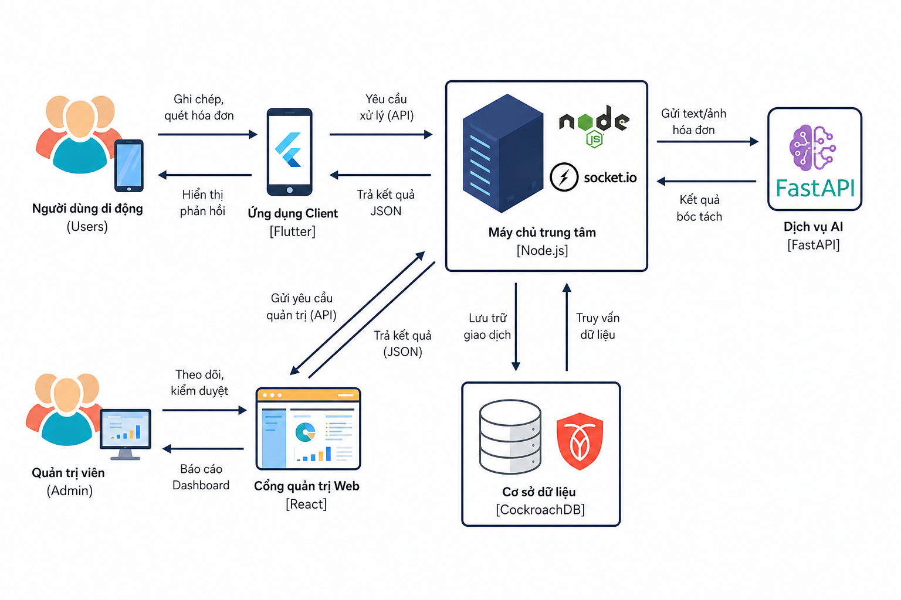

# Spending Diary — Hệ thống quản lý chi tiêu cá nhân thông minh tích hợp trí tuệ nhân tạo

Spending Diary là nền tảng quản lý tài chính cá nhân toàn diện, kết hợp xử lý ngôn ngữ tự nhiên (NLU) và thị giác máy tính (OCR) để tự động hóa hoàn toàn quy trình ghi chép thu chi hàng ngày. Hệ thống cung cấp trợ lý ảo thông minh Mimo, hỗ trợ người dùng nhập liệu bằng câu nói tự nhiên, quét ảnh chụp hóa đơn bán lẻ, phân tích xu hướng chi tiêu và tư vấn kế hoạch tài chính dựa trên dữ liệu thực tế.



Hình trên thể hiện sơ đồ kiến trúc tổng thể 4 tầng của hệ thống Spending Diary, minh họa luồng trao đổi dữ liệu liền mạch từ các ứng dụng người dùng, qua tầng điều phối nghiệp vụ, đến cụm xử lý trí tuệ nhân tạo chuyên sâu và hệ thống lưu trữ đám mây.

---

## 1. Kiến trúc hệ thống 4 tầng

Hệ thống được thiết kế theo mô hình kiến trúc phân tầng độc lập, đảm bảo tính mở rộng cao và độ tin cậy khi vận hành:

1. Tầng trải nghiệm người dùng (Client Applications):
   - Ứng dụng di động (Mobile App): Xây dựng bằng Flutter, hỗ trợ đa nền tảng Android và iOS với giao diện trực quan, tương tác giọng nói, thông báo đẩy và đồng bộ dữ liệu thời gian thực qua WebSocket.
   - Trang quản trị (Web Admin): Xây dựng bằng React và Vite, cung cấp bảng điều khiển phân tích chi tiêu, quản trị danh mục, giám sát nhật ký giao dịch và công cụ kiểm duyệt dữ liệu để tái huấn luyện mô hình học máy.

2. Tầng điều phối nghiệp vụ (Backend Orchestrator):
   - Máy chủ API: Phát triển bằng Node.js và Express, xử lý toàn bộ logic nghiệp vụ, quản lý phiên xác thực JWT, điều phối luồng xử lý AI, lập lịch giao dịch định kỳ và tích hợp cổng thanh toán VietQR SePay.
   - Cơ chế bảo mật và tối ưu: Sử dụng kiến trúc bất đồng bộ, kiểm soát truy cập phân quyền và lưu trữ đối tượng hóa đơn trên Cloudflare R2.

3. Tầng trí tuệ nhân tạo (AI Processing Cluster):
   - Dịch vụ AI Service: Phát triển bằng Python FastAPI, vận hành linh hoạt trên máy trạm cục bộ hoặc hạ tầng máy chủ GPU không máy chủ (Serverless GPU) Modal Cloud.
   - Phân hệ hiểu ngôn ngữ tự nhiên (NLU): Kiến trúc 2 tầng kết hợp giữa TF-IDF, PhoBERT Base và mô hình ngôn ngữ lớn Qwen 2.5 14B Instruct để phân loại ý định, bóc tách tham số giao dịch và nhận diện lệnh điều khiển.
   - Phân hệ bóc tách hóa đơn (Bill OCR): Chuỗi xử lý 3 bước gồm DBNet PaddleOCR phát hiện vùng chữ, MobileNetV3 hiệu chỉnh góc nghiêng, VietOCR nhận dạng văn bản tiếng Việt và LayoutLMv3 bóc tách các trường thực thể.
   - Kiến trúc truy xuất tăng cường (RAG): Tự động truy xuất lịch sử giao dịch và hạn mức từ cơ sở dữ liệu để cung cấp ngữ cảnh chính xác cho mô hình ngôn ngữ lớn, ngăn chặn triệt để hiện tượng bịa đặt số liệu khi tư vấn tài chính.

4. Tầng lưu trữ và đồng bộ dữ liệu (Data & Storage Layer):
   - Cơ sở dữ liệu quan hệ CockroachDB: Lưu trữ toàn bộ dữ liệu người dùng, tài khoản ví, lịch sử giao dịch, quy tắc định kỳ và nhật ký hoạt động với khả năng chịu lỗi và tính sẵn sàng cao.
   - Lưu trữ đám mây Cloudflare R2: Lưu trữ tập trung các tệp ảnh chụp hóa đơn gốc và ảnh đã qua xử lý.
   - Kho dữ liệu huấn luyện Kaggle: Đồng bộ nhãn dữ liệu thực tế phục vụ quy trình đánh giá và tái huấn luyện mô hình định kỳ.

---

## 2. Cấu trúc thư mục dự án

```text
spending-diary/
├── app/
│   ├── backend/             Máy chủ Node.js Express REST API (Auth, Ví, Giao dịch, Định kỳ, Báo cáo)
│   ├── database/            Cấu trúc cơ sở dữ liệu CockroachDB / PostgreSQL và các tệp migration
│   └── frontend/
│       ├── mobile/          Ứng dụng di động Flutter dành cho người dùng cuối (Android / iOS)
│       └── web-admin/       Trang web quản trị React + Vite (Quản lý giao dịch, NLU Ops, Retrain)
├── expense-ocr-nlu/         Dịch vụ AI Service FastAPI (OCR Pipeline, NLU Pipeline, Model Weights)
│   ├── bill_ocr/            Module nhận dạng hóa đơn (DBNet, MobileNetV3, VietOCR, LayoutLMv3)
│   ├── text_nlu/            Module xử lý văn bản (TF-IDF, PhoBERT, Qwen LLM, RAG Engine)
│   ├── modal_deploy/        Cấu hình triển khai AI Service lên GPU Modal Cloud
│   └── src/api/             FastAPI endpoints và bộ điều phối suy luận AI
├── docs/                    Tài liệu hướng dẫn kỹ thuật và đặc tả hệ thống
├── tests_chuong4/           Kịch bản kiểm thử tự động phục vụ đánh giá thực nghiệm
├── setup.md                 Tài liệu hướng dẫn thiết lập chi tiết và quy trình chạy demo
├── system_architecture.png  Sơ đồ kiến trúc hệ thống tổng thể
└── README.md                Tài liệu giới thiệu tổng quan về dự án
```

---

## 3. Các tính năng nổi bật

1. Ghi chép chi tiêu siêu tốc bằng ngôn ngữ tự nhiên:
   Người dùng chỉ cần nhập văn bản hoặc nói một câu tự nhiên như "ăn trưa bún bò 45k bằng ví tiền mặt", hệ thống AI sẽ tự động phân loại danh mục Ăn uống, bóc tách số tiền 45.000 đồng, chọn ví Tiền mặt và lưu vào sổ chi tiêu trong chưa đầy 1 giây.

2. Bóc tách hóa đơn bán lẻ thông minh bằng LayoutLMv3:
   Chụp hoặc tải ảnh hóa đơn mua sắm từ siêu thị, nhà hàng. Hệ thống tự động xoay thẳng ảnh, nhận diện chữ tiếng Việt có dấu, bóc tách chính xác tên cửa hàng, địa chỉ, thời gian và tổng tiền thanh toán, đồng thời dùng LLM để suy luận danh mục chi tiêu tương ứng.

3. Trợ lý ảo tài chính Mimo và kiến trúc RAG:
   Linh vật Mimo đồng hành cùng người dùng với phong cách giao tiếp vui vẻ hoặc nghiêm khắc. Người dùng có thể hỏi "tháng này tôi đã tiêu bao nhiêu tiền cho ăn uống so với hạn mức?", Mimo sẽ truy xuất số liệu thật trong cơ sở dữ liệu và phân tích đưa ra lời khuyên hữu ích.

4. Báo cáo phân tích dòng tiền chuyên sâu:
   Cung cấp các biểu đồ trực quan gồm biểu đồ tròn phân tích cơ cấu chi tiêu, biểu đồ cột so sánh chi tiêu theo từng tháng (Month over Month) và biểu đồ đường theo dõi chi tiêu lũy kế so với đường ngân sách chuẩn.

5. Quản lý hạn mức chi tiêu thông minh:
   Thiết lập hạn mức chi tiêu theo tháng hoặc theo từng danh mục cụ thể. Hệ thống áp dụng hệ số điều chỉnh theo mùa lễ Tết và phát cảnh báo sớm khi tốc độ chi tiêu vượt ngưỡng an toàn.

6. Tự động hóa giao dịch định kỳ:
   Hỗ trợ cài đặt các khoản chi cố định lặp lại như tiền thuê nhà, cước internet, học phí với cơ chế tự động ghi nhận và gửi thông báo xác nhận tức thời.

7. Công cụ tài chính và chia tiền nhóm:
   Tích hợp tính năng quản lý kế hoạch tiết kiệm, sự kiện chia tiền nhóm bạn bè (Chia Bill) có mã QR thanh toán và chuỗi điểm danh ghi chép liên tục (Streak) để duy trì thói quen tài chính tốt.

8. Cổng quản trị và quy trình tái huấn luyện NLU Ops:
   Trang web quản trị cho phép theo dõi toàn bộ giao dịch, kiểm duyệt các trường hợp AI phân loại sai và kích hoạt quy trình huấn luyện lại mô hình học máy để liên tục nâng cao độ chính xác.

---

## 4. Hướng dẫn khởi chạy nhanh hệ thống

Chi tiết các bước cài đặt và cấu hình môi trường được mô tả đầy đủ trong tệp [setup.md](setup.md). Dưới đây là tóm tắt các lệnh khởi chạy cho từng thành phần:

### 4.1 Khởi chạy Backend Node.js
```bash
cd app/backend
npm install
npm run migrate
npm run seed
npm run dev
```
Máy chủ Backend sẵn sàng tại `http://localhost:4000`. Tài liệu API Swagger có thể truy cập tại `http://localhost:4000/docs`.

### 4.2 Khởi chạy AI Service Python FastAPI
```bash
cd expense-ocr-nlu
python -m venv .venv
# Kích hoạt môi trường ảo (Windows: .venv\Scripts\activate, Linux/macOS: source .venv/bin/activate)
pip install -r requirements.txt
uvicorn src.api.app:app --host 127.0.0.1 --port 8000
```
Dịch vụ AI sẵn sàng tại `http://127.0.0.1:8000` hoặc kết nối trực tiếp đến điểm cuối trên GPU Modal Cloud.

### 4.3 Khởi chạy Web Admin React Vite
```bash
cd app/frontend/web-admin
npm install
npm run dev
```
Trang quản trị sẵn sàng tại `http://localhost:5173`.

### 4.4 Khởi chạy Mobile App Flutter
```bash
cd app/frontend/mobile
flutter pub get
flutter run
```

---

## 5. Tài khoản thử nghiệm và liên kết tham khảo

Tài khoản kiểm thử nhanh đã được cấu hình sẵn trong cơ sở dữ liệu mẫu:
- Tài khoản người dùng: email `demo@money.local`, mật khẩu `demo1234`
- Tài khoản quản trị viên: email `admin@moneystory.local`, mật khẩu `admin1234`

Liên kết mã nguồn và các mô hình nền tảng:
- Kho lưu trữ chính: https://github.com/maikhang160504/spending-diary
- Kho lưu trữ dịch vụ AI: https://github.com/maikhang160504/genz-expense-ml
- Mô hình xoay ảnh MobileNetV3: https://github.com/ndcuong91/MC_OCR
- Mô hình nhận dạng chữ VietOCR: https://github.com/pbcquoc/vietocr
- Mô hình phát hiện vùng chữ PaddleOCR: https://github.com/PaddlePaddle/PaddleOCR
- Mô hình trích xuất thực thể LayoutLMv3: https://huggingface.co/microsoft/layoutlmv3-base
- Mô hình ngôn ngữ tiếng Việt PhoBERT: https://huggingface.co/vinai/phobert-base
- Mô hình ngôn ngữ lớn Qwen 2.5: https://huggingface.co/Qwen/Qwen2.5-14B-Instruct
