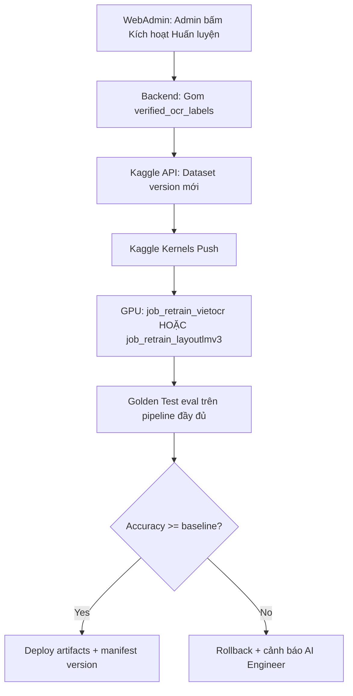

Dự án: Hệ thống quản lý chi tiêu cá nhân dạng Story
Vai trò: Kiến Trúc Sư Hệ Thống FinTech AI
Trọng tâm: Tối ưu hóa vòng lặp học chủ động (Active Learning Loop) và Quản lý hạ tầng GPU

---

## PHẦN 1: CHIẾN LƯỢC HUẤN LUYỆN LẠI (INCREMENTAL VS. FULL RETRAINING)

Khi hệ thống tích lũy dữ liệu gán nhãn sạch từ WebAdmin, việc lựa chọn phương pháp nạp dữ liệu vào mô hình quyết định độ chính xác tổng thể của hệ thống FinTech.

### 1. Phân tích các phương pháp tiếp cận

| Tiêu chí | Cách 1: Chỉ dùng Dữ liệu mới (Incremental/Fine-tuning) | Cách 2: Gộp Dữ liệu cũ + Dữ liệu mới (Full Retraining) |
|---|---|---|
| Bản chất | Nạp trọng số mô hình cũ, chỉ học dữ liệu mới từ WebAdmin | Huấn luyện lại toàn bộ kho từ pre-trained gốc hoặc checkpoint |
| Ưu điểm | Nhanh, ít GPU | Ổn định, không thiên vị batch mới |
| Nhược điểm | Catastrophic Forgetting | Tốn thời gian khi kho lớn |

### 2. Đề xuất kiến trúc cho từng thành phần Tech Stack

Hệ thống **không** train tất cả model cùng lúc. Retrain **theo tầng lỗi**:

| Thành phần | Chiến lược | Trigger retrain |
|---|---|---|
| **Category model** (TF-IDF/encoder) | **Full retrain** (cũ + mới), vài phút, local CPU | User sửa category trên app + admin duyệt batch |
| **VietOCR** | Fine-tune + Data Rehearsal (100% mới + 20–30% cũ) | WebAdmin verified OCR transcript |
| **LayoutLMv3 KIE** | Fine-tune riêng trên PICK format | WebAdmin verified entity (SELLER/TOTAL…) hoặc sau VietOCR retrain nếu golden fail |
| **Hybrid pipeline** | OCR và LayoutLMv3 là **2 job Kaggle tách biệt** | Không gộp một notebook |

**Phân loại bill (production):** `resolve_mixed_receipt_categories` dùng **Weighted Voting by Value** (`split_mode=False` mặc định):
$$\text{Score}(C) = \sum_i \text{Price}_i \times \text{Confidence}_i$$

---

## PHẦN 1B: NGUỒN DỮ LIỆU TỪ APP VS WEBADMIN

### Phạm vi chỉnh sửa trên mobile (Bill-only)

Sau OCR, user trên app **chỉ sửa được:**
- **Số tiền** (`amount`)
- **Danh mục** (`category`)
- Ví lưu, ghi chú (không dùng train OCR)

User **không** sửa bbox, tên từng món, SELLER, TOTAL trên app.

### Quy tắc đưa vào train

| Nguồn | Vào train ngay? | Ghi chú |
|---|---|---|
| Bill upload, user **accept** không sửa | **Không** | Nhãn nhiễu (OCR có thể sai) |
| User **sửa** amount/category | **Chờ admin duyệt** | Đủ cho category model; **không đủ** cho OCR |
| WebAdmin Labeling Canvas | **Có** (verified) | Đủ cho VietOCR + LayoutLMv3 + category |

**Luồng đề xuất:**
```
User sửa category/amount → user_corrections (Postgres)
    → WebAdmin: Global Train Curation (admin duyệt)
        → category: merge intent_record.csv → train_category_model
        → OCR/KIE: export verified_ocr_labels → Kaggle batch
```

**Không** trigger train tự động mỗi bill mới. Gom batch (≥500 category / ≥2.000 OCR) hoặc lịch định kỳ.

---

## PHẦN 2: KIẾN TRÚC KẾT NỐI TỰ ĐỘNG HÓA QUA KAGGLE API

Kaggle làm Remote GPU Worker cho WebAdmin qua Kaggle API.

### Luồng vận hành (Data Flow)



### Lệnh CLI cốt lõi

```bash
kaggle datasets version -p /app/storage/verified_ocr_labels -m "WebAdmin Auto-sync: Version $(date +'%Y%m%d')"
kaggle kernels push -p /app/ai_pipeline/kaggle_notebook/
```

### Giới hạn Kaggle Production

- **Timeout:** tối đa 9 giờ / run
- **GPU quota:** 30 giờ/tuần — batch theo lịch, không train liên tục
- **Artifacts:** upload `.pth` / `layoutlmv3_kie_best/` lên S3 hoặc Webhook WebAdmin sau khi run xong

---

## PHẦN 3: KIỂM CHỨNG CHẤT LƯỢNG (QUALITY ASSURANCE GATE)

Trước mọi deploy, chạy **Golden Test Set** — pipeline end-to-end, không chỉ metric từng model.

### Golden Test Set

- **200–500 ảnh** đa dạng (WinMart, Circle K, cafe, điện nước, tạp hóa, bill mờ/nghiêng)
- **Bắt buộc gán nhãn 100%** trước khi dùng: `amount`, `category` (và `seller`/items nếu đo KIE)
- **Nguồn:** MC-OCR `val_images` (~391) + production curated qua WebAdmin
- **Tuyệt đối không** đưa vào huấn luyện

### Release condition

$$\text{Accuracy}_{\text{New Model}} \ge \text{Accuracy}_{\text{Current Model}}$$

Metric tối thiểu: `amount_exact`, `category_top1`, `seller_f1`, `total_cost_f1` (nếu có LayoutLMv3).

### Manifest version (mỗi deploy)

```json
{
  "vietocr_weights": "vietocr_receipt_v12.pth",
  "layoutlmv3_kie": "layoutlmv3_kie_v5",
  "category_model": "category_model_v28.joblib",
  "bill_category_strategy": "weighted_voting_v1",
  "trained_on_batch": "20260618_2400samples"
}
```

---

## PHẦN 4: WEBADMIN — BILL OCR RETRAIN (ĐÃ TRIỂN KHAI)

**UI:** WebAdmin → **Bill OCR Retrain** (`/bill-retrain`)

### Một lần gán nhãn → train 2 model

Admin chỉ gán nhãn **một lần** trên canvas (bbox + text + entity). Export tạo **đồng thời** hai định dạng:

| Output export | Dùng cho | Đường dẫn |
|---|---|---|
| PICK TSV + ảnh hóa đơn | **LayoutLMv3 KIE** | `incremental/boxes_and_transcripts/*.tsv`, `incremental/images/` |
| Text crops + annotation | **VietOCR** | `incremental/vietocr_crops/images/`, `incremental/vietocr_crops/train_annotation.txt` |

Hai kernel Kaggle **tách biệt**, cùng attach dataset incremental `webadmin-verified-receipts`:

| Kernel | `code_file` | Kaggle |
|---|---|---|
| `retrain-layoutlmv3` | `vietnamese-receipts-with-layoutlmv3.ipynb` | [retrain-layoutlmv3](https://www.kaggle.com/code/mainhatkhangb2205881/retrain-layoutlmv3) |
| `retrain-vietocr` | `vietnamese-receipts-with-paddleocr-vietocr.ipynb` | [retrain-vietocr](https://www.kaggle.com/code/mainhatkhangb2205881/retrain-vietocr) |

**Notebook gốc** (`OCR/kaggle/vietnamese-receipts-with-*.ipynb`): chỉ 1 dataset MC-OCR — dùng train lần đầu / tham chiếu.

**Kernel retrain** (`kernels/retrain-*/`): copy notebook gốc + **1 cell gộp** MC-OCR + `webadmin-verified-receipts`.

Đồng bộ notebook gốc → kernel retrain:

```bash
python expense-ocr-nlu/OCR/kaggle/kernels/sync_retrain_kernels.py
kaggle kernels push -p expense-ocr-nlu/OCR/kaggle/kernels/retrain-layoutlmv3
kaggle kernels push -p expense-ocr-nlu/OCR/kaggle/kernels/retrain-vietocr
```

### Luồng WebAdmin (trigger retrain)

```
Upload & Auto-label → chỉnh canvas → Duyệt nhãn (×N approved)
    → Export approved  (PICK + VietOCR crops + kaggle_upload/)
    → Kaggle LayoutLMv3  HOẶC  Kaggle VietOCR  (hoặc cả hai, lần lượt)
    → Theo dõi job → Golden Test → deploy OCR/models/
```

**Chi tiết từng bước:**

1. **Upload & Auto-label** — hybrid PaddleOCR + VietOCR + KIE (heuristic/LayoutLMv3). Cần `USE_REAL_OCR=true` trong `app/ai-service/.env` và restart ai-service. Nếu 0 box: bấm **Gán nhãn lại** hoặc xem thông báo lỗi đỏ.
2. **Canvas bbox** — kéo/di chuyển, resize góc, chỉnh **text** + **entity** (`OTHER`, `SELLER`, `ADDRESS`, `TIMESTAMP`, `TOTAL_COST`).
3. **Lưu nháp** (`pending`) hoặc **Duyệt nhãn** (`approved`).
4. **Export approved** — ghi `OCR/verified_ocr_labels/incremental/` + `kaggle_upload/`. Tick **Auto Kaggle sau export** + chọn kernel (LayoutLMv3 / VietOCR) nếu muốn export + queue job một lần.
5. **Kaggle LayoutLMv3** / **Kaggle VietOCR** — version dataset → push kernel → poll → download → deploy. Job hiển thị ở **Kaggle jobs gần đây** (~5s refresh).
6. **Golden Test** trước deploy production.

Dataset gốc: [vietnamese-receipts-mc-ocr-2021](https://www.kaggle.com/datasets/domixi1989/vietnamese-receipts-mc-ocr-2021)

### Lưu trữ ảnh

| Giai đoạn | Đường dẫn |
|---|---|
| Sau upload (chờ duyệt) | `app/backend/storage/bill_retrain/images/{uuid}.jpg` |
| Index metadata | `app/backend/storage/bill_retrain/samples_index.json` |
| Sau export (train pool) | `OCR/verified_ocr_labels/incremental/images/{uuid}.jpg` |

### API Backend (`/api/admin/bill-retrain/*`)

| Method | Path | Mô tả |
|---|---|---|
| POST | `/prelabel` | Upload ảnh → auto-label |
| POST | `/samples/:id/prelabel` | Gán nhãn lại trên ảnh đã lưu |
| GET | `/samples` | Danh sách hàng đợi |
| GET | `/samples/:id/image` | Ảnh gốc để hiển thị canvas |
| PUT | `/samples/:id` | Lưu nhãn admin |
| DELETE | `/samples/:id` | Xóa sample + ảnh khỏi hàng đợi |
| POST | `/samples/:id/approve` | Duyệt vào pool train |
| POST | `/export` | Export PICK + VietOCR crops; body: `triggerKaggle`, `kaggleJobType` (`layoutlmv3` \| `vietocr`) |
| POST | `/kaggle/trigger` | Bắt đầu job retrain async; body: `jobType` |
| GET | `/kaggle/jobs/:id` | Trạng thái job |
| POST | `/kaggle/deploy` | Deploy từ zip/URL cloud |
| POST | `/kaggle/webhook` | Callback hoàn thành |
| POST | `/kaggle/plan` | Kế hoạch retrain (CLI) |
| GET | `/golden-eval` | QA gate trên fixtures |

**Lưu ý:** Chỉ sample `approved` mới export. Retrain **luôn** dùng base MC-OCR + incremental đã duyệt (xem PHẦN 5). Prelabel timeout backend → ai-service: **5 phút** (load OCR lần đầu có thể lâu).

---

## PHẦN 5: CẤU TRÚC THƯ MỤC MODEL & LUỒNG DỮ LIỆU (BASE + INCREMENTAL)

### Cấu trúc thư mục OCR

```
expense-ocr-nlu/OCR/
├── models/                          # Production weights
│   ├── vietocr/                     # vietocr_receipt.pth, config.yml
│   └── layoutlmv3_kie/model-best/   # LayoutLMv3 KIE inference
├── artifacts/                       # train.log, backup, zip Kaggle
├── manifests/ocr_models.json
├── verified_ocr_labels/
│   ├── incremental/                 # WebAdmin export
│   │   ├── boxes_and_transcripts/   # LayoutLMv3 PICK TSV
│   │   ├── vietocr_crops/           # VietOCR images + train_annotation.txt
│   │   └── images/                  # ảnh hóa đơn gốc
│   └── kaggle_upload/               # Upload qua kaggle datasets version
└── kaggle/kernels/
    ├── retrain-layoutlmv3/          # code_file: vietnamese-receipts-with-layoutlmv3.ipynb
    ├── retrain-vietocr/             # code_file: vietnamese-receipts-with-paddleocr-vietocr.ipynb
    └── sync_retrain_kernels.py      # copy notebook gốc → retrain + 1 cell gộp 2 dataset
```

### Retrain = Base + Incremental

| Thành phần | Nguồn |
|---|---|
| **Base** | Kaggle `domixi1989/vietnamese-receipts-mc-ocr-2021` (gắn trong kernel) |
| **Incremental** | WebAdmin `approved` → export → `kaggle_upload/` |

```bash
kaggle datasets version -p OCR/verified_ocr_labels/kaggle_upload -m "batch YYYYMMDD" -r zip
# LayoutLMv3 KIE:
kaggle kernels push -p OCR/kaggle/kernels/retrain-layoutlmv3
# VietOCR (cùng dataset incremental, kernel khác):
kaggle kernels push -p OCR/kaggle/kernels/retrain-vietocr
# Sau train: deploy vào OCR/models/ (tự động qua WebAdmin job hoặc BILL_RETRAIN_ARTIFACT_URL)
```

**Credentials:** `app/backend/kaggle.json` (gitignored) — đã copy sang `%USERPROFILE%\.kaggle\kaggle.json` cho Kaggle CLI. Code cũng tự tìm file tại `app/backend/kaggle.json`.
