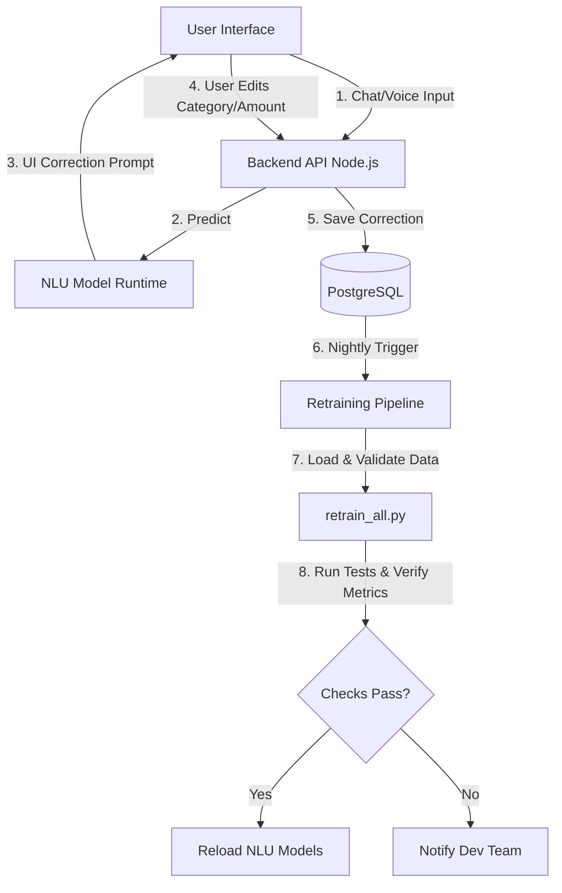

# NLU Dataset Consolidation & Retraining Strategy

This document provides a detailed analysis of the NLU action label consolidation, the cleaning of dataset files, a structured prompt to generate 20,000 synthetic NER sentences, and a discussion on the production retraining pipeline.

---

## 1. Action Type Consolidation (`intent_action.csv`)

### Problem Analysis
Previously, `intent_action.csv` contained overlapping and redundant labels, causing classifier confusion and class stratification issues during training:
- **`Report`**, **`REPORT_GENERAL`**, and **`REPORT_COMPARE`** are all handled by the same backend function (`executeReport`) which extracts the comparison sub-type or category from the text dynamically using regex.
- **`Search`** and **`SEARCH_RECORD`** both map to the same `executeSearch` endpoint in the backend.
- **`Setting`** and **`SYSTEM_SETTING`** are duplicates of the settings page toggle.
- **`Edit`** was a mixed class containing both update actions ("Sửa khoản...", "Chỉnh...") and delete actions ("Bỏ giao dịch...", "Xóa...").

### Consolidation Strategy
We have applied the following mappings to normalize the dataset:

| Old Action Type | New Normalized Action Type | Rule / Logic |
| :--- | :--- | :--- |
| `Report` | `REPORT_GENERAL` | Unified (Backend extracts details dynamically via regex/NER) |
| `REPORT_COMPARE` | `REPORT_GENERAL` | Unified |
| `REPORT_GENERAL` | `REPORT_GENERAL` | Retained as the standard label |
| `Search` | `SEARCH_RECORD` | Unified |
| `SEARCH_RECORD` | `SEARCH_RECORD` | Retained as the standard label |
| `Setting` | `SYSTEM_SETTING` | Unified to standard snake_case |
| `Edit` (Update) | `UPDATE_RECORD` | Mapped if text contains adjustment keywords (sửa, chỉnh, đổi, cập nhật) |
| `Edit` (Delete) | `DELETE_RECORD` | Mapped if text contains deletion keywords (xóa, bỏ, hủy, gỡ) |
| `EXPORT_DATA` | **[DELETED]** | Removed entirely as requested |

### Final Action Type Distribution
Following consolidation, the labels are cleaner, well-separated, and balanced:

* **`SET_LIMIT`**: 941 samples
* **`UPDATE_RECORD`**: 927 samples (consolidated from `UPDATE_RECORD` + update-related `Edit` rows)
* **`REPORT_GENERAL`**: 907 samples (consolidated from `REPORT_GENERAL` + `Report` + `REPORT_COMPARE`)
* **`SEARCH_RECORD`**: 799 samples (consolidated from `SEARCH_RECORD` + `Search`)
* **`SYSTEM_SETTING`**: 559 samples (consolidated from `Setting`)
* **`DELETE_RECORD`**: 296 samples (consolidated from `DELETE_RECORD` + delete-related `Edit` rows)
* **`SET_TONE`**: 248 samples
* **`SET_USERNAME`**: 245 samples
* **`SET_INCOME`**: 234 samples
* **`SET_ALERT`**: 233 samples
* **`SUGGEST_BUDGET`**: 184 samples
* **`SET_GOAL`**: 161 samples
* **`ADD_GOAL`**: 138 samples

---

## 2. Dataset Cleanup (`EXPORT_DATA` Removal)

As requested, all references to `EXPORT_DATA` have been removed:
1. **`intent_action.csv`**: Deleted 246 rows with `action_type = EXPORT_DATA`.
2. **`ner_dataset.jsonl`**: Deleted 318 export-related annotation lines starting with keywords like `xuất csv`, `xuất file`, `xuất excel`, `export`.

Backup copies of the original files have been safely created as:
- `intent_action.csv.bak`
- `ner_dataset.jsonl.bak`

---

## 3. LLM Prompt for Generating 20,000 NER Samples

Generating NER data with exact character offsets (`[start, end, label]`) using LLMs is challenging because models frequently miscalculate string lengths. To solve this, we instruct the LLM to write sentences using XML-style tags (e.g., `<AMOUNT>300k</AMOUNT>`) and provide a Python post-processing script to strip the tags and calculate the exact character offsets.

### Prompt Template
You can send the following prompt to Gemini 1.5 Pro / GPT-4o to generate large batches of high-quality data:

```markdown
You are an expert NLP data engineer. We are training a spaCy NER model for a Vietnamese Personal Finance Voice/Chat Bot (Mimo). 
Your task is to generate 1,000 diverse training examples in XML-tagged format.

Supported entity tags:
- <AMOUNT>: transaction value or limit (e.g. 50k, 2 triệu, 120k, 2tr500)
- <CATEGORY>: expense/income category (e.g. ăn uống, đi lại, học phí, giải trí, nhà ở, mua sắm)
- <TIME>: date/time range (e.g. hôm nay, tháng này, tuần sau, thứ hai, cuối tuần, ngày thường, 25-05-2026)
- <ACTION_TYPE>: search/report keywords (e.g. tìm kiếm, báo cáo, so sánh, tổng hợp)
- <VERB>: limit/goal adjustments (e.g. tăng, giảm, bớt, cộng thêm, đặt)
- <TARGET>: limit/goal nouns (e.g. hạn mức, giới hạn, mục tiêu)

Guidelines for Diversity:
1. Time range: Use diverse formats: days, months, years, specific weekdays (thứ hai, chủ nhật), weekends (cuối tuần), holidays, raw dates (dd/mm/yyyy, dd-mm-yyyy), and conversational terms (dạo này, vừa rồi).
2. Slang & Tone: Mix normal Vietnamese, Gen Z slang (củ, tr, cành, ví, cháy túi), abbreviations (cf, k, tr, ae, nv), and typos/accentless text (an uong, nha o, di lai).
3. sentence structures: Refer to action.md guidelines:
   - Reports: "Thống kê <CATEGORY>ăn uống</CATEGORY> <TIME>tháng này</TIME>" or "So sánh <CATEGORY>giải trí</CATEGORY> <TIME>tuần vừa rồi</TIME>"
   - Limits: "<VERB>Cộng thêm</VERB> <AMOUNT>500k</AMOUNT> vào <TARGET>giới hạn</TARGET> <CATEGORY>đi lại</CATEGORY>"
   - Goals: "Tớ muốn <VERB>tiết kiệm</VERB> <AMOUNT>10 triệu</AMOUNT> làm <TARGET>mục tiêu</TARGET> mua xe"
   - Deletions: "<VERB>Xóa</VERB> giao dịch gần nhất hộ tớ"
   - Settings: "Chuyển sang giao diện tối" (no tags needed if no entities are present)

Output format: Return ONLY a raw list of JSON lines, where each line has a "tagged_text" field:
{"tagged_text": "thống kê chi tiêu <CATEGORY>ăn uống</CATEGORY> <TIME>tháng này</TIME> nha"}
{"tagged_text": "<VERB>giảm</VERB> <TARGET>giới hạn</TARGET> <CATEGORY>mua sắm</CATEGORY> đi <AMOUNT>200k</AMOUNT>"}

Examples:
{"tagged_text": "<ACTION_TYPE>tìm</ACTION_TYPE> hóa đơn nào trên <AMOUNT>500k</AMOUNT>"}
{"tagged_text": "Mimo <VERB>đổi</VERB> giọng sang châm chọc <TIME>hôm nay</TIME> đi"}
```

### Python Conversion Script
After receiving the XML-tagged sentences from the LLM, run this Python script to convert them to spaCy-compatible JSONL format:

```python
import json
import re

def convert_xml_to_spacy(tagged_line):
    # Regex to find tags
    pattern = re.compile(r"<([A-Z_]+)>(.*?)</\1>")
    
    text = tagged_line["tagged_text"]
    labels = []
    
    while True:
        match = pattern.search(text)
        if not match:
            break
        
        label_type = match.group(1)
        entity_value = match.group(2)
        start_idx = match.start()
        end_idx = start_idx + len(entity_value)
        
        labels.append([start_idx, end_idx, label_type])
        
        # Replace the tag in the text and continue searching
        text = text[:match.start()] + entity_value + text[match.end():]
        
    return {"text": text, "label": labels}

# Example processing loop:
# for line in xml_lines:
#     spacy_json = convert_xml_to_spacy(json.loads(line))
#     output_file.write(json.dumps(spacy_json, ensure_ascii=False) + "\n")
```

---

## 4. Production Retraining Strategy & Architecture Discussion

Deploying NLU and NER models in production requires a reliable loop that collects corrections, validates them, retrains models without downtime, and safely rolls them out.

### 4.1 Automated Active Learning Loop



### 4.2 logic and Steps for retrain_all.py
When training models in production, the pipeline must enforce checks to prevent low-quality data or class imbalance from breaking the service:

1. **Transactional Data Validation (Step 1 - Backend & Python)**:
   - Check headers, duplicate values, and column counts.
   - Strip duplicate labels (e.g. double headers `text,label,type,is_money`).
   - Validate categories against standard definitions (`Food`, `Shopping`, etc.).

2. **Stratification Guard (Step 2 - Python)**:
   - When split-testing datasets using `train_test_split(X, y, stratify=y)`, ensure every unique label has **at least 2 samples**.
   - If any class has only 1 sample, it must be programmatically duplicated or augmented, otherwise stratification fails and training crashes.

3. **Performance Metric Gating (Step 3 - Python)**:
   - After training models, compute F1-score and Accuracy.
   - If the new model's weighted-F1 falls below a predefined threshold (e.g., `< 0.85`), **abort deployment** and roll back to the previous stable model.

### 4.3 Collecting Production Samples
To expand the datasets naturally without relying solely on synthetic generation:

- **Implicit Corrections**: When a user uploads a receipt (OCR) and modifies the predicted category or amount, this is logged as a correction.
- **Explicit Feedback**: Add a simple Thumbs Up / Thumbs Down next to Mimo's chat bubbles. A "Thumbs Down" records the conversation snippet into `action_rejected_log` for developer review.
- **High-Entropy Sampling**: Periodically select sentences where classifier confidence was borderline (e.g., between `0.5` and `0.7`) and send them to human annotators (or an LLM-guided review dashboard) for labeling.
