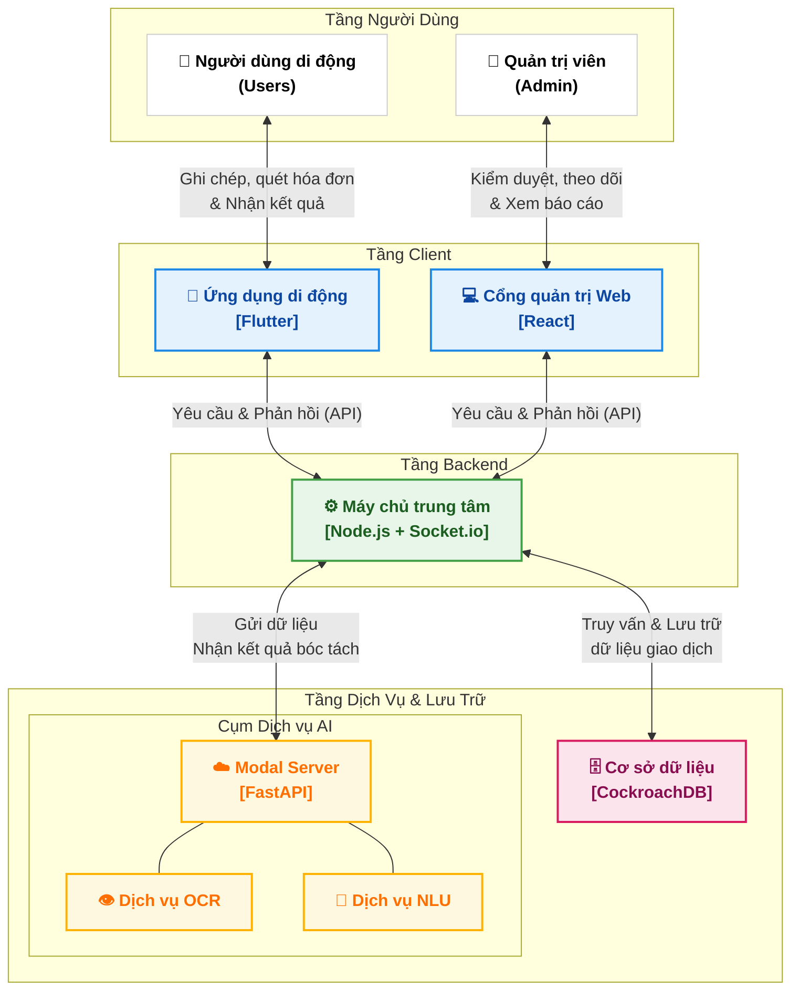

# Sơ đồ Kiến trúc Hệ thống 4 Tầng

Sơ đồ kiến trúc được thiết kế theo dạng phân tầng (Top-Down) để thể hiện rõ luồng dữ liệu từ người dùng qua Client, Backend và tới các dịch vụ lưu trữ cùng AI.

### Cách sử dụng
Bạn copy đoạn code bên trong và dán vào [Mermaid Live Editor](https://mermaid.live/) để xuất ra ảnh. Bố cục này đã giống y đúc sơ đồ ảnh cũ của bạn!
