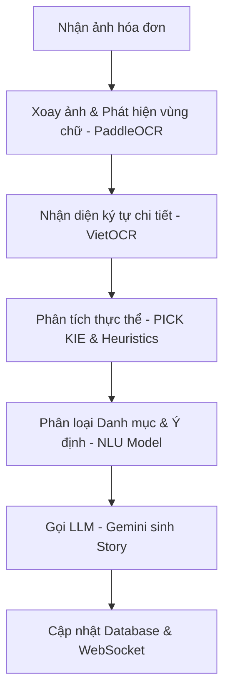
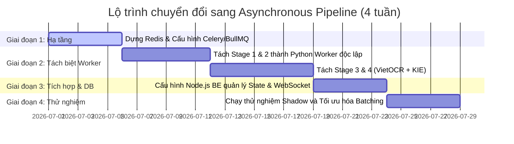

# Nghiên Cứu Tính Khả Thi: Kiến Trúc Hàng Đợi Bất Đồng Bộ 5 Giai Đoạn (Asynchronous Pipeline) cho Module OCR/NLU Bill

Tài liệu này đánh giá tính khả thi, phân tích kiến trúc đề xuất và xây dựng lộ trình chuyển đổi luồng xử lý ảnh hóa đơn (luồng 2) từ **Tuần tự (Sequential)** sang **Bất đồng bộ (Asynchronous Queue Chain)** cho module `ai-service` thuộc hệ thống Spending Diary.

---

## 1. Hiện Trạng & Vấn Đề (Current Bottlenecks)

Hiện tại, luồng xử lý hóa đơn được thực hiện qua hàm ngầm `_processBillBackground` trong [ai.service.js](file:///d:/Luan-Van/Project/app/backend/src/modules/ai/ai.service.js). Tuy nhiên, luồng này gọi API `expenseFromBill` của `ai-service` (FastAPI), nơi thực hiện toàn bộ chuỗi xử lý sau một cách tuần tự:



### ❌ Hạn chế của kiến trúc hiện tại:
1. **Lãng phí tài nguyên phần cứng cực lớn**:
   - `PaddleOCR` (phát hiện vùng chữ) và `VietOCR` (nhận dạng ký tự) là các tác vụ chạy trên GPU rất nặng. Trong lúc GPU chạy OCR, CPU rảnh rỗi. Khi đến bước gọi LLM (qua API mạng ngoài), cả GPU lẫn CPU cục bộ đều phải chờ đợi phản hồi mạng (I/O Blocked).
2. **Nghẽn cổ chai (Bottleneck)**:
   - Tốc độ xử lý toàn chuỗi bị kéo lùi bởi bước chậm nhất (VietOCR nhận diện từng dòng chữ nhỏ mất khoảng 1.5s - 2.5s). Nếu có nhiều yêu cầu đồng thời, các luồng sau sẽ bị xếp hàng chờ ở cấp độ HTTP request, dễ dẫn đến timeout cổng gateway (Gateway Timeout 504).
3. **Thiếu khả năng mở rộng (Horizontal Scaling)**:
   - Không thể scale riêng lẻ các thành phần. Ví dụ: Nếu hệ thống bị nghẽn ở khâu Nhận diện chữ (VietOCR), chúng ta buộc phải nhân bản toàn bộ dịch vụ `ai-service` (chứa cả các model NLU và LLM Client), gây lãng phí dung lượng RAM lớn (mỗi instance load model mất 3-4 GB RAM).
4. **Độ tin cậy thấp (Fault Tolerance)**:
   - Nếu bất kỳ bước nào trong chuỗi bị sập (ví dụ: lỗi nhận diện ảnh hỏng, LLM rate limit), toàn bộ giao dịch bị hủy và người dùng nhận lỗi. Không có cơ chế lưu trữ vết hoặc phục hồi giữa chừng.

---

## 2. Thiết Kế Kiến Trúc Bất Đồng Bộ 5 Giai Đoạn

Đề xuất tách chuỗi xử lý hóa đơn thành **5 Stage Micro-workers** độc lập. Các stage liên kết với nhau bằng các **Hàng đợi tin nhắn (Message Queues)** riêng biệt theo mô hình nhà máy (Pipeline & Filter pattern):

```mermaid
graph LR
    subgraph Frontend API Gateway
        A[Mobile Client] -- 1. Upload & Create Pending --> B[Node.js BE]
    end

    subgraph Message Queues & Micro-workers
        B -- 2. Push Task --> Q1[Queue 1: Image Prep]
        Q1 --> W1[Worker 1: Rotation Correct]
        W1 -- 3. Push --> Q2[Queue 2: Detection]
        Q2 --> W2[Worker 2: PaddleOCR Box]
        W2 -- 4. Push --> Q3[Queue 3: Recognition]
        Q3 --> W3[Worker 3: VietOCR Text]
        W3 -- 4.1. Batching --> W3
        W3 -- 5. Push --> Q4[Queue 4: KIE Fusion]
        Q4 --> W4[Worker 4: PICK KIE Engine]
        W4 -- 6. Push --> Q5[Queue 5: NLU & LLM]
        Q5 --> W5[Worker 5: Gemini Story]
    end

    subgraph Persistence & Notify
        W5 -- 7. Update DB --> DB[(PostgreSQL)]
        W5 -- 8. Notify Done --> WS[WebSocket Hub]
        WS -. 9. Event .-> A
    end
    
    style Q1 fill:#f9f,stroke:#333,stroke-width:2px
    style Q2 fill:#f9f,stroke:#333,stroke-width:2px
    style Q3 fill:#f9f,stroke:#333,stroke-width:2px
    style Q4 fill:#f9f,stroke:#333,stroke-width:2px
    style Q5 fill:#f9f,stroke:#333,stroke-width:2px
```

### Chi tiết nhiệm vụ từng Giai đoạn (Stages):

| Stage | Tên Giai Đoạn | Nhiệm vụ chính | Yêu cầu tài nguyên |
| :--- | :--- | :--- | :--- |
| **Stage 1** | **Image Prep & Rotation** | Tải ảnh từ R2, chạy bộ lọc làm nét, kiểm tra góc quay bằng `RotationCorrector` và xoay ảnh về dạng thẳng đứng chuẩn. | CPU nhẹ, I/O mạng tải ảnh |
| **Stage 2** | **OCR Detection** | Chạy mô hình phát hiện vùng chữ viết (Bounding Boxes) của `PaddleOCR`. Trả về danh sách tọa độ bounding boxes. | GPU mức trung bình |
| **Stage 3** | **OCR Recognition** | Cắt các vùng ảnh (crop) và chạy `VietOCR` song song hoặc gom cụm (batching) để nhận diện chữ tiếng Việt thô. | GPU mức cao (Hỗ trợ Gom cụm) |
| **Stage 4** | **PICK KIE & Fusion** | Chạy mô hình `PICK` để phân loại thực thể khóa (`TOTAL_COST`, `TIMESTAMP`, `MERCHANT_NAME`) kết hợp bộ luật heuristics và fusion dữ liệu. | GPU/CPU trung bình |
| **Stage 5** | **NLU & LLM Story** | Chạy mô hình NLU phân loại danh mục, truy vấn PostgreSQL lấy ContextMeta, gọi Gemini API sinh câu thoại Story của Mimo, cập nhật trạng thái giao dịch sang `done` và kích hoạt WebSocket. | CPU nhẹ, I/O mạng gọi API |

---

## 3. Giải Pháp Công Nghệ & Quy Tắc Thiết Kế

### 3.1. Lựa chọn Message Queue: RabbitMQ vs Kafka vs BullMQ

Để quản lý 5 hàng đợi này, chúng ta so sánh 3 giải pháp phổ biến:

| Tiêu chí | BullMQ (Redis-based) | RabbitMQ (AMQP) | Apache Kafka |
| :--- | :--- | :--- | :--- |
| **Độ phức tạp** | **Rất thấp** (Đã có sẵn cụm Redis dùng cho cache) | **Trung bình** (Cần dựng cụm Erlang/RabbitMQ) | **Cao** (Yêu cầu Zookeeper/KRaft, tốn RAM vận hành) |
| **Khả năng Retry/Delay** | Hỗ trợ cực tốt, có sẵn cấu hình exponential backoff | Hỗ trợ qua plugin hoặc DLX | Cần lập trình thủ công ở tầng consumer |
| **Tốc độ xử lý** | ~10,000 msgs/sec | ~50,000 msgs/sec | >1,000,000 msgs/sec |
| **Tích hợp Node.js & Python** | Rất tốt (Thư viện `BullMQ` cho Node, `Celery` hoặc `Arq` cho Python sử dụng chung Redis) | Rất tốt (Thư viện `amqplib` và `pika`) | Tốt nhưng cấu hình driver phức tạp |

> [!TIP]
> **Khuyến nghị**: Sử dụng **BullMQ (Redis-based)** kết hợp với **Celery (Python)** chia sẻ chung cụm Redis. Do hệ thống hiện tại đã có Redis phục vụ cache, việc tận dụng Redis giúp giảm thiểu chi phí hạ tầng, dễ triển khai, và có công cụ giám sát trực quan (`Bull-Board`).

### 3.2. Quản lý Trạng thái Xử lý (State Management)

Do xử lý bất đồng bộ kéo dài từ 2s - 4s, trạng thái của giao dịch cần được quản lý chặt chẽ trong Redis và PostgreSQL:
* **Redis Hash**: Lưu trữ thông tin trạng thái real-time của job:
  ```json
  {
    "transactionId": "tx-abc-123",
    "status": "processing",
    "current_stage": "Stage_3_Recognition",
    "percentage": 60,
    "ocr_raw_path": "s3://bills/tx-abc-123_ocr.json",
    "error_log": ""
  }
  ```
* **PostgreSQL (`transactions` table)**:
  - Cập nhật trường `processing_status` từ `pending` sang `done` hoặc `failed` khi kết thúc Stage 5.
  - Điều này giúp ứng dụng Mobile có thể khôi phục trạng thái loading nếu bị mất kết nối WebSocket giữa chừng (chỉ cần gọi lại HTTP GET `/transactions/:id` để kiểm tra trạng thái trong PostgreSQL).

### 3.3. Quy Tắc Vàng: Không truyền dữ liệu nhị phân (Binary Image) qua Queue

> [!WARNING]
> **Quy tắc bắt buộc**: Tuyệt đối không đưa file buffer (ảnh nhị phân) vào payload của Queue Message. Việc này sẽ làm phình to RAM của Redis/RabbitMQ, gây nghẽn băng thông hàng đợi và giảm hiệu năng điều phối.

* **Quy trình chuẩn**:
  1. Khi người dùng gửi ảnh, Backend upload trực tiếp lên Cloudflare R2 / S3 và nhận lại một mã khóa duy nhất hoặc URL tuyệt đối (ví dụ: `bills/2026/06/bill-xyz.jpg`).
  2. Tin nhắn đẩy vào hàng đợi **Stage 1** chỉ chứa Metadata:
     ```json
     {
       "transactionId": "tx-12345",
       "userId": "usr-8888",
       "imageKey": "bills/2026/06/bill-xyz.jpg",
       "timestamp": "2026-06-22T14:42:00Z"
     }
     ```
  3. Mỗi Worker tự động tải ảnh từ Cloudflare R2 nếu cần thiết (hoặc lưu tạm vào thư mục đệm dùng chung tốc độ cao như Local SSD / RAM Disk nếu các worker nằm chung cụm máy chủ vật lý).

### 3.4. Giám sát Hàng Đợi (Monitoring & Auto-scaling)

* **Dashboard**: Sử dụng **Bull-Board** hoặc **Flower** (nếu dùng Celery) làm giao diện theo dõi các queue.
* **Auto-scaling (KEDA / Kubernetes)**:
  - Định cấu hình tự động co giãn số lượng Worker dựa trên độ trễ của queue (Queue Length / Backlog):
    - Nếu Queue 3 (VietOCR) có số lượng tin nhắn chờ vượt quá 50, tự động scale thêm Worker 3 (chạy GPU/CPU).
    - Nếu hàng đợi trống, giảm số lượng worker về mức tối thiểu để tiết kiệm năng lượng/chi phí GPU.

---

## 4. Đánh Giá Độ Khả Thi & Rủi Ro

### 4.1. Những lợi ích chắc chắn đạt được (Feasible Advantages)

1. **Kháng lỗi vượt trội (Fault Tolerance)**:
   - Nếu mô hình PICK KIE bị crash hoặc API Gemini bị ngắt kết nối tạm thời, các tin nhắn xử lý dở dang sẽ dừng lại ở Queue 4 / Queue 5. Sau khi dịch vụ khởi động lại, các worker tiếp tục tiêu thụ tin nhắn mà không yêu cầu người dùng phải chụp lại ảnh hóa đơn.
2. **GPU Batching (Tăng throughput gấp 4 lần)**:
   - Các worker OCR (Stage 2 & 3) có thể gom các ảnh yêu cầu riêng lẻ thành một Batch (ví dụ: 8 ảnh cùng lúc) trước khi đẩy qua GPU. Điều này giúp tối ưu hóa luồng tính toán song song của nhân CUDA, tăng hiệu suất xử lý trên giây lên gấp 4-5 lần so với chạy tuần tự từng ảnh đơn lẻ.
3. **Trải nghiệm người dùng cực mượt (Premium UX)**:
   - Người dùng nhận phản hồi HTTP 202 Accepted trong <100ms. Mobile vẽ ngay khung sườn xám (Skeleton Loader) hoặc giao diện loading động của Mimo. Khi quá trình xử lý ngầm hoàn tất, WebSocket cập nhật dữ liệu mượt mà mà không có cảm giác trễ hay đơ giao diện.

### 4.2. Những thách thức & Rủi ro kỹ thuật

1. **Độ trễ do chi phí trung chuyển (Queue Latency Overhead)**:
   - Việc chuyển tiếp dữ liệu qua 5 hàng đợi sẽ tạo ra độ trễ mạng tích lũy (khoảng 50ms - 100ms cho việc serialize/deserialize JSON). Điều này không đáng kể so với thời gian chạy mô hình AI (~2 giây), nhưng cần tối ưu hóa payload tin nhắn gọn nhẹ nhất.
2. **Quản lý phân tán (Distributed State) & Tranh chấp ghi (Race Conditions)**:
   - Nếu người dùng bấm "Chỉnh sửa danh mục" trên Mobile trong lúc Pipeline ngầm vẫn đang chạy ở Stage 4, có thể xảy ra tình trạng ghi đè đè dữ liệu cũ lên dữ liệu người dùng vừa sửa.
   - **Giải pháp**: Đặt trạng thái khóa ghi (Optimistic Locking) trong PostgreSQL: Khi `processing_status = 'pending'`, tạm thời vô hiệu hóa nút lưu/sửa trên Mobile UI cho đến khi nhận được WebSocket `transaction_done`.

---

## 5. Lộ Trình Triển Khai Khuyến Nghị (Roadmap)



---

## Kết luận

Việc chuyển đổi sang kiến trúc **Asynchronous Pipeline 5 giai đoạn là hoàn toàn KHẢ THI** và là **bắt buộc** nếu hệ thống muốn đạt tiêu chuẩn vận hành production chịu tải cao (Scalable & High Availability). 

Hạ tầng hiện tại của Spending Diary đã có sẵn **Redis** và **Cloudflare R2**, do đó chi phí đầu tư thêm về mặt phần mềm gần như bằng 0. Độ phức tạp chủ yếu nằm ở việc tái cấu trúc các mã nguồn Python trong thư mục [expense-ocr-nlu/OCR/src/receipt_ocr](file:///d:/Luan-Van/Project/expense-ocr-nlu/OCR/src/receipt_ocr) thành các worker nhận lệnh từ queue thay vì chạy hàm tuần tự như hiện tại.
