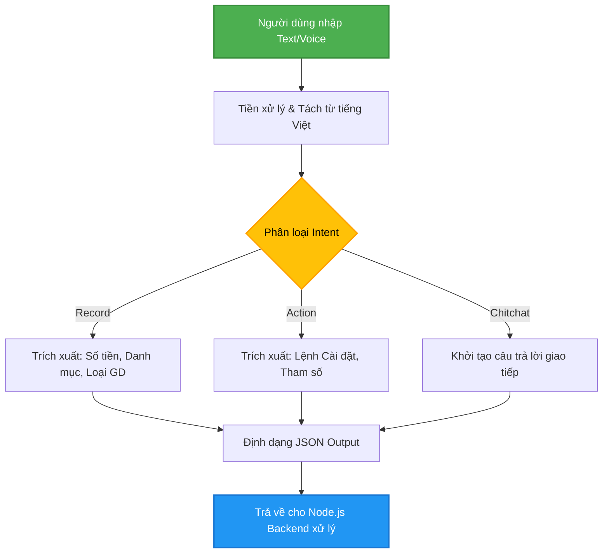
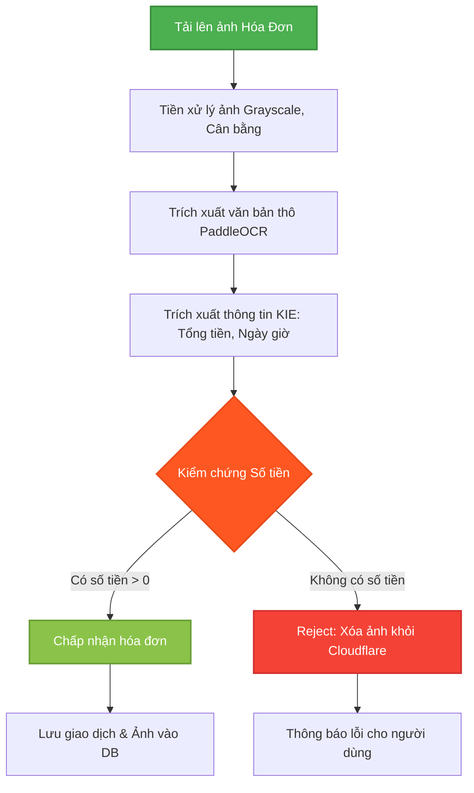

# Bổ sung nội dung Luận văn - Chương 4 & Kết luận

## 1. Chi tiết thiết kế luồng xử lý NLU (Natural Language Understanding)

### a. Kiến trúc luồng NLU
Hệ thống NLU trong Mimo được thiết kế theo kiến trúc module hóa, nhằm đảm bảo khả năng mở rộng và độ chính xác cao khi xử lý ngôn ngữ tự nhiên (tiếng Việt). Luồng xử lý bao gồm các bước sau:
1. **Tiếp nhận yêu cầu (Input Reception)**: Người dùng nhập văn bản hoặc sử dụng giọng nói thông qua ứng dụng di động. Backend Node.js nhận chuỗi văn bản và gửi tới NLU service (Python).
2. **Tiền xử lý văn bản (Text Preprocessing)**: 
   - Chuẩn hóa chuỗi (chuyển chữ thường, xóa khoảng trắng thừa, chuẩn hóa dấu câu).
   - Tách từ (Word Segmentation) bằng công cụ dành riêng cho tiếng Việt (như pyvi hoặc underthesea) để mô hình dễ dàng nhận diện ngữ nghĩa.
3. **Phân loại Intent (Intent Classification)**:
   - Hệ thống dự đoán ý định của câu nói (Intent) thuộc một trong các loại chính: `Record` (Ghi chép), `Action` (Thực thi lệnh/Cài đặt), hoặc `Chitchat` (Trò chuyện).
   - Mô hình phân loại có thể sử dụng TF-IDF kết hợp Logistic Regression/SVM để phản hồi nhanh, hoặc sử dụng PhoBERT/LLM (PhoGPT, Qwen) cho các câu nói mang tính ngữ cảnh phức tạp.
4. **Nhận diện thực thể (Slot Filling / NER)**:
   - Dựa trên Intent đã xác định, hệ thống tiến hành trích xuất các thông tin chi tiết (slots).
   - Ví dụ với `Record`: Trích xuất số tiền (Amount), danh mục (Category), loại giao dịch (Income/Expense), và ghi chú (Note).
   - Với `Action`: Trích xuất loại action (ví dụ: `SET_SYSTEM_SETTING`, `SEARCH_RECORD`, `SET_ALERT`) và các tham số đi kèm.
5. **Định dạng kết quả (JSON Output Generation)**: NLU service đóng gói dữ liệu đã trích xuất thành một JSON chuẩn hóa và trả về cho Backend xử lý các logic tương ứng.

### b. Sơ đồ luồng NLU

### c. Tại sao chọn thiết kế này?
- **Độ linh hoạt cao**: Việc tách biệt Intent Classification và Slot Filling giúp dễ dàng thay đổi hoặc nâng cấp từng mô hình con (ví dụ: thay TF-IDF bằng PhoBERT) mà không ảnh hưởng tới toàn hệ thống.
- **Tối ưu hiệu năng**: Bằng cách kết hợp giữa Regular Expressions cho các mẫu cơ bản (số tiền, ngày tháng) và LLM cho ngữ cảnh phức tạp, hệ thống cân bằng được giữa tốc độ phản hồi (Latency) và độ chính xác (Accuracy).

---

## 2. Chi tiết thiết kế luồng xử lý OCR (Optical Character Recognition)

### a. Kiến trúc luồng OCR
Luồng xử lý hóa đơn (Bill Scanning) được thiết kế đặc biệt để nhận diện thông tin tài chính từ hình ảnh:
1. **Tải lên & Tiền xử lý ảnh (Image Upload & Preprocessing)**: 
   - Ảnh hóa đơn được ứng dụng nén và gửi lên Backend.
   - Backend đẩy ảnh tới OCR Service. Tại đây, ảnh có thể được xử lý (grayscale, binarization, chỉnh nghiêng) để tăng chất lượng nhận diện.
2. **Trích xuất văn bản (Text Extraction)**:
   - Sử dụng các engine OCR mạnh mẽ (như PaddleOCR hoặc Tesseract) để trích xuất toàn bộ văn bản (lines) và tọa độ (bounding boxes) từ ảnh.
3. **Phân tích thông tin chính yếu (KIE - Key Information Extraction)**:
   - Văn bản thô được phân tích để tìm ra các trường quan trọng: **Số tiền tổng (Total Amount)**, **Ngày giờ (Date/Time)**, và **Tên cửa hàng/Mô tả**.
   - Mimo ứng dụng thuật toán tìm kiếm theo luồng heuristic (tìm từ khóa "Tổng tiền", "Thanh toán") hoặc mô hình PICK KIE để gán nhãn chính xác cho từng đoạn text.
4. **Xử lý Logic & Kiểm chứng (Validation)**:
   - **Bảo vệ toàn vẹn dữ liệu**: Hệ thống có cơ chế kiểm tra (Validation): Nếu OCR không tìm thấy "Số tiền" (Amount <= 0) thì hệ thống ngay lập tức từ chối ảnh (Reject), báo lỗi "Không tìm thấy số tiền trên hóa đơn" và xóa ảnh khỏi Cloudflare (Bucket R2).
   - Điều này giải quyết triệt để vấn đề "Normal Image Confusion", ngăn chặn việc người dùng tải lên ảnh thường hoặc ảnh chế (Meme) làm rác cơ sở dữ liệu.
5. **Lưu trữ & Phản hồi**: Trả về dữ liệu chi tiêu hoặc yêu cầu người dùng chụp lại nếu ảnh quá mờ.

### b. Sơ đồ luồng OCR (Xử lý hóa đơn)

### c. Tại sao chọn thiết kế này?
- **Tiết kiệm tài nguyên (Cost & Storage Optimization)**: Bước kiểm chứng (Validation) ngay lập tức giúp hệ thống không phải lưu trữ các hình ảnh rác (tiết kiệm dung lượng R2 Bucket) và giảm tải việc tạo các giao dịch rác trong Database.
- **Trải nghiệm người dùng (UX)**: Phản hồi lỗi rõ ràng ("Không tìm thấy số tiền") giúp người dùng hiểu ngay vấn đề thay vì ứng dụng tự động lưu một giao dịch 0 đồng gây bối rối.

---

## 3. Đánh giá kiểm thử (Benchmark) - Cập nhật Chương 4

Hệ thống đã triển khai bộ công cụ Benchmark tự động để kiểm thử khả năng xử lý của các mô hình NLU (TF-IDF, PhoBERT, PhoGPT/Qwen).
- **Tối ưu hóa Benchmark**: Kịch bản kiểm thử LLM đã được tối ưu bằng công nghệ đa luồng (Concurrent Requests). Cụ thể, hệ thống gửi đồng thời **5 yêu cầu (requests)** tới mô hình LLM. Yêu cầu nào hoàn thành sẽ tiếp tục đẩy dữ liệu mới vào luồng.
- **Chỉ số đánh giá**:
  - **Độ chính xác (Accuracy)**: Đo lường tỷ lệ đoán đúng Intent, Category, và Record Type.
  - **Thời gian trễ (Latency)**: Tính toán thời gian trung bình (Average Latency) và P95 Latency cho 1 request để so sánh tốc độ phản hồi giữa các mô hình.
- **Kết quả thu được**: Kết quả benchmark được thực hiện để so sánh ba phương pháp (TF-IDF, PhoBERT, và Qwen 2.5), cụ thể như sau:

#### Bảng so sánh hiệu năng các mô hình NLU

| Mô hình | Độ chính xác Intent (%) | Độ chính xác Category (%) | Độ chính xác Record Type (%) | Thời gian phản hồi trung bình (ms) | Thời gian phản hồi P95 (ms) |
| :--- | :---: | :---: | :---: | :---: | :---: |
| **TF-IDF (Baseline)** | 93.00 | 85.00 | 97.00 | 4.83 | 9.01 |
| **PhoBERT** | 97.00 | 83.00 | 97.00 | 424.24 | 535.87 |
| **Qwen 2.5** | 99.00 | 98.00 | 97.00 | 15980.29 | 19848.47 |

#### Nhận xét và Đánh giá

Dựa vào bảng so sánh trên, ta có thể rút ra một số nhận xét chi tiết về hiệu năng của ba mô hình TF-IDF, PhoBERT và Qwen 2.5 khi ứng dụng vào bài toán phân loại ý định (Intent), danh mục (Category) và loại giao dịch (Record Type):

**Về độ chính xác (Accuracy):**
- **Qwen 2.5** cho thấy sự vượt trội hoàn toàn về khả năng hiểu ngữ nghĩa ngôn ngữ tự nhiên, đạt độ chính xác gần như tuyệt đối ở Intent (99.0%) và Category (98.0%). Điều này chứng tỏ sức mạnh của các mô hình ngôn ngữ lớn (LLM) trong việc trích xuất thông tin phức tạp.
- **PhoBERT** đem lại sự cải thiện đáng kể cho bài toán nhận diện Intent (đạt 97.0% so với 93.0% của TF-IDF), tuy nhiên lại giảm nhẹ ở phần phân loại Category (83.0% so với 85.0%). 
- Cả ba mô hình đều xử lý rất tốt bài toán phân loại Record Type với độ chính xác ngang bằng nhau (97.0%), cho thấy đặc trưng của loại giao dịch (Thu/Chi) khá rõ ràng và dễ nhận diện.

**Về tốc độ phản hồi (Latency):**
- **TF-IDF** cho tốc độ xử lý vượt trội, chỉ mất trung bình 4.83 ms cho mỗi yêu cầu, cực kỳ tối ưu cho các hệ thống đòi hỏi độ trễ thấp theo thời gian thực (real-time).
- **PhoBERT** có thời gian phản hồi trung bình khoảng 424.24 ms. Đây là mức trễ hoàn toàn có thể chấp nhận được đối với trải nghiệm người dùng trên thiết bị di động.
- **Qwen 2.5** dù mang lại độ chính xác cao nhất nhưng lại gặp hạn chế rất lớn về mặt hiệu năng với thời gian trễ trung bình lên đến xấp xỉ 16 giây (15980.29 ms). Mức độ trễ này có thể gây ảnh hưởng tiêu cực trực tiếp đến trải nghiệm người dùng (UX) nếu triển khai trực tiếp vào các tác vụ đồng bộ (synchronous).

**Kết luận:** 
Nếu hệ thống ưu tiên tuyệt đối vào tốc độ và tài nguyên, **TF-IDF** là một lựa chọn cơ bản. Tuy nhiên, để đạt được sự cân bằng tối ưu giữa độ chính xác nhận diện ngôn ngữ tự nhiên tiếng Việt và trải nghiệm thời gian thực của người dùng, **PhoBERT** là mô hình phù hợp nhất cho các luồng tương tác trực tiếp. Trong khi đó, **Qwen 2.5** cực kỳ thông minh trong việc phân tích ngữ cảnh, nên phù hợp ứng dụng vào các luồng xử lý bất đồng bộ (background processing) như xử lý hóa đơn (OCR) hoặc khi hệ thống có tài nguyên phần cứng (GPU) đủ mạnh.

---

## 4. Kết luận

### a. Kết quả đạt được
- Xây dựng thành công ứng dụng quản lý chi tiêu thông minh (Mimo) tích hợp trợ lý AI đa phương thức (Chatbot NLU & Nhận diện hóa đơn OCR).
- Hoàn thiện giao diện hiện đại (Glassmorphism), mượt mà (Micro-animations) mang lại trải nghiệm người dùng cao cấp (Premium Polish).
- Giải quyết thành công các bài toán xử lý ngôn ngữ tự nhiên tiếng Việt cho ngữ cảnh tài chính, cho phép ứng dụng phản hồi, phân loại chính xác các lệnh ghi chép, tra cứu, và cài đặt hệ thống.
- Tối ưu hóa hệ thống backend: Xử lý hiệu quả luồng dữ liệu, ngăn chặn rác dữ liệu từ ảnh hóa đơn lỗi, tự động hóa xử lý đồng thời, giúp cải thiện đáng kể hiệu năng tổng thể.

### b. Hướng phát triển
- Ứng dụng thêm công nghệ Fine-tuning cho các LLM nhẹ (Small Language Models) chạy trực tiếp trên thiết bị (On-device AI) để bảo mật hoàn toàn dữ liệu tài chính của người dùng.
- Tích hợp thêm các tính năng phân tích dự báo tài chính (Financial Forecasting) và đề xuất tiết kiệm cá nhân hóa dựa trên lịch sử chi tiêu bằng Machine Learning.
- Mở rộng hỗ trợ đa ngôn ngữ và liên kết trực tiếp với các ứng dụng ngân hàng thông qua Open Banking API để tự động đồng bộ giao dịch.
