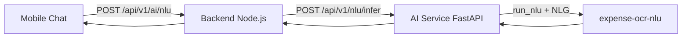

# Luồng Intent Action — Phân tích hiện trạng & Kế hoạch triển khai

Tài liệu mô tả luồng **nhận dạng và xử lý câu thoại hành động** (Intent Action) trong hệ thống: Mobile → Backend Node.js → AI Service → expense-ocr-nlu.

---

## 0.1 Emotion vs giọng nói (Dui Dẻ / Dận Dữ)

| Khái niệm | Vai trò | Nguồn |
|-----------|---------|--------|
| **verbalStyle** (`funny` / `strict`) | Chọn template NLG (`hai_huoc` / `dan_doi`) | Settings → BE `mapVerbalStyleToNlgPersona()` → `nlg_persona` |
| **Quan hệ đặc biệt** | Override giọng (CHA_ME, NGUOI_YEU) — **không** đổi phong cách Dui/Dận cơ bản | `relationship_override` trong `prompts.json` + `build_nlg_prompt()` |
| **`nlg_persona`** | Giọng NLG (`hai_huoc`, `dan_doi`, …) — **không** dùng làm ảnh sticker | BE → AI Service `nlg_persona` (alias cũ: `emotion` request) |
| **`mimo_emotion`** (LLM output) | Tên file PNG: `assets/MiMo/emotions/{Name}.png` | `gemini_json.mimo_emotion` (alias: `emotion` trong block LLM) |
| **`llm_emotion` / `mascot_mood`** | Alias API/mobile = `mimo_emotion` | AI Service chuẩn hóa trước khi trả về |

**Cùng một `LlmMimoReply` (text + emotionAsset), hai cách hiển thị:**

| Ngữ cảnh | Text LLM | Emotion LLM |
|----------|----------|-------------|
| **Chat** | Chat response (bubble) | Emoji (sticker `_ChatEmotionSticker`) |
| **Add story / feed** | Comment AI (`aiComment`) | Avatar (`mascotMood` → `assets/MiMo/emotions/…`) |

Mobile: `LlmMimoReply.fromNlu(nlu)` → `.text` + `.emotionAsset`; lưu story qua `.toStoryPersistFields()`.

- Header chat: `personalityMascotAsset(verbalStyle)` — avatar **phong cách** (Cool/Angry), không phải emotion từng câu.
- Fallback emotion A: `Record`→Success, `Action`→Thinking, `Chitchat`→Hello.

---

## 0. Kiến trúc tổng quan



**Ba nhãn intent chính:**

| Intent | Ý nghĩa | Ví dụ |
|--------|---------|-------|
| `Record` | Ghi chép giao dịch mới | "Phở 50k", "Lương về 12tr" |
| `Action` | Thao tác trên dữ liệu đã có | "Tổng chi tuần này", "Đặt hạn mức 10tr", "Xóa giao dịch vừa rồi" |
| `Chitchat` | Tán gẫu, không liên quan tiền | "Chào Mimo", "Cảm ơn nha" |

> Câu kiểu *"Tháng này tiêu bao nhiêu?"* thuộc **Action** (không có intent riêng "Analytics"). `action_type` thường là `REPORT_GENERAL` hoặc `Report`.

---

## 1. Luồng lý tưởng (mục tiêu sản phẩm)

Ví dụ: *"Tổng chi tiêu của tuần này"*

### Bước 1 — Tiếp nhận đầu vào (Trigger)

- User nhập câu chat kèm **User ID** và **thời điểm gửi** (ví dụ: Chủ Nhật 31/05/2026).
- Hệ thống lưu tin nhắn user vào chat session.

### Bước 2 — Nhận diện ý định & trích xuất thực thể (NLU)

- **Intent:** `Action` (xem báo cáo, không phải ghi chi mới).
- **Entity thời gian:** `"Tuần này"` (qua NER slot `TIME`).
- **Action type:** `REPORT_GENERAL` hoặc `Report`.

### Bước 3 — Quy đổi thời gian sang khoảng ngày (Date Parsing)

- Hôm nay: 31/05/2026 (Chủ Nhật).
- Đầu tuần (Thứ Hai): 25/05/2026.
- **Output:** `from = 2026-05-25 00:00:00`, `to = 2026-05-31 23:59:59`.

### Bước 4 — Truy vấn & tính toán (Database Query)

- Tính **tổng chi** và **số giao dịch** trong khoảng thời gian + User ID.
- **Gom nhóm theo danh mục**, sắp xếp từ cao → thấp.

### Bước 5 — Đóng gói & hiển thị (Render UI)

- Story tổng kết trong chat: tiêu đề kỳ, tổng tiền, số lần chi, biểu đồ danh mục.
- Lời thoại AI ngắn gọn dựa trên **số liệu thật** (không bịa).

---

## 2. Luồng thực tế trong code (hiện trạng)

### 2.1 Mobile (`app/frontend/mobile/lib/screens/chat/chat_screen.dart`) — **đã cập nhật**

1. Lưu tin user → `POST /api/v1/chat/...`
2. Gọi NLU → `aiNlu(text, runLlm: true)` → `POST /api/v1/ai/nlu`
   - Backend **tự gắn `profile`** ví (spent_week/month) khi client không gửi.
3. Parse NLU an toàn; hiển thị:
   - **Text:** `gemini_json.story` hoặc `response` (hoặc `nlg_response`)
   - **Mascot sticker:** `gemini_json.emotion` (PascalCase, khớp `assets/MiMo/emotions/`) — **không** dùng `mascot_mood`/verbalStyle cho UI
4. Nếu `intent == 'Action'`:
   - Báo cáo (`REPORT_*`): backend `_enrichNluWithAction` → `action_result` + story có số liệu thật → card báo cáo trong chat (không navigate Report).
   - LIMIT/DELETE/GOAL/SEARCH: card xác nhận; gọi `GET is-confirmed` rồi `POST actions/execute` khi user bấm.
   - SETTING: mở Settings.
5. `_handleActionConfirm` / `aiExecuteAction`:

| `action_type` chứa | Hành vi thực tế |
|--------------------|-----------------|
| `REPORT` | Navigate sang màn Report (range mặc định "7 ngày") |
| `LIMIT` | Mở màn hạn mức |
| `SETTING` | Mở Settings |
| `GOAL` | Mở Goals |
| `DELETE_RECORD` | Xóa giao dịch gần nhất qua API |

5. Gọi `POST /api/v1/ai/actions/confirm` — **chỉ lưu DB**, không thực thi logic nghiệp vụ server.

**Chưa dùng:** `GET /api/v1/ai/actions/is-confirmed` (API có sẵn, mobile không gọi).

### 2.2 Backend Node.js (`app/backend/src/modules/ai/`) — **đã cập nhật**

**`nluInfer(userId, payload)`:**

- `emotion` gửi sang AI Service = **giọng prompt** (`funny`→`hai_huoc`, `strict`→`dan_doi`) — quyết định *cách viết*, không phải file PNG.
- Tự fetch `profile` ví khi thiếu.
- Sau NLU: `_enrichNluWithAction` — nếu `REPORT_*` thì query `statsService.dashboard`, gắn `action_result`, `time_range`, cập nhật `gemini_json.story` + `emotion`.

**Endpoints Action:**

| Endpoint | Vai trò |
|----------|---------|
| `POST /api/v1/ai/nlu` | Proxy NLU |
| `POST /api/v1/ai/actions/confirm` | Lưu `user_confirmed_actions` |
| `POST /api/v1/ai/actions/reject` | Log `action_rejected_log` |
| `GET /api/v1/ai/actions/is-confirmed` | Tra cứu đã confirm chưa |

**Đã có:** `POST /api/v1/ai/actions/execute` (limit, delete, search, goal, tone, report data). Báo cáo trong luồng chat chủ yếu qua enrich trên `POST /ai/nlu`.

### 2.3 AI Service (`app/ai-service/`)

- `NLUService.infer()` → real pipeline hoặc mock fallback.
- Chuẩn hóa output: `intent`, `action_type`, `action_details`, `amount`, `gemini_json`, `mascot_mood`, `backend`.
- Mock: keyword `"tổng chi"`, `"báo cáo"` → `Action` nhưng **`action_type: null`**.

### 2.4 expense-ocr-nlu (`expense-ocr-nlu/src/`)

#### Phân loại Intent (`pipeline.py`)

```
classify_intent (encoder / TF-IDF)
    ↓
is_action_query guard (regex) → ép Action nếu khớp câu báo cáo/tổng chi
    ↓
intent ∈ { Record, Action, Chitchat }
```

**Regex guard** (`action_query.py`, bật mặc định `USE_ACTION_QUERY_GUARD=1`):

- Bắt: *"tổng chi"*, *"tháng này tiêu bao nhiêu"*, *"xem báo cáo"*, …
- Loại trừ: câu ghi chi có tiền (`chi 50k`), câu *"mẹ cho"*.

#### Phân loại Action Type (khi intent = Action)

```
predict action_type (encoder / TF-IDF)
    ↓
SYSTEM_SETTING → Setting
    ↓
report_general_action_type (regex override) → REPORT_GENERAL | Report
    ↓
NER → action_details { verb, target, target_type, value, time, ... }
action_param = số tiền đầu tiên trong câu (nếu có)
```

**Các `action_type` đã map** (`action_executor.py`):

| Nhóm | action_type |
|------|-------------|
| Báo cáo | `Report`, `REPORT_GENERAL`, `REPORT_COMPARE` |
| Tìm / sửa | `Search`, `SEARCH_RECORD`, `Edit`, `UPDATE_RECORD`, `DELETE_RECORD` |
| Cài đặt | `Setting`, `SET_LIMIT`, `SET_GOAL`, `ADD_GOAL`, `SET_ALERT`, `SET_TONE`, `SET_USERNAME`, `SET_INCOME`, `EXPORT_DATA` |

#### Context & LLM

- `build_context_metadata()` — với Action: `spent_today/week/month`, so sánh `new_value` vs `old_value`.
- `attach_nlg_and_llm()` khi `run_llm=true` → Gemini/Groq sinh `story` + `emotion`.
- Prompt Action: câu xác nhận ngắn, không bịa giao dịch.
- Fallback không LLM: `action_ack` cố định.

#### Action Executor

- `describe_action_execution()` — **chỉ mô tả demo** API sẽ gọi, **không kết nối DB/API thật**.

---

## 3. Ví dụ end-to-end hiện tại

**Input:** *"Tổng chi tiêu tuần này"*

```
User gõ câu
    ↓
Mobile: POST /ai/nlu { text, runLlm: true }   ← không có profile
    ↓
Backend: proxy + emotion từ user_settings
    ↓
AI Service → expense-ocr-nlu:
    • intent → Action (model + regex guard)
    • action_type → REPORT_GENERAL
    • NER → action_details.time = ["tuần này"] (nếu model nhận)
    • context_meta → spent_week = 0 (profile rỗng)
    • LLM → story xác nhận (có thể thiếu số liệu thật)
    ↓
Mobile:
    • Hiện bubble LLM + card "REPORT_GENERAL"
    • Sau 1.5s → confirmAction + navigate Report screen
    • Report screen load stats range "7 ngày" (không biết user hỏi "tuần này")
```

---

## 4. So sánh mục tiêu vs hiện trạng (cập nhật 2026)

| Bước | Mục tiêu | Hiện trạng |
|------|----------|------------|
| 1. Nhận text + userId | ✅ | ✅ |
| 2. NLU intent + entity thời gian | ✅ | ✅ intent + `action_type`; `inferTimeRangeFromText` trên BE |
| 3. Parse "tuần này" → khoảng ngày | ✅ | ✅ BE fallback parser (hôm nay/tuần này/tháng này/7 ngày) |
| 4. Query PostgreSQL tổng chi + gom danh mục | ✅ | ✅ `executeReport` trong enrich NLU |
| 5. Story tổng kết trong chat | ✅ | ✅ Bubble + `_ReportStoryCard`; thu nhập qua `REPORT_INCOME` |
| 6. Emotion mascot đúng asset | ✅ | ✅ `gemini_json.emotion` → `resolveLlmDisplayEmotion()` |

---

## 5. Hạn chế cần khắc phục

1. **Không parse thời gian** — entity `TIME` trong `action_details` không được chuyển thành `from`/`to`.
2. **Không query DB theo Action** — stats API (`/stats/...`) tồn tại riêng cho màn Report, không gắn NLU.
3. **Mobile không gửi profile** — LLM thiếu `spent_week/month` thật.
4. **Executor chỉ demo** — BE chưa có API thực thi Action (ví dụ `GET /reports/summary`).
5. **UX mâu thuẫn** — vừa popup confirm, vừa auto-execute sau 1.5s; không dùng `is-confirmed`.
6. **`action_signature` không ổn định** — `{actionType}_{hashCode}` thay đổi theo từng câu.
7. **Mock NLU** — trả `Action` nhưng `action_type: null` → mobile hiển thị `Unknown`.

---

## 6. Các bước cần làm tiếp theo

Thứ tự đề xuất theo dependency — làm tuần tự từ Phase 1 trước khi sang Phase 2.

---

### Phase 1 — Nền tảng dữ liệu & NLU (bắt buộc)

#### 1.1 Module parse thời gian tiếng Việt

**File đề xuất:** `expense-ocr-nlu/src/nlu/time_parser.py`

- Input: slot `TIME` từ NER hoặc regex fallback trên full text.
- Hỗ trợ: `hôm nay`, `tuần này`, `tháng này`, `quý này`, `hôm qua`, `tuần trước`, `tháng trước`, `7 ngày qua`, …
- Output chuẩn:

```json
{
  "period_label": "Tuần này (25/05 - 31/05/2026)",
  "from": "2026-05-25T00:00:00+07:00",
  "to": "2026-05-31T23:59:59+07:00",
  "granularity": "week"
}
```

- Gắn vào pipeline sau nhánh Action: `result["time_range"] = parse_time_range(...)`.
- Unit test với anchor date cố định (mock `datetime.now`).

#### 1.2 Backend — API thực thi Action (báo cáo)

**File đề xuất:** `app/backend/src/modules/ai/action.service.js` + route mới.

```
POST /api/v1/ai/actions/execute
Body: {
  actionType: "REPORT_GENERAL",
  timeRange: { from, to, period_label },
  walletId?: uuid,
  categoryCode?: string   // cho action_type Report theo danh mục
}
Response: {
  total_expense, total_income, transaction_count,
  by_category: [{ categoryCode, label, total, percent }],
  period_label
}
```

- Tái sử dụng logic SQL từ `stats.service.js` (`dashboard`, `byCategory`).
- Filter theo `from`/`to` thay vì hardcode `week`/`month`.

#### 1.3 Gắn profile vào luồng chat NLU

**Sửa:** `app/backend/src/modules/ai/ai.service.js` → `nluInfer()`

- Tự động fetch `_fetchWalletProfile(userId, walletId)` khi client không gửi profile.
- Truyền profile vào AI Service để `build_context_metadata` có `spent_week/month` thật.

**Sửa (tuỳ chọn):** `api_client.dart` — có thể bỏ qua nếu BE tự enrich.

---

### Phase 2 — Nối NLU → DB → LLM (luồng REPORT)

#### 2.1 Thực thi Action sau NLU (server-side)

**Luồng mới trong Backend hoặc AI Service:**

```
POST /ai/nlu (text)
    → NLU: intent=Action, action_type=REPORT_GENERAL, time_range=...
    → Nếu action_type ∈ { REPORT_GENERAL, Report, REPORT_COMPARE }:
         gọi action.service.executeReport(time_range, walletId)
    → Inject kết quả vào context_metadata / action_facts trước khi gọi LLM
    → LLM chỉ **tóm tắt** số liệu có sẵn, không được bịa
```

**Response mở rộng:**

```json
{
  "intent": "Action",
  "action_type": "REPORT_GENERAL",
  "time_range": { ... },
  "action_result": {
    "total_expense": 1450000,
    "transaction_count": 8,
    "by_category": [ ... ]
  },
  "gemini_json": { "story": "...", "emotion": "Thinking" }
}
```

#### 2.2 Cập nhật prompt Action

**File:** `expense-ocr-nlu/src/nlg/prompt.py` + `prompts.json`

- Thêm block `ACTION_FACTS` (JSON số liệu thật) vào user prompt.
- Rule: *"Chỉ dùng số trong ACTION_FACTS; nếu thiếu thì nói không có dữ liệu, không ước lượng."*

#### 2.3 Mobile — hiển thị Story báo cáo trong chat

**Sửa:** `chat_screen.dart`

- Thêm widget `_ReportStoryPreview` (tương tự `_TxPreview`):
  - Tiêu đề kỳ (`period_label`)
  - Tổng chi + số giao dịch
  - Top 3–5 danh mục (bar / list)
- Render khi `intent == Action` && `action_result != null`.
- **Không navigate** sang Report screen nếu đã có story đủ dữ liệu (hoặc thêm nút "Xem chi tiết").

---

### Phase 3 — UX Action & các loại action khác

#### 3.1 Sửa luồng confirm

| Việc | Chi tiết |
|------|----------|
| Bỏ auto-execute 1.5s | Chỉ thực thi khi user bấm **Xác nhận** |
| Dùng `is-confirmed` | Trước popup: `GET /ai/actions/is-confirmed?actionSignature=...` → skip popup nếu đã confirm |
| Signature ổn định | Pattern: `REPORT_GENERAL\|week\|current` thay vì hash full text |
| Phân loại cần confirm | `SET_LIMIT`, `DELETE_RECORD` → bắt confirm; `REPORT_GENERAL` → có thể auto nếu đã confirm pattern |

#### 3.2 Thực thi Action không phải Report

| action_type | Backend API cần có | Mobile sau confirm |
|-------------|-------------------|-------------------|
| `SET_LIMIT` | `PUT /budgets/limit` (category + amount) | Cập nhật + toast thành công |
| `SET_GOAL` / `ADD_GOAL` | `POST /goals` | Navigate Goals + prefill |
| `DELETE_RECORD` | `DELETE /transactions/last` hoặc by id | Giữ logic hiện tại, thêm confirm rõ |
| `SET_TONE` | `PATCH /settings` (`verbalStyle`) | Cập nhật settings |
| `SEARCH_RECORD` | `GET /transactions?query=...` | Hiện list kết quả trong chat |

**Thay `action_executor.py` demo** bằng gọi HTTP client thật (hoặc delegate về Backend).

#### 3.3 Mock NLU

**Sửa:** `mock_pipeline.py`

- Khi detect Action keyword → gán `action_type: "REPORT_GENERAL"` (không để `null`).

---

### Phase 4 — Chất lượng & vận hành

#### 4.1 Test

- Unit test `time_parser.py` (≥ 20 câu mẫu).
- Integration test: `"Tổng chi tuần này"` → response có `action_result.total_expense >= 0`.
- E2E Flutter: gửi câu Action → thấy story + số liệu.

#### 4.2 Logging & correction loop

- Log `action_executed` vào `ai_logs` (input text, action_type, time_range, result summary).
- Khi user **Bỏ qua** → đã có `action_rejected_log`; dùng cho retrain.

#### 4.3 Biến môi trường

| Biến | Ý nghĩa |
|------|---------|
| `USE_ACTION_QUERY_GUARD=1` | Bật regex ép Action (giữ bật) |
| `RUN_LLM=1` | Bật LLM cho Action sau khi có ACTION_FACTS |
| `USE_REAL_NLU=true` | AI Service dùng pipeline thật |

---

## 7. Checklist triển khai (tóm tắt)

- [x] **1.1** `time_parser.py` + test
- [x] **1.2** `POST /ai/actions/execute` (report)
- [x] **1.3** Backend auto-enrich profile trong `nluInfer`
- [x] **2.1** Inject `action_result` sau NLU + trước LLM (template story)
- [x] **2.2** Prompt Action dùng ACTION_FACTS (khi có trong context)
- [x] **2.3** Widget Story báo cáo trong chat
- [x] **3.1** Sửa UX confirm (bỏ auto 1.5s, dùng is-confirmed)
- [x] **3.2** API + mobile cho SET_LIMIT, DELETE, SEARCH, SET_TONE, SET_GOAL
- [x] **3.3** Mock NLU trả `action_type` hợp lệ
- [x] **4.x** Test cơ bản (time_parser, action.service, mock NLU)

---

## 8. File tham chiếu trong repo

| Thành phần | Đường dẫn |
|------------|-----------|
| NLU pipeline | `expense-ocr-nlu/src/nlu/pipeline.py` |
| Regex guard Action | `expense-ocr-nlu/src/nlu/action_query.py` |
| Action executor (demo) | `expense-ocr-nlu/src/nlu/action_executor.py` |
| Context metadata | `expense-ocr-nlu/src/nlg/context_meta.py` |
| NLG prompt | `expense-ocr-nlu/src/nlg/prompt.py` |
| API NLU gốc | `expense-ocr-nlu/src/api/app.py` |
| AI Service adapter | `app/ai-service/app/adapters/expense_ocr_nlu.py` |
| NLU service | `app/ai-service/app/services/nlu_service.py` |
| Backend AI | `app/backend/src/modules/ai/ai.service.js` |
| Mobile chat | `app/frontend/mobile/lib/screens/chat/chat_screen.dart` |
| Stats (tái sử dụng) | `app/backend/src/modules/stats/stats.service.js` |
| Mapping I/O | `expense-ocr-nlu/Input - Output Mapping.md` |
| Kiến trúc triển khai | `expense-ocr-nlu/ARCHITECTURE_TRIEN_KHAI.md` |

---

*Tài liệu cập nhật: 31/05/2026 — phản ánh hiện trạng codebase trước khi triển khai Phase 1.*
