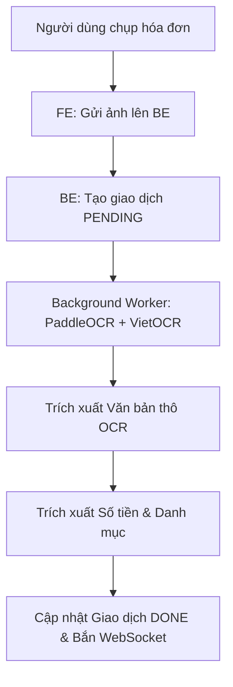
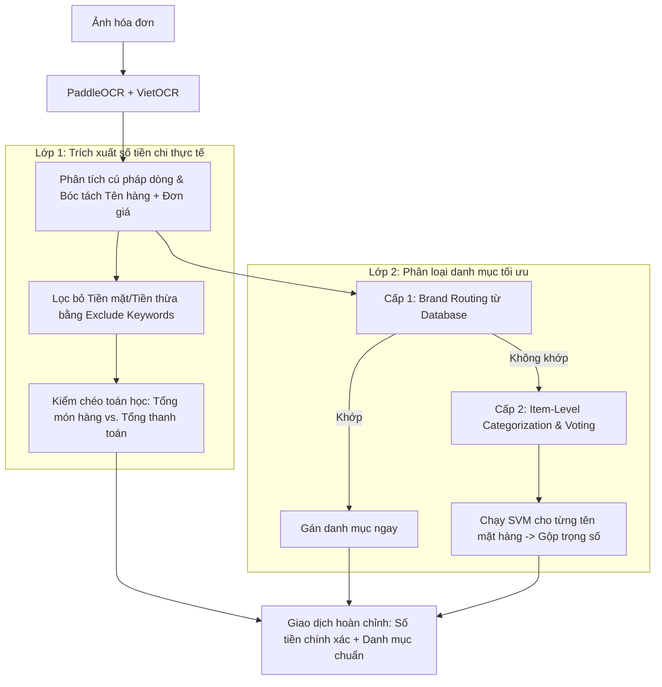
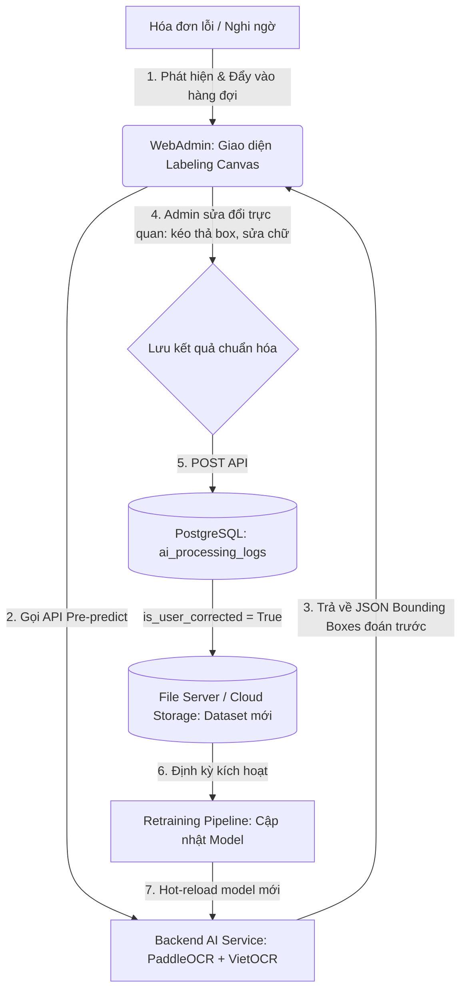

# BÁO CÁO PHÂN TÍCH VÀ ĐỀ XUẤT CẢI TIẾN HỆ THỐNG OCR & PHÂN LOẠI HÓA ĐƠN
**Dự án:** Hệ thống quản lý chi tiêu cá nhân dạng Story
**Vai trò:** Chuyên gia Kiến trúc Hệ thống AI & Trưởng nhóm QA
**Trọng tâm:** Tối ưu hóa Luồng Nhận dạng Bill-Only (Không có Text bổ trợ từ người dùng)

---

## PHẦN 1: ĐÁNH GIÁ LUỒNG HIỆN TRẠNG TRONG BỐ CẢNH THỰC TẾ (BILL-ONLY)

Hiện tại, ứng dụng di động chỉ hỗ trợ người dùng **chụp/quét ảnh hóa đơn (Bill-Only)** và không có phần nhập văn bản mô tả đi kèm. 



### 1. Phân tích điểm nghẽn cốt lõi (SPOF - Single Point of Failure)
Khi không có văn bản nhập tay của người dùng để bổ trợ ngữ cảnh hoặc đính kèm số tiền mong muốn:
* **OCR là nguồn dữ liệu duy nhất:** Bất kỳ lỗi sai lệch nào từ mô hình OCR (PaddleOCR phát hiện thiếu box, VietOCR đọc sai số/ký tự tiếng Việt) đều lập tiếp dẫn đến việc hiển thị sai lệch thông tin trên Story Timeline.
* **Mất đi lớp kiểm chứng chéo (No Cross-validation from Text):** Quy tắc ưu tiên cũ (Logic Fusion) không còn đối tượng để kết hợp. Hệ thống phụ thuộc 100% vào việc phân tích cú pháp chữ thô từ hóa đơn.
* **Hạn chế của mô hình SVM trên văn bản hóa đơn thô:** 
  Hóa đơn chứa rất nhiều từ rác (địa chỉ, số điện thoại, mã số thuế, tên nhân viên thu ngân). Khi đưa toàn bộ văn bản thô này vào model TF-IDF + SVM để phân loại danh mục, các từ rác có tần suất xuất hiện cao sẽ làm loãng đặc trưng, dẫn đến phân loại danh mục sai lệch nghiêm trọng.

---

## PHẦN 2: CÁC ĐIỂM NGHẼN & KỊCH BẢN LỖI CHÍNH (AMOUNT & CATEGORY)

QA đã xác định 4 kịch bản lỗi thực tế phổ biến nhất khiến hệ thống nhận diện sai lệch Số tiền hoặc Danh mục:

### 1. Sai lệch số tiền do các dòng thanh toán phụ (VAT, Chiết khấu, Tiền mặt, Tiền thối)
Một hóa đơn thông thường có cấu trúc phần chân (Footer) rất phức tạp:
```text
Cộng tiền hàng:   150.000
Chiết khấu (10%):  15.000
Thuế GTGT (VAT):   13.500
Tổng thanh toán:  148.500
Tiền khách đưa:   500.000
Tiền thối lại:    351.500
```
* **Lỗi hệ thống:** Nếu thuật toán chỉ tìm "số lớn nhất" hoặc quét dòng tổng cộng không lọc kỹ, nó sẽ nhận diện nhầm số tiền đã chi là **500.000** (Tiền khách đưa) hoặc **150.000** (Cộng tiền hàng trước chiết khấu) thay vì con số thực tế người dùng phải trả là **148.500**.

### 2. Sai lệch danh mục do hóa đơn Siêu thị/Cửa hàng tiện lợi (Mixed-Category Receipts)
* **Tình huống:** Người dùng đi Circle K hoặc WinMart mua: 2 chai nước ngọt (Food), 1 bánh mì (Food), 1 tuýp kem đánh răng (Essentials) và 1 chiếc bấm móng tay (Shopping).
* **Lỗi hệ thống:** SVM phân loại trên toàn bộ văn bản thô sẽ đưa ra một nhãn duy nhất (ví dụ: `Food`). Điều này làm lu mờ các khoản chi tiêu khác, hoặc nếu nhãn dự đoán bị lệch thành `Others`, người dùng sẽ phải sửa lại bằng tay.

### 3. Sai lệch danh mục do Thương hiệu/Cửa hàng lạ (Unseen Merchants)
* **Tình huống:** Hóa đơn ghi tên cửa hàng viết tắt hoặc thương hiệu nhỏ (Ví dụ: *"Tạp hóa Cô Năm"*, *"Tiệm bánh M.L"*).
* **Lỗi hệ thống:** SVM/TF-IDF chưa được huấn luyện trên từ khóa này. Do không có text của người dùng (ví dụ: "mua bánh sinh nhật"), hệ thống hoàn toàn mất phương hướng và phân loại thành `Others`.

### 4. Lỗi nhận dạng số tiền do OCR mất nét (Digit Drop/Shift)
* **Tình huống:** Ảnh chụp bị mờ, số tiền `120.000` bị nhận diện thiếu một số 0 thành `12.000` hoặc dấu chấm phân tách hàng nghìn bị đọc nhầm thành dấu phẩy thập phân khiến số tiền thành `120` đồng.
* **Lỗi hệ thống:** Không có cơ chế kiểm tra chéo toán học (Mathematical Cross-Validation) để phát hiện sự phi lý của con số này so với giá trị của từng món hàng cộng lại.

---

## PHẦN 3: ĐỀ XUẤT GIẢI PHÁP KỸ THUẬT (GIỮ NGUYÊN TECH STACK CORES)

Để giải quyết triệt để các vấn đề trên mà không thay đổi core Tech Stack (PaddleOCR + VietOCR, SVM, PostgreSQL), chúng ta sẽ thiết kế một bộ **Receipt Processing Pipeline** thông minh gồm 3 lớp bảo vệ:



### 1. Giải pháp Nhận dạng Số tiền thực chi chính xác nhất
* **Bước 1: Lập danh sách Exclude Keywords (Từ khóa loại trừ):** 
  Loại bỏ các dòng chứa số tiền đại diện cho tiền khách đưa (`tiền mặt`, `khách đưa`, `cash`, `received`) hoặc tiền thừa (`tiền thối`, `tiền thừa`, `thối lại`, `change`).
* **Bước 2: Phân tích thứ tự ưu tiên dòng tổng cộng:**
  Ưu tiên các dòng chứa từ khóa chỉ định số tiền thực tế người dùng phải trả: `tổng thanh toán`, `thực thu`, `thực trả`, `tổng cộng phải trả`, `momo`, `chuyển khoản`, `thẻ`.
* **Bước 3: Kiểm chéo toán học (Mathematical Consistency Check):**
  Tính tổng tiền của tất cả các dòng mặt hàng (item lines) được trích xuất. Nếu tổng các dòng hàng gần bằng con số tổng cộng nhận diện được (sai lệch < 5%), ta tin tưởng hoàn toàn vào con số này. Nếu con số tổng cộng bị đọc thiếu nét (ví dụ: `15.000` trong khi tổng các món hàng cộng lại là `150.000`), hệ thống tự động sửa đổi số tiền thành `150.000` và ghi nhận cảnh báo.

### 2. Giải pháp Nhận dạng Danh mục chính xác cho Bill (Tương thích với Giải pháp B - Tách Giao dịch)
* **Cấp 1: Ánh xạ thương hiệu đơn ngành (Single-Category Brand Routing):**
  * Đối với các hóa đơn thuộc chuỗi cửa hàng đơn ngành (Ví dụ: `Highlands Coffee`, `Phúc Long` $\rightarrow$ `Food`; `Pharmacity`, `Long Châu` $\rightarrow$ `Health`; `Zara`, `Uniqlo` $\rightarrow$ `Shopping`).
  * Khi OCR quét được tên thương hiệu ở đầu hóa đơn, lập tức định tuyến **toàn bộ các mặt hàng** trong bill sang danh mục đó với độ tin cậy $100\%$. Điều này giúp bỏ qua việc chạy SVM cho từng món hàng riêng lẻ, tránh sai sót khi tên món viết tắt và tiết kiệm tài nguyên.
* **Cấp 2: Phân loại cấp mặt hàng & Gom nhóm Giao dịch (Item-Level Classification & Grouping):**
  * Đối với các hóa đơn từ siêu thị đa ngành hoặc cửa hàng tiện lợi (Ví dụ: `WinMart`, `Circle K`, `GS25`, `Lotte Mart`).
  * Hệ thống bỏ qua bước Brand Routing toàn bộ và thực hiện phân loại chi tiết từng món hàng:
    1. Trích xuất tên của từng mặt hàng và đưa qua model SVM để gán nhãn danh mục độc lập (Ví dụ: *"Cà phê lon"* $\rightarrow$ `Food` (0.95), *"Khẩu trang"* $\rightarrow$ `Health` (0.90)).
    2. Gom nhóm các mặt hàng có cùng danh mục lại với nhau và tính tổng tiền của từng nhóm.
    3. Tạo các bản ghi giao dịch (`transactions`) riêng lẻ cho từng nhóm danh mục tìm được dưới cùng một ảnh hóa đơn (`story_items`), tận dụng triệt để quan hệ 1-N của cơ sở dữ liệu.
* **Cơ chế Fallback (Khi tắt chế độ Tách Giao dịch - `SPLIT_MODE = False`):**
  * Nếu hệ thống được cấu hình chỉ trả về 1 danh mục đại diện duy nhất, ta áp dụng công thức **Bỏ phiếu có trọng số (Weighted Voting by Value)** dựa trên giá trị của các danh mục con:
    $$\text{Score}(C) = \sum_{i \in \text{Items of Category } C} \text{Price}_i \times \text{Confidence}_i$$
    Danh mục con nào có điểm số cao nhất sẽ đại diện cho toàn bộ hóa đơn.


---

### 3. Mã giả Python (Pseudo-code) tối ưu luồng xử lý Bill-Only

Dưới đây là mã giả thể hiện hàm `predict_expense_bill_only` tích hợp các giải pháp trên:

```python
import re
from datetime import datetime
from typing import Any, Dict, List, Optional, Tuple

# === ĐỊNH NGHĨA TỪ KHÓA BẰNG REGEX ===
RE_EXCLUDE_AMOUNT = re.compile(
    r"tien\s*mat|khach\s*dua|tien\s*khach|cash|received|tra\s*lai|tien\s*thua|thoi\s*lai|change", 
    re.I
)
RE_TOTAL_KEYWORDS = re.compile(
    r"tong\s*thanh\s*toan|thuc\s*thu|thuc\s*tra|phai\s*thanh\s*toan|tong\s*cong|thanh\s*tien|total", 
    re.I
)
RE_DISCOUNT_KEYWORDS = re.compile(
    r"chiet\s*khau|giam\s*gia|khuyen\s*mai|promo|discount", 
    re.I
)

# === GIẢ ĐỊNH CÁC HÀM TỪ TECH STACK CORES ===
def query_brand_routing_db(merchant_name: str) -> Optional[str]:
    """Truy vấn bảng PostgreSQL để lấy danh mục từ thương hiệu cửa hàng (nếu có)."""
    # SELECT category FROM brand_routing WHERE brand_name ILIKE ...
    pass

def predict_svm_category(item_name: str) -> Tuple[str, float]:
    """Sử dụng TF-IDF + SVM hiện có để dự đoán danh mục cho một chuỗi text ngắn."""
    pass

def parse_date_format(text: str) -> Optional[datetime]:
    """Tìm và parse chuỗi ngày tháng từ dòng text."""
    pass

def get_image_exif_date(image_path: str) -> Optional[datetime]:
    """Trích xuất ngày chụp từ EXIF metadata của ảnh."""
    pass

# === PIPELINE XỬ LÝ CHÍNH ===
def predict_expense_bill_only(image_path: str, ocr_lines: List[str], client_metadata: Dict[str, Any]) -> Dict[str, Any]:
    system_date_str = client_metadata.get("system_date", datetime.now().strftime("%Y-%m-%d"))
    system_date = datetime.strptime(system_date_str, "%Y-%m-%d")
    
    # 1. Trích xuất danh sách mặt hàng, giá tiền và các số tiền tổng cộng
    items: List[Tuple[str, int]] = []  # Lưu (tên_mặt_hàng, giá_tiền)
    detected_amounts: List[Tuple[str, int]] = []  # Lưu (nội_dung_dòng, số_tiền)
    
    for line in ocr_lines:
        line_clean = line.strip()
        # Tìm các con số biểu thị tiền tệ trong dòng
        numbers = [int(num.replace(".", "").replace(",", "")) for num in re.findall(r"\b\d{1,3}(?:[.,]\d{3})+\b|\b\d{4,9}\b", line_clean)]
        if not numbers:
            continue
            
        # Kiểm tra nếu là dòng mô tả mặt hàng (Ví dụ: "1  Coca Cola  15.000  15.000")
        # Thường có cấu trúc: Tên hàng + Số lượng + Đơn giá + Thành tiền
        is_item_line = len(numbers) >= 1 and not RE_TOTAL_KEYWORDS.search(clean_and_normalize_text(line_clean))
        if is_item_line:
            item_price = numbers[-1]  # Lấy con số cuối cùng của dòng hàng làm thành tiền của item
            # Loại bỏ các số khỏi dòng để lấy tên mặt hàng sạch
            item_name = re.sub(r"\d{1,3}(?:[.,]\d{3})+\b|\b\d{4,9}\b|[\d.,]+", "", line_clean).strip()
            if len(item_name) > 2:
                items.append((item_name, item_price))
        
        # Lưu lại tất cả các số tiền để phân tích
        for num in numbers:
            detected_amounts.append((line_clean, num))

    # 2. XỬ LÝ SỐ TIỀN CHI TIÊU THỰC TẾ (Amount Extraction Optimization)
    final_amount = None
    warnings = []
    
    # Lọc tìm dòng tổng cộng chính thức (loại trừ các dòng tiền mặt khách đưa/tiền thừa)
    total_candidates = []
    for line, amt in detected_amounts:
        line_normalized = clean_and_normalize_text(line)
        if RE_TOTAL_KEYWORDS.search(line_normalized) and not RE_EXCLUDE_AMOUNT.search(line_normalized):
            total_candidates.append(amt)
            
    if total_candidates:
        # Ưu tiên số tiền xuất hiện ở dòng tổng cộng cuối cùng
        final_amount = total_candidates[-1]
    else:
        # Nếu không có dòng tổng cộng rõ ràng, tính tổng của các mặt hàng
        if items:
            final_amount = sum(price for _, price in items)
            warnings.append("AMOUNT_SUMMED_FROM_ITEMS")
        elif detected_amounts:
            # Fallback cuối cùng: Lấy số lớn nhất nhưng loại trừ số tiền khách đưa/tiền thừa
            filtered_amts = []
            for line, amt in detected_amounts:
                line_normalized = clean_and_normalize_text(line)
                if not RE_EXCLUDE_AMOUNT.search(line_normalized) and 1000 <= amt <= 50000000:
                    filtered_amts.append(amt)
            if filtered_amts:
                final_amount = max(filtered_amts)
                warnings.append("AMOUNT_FALLBACK_MAX_FILTERED")

    # Kiểm chéo toán học (Mathematical Cross-Validation)
    if items and final_amount:
        sum_items = sum(price for _, price in items)
        # Nếu tổng các món hàng lớn gấp 10 lần tổng cộng nhận diện được (Lỗi OCR thiếu số 0)
        if abs(sum_items - final_amount * 10) < (sum_items * 0.05):
            final_amount = sum_items
            warnings.append("AMOUNT_CORRECTED_BY_ITEMS_SUM_SCALE")
        # Hoặc nếu tổng món hàng khớp hoàn toàn nhưng số tiền tổng cộng nhận diện bị lệch nhỏ
        elif abs(sum_items - final_amount) > 1000 and abs(sum_items - final_amount) / sum_items <= 0.05:
            final_amount = sum_items
            warnings.append("AMOUNT_ADJUSTED_TO_ITEMS_SUM")

    # 3. XỬ LÝ DANH MỤC HÓA ĐƠN (Category Classification Optimization)
    final_category = None
    
    # Bước 3.1: Nhận diện thương hiệu (Brand-Level Routing) từ dòng đầu tiên của hóa đơn
    header_text = " ".join(ocr_lines[:3])
    detected_brand_category = query_brand_routing_db(header_text)
    if detected_brand_category:
        final_category = detected_brand_category
    else:
        # Bước 3.2: Phân loại cấp mặt hàng & Bỏ phiếu trọng số (Item-Level Weighted Voting)
        if items:
            category_votes: Dict[str, float] = {}
            for name, price in items:
                cat, confidence = predict_svm_category(name)
                # Tính trọng số phiếu bầu = Giá trị mặt hàng * Độ tự tin của mô hình
                vote_weight = price * confidence
                category_votes[cat] = category_votes.get(cat, 0.0) + vote_weight
                
            if category_votes:
                # Chọn danh mục có tổng trọng số phiếu bầu cao nhất
                final_category = max(category_votes, key=category_votes.get)
                
        # Bước 3.3: Fallback dùng toàn bộ text hóa đơn qua SVM
        if not final_category:
            full_text = " ".join(ocr_lines)
            final_category, _ = predict_svm_category(full_text)

    # 4. XỬ LÝ NGÀY THÁNG HÓA ĐƠN (Date Extraction)
    final_date = None
    date_ocr = None
    for line in ocr_lines:
        parsed_d = parse_date_format(line)
        if parsed_d:
            # Kiểm tra ràng buộc thời gian hợp lệ
            if 0 <= (system_date - parsed_d).days <= 365:
                date_ocr = parsed_d
                break
                
    if date_ocr:
        final_date = date_ocr.strftime("%Y-%m-%d")
    else:
        # Không có ngày trên hóa đơn -> Thử lấy ngày tạo ảnh EXIF
        exif_d = get_image_exif_date(image_path)
        if exif_d and 0 <= (system_date - exif_d).days <= 365:
            final_date = exif_d.strftime("%Y-%m-%d")
            warnings.append("DATE_FROM_EXIF_IMAGE")
        else:
            final_date = system_date_str
            warnings.append("DATE_FALLBACK_SYSTEM")
            
    return {
        "amount": final_amount,
        "category": final_category or "Others",
        "date": final_date,
        "warnings": warnings,
        "items_parsed_count": len(items)
    }

def clean_and_normalize_text(text: str) -> str:
    """Loại bỏ dấu tiếng Việt và chuyển sang viết thường."""
    import unicodedata
    text = unicodedata.normalize("NFD", text or "")
    text = "".join(c for c in text if unicodedata.category(c) != "Mn")
    return text.lower()
```

---

## PHẦN 4: BỘ CHỈ SỐ ĐO LƯỜNG CHẤT LƯỢNG (QA METRICS)

Để đảm bảo hiệu quả của luồng nhận dạng Bill-Only khi đưa vào vận hành thực tế, đội ngũ kỹ thuật và QA cần theo dõi sát sao 4 chỉ số chất lượng chính:

```text
1. Tỷ lệ sửa Số tiền (ACR)     ───>  Mục tiêu: < 5%  (Phản ánh chất lượng bóc tiền thối/VAT)
2. Tỷ lệ sửa Danh mục (CCR)    ───>  Mục tiêu: < 8%  (Phản ánh hiệu quả của Item Voting)
3. Tỷ lệ sai lệch toán học     ───>  Mục tiêu: < 3%  (Độ lệch giữa tổng mặt hàng & số tiền thu)
4. Độ trễ xử lý P95            ───>  Mục tiêu: < 2.5s (Hiệu năng queue nền)
```

1. **Amount Correction Rate (ACR - Tỷ lệ sửa Số tiền):**
   $$\text{ACR} = \frac{\text{Số lượng hóa đơn bị người dùng sửa lại số tiền bằng tay}}{\text{Tổng số hóa đơn được hệ thống xử lý}} \times 100\%$$
   * *Ý nghĩa:* Đo lường độ chính xác của thuật toán trích xuất số tiền. Chỉ số này cần $\le \mathbf{5\%}$ trong sản xuất.
2. **Category Correction Rate (CCR - Tỷ lệ sửa Danh mục):**
   $$\text{CCR} = \frac{\text{Số lượng hóa đơn bị người dùng sửa đổi danh mục phân loại}}{\text{Tổng số hóa đơn được hệ thống xử lý}} \times 100\%$$
   * *Ý nghĩa:* Đánh giá hiệu quả của giải pháp *Item-Level Voting* và *Brand Routing*. Chỉ số này cần $\le \mathbf{8\%}$.
3. **Mathematical Validation Rate (MVR - Tỷ lệ hóa đơn khớp toán học):**
   $$\text{MVR} = \frac{\text{Số lượng hóa đơn có Tổng tiền khớp với Tổng các mặt hàng (sai lệch < 5\%)}}{\text{Tổng số hóa đơn trích xuất được danh sách mặt hàng}} \times 100\%$$
   * *Ý nghĩa:* Đo lường chất lượng đọc từng món hàng của OCR và sự nhất quán của dữ liệu thô.
4. **End-to-End Latency P95 (Độ trễ P95 hoàn thành):**
   * *Ý nghĩa:* Thời gian từ khi người dùng tải ảnh lên cho đến khi nhận được WebSocket báo hoàn thành. Cần đảm bảo $\le \mathbf{2.5\text{ giây}}$ để không tạo cảm giác chờ đợi quá lâu.

---

## PHẦN 5: GIẢI PHÁP XỬ LÝ HÓA ĐƠN HỖN HỢP NHIỀU MẶT HÀNG KHÁC LOẠI (MIXED-CATEGORY RECEIPTS)

Trong thực tế, khi người dùng đi siêu thị (WinMart, Lotte Mart, Co.opmart) hoặc cửa hàng tiện lợi (Circle K, GS25), hóa đơn thường chứa nhiều mặt hàng thuộc các danh mục khác nhau. Để đưa ra danh mục tối ưu nhất, chúng tôi đề xuất 3 giải pháp kiến trúc dưới đây:

### GIẢI PHÁP A: BỎ PHIẾU THEO TỔNG CHI TIÊU (WEIGHTED VOTING BY VALUE)
*Áp dụng khi hệ thống bắt buộc mỗi hóa đơn chỉ được gán duy nhất 1 danh mục chính.*

* **Cách xử lý:** 
  1. Với mỗi mặt hàng trên hóa đơn, chạy model SVM để lấy nhãn danh mục $C$ và độ tự tin $P$.
  2. Tính tổng số tiền chi tiêu thực tế cho từng danh mục:
     $$\text{Total}(C) = \sum (\text{Đơn giá mặt hàng } \times P)$$
  3. Danh mục nào có **tổng số tiền lớn nhất** sẽ được chọn làm danh mục chính của hóa đơn.
* **Ví dụ:** Hóa đơn WinMart tổng cộng `500.000đ`:
  * Mua đồ ăn, nước uống (danh mục `Food`): `120.000đ`
  * Mua áo thun (danh mục `Shopping`): `380.000đ`
  * **Kết quả:** Hóa đơn được phân loại vào danh mục **Shopping** vì có tỉ trọng chi tiêu lớn nhất.
* **Đánh giá:**
  * *Ưu điểm:* Đơn giản cho cả Frontend và Backend, giữ nguyên giao diện Story 1 giao dịch. Phản ánh đúng bản chất dòng tiền (tiền chảy nhiều nhất về đâu).
  * *Nhược điểm:* Làm mất đi tính chính xác của thống kê (khoản 120.000đ chi cho ăn uống bị gán nhầm sang mua sắm).

---

### GIẢI PHÁP B: TỰ ĐỘNG TÁCH GIAO DỊCH (AUTOMATIC TRANSACTION SPLITTING)
*Đây là giải pháp tối ưu nhất cho quản lý tài chính cá nhân (QA & AI Architect Khuyên dùng).*

* **Liên hệ Cơ sở dữ liệu hiện tại:**
  Theo schema tại [CSDL.md](file:///d:/Luan-Van/Project/CSDL.md#L122-L144), bảng `transactions` có quan hệ **Nhiều-Một (Many-to-One)** với bảng `story_items` thông qua khóa ngoại `item_id`.
  
  ```mermaid
  erDiagram
      STORY_ITEMS ||--o{ TRANSACTIONS : "1-N (Một ảnh bill chứa nhiều giao dịch)"
      TRANSACTIONS }|--|| CATEGORIES : "N-1"
  ```
  Hệ thống của chúng ta **đã sẵn sàng về mặt cơ sở dữ liệu** để hỗ trợ tạo nhiều bản ghi `transactions` dưới cùng một `story_items` (ảnh hóa đơn).

* **Cách xử lý:**
  1. Sau khi phân loại cấp mặt hàng bằng SVM, gom nhóm các mặt hàng có cùng danh mục lại với nhau.
  2. Tính tổng số tiền cho từng nhóm danh mục.
  3. Tạo tự động các bản ghi `transactions` riêng biệt trong PostgreSQL có chung `item_id` nhưng khác `category_id` và `amount`.
* **Ví dụ:** Hóa đơn Circle K tổng `100.000đ` được tách thành 2 giao dịch song song:
  * Giao dịch 1: `category_id` = Food (Ăn uống), `amount` = 70.000đ.
  * Giao dịch 2: `category_id` = Essentials (Thiết yếu), `amount` = 30.000đ.
* **Đánh giá:**
  * *Ưu điểm:* Độ chính xác tuyệt đối 100% cho biểu đồ báo cáo tài chính của người dùng. Trải nghiệm người dùng cực kỳ premium (AI tự động chia tiền hộ).
  * *Nhược điểm:* Cần thiết kế lại giao diện hiển thị Story ở Frontend Mobile để hiển thị danh sách các giao dịch con được nhóm dưới một bức ảnh.

---

### GIẢI PHÁP C: ÁNH XẠ DANH MỤC HỖN HỢP / ĐI CHỢ (GENERAL FALLBACK ROUTING)
*Áp dụng khi độ phân tán danh mục quá cao (không có danh mục nào vượt trội).*

* **Cách xử lý:**
  * Nếu không có danh mục nào chiếm trên một ngưỡng tỉ trọng xác định (ví dụ: $60\%$ tổng tiền hóa đơn), hoặc số lượng danh mục con nhiều hơn 3:
  * Tự động chuyển danh mục hóa đơn về một nhãn tổng quát như **Essentials (Đi chợ / Thiết yếu)** thay vì chọn một danh mục cụ thể bị lệch.
* **Đánh giá:**
  * *Ưu điểm:* Tránh gán nhãn quá chi tiết nhưng sai bản chất tổng thể của hóa đơn siêu thị lớn.
  * *Nhược điểm:* Báo cáo tài chính sẽ chứa nhiều khoản "Đi chợ" chung chung, giảm giá trị phân tích hành vi.

---

### MÃ GIẢ PYTHON CHO LOGIC QUYẾT ĐỊNH DANH MỤC TỐI ƯU

Dưới đây là mã giả hàm `resolve_mixed_receipt_categories` tích hợp cả hai chiến lược **Weighted Voting** và **Transaction Splitting** tùy thuộc vào chế độ cấu hình hệ thống (`SPLIT_MODE`):

```python
def resolve_mixed_receipt_categories(
    items: List[Tuple[str, int]], 
    split_mode: bool = True, 
    entropy_threshold: float = 0.60
) -> List[Dict[str, Any]]:
    """
    Xử lý hóa đơn hỗn hợp và trả về danh sách các giao dịch cần tạo.
    items: List của (tên_mặt_hàng, số_tiền)
    """
    if not items:
        return [{"category": "Others", "amount": 0}]
        
    category_totals: Dict[str, int] = {}
    
    # Bước 1: Chạy SVM phân loại từng mặt hàng và cộng dồn tiền
    for name, price in items:
        category, confidence = predict_svm_category(name)
        # Sử dụng confidence làm trọng số hoặc lấy nhãn trực tiếp
        if confidence >= 0.60:
            cat_label = category
        else:
            cat_label = "Others"
            
        category_totals[cat_label] = category_totals.get(cat_label, 0) + price
        
    total_bill_amount = sum(price for _, price in items)
    
    # Bước 2: Ra quyết định dựa trên chế độ hệ thống (Split vs. Single Vote)
    if split_mode:
        # Giải pháp B: Tự động tách thành nhiều giao dịch con
        transactions_to_create = []
        for cat, amt in category_totals.items():
            transactions_to_create.append({
                "category": cat,
                "amount": amt,
                "is_split": True
            })
        return transactions_to_create
    else:
        # Giải pháp A hoặc C: Trả về 1 giao dịch đại diện duy nhất
        # Tìm danh mục có số tiền chi tiêu lớn nhất
        primary_category = max(category_totals, key=category_totals.get)
        primary_amount = category_totals[primary_category]
        
        # Kiểm tra tỷ lệ thống trị (Entropy check)
        dominance_ratio = primary_amount / total_bill_amount
        
        if dominance_ratio >= entropy_threshold:
            # Nếu danh mục lớn nhất chiếm đa số (>= 60%), lấy danh mục đó
            return [{"category": primary_category, "amount": total_bill_amount}]
        else:
            # Giải pháp C: Nếu phân tán quá rộng, fallback về danh mục đi chợ tổng hợp "Essentials"
            return [{"category": "Essentials", "amount": total_bill_amount, "note": "Giao dịch hỗn hợp siêu thị"}]
```


---

## PHẦN 6: GIẢI PHÁP KHẮC PHỤC LỖI NHẬN DẠNG LỆCH DÒNG (ALIGNMENT & LINE SKEW)

Hiện tượng **"lệch dòng/lệch cột"** (râu ông nọ cắm cằm bà kia) là lỗi kinh điển trong bài toán OCR hóa đơn. 
Hóa đơn thường in theo dạng cột: **[Tên mặt hàng]** nằm bên trái, **[Thành tiền]** nằm bên phải. Khi người dùng chụp ảnh bị nghiêng, cong, hoặc khoảng cách giữa hai cột quá xa, hàm gom dòng đơn giản bằng tọa độ Y tuyệt đối (`group_lines` hiện tại) sẽ bị gãy:
* **Lỗi 1 (Ghép cặp chéo):** Giá tiền món A bị gán cho tên món B vì góc chụp nghiêng làm giá món B bị đẩy lên ngang tọa độ Y của món A.
* **Lỗi 2 (Tách dòng hoàn toàn):** OCR đọc toàn bộ cột Tên mặt hàng trước, sau đó mới đọc cột Giá tiền ở dưới cùng, làm mất hoàn toàn mối liên kết ngang.

```text
LỖI GROUP DÒNG DO CHỤP NGHIÊNG:
Món A (Y=100)  ------------\   Giá A (Y=105)
                            \
Món B (Y=120)  ------------  \> Giá B (Y=121)  --> Group nhầm: Món A đi với Giá B
```

Để khắc phục triệt để vấn đề này mà không cần thay đổi OCR engine, chúng tôi đề xuất bộ giải pháp **Ghép cặp Hình học 2D (Geometric Pairing Engine)** tại Backend:

### 1. Thuật toán phân tích độ đè bóng trục Y (Y-Axis Overlap Analysis)
Thay vì dùng ngưỡng khoảng cách Y tuyệt đối (ví dụ `line_threshold = 30`), chúng ta sử dụng **tỷ lệ trùng lặp hình chiếu Y (Y-Projection Overlap)** giữa hai bounding box $B_1$ và $B_2$.
* Công thức tính tỷ lệ trùng lặp:
  $$\text{Overlap}(B_1, B_2) = \frac{\max(0, \min(y_{12}, y_{22}) - \max(y_{11}, y_{21}))}{\min(y_{12}-y_{11}, y_{22}-y_{21})}$$
* Nếu tỷ lệ trùng lặp $\ge 50\%$, hai box này bắt buộc phải được xếp vào **cùng một hàng**, bất kể chúng cách xa nhau bao nhiêu về trục X.

### 2. Thuật toán Ghép cặp tối ưu (Hungarian Pair Matching)
Trong trường hợp ảnh bị nghiêng nặng khiến hình chiếu Y bị lệch hoàn toàn, ta áp dụng giải thuật ghép cặp dựa trên ma trận khoảng cách Y giữa hai cột:
1. **Phân chia cột:** Dựa trên tọa độ X của các bounding box, chia các box thành 2 nhóm: **Nhóm Tên hàng (Cột Trái)** và **Nhóm Giá tiền (Cột Phải)**.
2. **Xây dựng ma trận chi phí (Cost Matrix):** Tính khoảng cách tâm Y giữa mọi cặp Box Tên hàng và Box Giá tiền.
   $$\text{Cost}_{i,j} = |Y_{\text{center}}(\text{Name}_i) - Y_{\text{center}}(\text{Price}_j)|$$
3. **Ghép cặp tối ưu (Stable Marriage hoặc Hungarian Algorithm):** Tìm cách ghép cặp sao cho tổng khoảng cách Y giữa các cặp được chọn là nhỏ nhất. Thuật toán này triệt tiêu hoàn toàn khả năng một giá tiền bị ghép chéo cho hai mặt hàng khác nhau.

---

### MÃ GIẢ PYTHON CHO THUẬT TOÁN GHÉP CẶP DÒNG KHÔNG LỆCH COLUMNS

Dưới đây là mã giả tích hợp vào pipeline xử lý OCR trước khi bóc tách mặt hàng:

```python
import numpy as np
from typing import List, Dict, Tuple, Any

def get_y_center(bbox: List[int]) -> float:
    # bbox format: [x1, y1, x2, y2]
    return (bbox[1] + bbox[3]) / 2.0

def calculate_y_overlap(box_a: List[int], box_b: List[int]) -> float:
    y1_a, y2_a = box_a[1], box_a[3]
    y1_b, y2_b = box_b[1], box_b[3]
    
    overlap = max(0, min(y2_a, y2_b) - max(y1_a, y1_b))
    min_height = min(y2_a - y1_a, y2_b - y1_b)
    if min_height == 0:
        return 0.0
    return overlap / min_height

def reconstruct_aligned_receipt_lines(ocr_boxes: List[Dict[str, Any]], img_width: int) -> List[Tuple[str, int]]:
    """
    ocr_boxes: list của các dict {"text": str, "bbox": [x1, y1, x2, y2]}
    Trả về list của (tên_món_hàng, giá_tiền) đã được ghép cặp chính xác.
    """
    name_candidates = []
    price_candidates = []
    
    # Bước 1: Phân tách các box vào nhóm Cột Trái (Tên hàng) và Cột Phải (Giá tiền)
    boundary_x = img_width * 0.60  # Điểm phân tách cột giả định (60% chiều rộng)
    
    for box in ocr_boxes:
        text = box["text"].strip()
        bbox = box["bbox"]
        
        # Tìm các số tiền trong text
        numbers = [int(num.replace(".", "").replace(",", "")) for num in re.findall(r"\b\d{1,3}(?:[.,]\d{3})+\b|\b\d{4,9}\b", text)]
        
        if numbers and bbox[0] >= boundary_x:
            # Nếu chứa số và nằm ở nửa phải hóa đơn -> Ứng viên Giá tiền
            price_candidates.append({"text": text, "amount": numbers[-1], "bbox": bbox})
        else:
            # Còn lại -> Ứng viên Tên mặt hàng
            # Loại bỏ số thứ tự ở đầu dòng nếu có
            cleaned_text = re.sub(r"^\s*\d+[\s.-]+", "", text)
            if len(cleaned_text) > 2:
                name_candidates.append({"text": cleaned_text, "bbox": bbox})

    matched_items: List[Tuple[str, int]] = []
    
    if not price_candidates:
        # Nếu không bóc được cột giá riêng, fallback về gom dòng mặc định
        return []

    # Bước 2: Ghép cặp tối ưu dựa trên khoảng cách tâm Y
    # Sắp xếp danh sách tên hàng từ trên xuống dưới
    name_candidates.sort(key=lambda x: x["bbox"][1])
    
    used_price_indices = set()
    
    for name_box in name_candidates:
        name_y = get_y_center(name_box["bbox"])
        
        best_price_idx = -1
        min_y_diff = float("inf")
        
        # Tìm giá tiền có khoảng cách Y nhỏ nhất và có tỷ lệ đè bóng trục Y tốt
        for idx, price_box in enumerate(price_candidates):
            if idx in used_price_indices:
                continue
                
            price_y = get_y_center(price_box["bbox"])
            y_diff = abs(name_y - price_y)
            overlap = calculate_y_overlap(name_box["bbox"], price_box["bbox"])
            
            # Ưu tiên các hộp có độ đè bóng Y cao (>30%) hoặc có khoảng cách Y rất nhỏ
            if (overlap > 0.30 or y_diff < 15) and y_diff < min_y_diff:
                min_y_diff = y_diff
                best_price_idx = idx
                
        if best_price_idx != -1:
            matched_items.append((name_box["text"], price_candidates[best_price_idx]["amount"]))
            used_price_indices.add(best_price_idx)
        else:
            # Fallback nếu tên hàng không tìm được giá khớp trực tiếp (ví dụ giá bị mất nét)
            # Vẫn giữ lại món hàng để phục vụ việc phân loại danh mục, gán giá = 0
            matched_items.append((name_box["text"], 0))
            
    return matched_items
```

---

## PHẦN 7: PHÂN TÍCH CHUYÊN SÂU CÁC VẤN ĐỀ OCR NÂNG CAO

Khi đưa giải pháp **Tách giao dịch (Split Giao dịch con)** vào sản xuất thực tế, hệ thống sẽ đối mặt với 3 thách thức kỹ thuật lớn làm giảm độ chính xác của mô hình. Dưới đây là phân tích và giải pháp khắc phục cụ thể cho từng vấn đề:

### VẤN ĐỀ 1: HIỆN TƯỢNG "BÈO DẠT MÂY TRÔI" (OCR PHÂN MẢNH CHỮ - TEXT FRAGMENTATION)

* **Hiện tượng:** PaddleOCR thường phát hiện các từ trong cùng một cụm tên sản phẩm thành nhiều bounding box rời rạc thay vì một dòng liền mạch. 
  * *Ví dụ:* Cụm chữ `"Trà Sữa Matcha Trân Châu Đường Đen"` bị tách thành 4 hộp độc lập: `["Trà Sữa"]` (box 1), `["Matcha"]` (box 2), `["Trân Châu"]` (box 3), `["Đường Đen"]` (box 4) có tọa độ Y lệch nhau vài pixel và tọa độ X cách nhau khoảng trắng nhỏ.
  * *Hậu quả:* Nếu đưa các cụm này riêng rẽ qua SVM, mô hình sẽ phân loại sai (ví dụ `"Đường Đen"` bị phân thành `Others` thay vì `Food`). Ngoài ra việc ghép giá tiền sẽ bị lệch hoàn toàn.

* **Giải pháp khắc phục (Horizontal Box Merging Algorithm):**
  Trước khi chạy NLU và ghép giá, chúng ta áp dụng thuật toán gom cụm ngang (Horizontal Clustering):
  1. **Nhóm theo dòng Y:** Sử dụng thuật toán Y-Overlap ở Phần 6 để gom các hộp chữ có cùng dòng Y.
  2. **Hợp nhất theo khoảng cách X (X-Distance Thresholding):** Trên cùng một dòng Y, sắp xếp các hộp chữ theo chiều tăng của X. Đo khoảng cách giữa cạnh phải của box trước và cạnh trái của box sau:
     $$\Delta X = X_{1}(\text{Box}_{k+1}) - X_{2}(\text{Box}_{k})$$
     Nếu $\Delta X \le 1.5 \times H_{\text{font}}$ (với $H_{\text{font}}$ là chiều cao trung bình của hộp chữ), ta tiến hành gộp hai hộp chữ này làm một, cộng dồn chuỗi text lại và tính toán lại bounding box bao phủ cả hai.
  3. **Kết quả:** `["Trà Sữa"]` + `["Matcha"]` + ... $\rightarrow$ `["Trà Sữa Matcha Trân Châu Đường Đen"]`.

---

### VẤN ĐỀ 2: BÀI TOÁN "TÊN VIẾT TẮT / MÃ QUY ĐỔI CỦA SIÊU THỊ" (CRYPTIC ITEM NAMES)

* **Hiện tượng:** Hóa đơn siêu thị lớn (như Co.opmart, BigC, WinMart) sử dụng hệ thống từ viết tắt thô sơ và mã hàng nội bộ cực kỳ khó hiểu nhằm tiết kiệm khổ giấy in.
  * *Ví dụ:* `"KHAN UOT CO.OP SELECT"` (Khăn ướt), `"G.VI H.TIEN CHAU"` (Gia vị lẩu), `"B.M.M.TAY 300G"` (Bí đao/Bắp cải?), `"BM OPLA"` (Bánh mì ốp la).
  * *Hậu quả:* Model SVM được huấn luyện dựa trên tiếng Việt chuẩn (TF-IDF từ ngữ nghĩa) sẽ hoàn toàn bất lực trước các cụm viết tắt này và đẩy hết về danh mục `Others` hoặc đoán sai sang `Transport/Housing`.

* **Giải pháp khắc phục (Multi-tier Correction & Sub-word N-gram):**
  1. **Lớp 1 - Từ điển Ánh xạ Tên hàng (Supermarket Catalog Dictionary):**
     Xây dựng một từ điển regex ánh xạ các chữ viết tắt phổ biến của siêu thị thành từ khóa chuẩn hóa:
     * `B.M` / `BM` $\rightarrow$ `banh mi`
     * `K.UOT` / `KHAN UOT` $\rightarrow$ `khan uot` (gán danh mục `Essentials`)
     * `G.VI` / `GIA VI` $\rightarrow$ `gia vi` (gán danh mục `Food`)
     * `N.NGOT` / `NUOC NGOT` $\rightarrow$ `nuoc ngot` (gán danh mục `Food`)
  2. **Lớp 2 - Character n-gram cho TF-IDF:**
     Thay vì sử dụng Word-level TF-IDF (vốn nhạy cảm với khoảng trắng và từ viết tắt), ta cấu hình TF-IDF của model SVM sử dụng **Character-level n-gram** (với $n \in [3, 4, 5]$). 
     * *Tại sao hiệu quả:* Từ viết tắt như `"KHAN UOT"` vẫn chứa các chuỗi con gốc như `kha`, `han`, `uot`. Mô hình SVM ở cấp độ ký tự vẫn có thể nhận ra sự tương đồng cao với từ gốc `"khăn ướt"` và phân loại đúng vào `Essentials`.
  3. **Lớp 3 - Cơ chế tích lũy Feedback từ người dùng (Feedback Loop):**
     Khi người dùng sửa tay một mặt hàng viết tắt (Ví dụ: sửa `"BM OPLA"` thành danh mục `Food`), BE sẽ lưu cặp dữ liệu `("BM OPLA", "Food")` vào PostgreSQL. Lần sau nếu gặp đúng chuỗi `"BM OPLA"`, hệ thống sẽ ghi đè danh mục `Food` mà không cần SVM dự đoán.

---

### VẤN ĐỀ 3: LỖI "ẢNH NGHIÊNG XOẮN" (PERSPECTIVE SKEW) KHIẾN HÀM THUẦN HÌNH HỌC THẤT BẠI

* **Hiện tượng:** Người dùng không chụp thẳng đứng từ trên xuống mà chụp chéo góc (phối cảnh 3D - keystone effect), hoặc hóa đơn bị cong uốn nếp khi đặt trên bàn.
  * *Hậu quả:* 
    * Các dòng chữ không song song với trục ngang màn hình mà tạo thành các đường cong hoặc chéo nghiêng xoắn.
    * Tọa độ phân tách cột dọc không còn là một đường thẳng đứng cố định (`boundary_x = 0.60 * width`), mà là một đường chéo hoặc đường cong chạy dọc ảnh. Phép chiếu Y phẳng bị sai lệch hoàn toàn khiến giá tiền món A bị kéo xuống khớp với tên món B ở phía dưới.

```text
ẢNH NGHIÊNG XOẮN (PERSPECTIVE SKEW):
Tên Món A (Y=100)  ----------------------\ 
                                          \--> Giá Món A (Y=140) (bị lệch sâu xuống)
Tên Món B (Y=130)  ----------------------\
                                          \--> Giá Món B (Y=170)
Ghép Y phẳng tuyệt đối sẽ lấy Tên Món B (Y=130) ghép với Giá Món A (Y=140) -> SAI!
```

* **Giải pháp khắc phục (3D Perspective Correction & Baseline Tracing):**
  1. **Hiệu chỉnh phối cảnh 3D (Homography Transformation):**
     * Trước khi đưa vào OCR, sử dụng thuật toán phát hiện biên (Canny Edge Detection + Hough Lines) hoặc mô hình học sâu siêu nhẹ để phát hiện 4 góc của tờ hóa đơn.
     * Sử dụng hàm `cv2.getPerspectiveTransform` và `cv2.warpPerspective` để kéo thẳng (Flat Projection) tờ hóa đơn về dạng hình chữ nhật phẳng 2D chuẩn. Bước này khử đến 95% hiện tượng nghiêng xoắn phối cảnh.
  2. **Ghép cặp theo vectơ Baseline địa phương (Local Baseline Tracing):**
     * Nếu không thể kéo phẳng ảnh (do không tìm thấy đủ 4 góc bill bị khuất), ta không dùng tọa độ Y tuyệt đối.
     * Thay vào đó, tính góc nghiêng cục bộ (local skew angle $\theta$) của các dòng chữ lân cận.
     * Khi tìm hộp giá tiền cho hộp tên hàng tại tâm $(X_1, Y_1)$, ta vẽ một đường quét theo phương nghiêng:
       $$Y_{\text{search}} = Y_1 + (X_{\text{search}} - X_1) \times \tan(\theta)$$
       Thuật toán chỉ tìm hộp giá tiền nằm dọc theo đường quét $Y_{\text{search}}$ này, thay vì tìm theo phương nằm ngang tuyệt đối.

---

## PHẦN 8: KIẾN TRÚC WEB-BASED LABELING ENGINE & VÒNG LẶP HUẤN LUYỆN CHỦ ĐỘNG (ACTIVE LEARNING LOOP)

Để giải quyết triệt để bài toán nhận dạng hóa đơn thô trong dài hạn, việc xây dựng một **Module Gán nhãn trên Web (Web-based Labeling Engine)** tích hợp trực tiếp vào trang quản trị WebAdmin là cực kỳ cần thiết. Module này tạo nên một **Vòng lặp Huấn luyện Chủ động (Active Learning Loop)** giúp liên tục làm giàu dữ liệu huấn luyện từ các lỗi sai thực tế.



---

### 1. Thiết kế Phía Frontend (Giao diện WebAdmin Canvas)

Phân hệ WebAdmin (React/Vue/Angular) cần nhúng một vùng tương tác hình ảnh thông minh thay vì giao diện PPOCRLabel phức tạp:

* **Lựa chọn Thư viện Canvas:**
  * **Konva.js (hoặc React-Konva):** Đề xuất lựa chọn hàng đầu. Konva hỗ trợ tạo các đối tượng đồ họa dạng cây (`Stage` $\rightarrow$ `Layer` $\rightarrow$ `Group` $\rightarrow$ `Shape`), hỗ trợ kéo thả, co giãn (Transformer handles), phóng to/thu nhỏ (Zoom/Pan) và lấy tọa độ tương đối theo điểm ảnh hóa đơn cực kỳ chính xác.
  * **Fabric.js:** Phù hợp nếu dự án cần thao tác trực tiếp với SVG hoặc cấu trúc vector phức tạp, tuy nhiên Konva.js vẫn nhẹ và dễ tích hợp với mô hình trạng thái (State Management) của React/Vue hơn.
* **Quy trình tương tác trực quan (UX):**
  1. Khi Admin chọn một hóa đơn lỗi từ danh sách, ảnh hóa đơn được tải lên Canvas.
  2. Frontend tự động vẽ các hộp (Bounding Box) nhận được từ API Backend đoán trước (Pre-predict).
  3. Bên cạnh Canvas là một Sidebar dạng bảng chứa danh sách dòng hàng. Khi click vào một box trên Canvas, dòng tương ứng ở Sidebar tự động được làm nổi bật (focus) để Admin sửa text thô (hoặc ngược lại).
  4. Người quản trị có thể:
     * Kéo thả góc để chỉnh lại kích thước hộp chữ bị cắt thiếu.
     * Click đúp để sửa nhanh chữ bị VietOCR nhận diện sai.
     * Thêm mới box bằng cách vẽ đè chuột lên Canvas.

---

### 2. Thiết kế Phía Backend & Tích hợp Cơ sở dữ liệu (PostgreSQL)

Backend Python Fast API sẽ tận dụng trực tiếp mô hình PaddleOCR + VietOCR hiện có để thực hiện **Gán nhãn bán tự động (Semi-automatic Labeling)** nhằm tăng tốc độ làm việc của Admin lên gấp 5-10 lần.

* **Liên hệ Cơ sở dữ liệu hiện tại:**
  Bảng `ai_processing_logs` (xem tại [CSDL.md](file:///d:/Luan-Van/Project/CSDL.md#L146-L167)) chứa các trường quan trọng:
  * `ocr_raw_json` JSONB: Lưu tọa độ và text ban đầu.
  * `final_decision_json` JSONB: Lưu kết quả chốt sau cùng.
  * `is_user_corrected` BOOLEAN: Đánh dấu `TRUE` khi Admin hoặc người dùng sửa đổi kết quả AI.
  
  Khi Admin lưu nhãn trên WebAdmin:
  * Cập nhật đè dữ liệu tọa độ + text mới vào `ocr_raw_json`.
  * Đánh dấu `is_user_corrected = TRUE`.
  * Trích xuất tệp ảnh con (cropped image) của box bị lỗi và lưu vào thư mục dataset huấn luyện cùng với nhãn text chuẩn để chuẩn bị cho chu kỳ Retrain VietOCR tiếp theo.

---

### 3. Mã giả Python Backend API cho WebAdmin Labeling

Dưới đây là mã giả FastAPI định nghĩa 2 endpoint cốt lõi phục vụ luồng gán nhãn:

```python
import os
import json
from fastapi import FastAPI, HTTPException, Depends
from pydantic import BaseModel
from typing import List, Dict, Any, Optional

app = FastAPI()

# === ĐỊNH NGHĨA REQUEST/RESPONSE SCHEMA ===
class BoundingBox(BaseModel):
    id: int
    box: List[int]  # [x1, y1, x2, y2]
    text: str
    confidence: float

class PrePredictResponse(BaseModel):
    image_url: str
    boxes: List[BoundingBox]

class AnnotationSavePayload(BaseModel):
    item_id: str  # UUID của story_items
    corrected_boxes: List[BoundingBox]

# === GIẢ ĐỊNH CÁC HÀM XỬ LÝ NỀN ===
def run_paddle_vietocr_raw(image_path: str) -> List[Dict[str, Any]]:
    """Chạy mô hình OCR thô và trả về danh sách box + text."""
    # Trả về [{"box": [x1, y1, x2, y2], "text": "...", "confidence": 0.85}, ...]
    pass

def get_image_path_from_db(item_id: str) -> str:
    """Truy vấn PostgreSQL lấy đường dẫn file ảnh hóa đơn cục bộ."""
    # SELECT media_url FROM story_items WHERE id = item_id
    pass

def update_ai_logs_in_db(item_id: str, ocr_json: List[Dict[str, Any]]):
    """Cập nhật PostgreSQL ghi đè logs và đánh dấu is_user_corrected = True."""
    # UPDATE ai_processing_logs SET ocr_raw_json = ocr_json, is_user_corrected = TRUE WHERE item_id = item_id
    pass

# === API ENDPOINTS ===

@app.get("/api/v1/admin/ocr/pre-predict/{item_id}", response_model=PrePredictResponse)
def ocr_pre_predict(item_id: str):
    """
    1. Đón nhận yêu cầu từ WebAdmin khi Admin click chọn ảnh hóa đơn.
    2. BE chạy OCR đoán trước (Pre-predict) để vẽ sẵn box trên Web.
    """
    image_path = get_image_path_from_db(item_id)
    if not image_path or not os.path.exists(image_path):
        raise HTTPException(status_code=404, detail="Invoice image file not found")
        
    try:
        # Chạy OCR
        raw_predictions = run_paddle_vietocr_raw(image_path)
        
        boxes = []
        for idx, pred in enumerate(raw_predictions):
            boxes.append(BoundingBox(
                id=idx + 1,
                box=pred["box"],
                text=pred["text"],
                confidence=pred["confidence"]
            ))
            
        return PrePredictResponse(
            image_url=f"/static/invoices/{os.path.basename(image_path)}",
            boxes=boxes
        )
    except Exception as e:
        raise HTTPException(status_code=500, detail=f"OCR Pre-prediction failed: {str(e)}")

@app.post("/api/v1/admin/ocr/save")
def save_annotation(payload: AnnotationSavePayload):
    """
    Ghi nhận kết quả gán nhãn đã được Admin hiệu chỉnh trên WebAdmin Canvas,
    lưu lại Postgres phục vụ tái huấn luyện (Active Learning).
    """
    item_id = payload.item_id
    corrected_boxes = [box.dict() for box in payload.corrected_boxes]
    
    # 1. Ghi đè PostgreSQL
    try:
        update_ai_logs_in_db(item_id, corrected_boxes)
    except Exception as e:
        raise HTTPException(status_code=500, detail=f"Database update failed: {str(e)}")
        
    # 2. Xuất dữ liệu ảnh cắt để đưa vào thư mục huấn luyện (Data Harvesting)
    # BE sẽ cắt nhỏ ảnh hóa đơn theo các corrected_boxes, lưu vào thư mục training dataset
    # Ví dụ: /dataset/train/crop_123.jpg kèm file nhãn text chuẩn tương ứng
    image_path = get_image_path_from_db(item_id)
    harvest_dataset_for_retraining(image_path, corrected_boxes)
    
    return {"status": "success", "message": "Annotation saved. Active learning dataset updated."}

def harvest_dataset_for_retraining(image_path: str, boxes: List[Dict[str, Any]]):
    """Cắt nhỏ ảnh theo box và ghi vào thư mục dataset huấn luyện."""
    import cv2
    img = cv2.imread(image_path)
    if img is None:
        return
        
    output_dir = "./dataset/active_learning_crops"
    os.makedirs(output_dir, exist_ok=True)
    
    for item in boxes:
        box = item["box"]  # [x1, y1, x2, y2]
        text_label = item["text"]
        
        # Cắt ảnh con
        crop = img[box[1]:box[3], box[0]:box[2]]
        if crop.size == 0:
            continue
            
        # Lưu file ảnh con & file text label tương ứng làm tập Train mới cho VietOCR
        crop_id = f"{os.path.basename(image_path).split('.')[0]}_{item['id']}"
        cv2.imwrite(f"{output_dir}/{crop_id}.jpg", crop)
        with open(f"{output_dir}/{crop_id}.txt", "w", encoding="utf-8") as f:
            f.write(text_label)
```

---

## PHẦN 9: ĐÁNH GIÁ MÔ HÌNH KAGGLE & PHƯƠNG ÁN TRIỂN KHAI TÁCH GIAO DỊCH CON

Dựa trên việc phân tích cấu trúc notebook huấn luyện thực tế [vietnamese-receipts.ipynb](file:///d:/Luan-Van/Project/expense-ocr-nlu/OCR/kaggle/vietnamese-receipts.ipynb) (tương tự bản template [vietnamese_receipts_mc_ocr_train.ipynb](file:///d:/Luan-Van/Project/expense-ocr-nlu/OCR/kaggle/vietnamese_receipts_mc_ocr_train.ipynb)), QA đưa ra đánh giá cụ thể về khả năng hỗ trợ **Tách Giao dịch con** của hệ thống hiện tại như sau:

### 1. Phân tích Bản chất Huấn luyện của Mô hình hiện tại
* **Mô hình VietOCR:**
  * VietOCR được fine-tune (Giai đoạn 3) dựa trên tập dữ liệu cắt dòng chữ MC-OCR 2021 (`text_recognition_mcocr_data`). Các hình ảnh đầu vào là các mảnh ảnh con chứa chữ.
  * Bản chất VietOCR chỉ đóng vai trò là một **Bộ nhận diện chữ thô (OCR Text Recognizer)** từ ảnh cắt. Nó học cách chuyển đổi điểm ảnh chứa chữ sang text tiếng Việt có dấu. Mô hình này hoàn toàn không học và không có khái niệm về "mặt hàng", "ngày tháng", "tên quán" hay "giao dịch tài chính".
  * *Kết luận:* VietOCR có khả năng đọc tốt tên bất kỳ mặt hàng nào (Ví dụ: `"Coca Cola"`, `"Kem đánh răng"`) và giá tiền tương ứng nếu được cấp ảnh cắt box chính xác từ PaddleOCR.
* **Mô hình PaddleOCR:**
  * Đóng vai trò phát hiện các tọa độ vùng chứa chữ (Bounding Box). Mô hình này chỉ tìm xem đâu là chữ chứ không biết ý nghĩa của chữ đó.

### 2. Điểm nghẽn ở Thuật toán giải mã (Post-processing Parser)
Mặc dù hai mô hình học sâu (PaddleOCR + VietOCR) đọc được chữ trên hóa đơn, **thuật toán hậu xử lý hiện tại trong Notebook huấn luyện và Production hoàn toàn CHƯA HỖ TRỢ tách giao dịch con**:
* **Trong Notebook [vietnamese-receipts.ipynb](file:///d:/Luan-Van/Project/expense-ocr-nlu/OCR/kaggle/vietnamese-receipts.ipynb) (Giai đoạn 4 - Hàm `extract_receipt_fields`):**
  Thuật toán chỉ bóc tách 3 trường phẳng:
  1. `seller` (Lấy dòng chữ đầu tiên không chứa từ khóa ngày/tổng).
  2. `timestamp` (Tìm dòng có định dạng ngày bằng Regex).
  3. `total_cost` (Tìm tất cả các con số $\ge 1000$ và lấy số lớn nhất - `max(amounts)`).
* **Trong Code Production [receipt_nlu.py](file:///d:/Luan-Van/Project/expense-ocr-nlu/OCR/src/receipt_ocr/receipt_nlu.py) (Hàm `extract_receipt_summary`):**
  Thuật toán chỉ trả về duy nhất:
  1. `category` (Ném toàn bộ văn bản thô của bill qua SVM hoặc đếm từ khóa).
  2. `amount` (Tổng số tiền).

**Không hề có logic bóc tách danh sách các mặt hàng (`item lines`) và ghép cặp với giá tiền tương ứng.**

---

### 3. Kết luận & Phương án hành động cho Sprint tiếp theo
**Hệ thống hiện tại CHƯA THỂ tách giao dịch con ngay lập tức.** Để hiện thực hóa **Giải pháp B (Tách Giao dịch con)**, chúng ta không cần phải train lại VietOCR hay PaddleOCR trên Kaggle (vì chúng đã làm tốt việc đọc chữ và tìm box), mà phải viết lại tầng **Hậu xử lý hình học (Geometric Post-processing Parser)** tại Backend:

1. **Thay thế hàm `extract_receipt_fields`:** 
   Tích hợp hàm ghép cặp hình học `reconstruct_aligned_receipt_lines` (đã đề xuất ở Phần 6) để lọc và ghép cặp thành công danh sách các món hàng và đơn giá `(tên_món_hàng, giá_tiền)` từ tọa độ box.
2. **Tách và gán danh mục:**
   Đưa từng tên món hàng sau khi ghép cặp qua model SVM hiện có để dự đoán danh mục, sau đó chạy hàm `resolve_mixed_receipt_categories` (Phần 5) để gom nhóm theo danh mục và tạo nhiều bản ghi `transactions` có chung `item_id` trong PostgreSQL.
3. **Tiền xử lý ảnh (Deskew/Perspective):**
   Triển khai bộ căn chỉnh ảnh OpenCV tại API Backend để giảm thiểu sai số lệch dòng trước khi chạy OCR.

```


