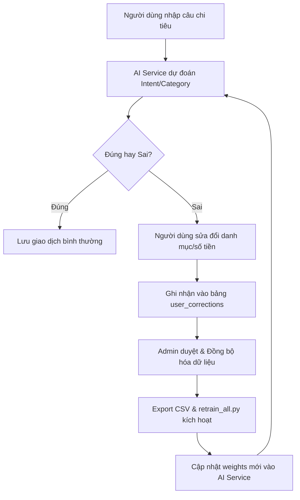

# Hướng Dẫn Huấn Luyện Lại (Retraining Guide) Mô Hình NLU & PICK KIE

Tài liệu này thảo luận chi tiết về logic huấn luyện lại mô hình, cách hoạt động của cơ chế ghi đè (overrides), quy trình thu thập mẫu sửa đổi từ người dùng và các bước triển khai trong hệ thống Spending Diary.

---

## 1. Logic Huấn Luyện Lại & Quy Trình Thu Thập Mẫu (Data Collection)

Hệ thống AI nhận dạng chi tiêu học hỏi liên tục (Active Learning) từ chính phản hồi của người dùng thông qua quy trình 4 bước:

### 1.1. Thu thập mẫu sửa đổi (User Corrections)
Khi AI nhận dạng sai (ví dụ: người dùng nhập *"mua sách 120k"* dự đoán sai sang `Others` thay vì `Education`), người dùng sẽ chỉnh sửa lại danh mục trên giao diện Mobile. 
* Lúc này, Mobile Client gửi yêu cầu kèm theo cờ sửa đổi lên Node.js Backend.
* Node.js Backend ghi chép một bản ghi vào bảng `user_corrections` chứa:
  - `raw_text`: câu thô người dùng nhập (*"mua sách 120k"*).
  - `corrected_intent`: `Record`
  - `corrected_category`: `Education`
  - `corrected_amount`: `120000`

### 1.2. Xuất dữ liệu huấn luyện (Dataset Export)
Khi số lượng bản ghi sửa đổi trong `user_corrections` vượt ngưỡng hoặc khi Admin kích hoạt thủ công:
1. Node.js Backend xuất toàn bộ các mẫu sửa đổi trong bảng `user_corrections` thành tệp CSV định dạng chuẩn.
2. Dữ liệu này được ghi đè/gộp vào tệp huấn luyện gốc `intent_record.csv` nằm trong thư mục [expense-ocr-nlu/text_nlu/datasets/intent_record.csv](file:///d:/Luan-Van/Project/expense-ocr-nlu/text_nlu/datasets/intent_record.csv).

---

## 2. Cơ Chế Ghi Đè Chính Xác (Exact Overrides Engine)

Để khắc phục ngay lập tức các lỗi nhận dạng nghiêm trọng mà không cần chờ đợi thời gian huấn luyện lại mô hình (thường mất từ vài phút đến vài giờ), hệ thống tích hợp **Cơ chế ghi đè chính xác (Exact Overrides)**:

1. **Bảng ghi đè (`nlu_overrides`)**:
   - Lưu trữ các quy tắc cứng do Admin định nghĩa qua giao diện Web Admin.
   - Ví dụ: Từ khóa `"winmart"` luôn trả về Category `Food & Beverage`, Intent `Record`.
2. **Quy trình kiểm tra (Rule Matching)**:
   - Khi có câu lệnh chi tiêu gửi lên, AI Service sẽ kiểm tra từ điển Exact Overrides trước tiên.
   - Nếu khớp từ khóa chính xác, trả về kết quả định nghĩa sẵn ngay lập tức, bỏ qua việc chạy qua mô hình máy học (PhoBERT / SVM).
   - Nếu không khớp, mới chuyển tiếp câu lệnh qua Pipeline NLU thông thường.
3. **Đồng bộ hóa ngược**:
   - Khi Admin thêm một từ khóa ghi đè mới, hệ thống tự động lưu vào database và đồng thời đồng bộ vào tệp `user_corrections` để đảm bảo trong tương lai, khi huấn luyện lại, mô hình máy học cũng sẽ học được quy luật này một cách tự nhiên.

---

## 3. Quy Trình Huấn Luyện NLU & PICK KIE

### 3.1. Huấn luyện NLU (Chạy cục bộ trên CPU)
Mô hình NLU sử dụng học máy truyền thống kết hợp với vector hóa TF-IDF. Thời gian train cực nhanh (~10s).
* **Script kích hoạt**: `text_nlu/train/retrain_all.py`.
* **Luồng xử lý của script**:
  1. Đọc dữ liệu từ `datasets/intent_record.csv` (đã bao gồm các mẫu sửa đổi mới).
  2. Thực hiện tách từ tiếng Việt (Word Segmentation) bằng `pyvi`.
  3. Trích xuất đặc trưng văn bản bằng TF-IDF Vectorizer.
  4. Huấn luyện độc lập 4 bộ phân loại SVM/Logistic Regression: Intent Classifier, Category Classifier, Record Type Classifier, Sentiment Classifier.
  5. Đóng gói các mô hình đã train thành các tệp `.joblib` lưu vào thư mục `models/`.
  6. Ghi nhật ký kết quả huấn luyện (F1-score, Accuracy) vào `models/nlu_training_history.json`.

### 3.2. Huấn luyện PICK KIE (Chạy qua Kaggle GPU)
Vì mô hình Graph Transformer rất nặng, hệ thống ủy thác (delegate) việc huấn luyện lại PICK KIE cho Kaggle Kernels thông qua Kaggle API:
1. **Đóng gói Dataset**:
   - Ảnh hóa đơn thô cùng tệp tọa độ nhãn (bounding boxes label) được nén thành file `.zip` và upload lên Kaggle Dataset bằng API.
2. **Kích hoạt Kaggle Job**:
   - Gửi yêu cầu qua `kaggle kernels push` để chạy notebook huấn luyện PICK KIE trên hạ tầng GPU miễn phí của Kaggle.
3. **Giám sát & Webhook**:
   - AI Service kiểm tra trạng thái Job định kỳ hoặc đợi Webhook phản hồi từ Kaggle gửi về Node.js Backend.
   - Khi hoàn tất, file weights đồ họa mới (`model_best.pth`) được tải về và cập nhật vào hệ thống Serving.
