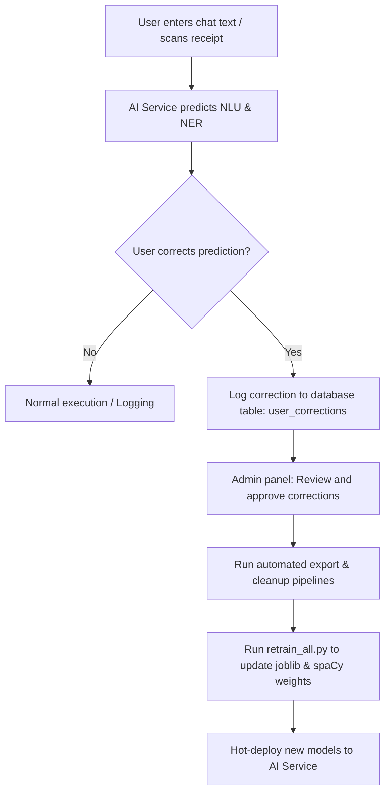

# Production Retraining & Operations Guide for NLU System

This guide outlines the production strategies, implementation logic, and data pipelines for continuously retraining the intent, category, action classifiers, and Named Entity Recognition (NER) models in the **Spending Diary** ecosystem.

---

## 1. Production Feedback Loop & Data Collection

In production, models must adapt to new vocabulary, user phrasing, GenZ slang, and abbreviations. This is achieved via a feedback loop.

### 1.1 Active Learning Architecture


### 1.2 Database Schema for Corrections (`user_corrections`)
Corrected samples are stored in the database with the following fields:
* `id` (UUID, Primary Key)
* `user_id` (UUID, Foreign Key)
* `raw_text` (String): The original user input (e.g., *"mua cf sua da 25k"*).
* `corrected_intent` (String): `Record` / `Action` / `Chitchat`.
* `corrected_category` (String): Resolved category code if intent is `Record` (e.g., `Food`).
* `corrected_action_type` (String): Resolved action code if intent is `Action` (e.g., `SET_LIMIT`).
* `corrected_amount` (Numeric): Extracted transaction amount.
* `status` (Enum): `pending`, `approved`, `rejected` (for admin moderation).
* `created_at` (Timestamp)

---

## 2. Dataset Maintenance & Data Quality Assurance

Before triggering retraining, the raw datasets must be validated to prevent model degradation.

### 2.1 Deduplication & Cleansing Heuristics
When exporting database corrections to `intent_record.csv` and `intent_action.csv`, we run a sanitization pipeline:
1. **Deduplication by Normalized Form**: Exact text duplicates are removed. Furthermore, templates are deduplicated by masking amounts (e.g., converting all numeric amounts to `<AMOUNT>`) to prevent specific monetary values from biasing the model.
2. **Label Conflict Resolution**: If identical text matches multiple labels, a majority vote (`mode()`) is applied, or the record is flagged for manual review.
3. **Edge Case Rectification**: Rules in `fix_disambiguation_labels.py` must run to align the datasets with runtime rules (e.g., ensuring all coffee transactions that are not social gatherings are classified under `Food` instead of `Entertainment`).

---

## 3. Classifiers & spaCy NER Retraining Flow

The training pipeline consists of lightweight machine learning classifiers for text categorization and a spaCy CNN model for entity extraction.

### 3.1 Step-by-Step Execution Sequence
The training orchestrator `retrain_all.py` performs the following tasks:

1. **Intent Classifier (`train_intent_model.py`)**:
   * Trains a TF-IDF + Logistic Regression/SVM model on `intent_record.csv`, `intent_action.csv`, and `intent_chitchat.csv`.
   * Saves weights to `models/intent_model.joblib`.
2. **Record Type Classifier (`train_record_type_model.py`)**:
   * Learns to distinguish `income` versus `expense` for inputs categorized under the `Record` intent.
   * Saves weights to `models/record_type_model.joblib`.
3. **Category Classifier (`train_category_model.py`)**:
   * Multi-class SVM predicting one of the 18 financial categories (e.g., `Food`, `Transport`, `Housing`).
   * Saves weights to `models/category_model.joblib`.
4. **Action Type Classifier (`train_action_type_model.py`)**:
   * Predicts the exact action type matching the 13 consolidated classes documented in `action.md`.
   * Saves weights to `models/action_type_model.joblib`.
5. **NER Dataset Generation (`ner_prepare.py`)**:
   * Parses JSONL annotations in `ner_dataset.jsonl`.
   * Resolves entity overlaps and validates span offsets.
   * Compiles and outputs binary datasets `ner_train.spacy` and `ner_dev.spacy`.
6. **spaCy NER Training (`train_ner_only.py`)**:
   * Loads `ner_config.cfg`, patches the `max_steps` setting from environment variables (e.g., `NER_MAX_STEPS`), and runs `spacy train`.
   * Deploys the best iteration model weights directly to `models/ner_model/model-best`.

---

## 4. Continuous Integration & Golden Regression Tests

To guarantee model quality before releasing weights to production, the pipeline incorporates **Golden Verification Tests**:

* **Script Location**: `tests/test_nlu_fixes.py`
* **Coverage Scope**:
  * **Food vs. Entertainment Cafe**: Distinguishes "buying coffee" (`Food`) from "going out to cafe with friends" (`Entertainment`).
  * **Record vs. Action**: Validates that statements like *"Đặt giới hạn..."* register as `Action` while *"Mới tiêu..."* or *"Thanh toán..."* register as `Record`.
  * **Math Operators**: Validates entity extraction and logic parameters (`ADD`, `SUB`, `SET`) for actions adjusting financial goals and budget limits.
  * **Fuzzy Queries**: Validates that query variants (e.g., *"goi y chi tieu"*, *"tổng chi"*) correctly trigger suggestions and reports.

### 4.1 Automated Validation Gate (CI/CD)
When deploying a retraining job, the pipeline executes the following shell sequence:
```bash
# 1. Clean and expand datasets
$env:PYTHONIOENCODING="utf-8"
python expense-ocr-nlu/text_nlu/datasets/improve_datasets.py

# 2. Retrain all models
$env:NER_MAX_STEPS="2000"
python expense-ocr-nlu/text_nlu/train/retrain_all.py

# 3. Run regression tests
python expense-ocr-nlu/tests/test_nlu_fixes.py
```
If `test_nlu_fixes.py` returns an exit code of `1` (test failure), the deployment is halted, and model weights are rolled back.

---

## 5. Deployment and Model Hot-Reloading

AI Service (running on FastAPI) uses local disk storage for model files. To achieve zero-downtime hot-reload of weights in production:
1. **Thread-Safe Loading**: The service implements a polling thread or listens to file change events using `watchdog`.
2. **Atomic Swap**: When `retrain_all.py` completes, it updates the files inside the `models/` directory. The AI Service detects the file modification time, loads the new model into memory, and performs a pointer swap:
   ```python
   # Example of thread-safe hot swap
   new_category_model = joblib.load("models/category_model.joblib")
   global_models["category"] = new_category_model
   ```
3. **Rollback Strategy**: The previous stable model files are kept as `.joblib.bak` or archived inside `models/archive/<timestamp>/`. If the hot-loaded models exhibit high latency or regression, the pointer is swapped back to the backup files.
