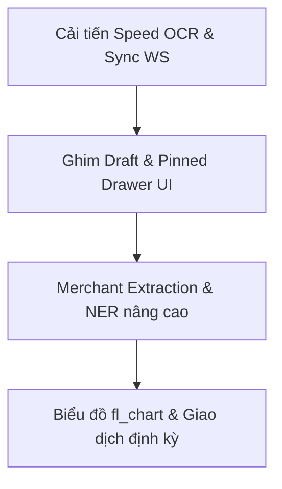

# Kiểm Toán Tính Năng Dự Án: MoneyStory (Expense AI)

Tài liệu này tổng hợp chi tiết hiện trạng các chức năng của dự án MoneyStory (gồm Mobile App Flutter, Backend Node.js, Web Admin React và module NLU/OCR Python), chỉ rõ những gì đã hoàn thiện, những gì cần cải thiện/sửa đổi, và những gì cần bổ sung thêm cùng với hướng triển khai logic tương ứng.

---

## I. Các Chức Năng Đã Hoàn Thiện (100% Ready)

Hệ thống đã xây dựng xong nền tảng vững chắc và chạy tốt các luồng nghiệp vụ cốt lõi:

| Phân hệ | Chức năng đã hoàn thành | Chi tiết kỹ thuật đã kiểm chứng |
| :--- | :--- | :--- |
| **Xác thực (Auth)** | Đăng ký, Đăng nhập thường & Google Sign-In | Sử dụng JWT (Access & Refresh Token rotation). |
| **Giao dịch (Transactions)** | CRUD giao dịch cá nhân và nhóm | Hỗ trợ phân trang, lọc theo danh mục, thời gian, loại thu/chi. |
| **Ví (Wallets)** | Quản lý ví cá nhân & ví nhóm | Mời thành viên tham gia ví nhóm qua mã mời, phân quyền (owner/member). |
| **Ngân sách (Budgets)** | Quản lý hạn mức chi tiêu theo danh mục | Cảnh báo hạn mức (chạm 80% hoặc 100%) đẩy real-time qua WebSocket. |
| **Mascot & Persona** | Trợ lý mascot MiMo động | 2 phong cách verbal_style (Dui Dẻ - funny vs Dận Dữ - strict), Lottie animation và sticker cảm xúc (emotion) theo ngữ cảnh chat. |
| **Nhập liệu Giọng nói** | Client-side STT & Chuẩn hoá từ lóng | Nhận diện giọng nói Việt, bộ lọc Regex + Normalization chuyển tiếng lóng (`cành`, `lít`, `củ`, `xị`, `chục`...) về số. Hiệu ứng sóng âm `WaveformVisualizer` sinh động khi ghi âm. |
| **Giao dịch chờ (Draft)** | Lưu nháp giao dịch thiếu thông tin tiền | Lưu DB với `is_draft = true, amount = 0` khi NLU nhận diện intent ghi chép nhưng thiếu tiền. Giao diện thẻ vàng trên Timeline và Bottom Sheet điền tiền nhanh. |
| **Logic Fusion (Gộp)** | Gộp OCR Hóa đơn + Ghi chú Giọng nói | Trong màn hình xác nhận hóa đơn, giữ micro nói mô tả (ví dụ "ăn trưa với bạn") để ghi đè danh mục/ghi chú từ NLU mà vẫn giữ nguyên số tiền OCR. |
| **Cấp quyền thông minh** | Dynamic Permissions (Native UX) | Kiểm tra và yêu cầu quyền (Camera, Microphone, Thư viện ảnh, Thông báo) tại đúng thời điểm tương tác. Liên kết chuyển trang Settings nếu bị chặn. |
| **Web Admin Dashboard** | Telemetry, Overrides & Curation | Thống kê Tỷ lệ Hội tụ (Fusion Success Rate), ghi đè nhãn cá nhân hóa (Overrides), gom cụm dữ liệu sửa đổi (Curate) để tái huấn luyện model, kích hoạt train & hot-reload model NLU. |

---

## II. Các Chức Năng Cần Cải Thiện & Sửa Đổi (Refactor / Optimize)

Các chức năng này đã có nhưng cần được tối ưu hóa để tăng hiệu năng hoặc nâng cao trải nghiệm người dùng:

### 1. Tốc độ xử lý OCR hóa đơn trên CPU
- **Hiện trạng**: PaddleOCR và VietOCR xử lý tuần tự trên CPU máy chủ mất khoảng 3 - 5 giây mỗi hóa đơn, có thể gây nghẽn khi nhiều người dùng tải lên cùng lúc.
- **Hướng cải thiện**:
  - Chuyển đổi model VietOCR & Paddle sang định dạng **ONNX Runtime** để tăng tốc độ suy luận trên CPU lên gấp 2-3 lần.
  - Sử dụng hàng đợi công việc (Job Queue) như **BullMQ (Redis)** ở Backend Node.js để quản lý tiến trình nhận dạng hóa đơn bất đồng bộ thay vì lưu trực tiếp trong bộ nhớ.

### 2. Ghim Giao dịch chờ (Draft Transactions) trên Timeline
- **Hiện trạng**: Các thẻ Draft màu vàng hiển thị xen kẽ trên Timeline theo ngày tạo. Nếu giao dịch chờ được tạo từ tuần trước, người dùng sẽ phải cuộn xuống rất sâu mới thấy để điền nốt tiền.
- **Hướng cải thiện**:
  - Thiết kế một **Ngăn kéo nhắc nhở (Draft Drawer)** hoặc ghim số lượng Draft chưa hoàn thành lên đầu màn hình Home (ví dụ: *"Bạn có 3 giao dịch chưa điền số tiền"*).
  - Người dùng bấm vào đó sẽ mở danh sách các Draft để điền nhanh mà không cần tìm kiếm trên timeline.

### 3. Tự động kết nối lại WebSocket (WS Reconnection)
- **Hiện trạng**: Màn hình xác nhận hóa đơn dùng WebSocket lắng nghe sự kiện `transaction_done`. Nếu mạng chập chờn gây ngắt kết nối, tiến trình có thể bị treo ở trạng thái "đang đọc bill".
- **Hướng cải thiện**:
  - Triển khai thuật toán kết nối lại với độ trễ lũy thừa (Exponential Backoff Reconnect).
  - Khi kết nối lại thành công, client gửi sự kiện đồng bộ trạng thái (`sync_status`) kèm theo `transactionId` để lấy kết quả mới nhất nếu server đã xử lý xong trong thời gian mất mạng.

---

## III. Các Chức Năng Còn Thiếu & Cần Bổ Sung (New Features)

Các chức năng này chưa được triển khai nhưng rất cần thiết để sản phẩm đạt độ hoàn thiện cao nhất:

### 1. Trích xuất Tên Cửa Hàng / Thương Hiệu (Merchant Extraction) trong OCR
- **Lý do**: OCR hiện tại chỉ trích xuất Tổng số tiền (`amount`) và gợi ý Danh mục (`category`), nhưng trường Ghi chú/Tên cửa hàng thường bị bỏ trống hoặc chỉ điền chung chung.
- **Hướng triển khai logic**:
  - Sử dụng mô hình **Named Entity Recognition (NER)** bổ sung nhãn `MERCHANT` hoặc dùng tập luật mẫu (Regex + Dictionary matching) để nhận dạng các chuỗi text chứa thương hiệu phổ biến Việt Nam (như `WinMart`, `Grab`, `Circle K`, `Phúc Long`, `Highlands`...).
  - Điền tự động tên cửa hàng vào trường Ghi chú (`note`) của giao dịch trước khi trả kết quả về cho client.

### 2. Biểu đồ Phân tích Chi tiêu Nâng cao (Interactive Charts)
- **Lý do**: Báo cáo hiện tại chỉ thống kê dạng danh sách danh mục và phần trăm. Người dùng cần biểu đồ trực quan để so sánh trực quan xu hướng chi tiêu.
- **Hướng triển khai logic**:
  - Tích hợp package `fl_chart` trên Flutter.
  - Vẽ biểu đồ cột nhóm (Grouped Bar Chart) so sánh chi tiêu tháng này với tháng trước (MoM).
  - Vẽ biểu đồ đường (Line Chart) biểu diễn biến động lũy kế chi tiêu hàng ngày so với hạn mức (ngăn ngừa việc chi tiêu quá nhanh ở đầu tháng).

### 3. Giao dịch định kỳ / lặp lại (Recurring Transactions)
- **Lý do**: Các khoản chi cố định hàng tháng (Tiền nhà, hóa đơn điện/nước, phí đăng ký dịch vụ Spotify/Netflix...) gây mất thời gian nhập liệu thủ công mỗi tháng.
- **Hướng triển khai logic**:
  - **Tầng dữ liệu**: Tạo bảng `recurring_rules` lưu: `user_id`, `amount`, `category_code`, `frequency` (daily/weekly/monthly), `next_occurrence`.
  - **Tầng Backend**: Viết một scheduler job chạy hàng ngày để quét và tự động tạo giao dịch (hoặc tạo Draft thông báo nhắc nhở) khi đến hạn.

---

## IV. Kế Hoạch Triển Khai Tiếp Theo

1. **Phase 1 (Trải nghiệm & Ổn định)**: Giải quyết các lintings, tối ưu tốc độ OCR qua ONNX, ghim nhắc nhở Draft ở màn hình Home, và thêm cơ chế reconnect WebSocket.
2. **Phase 2 (AI thông minh hơn)**: Train thêm nhãn Merchant cho NER, bổ sung từ điển thương hiệu để tự động điền ghi chú hóa đơn.
