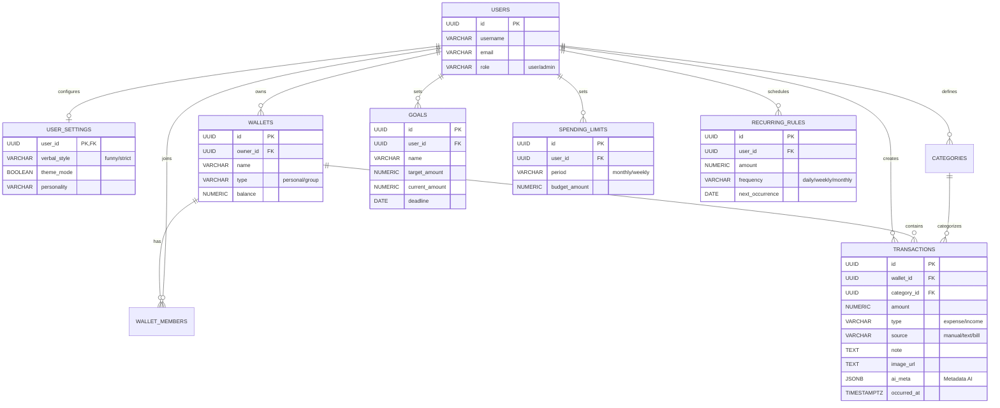
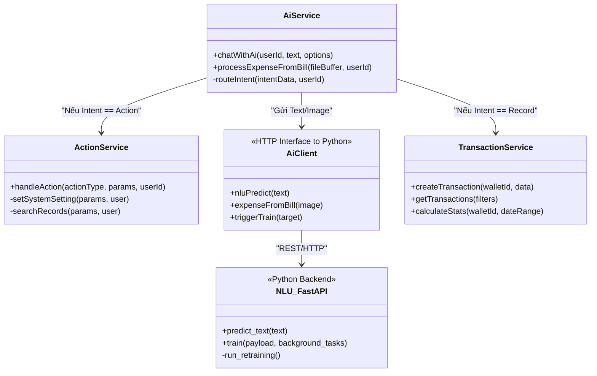

## 1. Mô tả Dữ liệu và Dataset (Dành cho Chương 3 - Cài đặt giải pháp)

### 1.1. Dataset huấn luyện NLU (Hiểu ngôn ngữ tự nhiên)
Để mô hình AI có thể hiểu được ý định và trích xuất thông tin chi tiêu từ văn bản tiếng Việt tự do, hệ thống sử dụng một tập dữ liệu (dataset) tự xây dựng kết hợp từ nhiều nguồn (thu thập thực tế, sinh dữ liệu tự động bằng kịch bản).

- **Tên Dataset**: `intent_action.csv`
- **Quy mô dữ liệu**: Khoảng **41.899** mẫu câu tiếng Việt.
- **Mục đích**: Huấn luyện phân loại ý định (Intent Classification) và nhận diện thực thể (Slot Filling/NER).
- **Mô tả các nhãn (Labels)**:
  1. **Intent (Ý định)**:
     - `Record`: Mẫu câu ghi chép chi tiêu/thu nhập (VD: "Sáng nay ăn phở hết 35k").
     - `Action`: Mẫu câu ra lệnh hoặc truy vấn hệ thống (VD: "Tìm cho tôi các khoản thu tháng này", "Đổi giọng điệu sang nghiêm túc").
     - `Chitchat`: Câu giao tiếp thông thường, tán gẫu (VD: "Chào Mimo, hôm nay mệt quá").
  2. **Category (Danh mục)**:
     - Gắn nhãn thể loại chi tiêu cho Intent `Record` như: `Food` (Ăn uống), `Shopping` (Mua sắm), `Transport` (Di chuyển), `Bills` (Hóa đơn)...
  3. **Record Type (Loại giao dịch)**:
     - `expense` (Chi tiêu) hoặc `income` (Thu nhập).
  4. **Action Type (Loại hành động)**:
     - Dành cho Intent `Action`, bao gồm: `SET_SYSTEM_SETTING` (Cài đặt hệ thống), `SEARCH_RECORD` (Tìm kiếm giao dịch), `SET_ALERT` (Đặt cảnh báo).
- **Chiến lược huấn luyện**:
  - Đối với mô hình học máy truyền thống (TF-IDF): Sử dụng toàn bộ ~42.000 mẫu để học từ vựng và trọng số do tốc độ huấn luyện nhanh.
  - Đối với mô hình học sâu (PhoBERT): Do giới hạn về tài nguyên GPU (NVIDIA L4) và thời gian, dữ liệu được lấy mẫu ngẫu nhiên (Random Sampling) xuống còn khoảng **14.000 mẫu** (5000 cho Intent, 3000 cho mỗi loại thực thể) để cân bằng giữa thời gian huấn luyện (~15 phút) và độ chính xác của ngữ cảnh.

### 1.2. Dataset xử lý Hóa đơn (OCR & KIE)
- Dữ liệu hóa đơn (Bills/Receipts) tiếng Việt được thu thập từ các cửa hàng tiện lợi, siêu thị, quán ăn tại Việt Nam.
- Dữ liệu được gán nhãn khung bao (Bounding Box) và phân loại thực thể (Key Information Extraction - KIE) cho các trường: Tên quán, Tổng tiền (Total Amount), Ngày giờ (Date).
- Quá trình huấn luyện sử dụng **PaddleOCR** cho tác vụ nhận diện văn bản thô (Text Detection & Recognition) và **LayoutLMv3** cho việc hiểu bố cục không gian (Spatial Layout) để tìm ra đúng số tiền cần thanh toán.

---

## 2. Thiết kế Cơ sở dữ liệu (Dành cho Chương 2 - Thiết kế giải pháp)

Cơ sở dữ liệu của hệ thống được thiết kế tối ưu cho PostgreSQL (tương thích CockroachDB) với kiến trúc linh hoạt cho quản lý tài chính cá nhân và AI.

### 2.1. Lược đồ Cơ sở dữ liệu (ERD)

### 2.2. Chi tiết các bảng quan trọng
- **`transactions`**: Bảng cốt lõi lưu trữ mọi biến động số dư. Cột `ai_meta` (JSONB) lưu metadata AI trích xuất (intent, box OCR); cột `source` phân biệt giao dịch (`manual`, `text`, `bill`).
- **`user_settings`**: Tách rời cấu hình cá nhân hóa AI của người dùng (`verbal_style`, `personality`, `theme_mode`) khỏi bảng users chính, giúp dễ dàng mở rộng các tính năng tùy chỉnh AI.
- **`goals` & `spending_limits`**: Phục vụ tính năng quản lý tài chính nâng cao, cho phép thiết lập mục tiêu tiết kiệm và hạn mức chi tiêu. AI sẽ dựa vào các bảng này để đưa ra lời khuyên (Budget Suggestions) hoặc cảnh báo (Alerts).
- **`recurring_rules`**: Lưu trữ các quy tắc lặp lại (hàng ngày, tuần, tháng) để hệ thống tự động sinh giao dịch (tiền điện, mạng, lương) theo cronjob.

---

## 3. Sơ đồ Lớp - Class Diagram (Dành cho Chương 2)

Dưới đây là sơ đồ lớp mô tả kiến trúc của các Service cốt lõi (Backend Node.js tương tác với Python AI Backend):

### 3.1. Giải thích các lớp:
- **`AiService` (Node.js)**: Lớp điều phối trung tâm. Nhận đầu vào từ thiết bị người dùng (Văn bản hoặc Hình ảnh), gọi sang AI Backend để phân tích, sau đó định tuyến (Route) kết quả dựa trên Intent.
- **`ActionService` (Node.js)**: Xử lý chuyên biệt các lệnh điều khiển hệ thống (`Action`). Ví dụ khi AI phân tích ra lệnh `SET_SYSTEM_SETTING`, lớp này sẽ cập nhật DB (đổi vibe của user).
- **`AiClient` (Node.js)**: Lớp Adapter/Proxy đóng gói các HTTP Request gửi sang server Python (Modal/Local). Xử lý timeout và lỗi kết nối.
- **`TransactionService` (Node.js)**: Lớp nghiệp vụ thao tác trực tiếp với Database để tạo, xóa hoặc thống kê giao dịch.
- **`NLU_FastAPI` (Python)**: Hệ thống AI phục vụ (Serving System) viết bằng FastAPI. Trực tiếp chạy các mô hình Machine Learning (PhoBERT, TF-IDF, PaddleOCR) để suy luận (Inference) và huấn luyện (Training ngầm qua `background_tasks`).
