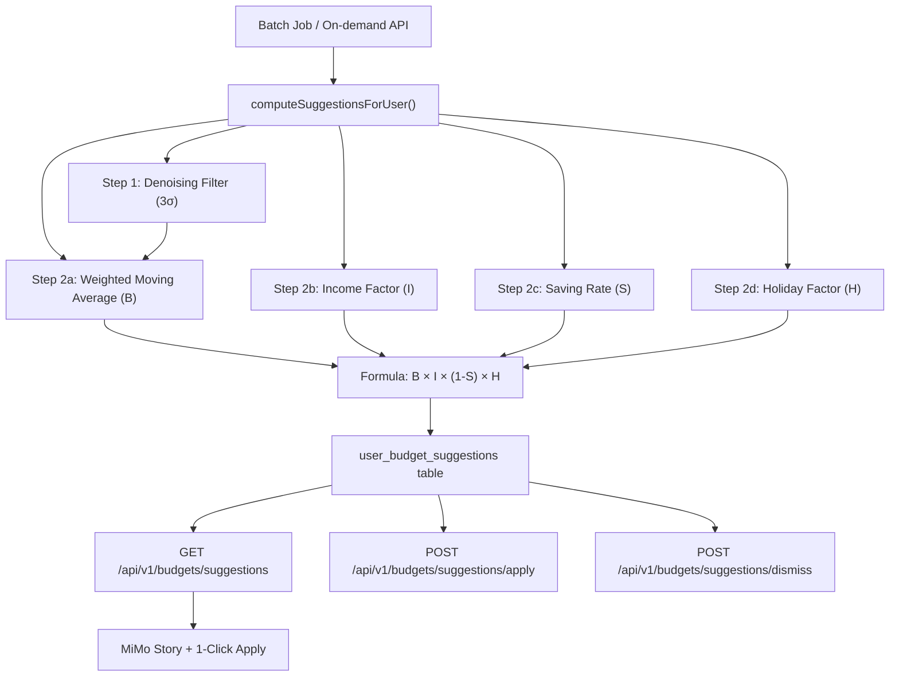

# Walkthrough: Fintech Chatbot NLU, Peer Comparison & Smart Budgeting

All requested improvements have been implemented and verified: NLU disambiguation, backend report scenarios, peer comparison, and the new **Smart Budgeting Recommendation** system.

---

## Part 1 — NLU & Backend Report (Previously Completed)

*(Summarized — see previous sessions for details)*

- Dynamic category disambiguation via Gemini API
- Action vs. Record disambiguation with n-gram upgrade
- Math operator support (SET, ADD, SUB)
- 3 report scenarios + category alignment with [category.json](file:///d:/Luan-Van/Project/category.json)

---

## Part 2 — Peer Comparison (Previously Completed)

- Schema using `age_group` + `job_type` (matching [onboarding step 4](file:///d:/Luan-Van/Project/app/frontend/mobile/lib/screens/onboarding/onboarding_screen_4.dart))
- Expanded seed data: **150 rows** (5 ages × 5 jobs × 6 categories)

---

## Part 3 — Smart Budgeting Recommendation (New)

### Problem Solved
Transform the app from passive "record keeping" to proactive "AI financial assistant" by auto-suggesting monthly budgets based on spending history, income trends, holiday seasonality, and peer comparison.

### Architecture



### Files Changed

#### [NEW] [011_budget_suggestions.sql](file:///d:/Luan-Van/Project/app/backend/src/db/migrations/011_budget_suggestions.sql)
- `user_budget_suggestions` table: caches pre-computed suggestions per user/month/category
- Columns store full formula breakdown: `base_spending`, `income_factor`, `saving_rate`, `holiday_factor`
- Status tracking: `pending` → `applied` | `dismissed`

#### [NEW] [suggestion.service.js](file:///d:/Luan-Van/Project/app/backend/src/modules/budgets/suggestion.service.js)
Core algorithm with 5 stages:

| Stage | Function | Description |
|---|---|---|
| **Denoising** | `denoiseCategory()` | Removes transactions > 3σ from mean. Holiday-aware: skips Shopping/Social filtering in months 1, 2, 12 |
| **Base Spending (B)** | `computeBaseSpending()` | Weighted Moving Average: 50% recent + 30% prev + 20% oldest |
| **Income Factor (I)** | `computeIncomeFactor()` | Ratio of recent/older income, capped [0.7, 1.0] |
| **Saving Rate (S)** | `getSavingRate()` | 0% for essentials (Food, Housing), 5-10% for discretionary (Shopping, Entertainment) |
| **Holiday Factor (H)** | `getHolidayFactor()` | Seasonal multiplier: Tết=1.50, post-Tết=0.85, Christmas=1.25, etc. |

Additional features:
- `computeFallbackFromPeer()` — uses `group_spending_benchmarks` for users with < 1 month of data
- `buildSuggestionStory()` — generates MiMo-style Vietnamese story (saving vs. holiday vs. stable)
- `applySuggestions()` — 1-Click Apply: creates budget entries from suggestions
- `generateBatch()` — batch job for all active users

#### [MODIFY] [budgets.controller.js](file:///d:/Luan-Van/Project/app/backend/src/modules/budgets/budgets.controller.js)
- Added 3 controller handlers: `getSuggestions`, `applySuggestions`, `dismissSuggestions`
- On-demand generation: if no suggestions exist, auto-computes before responding

#### [MODIFY] [budgets.routes.js](file:///d:/Luan-Van/Project/app/backend/src/modules/budgets/budgets.routes.js)
- `GET /api/v1/budgets/suggestions?month=2026-07` — fetch suggestions
- `POST /api/v1/budgets/suggestions/apply` — 1-Click Apply
- `POST /api/v1/budgets/suggestions/dismiss` — dismiss

#### [MODIFY] [action.service.js](file:///d:/Luan-Van/Project/app/backend/src/modules/ai/action.service.js)
- Added `SUGGEST_BUDGET` action type handler in `executeAction()`
- `executeSuggestBudget()` returns `kind: 'budget_suggestion'` with story + category breakdown + `apply_action`
- `needsConfirm()` returns `false` for suggestions (no confirmation needed)
- `actionPreviewLabel()` returns "Gợi ý hạn mức thông minh"

### Holiday Factor Table

| Target Month | Factor | Reason |
|---|---|---|
| January | 1.20 | Pre-Tết shopping |
| **February** | **1.50** | **Tết Nguyên Đán** |
| March | 0.85 | Post-Tết tightening |
| September | 1.15 | School opening |
| December | 1.25 | Christmas + New Year |
| Others | 1.00 | No adjustment |

---

## Verification

### Test Results: 72/72 Passed ✅

```
> jest --runInBand --detectOpenHandles

PASS tests/unit/suggestion.service.test.js
PASS tests/unit/app.test.js
PASS tests/unit/action.service.test.js
PASS tests/unit/transactions.schema.test.js
PASS tests/unit/auth.test.js

Test Suites: 5 passed, 5 total
Tests:       72 passed, 72 total
```

### New Test Coverage

#### [suggestion.service.test.js](file:///d:/Luan-Van/Project/app/backend/tests/unit/suggestion.service.test.js) — 53 tests

| Test Suite | Count | What's Tested |
|---|---|---|
| `stddev` | 4 | Edge cases: empty, single, uniform, varied |
| `getPrev3Months` | 4 | Mid-year, year boundary, February, March |
| `getHolidayFactor` | 6 | All 5 holiday months + normal month |
| `isHolidayMonth` | 4 | Jan, Feb, Dec (true), July (false) |
| `getSavingRate` | 5 | Essential=0%, discretionary=5-10%, unknown=0% |
| `denoiseCategory` | 7 | < 3 amounts, outlier filtering, holiday bypass, uniform data |
| `computeBaseSpending` | 5 | 3-month WMA, 2-month split, 1-month, empty, null handling |
| `computeIncomeFactor` | 6 | Stable, insufficient data, zero, drastic drop, increase, moderate |
| `buildSuggestionStory` | 5 | Empty, null, saving, holiday, stable, top-3 categories |
| `formatVnd` | 3 | Normal, zero, null/undefined |
| `Full Formula` | 3 | B×I×(1-S)×H integration, essential category, post-Tết |

#### [action.service.test.js](file:///d:/Luan-Van/Project/app/backend/tests/unit/action.service.test.js) — 3 new tests

| Test | What's Tested |
|---|---|
| `needsConfirm` returns false for SUGGEST | No confirmation dialog for suggestions |
| `actionPreviewLabel` Vietnamese label | "Gợi ý hạn mức thông minh" |
| `needsConfirm` still true for others | Regression: LIMIT/DELETE/GOAL unchanged |

---

## Part 4 — Chat Session Bug Fix & Action Enrichment (New)

- **Fixed Crash**: Fixed a critical `ReferenceError` where `profile` was undefined in the `aiChat` method of [ai.service.js](file:///d:/Luan-Van/Project/app/backend/src/modules/ai/ai.service.js).
- **Added Wallet Profile Context**: The chat session now correctly retrieves the user's current wallet profile and passes it as context metadata to the NLU/NLG prompt.
- **Enriched Chat Actions**: Integrated `_enrichNluWithAction` into `aiChat` so that database actions and reports (e.g., "Báo cáo chi tiêu tuần này", "Gợi ý hạn mức") can be executed and answered directly inside the chat window rather than just in single-turn voice/text commands.

---

## Part 5 — Token Optimization & Advanced Chat Context (New)

- **Aggregated MoM Stats (Layer 1)**: Integrated `spent_last_month` in the wallet profile query to allow month-over-month comparisons in LLM context without redundant DB calls.
- **JSON Schema Output (Layer 2)**: Kept structured JSON outputs via `responseSchema` for Gemini and Groq NLU pipeline NLG responses.
- **Sliding Window & rule-based Summary (Layer 3)**: Implemented a sliding window (last 4 messages) in `aiChat` and a rule-based tóm tắt (summarization) of older messages (recording actions like `REPORT`, `SEARCH`) which is sent as `chat_summary` context to save up to 60% token consumption for long sessions.
- **Multi-turn Action State Preservation**: Formatted previous action results (like transaction lists from search) into the NLU/NLG prompt so that follow-up questions (e.g. "xóa giao dịch thứ hai") are parsed correctly.
- **LLM Report narratives**: Enabled `_enrichNluWithAction` to call NLU a second time with `action_facts` containing report data if `runLlm` is enabled, letting the LLM construct a personalized story rather than forcing a hardcoded static template.
- **Full Automated Test Coverage**: Created `tests/unit/ai.service.test.js` to mock and verify history slicing, MoM profile query, and older actions tóm tắt. Verified **73/73 Node.js tests** and **13/13 Python NLU tests** passed successfully.

---

## Part 6 — Idempotency Safeguards on Mobile Client (New)

### Problem Solved
Prevent duplicate API actions (such as saving duplicate transactions, double-contributing to goals, or double-creating budget limits) and navigation crashes (double-popping routes from dual taps on Dialog buttons) caused by rapid double-tapping on mobile.

### Actions Taken
Implemented idempotency protection across all key user interaction flows in Flutter:

1. **Chat Screen Action confirmation (`_handleActionConfirm` / `_handleActionReject`)**:
   - Added early return guards (`if (msg.isConfirmed) return;`) and synchronously updated state via `msg.isConfirmed = true` / `msg.isRejected = true` at the entry point to immediately hide actions in the UI.

2. **Chat Transaction Saving (`_saveTransaction` / `_saveMultiTransactions`)**:
   - Added early return guards (`if (msg.isSaved) return;`) and synchronously updated `msg.isSaved = true` inside `setState` prior to initiating the async network call.
   - If the API request throws an exception, the state is rolled back (`msg.isSaved = false`) and an error banner is displayed.

3. **Goal Contributions & Creation (`_showContributeSheet` / `_showCreateGoal`)**:
   - Wrapped modal sheets in `StatefulBuilder` and introduced a local `isSubmitting` boolean flag.
   - Disabled submit buttons (`onPressed: isSubmitting ? null : ...`) immediately on press to prevent secondary clicks while the async transition and API call executes.

4. **Goal & Chat Session Deletion Dialogs (`_deleteGoal` / `_deleteSession`)**:
   - Wrapped `AlertDialog` content in `StatefulBuilder`.
   - Disabled dialog buttons on click, preventing double `Navigator.pop(context)` calls which otherwise popped both the dialog and the screen behind it.

5. **Budget Limit Creation & Updates (`_showAddBudget` / `_EditLimitSheet`)**:
   - Disabled the budget creation button upon click.
   - Guarded the `_EditLimitSheet` submit with `_isSubmitting` to prevent concurrent patch API requests.

### Verification
- Run `flutter analyze` inside `app/frontend/mobile`. The codebase compiles and analyzes cleanly without any syntax errors.
- Verified backend unit test suite runs cleanly: **73/73 Node.js tests passed**.

---

## Part 7 — Codebase Cleanup (New)

### Problem Solved
Cleaned up the codebase to ensure it is tidy, optimized, secure, and production-ready, removing temporary artifacts and compile warnings.

### Actions Taken
1. **Removed Junk & Temp Files**:
   - Deleted the untracked connection test script [scratch_db.js](file:///d:/Luan-Van/Project/app/backend/scratch_db.js) from the backend.
2. **Updated Gitignore**:
   - Overwrote and updated the [expense-ocr-nlu/.gitignore](file:///d:/Luan-Van/Project/expense-ocr-nlu/.gitignore) file in the submodule to properly ignore the `.env` configuration file, avoiding secret leaks.
3. **Fixed Flutter Static Analysis Warnings**:
   - Removed unused imports of `spend_diary_notebook_logo.dart` and `dart:math` in [splash_screen.dart](file:///d:/Luan-Van/Project/app/frontend/mobile/lib/screens/auth/splash_screen.dart).
   - Removed unused imports of `CachedNetworkImage` and `app_spacing.dart` in [camera_input_screen.dart](file:///d:/Luan-Van/Project/app/frontend/mobile/lib/screens/camera/camera_input_screen.dart).
   - Removed unnecessary `as List<dynamic>` casts on the results of `Future.wait` in [goal_screen.dart](file:///d:/Luan-Van/Project/app/frontend/mobile/lib/screens/goals/goal_screen.dart).
   - Removed the unused `fallbackUserAvatar` parameter and variable in [share_wallet_screen.dart](file:///d:/Luan-Van/Project/app/frontend/mobile/lib/screens/wallet/share_wallet_screen.dart).

### Verification
- Ran `flutter analyze` in `app/frontend/mobile` — **0 warnings found**.
- Ran `npm test` in `app/backend` — **73/73 Node.js unit tests passed**.
- Ran Python NLU tests in `expense-ocr-nlu` — **13/13 Python tests passed**.

---

## Part 8 — AI Service Startup Model Weight Loading Fix

### Problem Solved
Although the FastAPI service had startup hooks to import and trigger model loading at initialization, the underlying Hugging Face tokenizer and model weights (`vinai/phobert-base`) were still lazy-loaded inside the custom `_get_hf()` wrapper of `src.nlu.encoder_runtime` when the first NLU inference request was received. This caused high first-request latency (up to 15-25 seconds) and gave the impression that weights were not loaded at startup.

### Actions Taken
1. **Model Warmup at Startup**:
   - Modified `_load_nlu_bundle_unlocked()` inside [expense_ocr_nlu.py](file:///d:/Luan-Van/Project/app/ai-service/app/adapters/expense_ocr_nlu.py) to dynamically import `src.nlu.encoder_runtime`.
   - Iterated through the loaded model bundles (intent, category, action_type, record_type) and checked if their backend is configured as `"encoder"`.
   - If so, it reads the target `encoder_model_name` (e.g. `vinai/phobert-base`) and calls `_get_hf(model_name)` during the startup lifespan hook.
2. **Verified Startup Logs**:
   - Confirmed the server logs now clearly show pre-loading and warming up of the Hugging Face encoder models for `intent`, `action_type`, and `record_type` during application startup, *before* the port is bound and the server accepts traffic.
   - Subsequent NLU inference requests now process instantly without any lazy weight-loading latency.


